    ################################################################################
    # Project:      Anxiety Prediction - Logistic Regression
    # Objective:    Predict patient anxiety status using survey response items
    # Author:       Kim Shellenberger
    # Date:         2024
    # Description:  Binary logistic regression model to predict anxiety (Yes/No)
    #               based on 8 survey response items. Includes exploratory analysis,
    #               model specification, and diagnostic evaluation.
    ################################################################################

    # SECTION 1: LOAD REQUIRED PACKAGES
    library(ggplot2)       # Data visualization
    library(mosaic)        # Mosaic plots for categorical data

    ## Registered S3 method overwritten by 'mosaic':
    ##   method                           from   
    ##   fortify.SpatialPolygonsDataFrame ggplot2

    ## 
    ## The 'mosaic' package masks several functions from core packages in order to add 
    ## additional features.  The original behavior of these functions should not be affected by this.

    ## 
    ## Attaching package: 'mosaic'

    ## The following objects are masked from 'package:dplyr':
    ## 
    ##     count, do, tally

    ## The following object is masked from 'package:Matrix':
    ## 
    ##     mean

    ## The following object is masked from 'package:ggplot2':
    ## 
    ##     stat

    ## The following objects are masked from 'package:stats':
    ## 
    ##     binom.test, cor, cor.test, cov, fivenum, IQR, median, prop.test,
    ##     quantile, sd, t.test, var

    ## The following objects are masked from 'package:base':
    ## 
    ##     max, mean, min, prod, range, sample, sum

    library(caret)         # Classification and regression tools

    ## 
    ## Attaching package: 'caret'

    ## The following object is masked from 'package:mosaic':
    ## 
    ##     dotPlot

    library(tidyverse)     # Data manipulation suite

    ## ── Attaching core tidyverse packages ──────────────────────── tidyverse 2.0.0 ──
    ## ✔ forcats   1.0.0     ✔ stringr   1.5.1
    ## ✔ lubridate 1.9.3     ✔ tibble    3.2.1
    ## ✔ purrr     1.0.2     ✔ tidyr     1.3.1
    ## ✔ readr     2.1.5

    ## ── Conflicts ────────────────────────────────────────── tidyverse_conflicts() ──
    ## ✖ mosaic::count() masks dplyr::count()
    ## ✖ purrr::cross()  masks mosaic::cross()
    ## ✖ mosaic::do()    masks dplyr::do()
    ## ✖ tidyr::expand() masks Matrix::expand()
    ## ✖ dplyr::filter() masks stats::filter()
    ## ✖ dplyr::lag()    masks stats::lag()
    ## ✖ purrr::lift()   masks caret::lift()
    ## ✖ tidyr::pack()   masks Matrix::pack()
    ## ✖ mosaic::stat()  masks ggplot2::stat()
    ## ✖ mosaic::tally() masks dplyr::tally()
    ## ✖ tidyr::unpack() masks Matrix::unpack()
    ## ℹ Use the conflicted package (<http://conflicted.r-lib.org/>) to force all conflicts to become errors

    library(lessR)         # Additional statistical functions

    ## 
    ## lessR 4.3.6                         feedback: gerbing@pdx.edu 
    ## --------------------------------------------------------------
    ## > d <- Read("")   Read text, Excel, SPSS, SAS, or R data file
    ##   d is default data frame, data= in analysis routines optional
    ## 
    ## Many examples of reading, writing, and manipulating data, 
    ## graphics, testing means and proportions, regression, factor analysis,
    ## customization, and descriptive statistics from pivot tables
    ##   Go to:  https://web.pdx.edu/~gerbing/lessR/examples
    ## 
    ## View changes in this and recent versions of lessR
    ##   Enter: news(package="lessR")
    ## 
    ## Interactive data analysis
    ##   Enter: interact()
    ## 
    ## 
    ## Attaching package: 'lessR'
    ## 
    ## The following objects are masked from 'package:mosaic':
    ## 
    ##     model, prop, rescale
    ## 
    ## The following objects are masked from 'package:dplyr':
    ## 
    ##     recode, rename

    # SECTION 2: LOAD DATA
    # TODO: Update file path to your data location
    med <- read.csv("medical_clean.csv")  # Load medical dataset
    med

    ##     Customer_id Interaction        UID    City State   County   Zip     Lat
    ## 1        C00001    I0000001 U000000001  Dallas    TX   Dallas 93807 33.1287
    ## 2        C00002    I0000002 U000000002  Austin    IL   Dallas 55539 30.4480
    ## 3        C00003    I0000003 U000000003 Phoenix    TX   Dallas 17491 42.9521
    ## 4        C00004    I0000004 U000000004  Austin    AZ   Dallas 60192 31.3205
    ## 5        C00005    I0000005 U000000005  Austin    AZ   Travis 90395 43.9201
    ## 6        C00006    I0000006 U000000006 Houston    IL   Travis 73888 34.7460
    ## 7        C00007    I0000007 U000000007 Phoenix    TX   Harris 83609 40.3536
    ## 8        C00008    I0000008 U000000008 Phoenix    TX     Cook 19077 27.1973
    ## 9        C00009    I0000009 U000000009 Phoenix    TX   Dallas 30953 39.3488
    ## 10       C00010    I0000010 U000000010  Austin    IL   Harris 86919 35.3907
    ## 11       C00011    I0000011 U000000011  Dallas    AZ     Cook 77889 38.4920
    ## 12       C00012    I0000012 U000000012 Phoenix    TX Maricopa 33821 28.8643
    ## 13       C00013    I0000013 U000000013  Austin    IL   Travis 47567 41.9481
    ## 14       C00014    I0000014 U000000014 Houston    TX     Cook 34860 44.8443
    ## 15       C00015    I0000015 U000000015  Dallas    TX Maricopa 31195 29.9850
    ## 16       C00016    I0000016 U000000016 Houston    AZ     Cook 87475 27.2014
    ## 17       C00017    I0000017 U000000017  Dallas    TX   Travis 97266 25.5437
    ## 18       C00018    I0000018 U000000018  Austin    TX   Travis 31427 39.7653
    ## 19       C00019    I0000019 U000000019 Chicago    TX   Harris 37083 38.9632
    ## 20       C00020    I0000020 U000000020  Dallas    AZ   Dallas 97046 37.5740
    ## 21       C00021    I0000021 U000000021 Houston    TX     Cook 67372 30.3348
    ## 22       C00022    I0000022 U000000022  Austin    IL     Cook 54064 33.9908
    ## 23       C00023    I0000023 U000000023  Dallas    TX Maricopa 17813 38.6730
    ## 24       C00024    I0000024 U000000024 Chicago    AZ   Travis 41598 36.4256
    ## 25       C00025    I0000025 U000000025 Chicago    TX     Cook 37082 47.7191
    ## 26       C00026    I0000026 U000000026 Phoenix    TX   Travis 39241 28.1381
    ## 27       C00027    I0000027 U000000027 Phoenix    TX     Cook 54569 40.9883
    ## 28       C00028    I0000028 U000000028 Houston    IL   Harris 21745 34.2993
    ## 29       C00029    I0000029 U000000029  Dallas    TX   Dallas 36029 34.8486
    ## 30       C00030    I0000030 U000000030  Dallas    TX     Cook 23025 41.5047
    ## 31       C00031    I0000031 U000000031 Phoenix    TX   Travis 24288 40.9260
    ## 32       C00032    I0000032 U000000032  Dallas    TX   Harris 99186 47.7989
    ## 33       C00033    I0000033 U000000033  Dallas    TX     Cook 16540 27.9531
    ## 34       C00034    I0000034 U000000034 Chicago    TX Maricopa 91958 27.3945
    ## 35       C00035    I0000035 U000000035 Phoenix    AZ   Dallas 78878 41.6598
    ## 36       C00036    I0000036 U000000036  Austin    TX     Cook 51846 38.3029
    ## 37       C00037    I0000037 U000000037 Phoenix    AZ   Harris 85932 31.3057
    ## 38       C00038    I0000038 U000000038  Austin    AZ Maricopa 27482 26.8266
    ## 39       C00039    I0000039 U000000039 Chicago    TX   Harris 33411 26.9701
    ## 40       C00040    I0000040 U000000040 Houston    TX   Harris 60975 45.5664
    ## 41       C00041    I0000041 U000000041  Dallas    IL Maricopa 70545 29.4129
    ## 42       C00042    I0000042 U000000042 Chicago    TX   Harris 88797 32.4375
    ## 43       C00043    I0000043 U000000043  Dallas    TX Maricopa 62307 30.2131
    ## 44       C00044    I0000044 U000000044 Houston    TX     Cook 13093 33.1649
    ## 45       C00045    I0000045 U000000045 Houston    IL Maricopa 87258 26.5967
    ## 46       C00046    I0000046 U000000046 Chicago    TX Maricopa 32042 36.9384
    ## 47       C00047    I0000047 U000000047 Houston    TX   Dallas 62930 26.5551
    ## 48       C00048    I0000048 U000000048  Austin    TX Maricopa 54413 43.4082
    ## 49       C00049    I0000049 U000000049 Houston    IL Maricopa 43756 30.3754
    ## 50       C00050    I0000050 U000000050  Dallas    TX     Cook 63268 37.4203
    ## 51       C00051    I0000051 U000000051  Dallas    AZ   Dallas 49214 45.2418
    ## 52       C00052    I0000052 U000000052  Dallas    TX   Travis 91871 39.9702
    ## 53       C00053    I0000053 U000000053  Dallas    TX     Cook 38602 37.2580
    ## 54       C00054    I0000054 U000000054  Austin    TX     Cook 63331 32.4597
    ## 55       C00055    I0000055 U000000055 Phoenix    TX   Travis 58901 32.6590
    ## 56       C00056    I0000056 U000000056 Chicago    TX Maricopa 73416 40.3982
    ## 57       C00057    I0000057 U000000057  Dallas    AZ   Harris 42196 47.8652
    ## 58       C00058    I0000058 U000000058 Houston    TX   Dallas 15626 40.2223
    ## 59       C00059    I0000059 U000000059  Dallas    IL   Harris 17424 37.8290
    ## 60       C00060    I0000060 U000000060 Houston    TX   Travis 22857 41.8050
    ## 61       C00061    I0000061 U000000061 Houston    IL     Cook 29982 35.6997
    ## 62       C00062    I0000062 U000000062  Dallas    IL     Cook 86961 26.3833
    ## 63       C00063    I0000063 U000000063  Austin    TX   Dallas 11980 37.9328
    ## 64       C00064    I0000064 U000000064 Houston    TX     Cook 58290 47.0254
    ## 65       C00065    I0000065 U000000065 Houston    TX     Cook 36431 29.0320
    ## 66       C00066    I0000066 U000000066  Dallas    TX   Dallas 94976 40.8701
    ## 67       C00067    I0000067 U000000067 Houston    AZ   Dallas 92711 29.6215
    ## 68       C00068    I0000068 U000000068 Houston    TX   Travis 36385 37.3240
    ## 69       C00069    I0000069 U000000069  Dallas    TX     Cook 48158 27.2236
    ## 70       C00070    I0000070 U000000070  Dallas    AZ     Cook 33019 35.3585
    ## 71       C00071    I0000071 U000000071 Chicago    TX   Travis 28639 42.3918
    ## 72       C00072    I0000072 U000000072  Austin    TX Maricopa 95530 32.9941
    ## 73       C00073    I0000073 U000000073  Austin    AZ Maricopa 31563 40.2930
    ## 74       C00074    I0000074 U000000074 Houston    AZ Maricopa 49341 43.2953
    ## 75       C00075    I0000075 U000000075  Austin    TX   Travis 15776 46.3251
    ## 76       C00076    I0000076 U000000076 Houston    TX     Cook 46444 30.3968
    ## 77       C00077    I0000077 U000000077 Chicago    TX   Travis 78916 34.1843
    ## 78       C00078    I0000078 U000000078  Dallas    TX   Travis 18711 28.5056
    ## 79       C00079    I0000079 U000000079  Dallas    TX Maricopa 84318 47.8271
    ## 80       C00080    I0000080 U000000080  Dallas    TX   Harris 92970 46.3210
    ## 81       C00081    I0000081 U000000081  Austin    TX     Cook 95553 37.4190
    ## 82       C00082    I0000082 U000000082 Chicago    TX Maricopa 40707 44.3668
    ## 83       C00083    I0000083 U000000083  Austin    IL   Harris 49110 36.9820
    ## 84       C00084    I0000084 U000000084  Austin    IL   Harris 71788 39.3425
    ## 85       C00085    I0000085 U000000085 Chicago    AZ   Dallas 92879 27.0499
    ## 86       C00086    I0000086 U000000086 Chicago    TX     Cook 48827 42.3712
    ## 87       C00087    I0000087 U000000087 Chicago    TX   Harris 15655 27.9374
    ## 88       C00088    I0000088 U000000088 Chicago    IL Maricopa 54859 43.9996
    ## 89       C00089    I0000089 U000000089  Dallas    TX   Dallas 63625 42.9866
    ## 90       C00090    I0000090 U000000090 Phoenix    IL     Cook 62098 41.3011
    ## 91       C00091    I0000091 U000000091 Phoenix    IL   Travis 25251 25.8317
    ## 92       C00092    I0000092 U000000092 Chicago    IL Maricopa 10526 31.9720
    ## 93       C00093    I0000093 U000000093 Phoenix    TX   Harris 78760 31.0516
    ## 94       C00094    I0000094 U000000094 Phoenix    TX   Harris 57837 33.2831
    ## 95       C00095    I0000095 U000000095 Chicago    TX Maricopa 21536 27.0158
    ## 96       C00096    I0000096 U000000096 Phoenix    TX   Harris 38541 46.5500
    ## 97       C00097    I0000097 U000000097  Austin    TX   Dallas 89083 37.7375
    ## 98       C00098    I0000098 U000000098 Houston    TX     Cook 61027 32.0271
    ## 99       C00099    I0000099 U000000099 Houston    TX   Dallas 44531 34.1306
    ## 100      C00100    I0000100 U000000100 Chicago    TX   Harris 18712 35.2857
    ## 101      C00101    I0000101 U000000101  Dallas    AZ   Travis 75455 38.8137
    ## 102      C00102    I0000102 U000000102 Chicago    TX     Cook 84744 36.8606
    ## 103      C00103    I0000103 U000000103  Dallas    TX     Cook 15109 46.1460
    ## 104      C00104    I0000104 U000000104 Houston    TX Maricopa 59268 36.4302
    ## 105      C00105    I0000105 U000000105 Chicago    AZ Maricopa 64615 47.8196
    ## 106      C00106    I0000106 U000000106  Austin    AZ   Travis 92503 44.5828
    ## 107      C00107    I0000107 U000000107 Phoenix    TX     Cook 39759 29.7957
    ## 108      C00108    I0000108 U000000108  Dallas    IL   Travis 95708 46.4037
    ## 109      C00109    I0000109 U000000109 Phoenix    TX Maricopa 70112 27.6764
    ## 110      C00110    I0000110 U000000110 Phoenix    IL Maricopa 36589 43.8013
    ## 111      C00111    I0000111 U000000111 Chicago    IL     Cook 40015 33.7543
    ## 112      C00112    I0000112 U000000112 Phoenix    IL   Dallas 39009 45.1934
    ## 113      C00113    I0000113 U000000113  Austin    TX   Harris 93309 44.9653
    ## 114      C00114    I0000114 U000000114 Phoenix    AZ Maricopa 72046 43.5363
    ## 115      C00115    I0000115 U000000115 Chicago    IL Maricopa 36143 43.1707
    ## 116      C00116    I0000116 U000000116  Austin    AZ   Dallas 16154 32.0076
    ## 117      C00117    I0000117 U000000117 Houston    TX   Dallas 31804 26.8611
    ## 118      C00118    I0000118 U000000118 Phoenix    TX   Travis 51688 34.2685
    ## 119      C00119    I0000119 U000000119 Chicago    TX   Travis 74288 28.9911
    ## 120      C00120    I0000120 U000000120 Houston    TX   Harris 61195 40.9839
    ## 121      C00121    I0000121 U000000121 Houston    TX   Harris 30581 32.9603
    ## 122      C00122    I0000122 U000000122  Dallas    TX     Cook 62648 47.4390
    ## 123      C00123    I0000123 U000000123  Austin    TX   Travis 40087 39.7424
    ## 124      C00124    I0000124 U000000124 Phoenix    TX Maricopa 59930 43.9171
    ## 125      C00125    I0000125 U000000125 Chicago    TX   Travis 42981 28.0481
    ## 126      C00126    I0000126 U000000126  Dallas    TX Maricopa 79298 44.8263
    ## 127      C00127    I0000127 U000000127  Austin    TX   Dallas 56167 46.2234
    ## 128      C00128    I0000128 U000000128  Dallas    TX   Travis 85304 36.2024
    ## 129      C00129    I0000129 U000000129  Austin    TX   Dallas 53408 38.9438
    ## 130      C00130    I0000130 U000000130  Austin    TX   Harris 49499 42.5906
    ## 131      C00131    I0000131 U000000131 Phoenix    TX   Harris 62269 29.0213
    ## 132      C00132    I0000132 U000000132  Austin    IL     Cook 48559 36.5590
    ## 133      C00133    I0000133 U000000133  Dallas    TX   Travis 84319 34.1692
    ## 134      C00134    I0000134 U000000134  Austin    AZ   Dallas 58787 28.3666
    ## 135      C00135    I0000135 U000000135 Phoenix    IL Maricopa 45488 33.4533
    ## 136      C00136    I0000136 U000000136 Phoenix    IL   Harris 84441 26.5680
    ## 137      C00137    I0000137 U000000137  Dallas    IL   Harris 84663 25.5937
    ## 138      C00138    I0000138 U000000138 Houston    TX Maricopa 32431 28.1088
    ## 139      C00139    I0000139 U000000139 Houston    TX   Dallas 71681 47.1516
    ## 140      C00140    I0000140 U000000140  Austin    TX   Dallas 73483 37.6392
    ## 141      C00141    I0000141 U000000141 Chicago    TX   Travis 59153 47.2139
    ## 142      C00142    I0000142 U000000142  Austin    TX   Travis 16368 34.9475
    ## 143      C00143    I0000143 U000000143  Dallas    TX     Cook 37424 32.1718
    ## 144      C00144    I0000144 U000000144  Dallas    AZ   Harris 55004 36.6413
    ## 145      C00145    I0000145 U000000145  Dallas    TX   Travis 93869 35.1088
    ## 146      C00146    I0000146 U000000146  Dallas    TX   Dallas 98652 27.4303
    ## 147      C00147    I0000147 U000000147  Dallas    AZ Maricopa 66985 39.7390
    ## 148      C00148    I0000148 U000000148 Phoenix    TX   Dallas 60069 29.9689
    ## 149      C00149    I0000149 U000000149 Houston    IL   Harris 62326 39.2505
    ## 150      C00150    I0000150 U000000150  Dallas    TX   Dallas 91061 39.9546
    ## 151      C00151    I0000151 U000000151 Chicago    TX     Cook 33398 28.4966
    ## 152      C00152    I0000152 U000000152 Chicago    TX   Harris 60861 26.4110
    ## 153      C00153    I0000153 U000000153 Chicago    AZ Maricopa 85897 42.9575
    ## 154      C00154    I0000154 U000000154 Chicago    TX     Cook 91905 35.5754
    ## 155      C00155    I0000155 U000000155 Phoenix    TX   Harris 78577 26.3378
    ## 156      C00156    I0000156 U000000156 Chicago    IL Maricopa 75641 47.8819
    ## 157      C00157    I0000157 U000000157  Dallas    IL     Cook 19078 26.3290
    ## 158      C00158    I0000158 U000000158  Austin    TX     Cook 35003 40.9858
    ## 159      C00159    I0000159 U000000159 Chicago    IL   Harris 72768 47.6246
    ## 160      C00160    I0000160 U000000160 Phoenix    AZ   Travis 61047 30.5011
    ## 161      C00161    I0000161 U000000161 Phoenix    TX     Cook 81626 28.2717
    ## 162      C00162    I0000162 U000000162 Chicago    TX     Cook 67660 27.7919
    ## 163      C00163    I0000163 U000000163  Austin    IL Maricopa 59786 31.9753
    ## 164      C00164    I0000164 U000000164 Chicago    AZ   Dallas 11925 27.3241
    ## 165      C00165    I0000165 U000000165 Phoenix    AZ   Harris 93976 40.9197
    ## 166      C00166    I0000166 U000000166 Houston    IL   Harris 36015 26.4327
    ## 167      C00167    I0000167 U000000167  Dallas    TX   Travis 43320 36.7167
    ## 168      C00168    I0000168 U000000168 Phoenix    IL   Travis 74881 47.9240
    ## 169      C00169    I0000169 U000000169 Chicago    TX   Harris 36289 43.7213
    ## 170      C00170    I0000170 U000000170  Dallas    IL   Travis 13389 39.1500
    ## 171      C00171    I0000171 U000000171 Chicago    AZ Maricopa 35683 32.0438
    ## 172      C00172    I0000172 U000000172 Chicago    IL   Harris 23629 39.3496
    ## 173      C00173    I0000173 U000000173 Houston    TX   Travis 71550 37.1220
    ## 174      C00174    I0000174 U000000174  Dallas    TX   Harris 34826 34.7999
    ## 175      C00175    I0000175 U000000175  Dallas    IL   Dallas 36630 28.0063
    ## 176      C00176    I0000176 U000000176 Houston    TX     Cook 56163 45.3919
    ## 177      C00177    I0000177 U000000177 Phoenix    TX   Harris 76435 35.3450
    ## 178      C00178    I0000178 U000000178 Chicago    AZ     Cook 21653 29.4763
    ## 179      C00179    I0000179 U000000179  Austin    TX   Travis 37961 33.4585
    ## 180      C00180    I0000180 U000000180 Chicago    TX     Cook 91941 34.5250
    ## 181      C00181    I0000181 U000000181 Chicago    TX   Harris 84137 44.0334
    ## 182      C00182    I0000182 U000000182 Phoenix    TX   Dallas 43662 41.8731
    ## 183      C00183    I0000183 U000000183 Chicago    TX   Travis 66446 42.6940
    ## 184      C00184    I0000184 U000000184 Houston    TX   Harris 31288 25.2537
    ## 185      C00185    I0000185 U000000185 Houston    AZ   Travis 46877 34.5715
    ## 186      C00186    I0000186 U000000186  Dallas    IL Maricopa 25313 36.0709
    ## 187      C00187    I0000187 U000000187  Austin    TX     Cook 90885 25.4414
    ## 188      C00188    I0000188 U000000188 Chicago    IL Maricopa 82715 30.9757
    ## 189      C00189    I0000189 U000000189 Chicago    IL   Harris 20326 42.4867
    ## 190      C00190    I0000190 U000000190 Phoenix    AZ   Dallas 11560 28.1535
    ## 191      C00191    I0000191 U000000191 Houston    TX   Travis 89148 37.3121
    ## 192      C00192    I0000192 U000000192  Austin    TX     Cook 93186 29.9496
    ## 193      C00193    I0000193 U000000193  Dallas    TX   Travis 36745 25.2788
    ## 194      C00194    I0000194 U000000194 Houston    IL   Harris 41890 30.5476
    ## 195      C00195    I0000195 U000000195  Dallas    IL   Travis 30022 47.4451
    ## 196      C00196    I0000196 U000000196 Phoenix    TX     Cook 62579 43.4354
    ## 197      C00197    I0000197 U000000197 Phoenix    TX   Harris 80316 47.0703
    ## 198      C00198    I0000198 U000000198 Chicago    TX   Travis 93847 36.2206
    ## 199      C00199    I0000199 U000000199  Austin    TX   Dallas 38380 27.5239
    ## 200      C00200    I0000200 U000000200  Dallas    TX   Harris 12356 37.6031
    ## 201      C00201    I0000201 U000000201 Houston    AZ   Harris 80326 35.4507
    ## 202      C00202    I0000202 U000000202 Phoenix    AZ   Dallas 99899 44.4202
    ## 203      C00203    I0000203 U000000203 Chicago    TX Maricopa 30049 27.2559
    ## 204      C00204    I0000204 U000000204 Chicago    TX     Cook 85717 36.2295
    ## 205      C00205    I0000205 U000000205  Dallas    IL Maricopa 26082 28.4511
    ## 206      C00206    I0000206 U000000206 Phoenix    TX   Travis 10661 32.4675
    ## 207      C00207    I0000207 U000000207  Austin    TX   Dallas 47412 41.9592
    ## 208      C00208    I0000208 U000000208 Phoenix    AZ Maricopa 12920 35.9484
    ## 209      C00209    I0000209 U000000209  Dallas    IL   Harris 70315 33.6454
    ## 210      C00210    I0000210 U000000210  Dallas    IL   Travis 89561 34.0730
    ## 211      C00211    I0000211 U000000211 Phoenix    TX   Travis 18946 35.5673
    ## 212      C00212    I0000212 U000000212  Dallas    TX Maricopa 55500 43.0554
    ## 213      C00213    I0000213 U000000213 Phoenix    TX Maricopa 26309 45.5179
    ## 214      C00214    I0000214 U000000214 Houston    AZ   Dallas 65230 46.9727
    ## 215      C00215    I0000215 U000000215 Phoenix    AZ     Cook 40027 43.0988
    ## 216      C00216    I0000216 U000000216 Phoenix    TX Maricopa 82541 32.2544
    ## 217      C00217    I0000217 U000000217  Dallas    TX Maricopa 69321 40.8271
    ## 218      C00218    I0000218 U000000218  Dallas    TX   Harris 10956 35.0649
    ## 219      C00219    I0000219 U000000219 Chicago    TX   Travis 84131 30.8574
    ## 220      C00220    I0000220 U000000220 Chicago    TX     Cook 57908 44.3400
    ## 221      C00221    I0000221 U000000221 Houston    AZ   Harris 88339 25.8838
    ## 222      C00222    I0000222 U000000222 Chicago    AZ   Dallas 35963 45.7405
    ## 223      C00223    I0000223 U000000223 Phoenix    TX   Dallas 49443 35.6140
    ## 224      C00224    I0000224 U000000224  Dallas    TX Maricopa 49063 39.6556
    ## 225      C00225    I0000225 U000000225 Chicago    IL Maricopa 90818 40.1651
    ## 226      C00226    I0000226 U000000226 Chicago    IL   Dallas 14703 45.5877
    ## 227      C00227    I0000227 U000000227 Houston    TX Maricopa 75128 39.6434
    ## 228      C00228    I0000228 U000000228 Houston    TX     Cook 82099 39.1205
    ## 229      C00229    I0000229 U000000229 Phoenix    AZ Maricopa 35849 26.5330
    ## 230      C00230    I0000230 U000000230  Dallas    IL   Travis 41860 36.9234
    ## 231      C00231    I0000231 U000000231 Houston    TX Maricopa 41585 28.4539
    ## 232      C00232    I0000232 U000000232 Chicago    TX   Harris 32015 41.9610
    ## 233      C00233    I0000233 U000000233  Dallas    TX     Cook 87539 36.7811
    ## 234      C00234    I0000234 U000000234  Dallas    TX   Harris 53585 40.6452
    ## 235      C00235    I0000235 U000000235 Chicago    IL   Harris 36958 25.9585
    ## 236      C00236    I0000236 U000000236 Houston    TX   Travis 36017 26.9502
    ## 237      C00237    I0000237 U000000237 Chicago    IL     Cook 86707 41.4754
    ## 238      C00238    I0000238 U000000238  Dallas    TX     Cook 55350 26.6579
    ## 239      C00239    I0000239 U000000239  Austin    TX     Cook 22201 26.6389
    ## 240      C00240    I0000240 U000000240  Austin    TX     Cook 39426 25.2785
    ## 241      C00241    I0000241 U000000241 Phoenix    TX     Cook 27778 46.9995
    ## 242      C00242    I0000242 U000000242 Chicago    TX   Travis 55241 41.9627
    ## 243      C00243    I0000243 U000000243 Chicago    TX Maricopa 52229 33.1248
    ## 244      C00244    I0000244 U000000244 Phoenix    TX   Harris 96652 31.8203
    ## 245      C00245    I0000245 U000000245 Phoenix    AZ     Cook 58364 33.0432
    ## 246      C00246    I0000246 U000000246 Phoenix    AZ Maricopa 94878 42.8170
    ## 247      C00247    I0000247 U000000247  Dallas    AZ Maricopa 67056 40.2115
    ## 248      C00248    I0000248 U000000248 Chicago    AZ   Harris 37490 29.2595
    ## 249      C00249    I0000249 U000000249  Dallas    IL   Travis 29975 29.0045
    ## 250      C00250    I0000250 U000000250 Phoenix    AZ   Dallas 36723 27.2631
    ## 251      C00251    I0000251 U000000251 Chicago    TX   Dallas 33279 40.1870
    ## 252      C00252    I0000252 U000000252  Dallas    TX Maricopa 88301 42.5806
    ## 253      C00253    I0000253 U000000253  Dallas    IL   Harris 21561 31.0961
    ## 254      C00254    I0000254 U000000254 Phoenix    AZ   Dallas 76061 25.4817
    ## 255      C00255    I0000255 U000000255 Chicago    AZ Maricopa 98397 26.8899
    ## 256      C00256    I0000256 U000000256 Phoenix    AZ   Travis 59153 47.2608
    ## 257      C00257    I0000257 U000000257 Chicago    TX   Dallas 43142 31.7952
    ## 258      C00258    I0000258 U000000258  Austin    TX Maricopa 36916 42.6921
    ## 259      C00259    I0000259 U000000259 Houston    TX Maricopa 74324 39.3673
    ## 260      C00260    I0000260 U000000260 Houston    TX     Cook 54965 33.7846
    ## 261      C00261    I0000261 U000000261 Houston    AZ   Travis 14648 29.7308
    ## 262      C00262    I0000262 U000000262 Phoenix    AZ     Cook 45133 27.7919
    ## 263      C00263    I0000263 U000000263  Austin    TX   Harris 60677 39.1453
    ## 264      C00264    I0000264 U000000264 Chicago    TX     Cook 80135 42.8166
    ## 265      C00265    I0000265 U000000265  Dallas    TX     Cook 45046 39.8098
    ## 266      C00266    I0000266 U000000266 Chicago    TX   Dallas 57064 37.1969
    ## 267      C00267    I0000267 U000000267  Dallas    TX Maricopa 79350 25.9649
    ## 268      C00268    I0000268 U000000268 Chicago    TX   Travis 55893 47.2752
    ## 269      C00269    I0000269 U000000269  Austin    TX     Cook 71272 43.3704
    ## 270      C00270    I0000270 U000000270  Dallas    IL   Travis 77649 31.7349
    ## 271      C00271    I0000271 U000000271 Phoenix    TX     Cook 74674 47.5393
    ## 272      C00272    I0000272 U000000272 Chicago    IL   Harris 23760 38.8433
    ## 273      C00273    I0000273 U000000273 Chicago    TX     Cook 31927 38.3957
    ## 274      C00274    I0000274 U000000274  Dallas    TX   Dallas 96475 42.2057
    ## 275      C00275    I0000275 U000000275 Phoenix    TX Maricopa 71367 43.6707
    ## 276      C00276    I0000276 U000000276 Phoenix    IL   Harris 22588 40.0990
    ## 277      C00277    I0000277 U000000277  Austin    TX     Cook 62233 27.9462
    ## 278      C00278    I0000278 U000000278 Phoenix    TX   Travis 54738 32.7802
    ## 279      C00279    I0000279 U000000279 Phoenix    AZ   Harris 43397 46.3459
    ## 280      C00280    I0000280 U000000280 Phoenix    IL   Harris 92189 30.1662
    ## 281      C00281    I0000281 U000000281 Houston    TX     Cook 86367 33.5598
    ## 282      C00282    I0000282 U000000282  Austin    IL   Harris 81260 34.9378
    ## 283      C00283    I0000283 U000000283 Chicago    IL   Travis 86619 35.1063
    ## 284      C00284    I0000284 U000000284  Dallas    AZ   Harris 29816 39.0976
    ## 285      C00285    I0000285 U000000285 Chicago    TX   Travis 52240 46.6907
    ## 286      C00286    I0000286 U000000286  Austin    IL     Cook 16276 30.5359
    ## 287      C00287    I0000287 U000000287  Dallas    TX Maricopa 89530 27.7945
    ## 288      C00288    I0000288 U000000288  Austin    TX   Harris 33499 29.5418
    ## 289      C00289    I0000289 U000000289 Phoenix    IL Maricopa 98576 45.3993
    ## 290      C00290    I0000290 U000000290  Dallas    IL   Travis 92495 39.8536
    ## 291      C00291    I0000291 U000000291 Phoenix    AZ   Harris 81635 31.5759
    ## 292      C00292    I0000292 U000000292 Chicago    TX   Dallas 95112 43.7668
    ## 293      C00293    I0000293 U000000293 Chicago    TX Maricopa 45946 44.8115
    ## 294      C00294    I0000294 U000000294  Dallas    TX   Harris 65204 44.4698
    ## 295      C00295    I0000295 U000000295  Dallas    TX Maricopa 61886 46.1353
    ## 296      C00296    I0000296 U000000296  Austin    TX   Harris 81652 30.8015
    ## 297      C00297    I0000297 U000000297  Austin    TX     Cook 25563 42.3660
    ## 298      C00298    I0000298 U000000298 Phoenix    TX Maricopa 19847 35.5924
    ## 299      C00299    I0000299 U000000299  Dallas    AZ   Dallas 36155 44.3660
    ## 300      C00300    I0000300 U000000300 Chicago    AZ   Dallas 89671 41.7553
    ## 301      C00301    I0000301 U000000301  Austin    AZ   Travis 93310 42.8583
    ## 302      C00302    I0000302 U000000302  Austin    AZ   Harris 77278 40.0917
    ## 303      C00303    I0000303 U000000303 Chicago    TX Maricopa 28309 29.0809
    ## 304      C00304    I0000304 U000000304  Austin    TX   Travis 10619 37.5356
    ## 305      C00305    I0000305 U000000305 Phoenix    TX Maricopa 93194 47.6474
    ## 306      C00306    I0000306 U000000306  Dallas    TX   Harris 60108 46.5599
    ## 307      C00307    I0000307 U000000307 Chicago    AZ   Dallas 44707 25.9930
    ## 308      C00308    I0000308 U000000308  Dallas    AZ     Cook 30337 28.7907
    ## 309      C00309    I0000309 U000000309  Austin    IL   Dallas 91537 28.0298
    ## 310      C00310    I0000310 U000000310  Austin    TX   Travis 76504 41.6975
    ## 311      C00311    I0000311 U000000311 Chicago    TX     Cook 57614 43.8091
    ## 312      C00312    I0000312 U000000312 Phoenix    TX   Travis 10281 29.9108
    ## 313      C00313    I0000313 U000000313 Houston    IL   Harris 37420 36.6346
    ## 314      C00314    I0000314 U000000314 Chicago    IL     Cook 90896 44.3362
    ## 315      C00315    I0000315 U000000315 Houston    TX   Travis 49030 41.8544
    ## 316      C00316    I0000316 U000000316 Houston    TX   Harris 11058 37.4715
    ## 317      C00317    I0000317 U000000317 Phoenix    IL   Dallas 96213 38.5780
    ## 318      C00318    I0000318 U000000318 Houston    IL   Harris 86260 36.6923
    ## 319      C00319    I0000319 U000000319 Houston    TX Maricopa 38404 31.8436
    ## 320      C00320    I0000320 U000000320 Phoenix    TX   Harris 39856 37.9955
    ## 321      C00321    I0000321 U000000321 Houston    IL   Harris 19200 40.8444
    ## 322      C00322    I0000322 U000000322 Houston    TX Maricopa 74178 45.0864
    ## 323      C00323    I0000323 U000000323 Houston    TX   Travis 43997 39.6347
    ## 324      C00324    I0000324 U000000324 Chicago    AZ   Travis 35611 42.5058
    ## 325      C00325    I0000325 U000000325 Chicago    IL   Harris 51235 28.6816
    ## 326      C00326    I0000326 U000000326 Chicago    TX Maricopa 45057 35.6158
    ## 327      C00327    I0000327 U000000327 Phoenix    TX Maricopa 11239 25.2146
    ## 328      C00328    I0000328 U000000328  Austin    TX   Dallas 75661 30.6736
    ## 329      C00329    I0000329 U000000329 Houston    TX   Travis 55272 41.7086
    ## 330      C00330    I0000330 U000000330 Houston    IL     Cook 99393 47.8116
    ## 331      C00331    I0000331 U000000331 Phoenix    TX   Travis 71212 27.2811
    ## 332      C00332    I0000332 U000000332 Houston    AZ   Travis 25398 34.2344
    ## 333      C00333    I0000333 U000000333 Chicago    TX   Dallas 66503 43.4016
    ## 334      C00334    I0000334 U000000334  Austin    IL     Cook 16638 29.6928
    ## 335      C00335    I0000335 U000000335  Dallas    TX   Dallas 16570 37.7670
    ## 336      C00336    I0000336 U000000336 Houston    TX     Cook 78785 41.8606
    ## 337      C00337    I0000337 U000000337 Chicago    TX   Harris 19110 39.1677
    ## 338      C00338    I0000338 U000000338  Dallas    TX     Cook 89141 29.3246
    ## 339      C00339    I0000339 U000000339  Austin    AZ   Dallas 22115 33.1738
    ## 340      C00340    I0000340 U000000340  Dallas    AZ   Travis 49062 43.0272
    ## 341      C00341    I0000341 U000000341 Chicago    TX     Cook 32911 37.7472
    ## 342      C00342    I0000342 U000000342  Dallas    TX     Cook 42556 25.1203
    ## 343      C00343    I0000343 U000000343 Phoenix    IL Maricopa 88131 42.5028
    ## 344      C00344    I0000344 U000000344  Dallas    IL   Travis 11969 25.8122
    ## 345      C00345    I0000345 U000000345 Houston    TX   Harris 53753 42.1519
    ## 346      C00346    I0000346 U000000346 Houston    TX   Dallas 92811 29.6571
    ## 347      C00347    I0000347 U000000347 Phoenix    TX   Harris 14470 47.0357
    ## 348      C00348    I0000348 U000000348 Chicago    AZ   Travis 20225 33.4626
    ## 349      C00349    I0000349 U000000349 Houston    IL     Cook 33196 32.5194
    ## 350      C00350    I0000350 U000000350  Austin    AZ     Cook 23669 28.4244
    ## 351      C00351    I0000351 U000000351 Houston    AZ   Travis 47380 32.0289
    ## 352      C00352    I0000352 U000000352 Houston    TX     Cook 58320 45.1630
    ## 353      C00353    I0000353 U000000353 Chicago    TX     Cook 57414 47.9157
    ## 354      C00354    I0000354 U000000354  Dallas    TX     Cook 25577 33.4711
    ## 355      C00355    I0000355 U000000355 Houston    TX   Dallas 98009 35.3180
    ## 356      C00356    I0000356 U000000356 Phoenix    TX   Dallas 65409 41.6076
    ## 357      C00357    I0000357 U000000357  Dallas    AZ Maricopa 38625 45.3825
    ## 358      C00358    I0000358 U000000358  Austin    TX   Harris 91040 38.6400
    ## 359      C00359    I0000359 U000000359 Chicago    IL   Travis 34089 34.0051
    ## 360      C00360    I0000360 U000000360  Austin    AZ   Travis 46487 34.4903
    ## 361      C00361    I0000361 U000000361  Dallas    IL   Travis 75838 40.9992
    ## 362      C00362    I0000362 U000000362  Dallas    TX Maricopa 60138 25.0740
    ## 363      C00363    I0000363 U000000363  Dallas    AZ   Dallas 52823 39.2506
    ## 364      C00364    I0000364 U000000364  Austin    TX Maricopa 47208 33.1763
    ## 365      C00365    I0000365 U000000365  Dallas    AZ   Travis 64061 43.2665
    ## 366      C00366    I0000366 U000000366  Austin    TX   Harris 40659 27.1388
    ## 367      C00367    I0000367 U000000367  Dallas    TX     Cook 41890 38.5287
    ## 368      C00368    I0000368 U000000368 Phoenix    TX   Dallas 89134 36.0624
    ## 369      C00369    I0000369 U000000369  Dallas    TX   Dallas 57055 39.7735
    ## 370      C00370    I0000370 U000000370  Austin    TX Maricopa 29508 26.4916
    ## 371      C00371    I0000371 U000000371 Houston    AZ   Dallas 52287 38.3396
    ## 372      C00372    I0000372 U000000372  Dallas    TX   Travis 88916 37.9141
    ## 373      C00373    I0000373 U000000373 Houston    IL   Travis 36984 37.8952
    ## 374      C00374    I0000374 U000000374 Phoenix    TX Maricopa 18125 38.8802
    ## 375      C00375    I0000375 U000000375 Chicago    IL   Travis 46059 40.5588
    ## 376      C00376    I0000376 U000000376 Phoenix    TX   Harris 79569 43.5147
    ## 377      C00377    I0000377 U000000377  Dallas    IL Maricopa 27087 31.2059
    ## 378      C00378    I0000378 U000000378 Houston    TX   Harris 15704 43.9761
    ## 379      C00379    I0000379 U000000379 Houston    TX     Cook 70576 36.4599
    ## 380      C00380    I0000380 U000000380  Austin    AZ   Harris 83384 26.7723
    ## 381      C00381    I0000381 U000000381 Houston    TX     Cook 97128 26.3467
    ## 382      C00382    I0000382 U000000382  Austin    TX     Cook 82460 32.6875
    ## 383      C00383    I0000383 U000000383 Chicago    AZ   Harris 37208 43.0526
    ## 384      C00384    I0000384 U000000384  Dallas    AZ Maricopa 95150 41.2767
    ## 385      C00385    I0000385 U000000385  Austin    IL   Travis 76024 43.1381
    ## 386      C00386    I0000386 U000000386 Chicago    TX   Travis 49882 36.8972
    ## 387      C00387    I0000387 U000000387 Houston    TX     Cook 35923 35.1246
    ## 388      C00388    I0000388 U000000388 Houston    TX     Cook 39165 28.3914
    ## 389      C00389    I0000389 U000000389 Chicago    TX Maricopa 77203 32.5484
    ## 390      C00390    I0000390 U000000390 Houston    TX   Dallas 14114 34.9824
    ## 391      C00391    I0000391 U000000391 Chicago    TX   Harris 74965 27.0378
    ## 392      C00392    I0000392 U000000392  Austin    TX     Cook 46321 30.0741
    ## 393      C00393    I0000393 U000000393  Austin    TX   Travis 83297 38.7592
    ## 394      C00394    I0000394 U000000394 Chicago    TX Maricopa 35426 41.9203
    ## 395      C00395    I0000395 U000000395  Austin    IL   Harris 27772 47.9620
    ## 396      C00396    I0000396 U000000396  Austin    TX Maricopa 13712 46.4616
    ## 397      C00397    I0000397 U000000397  Austin    IL   Harris 11367 39.7790
    ## 398      C00398    I0000398 U000000398 Phoenix    IL   Harris 61924 34.6887
    ## 399      C00399    I0000399 U000000399  Dallas    IL     Cook 13726 39.6321
    ## 400      C00400    I0000400 U000000400 Houston    AZ Maricopa 99152 43.0700
    ## 401      C00401    I0000401 U000000401 Phoenix    AZ Maricopa 37723 27.7217
    ## 402      C00402    I0000402 U000000402  Austin    IL   Travis 19108 34.4278
    ## 403      C00403    I0000403 U000000403 Chicago    TX   Travis 87714 44.3155
    ## 404      C00404    I0000404 U000000404  Austin    TX     Cook 45643 33.8282
    ## 405      C00405    I0000405 U000000405  Dallas    TX     Cook 41324 38.1531
    ## 406      C00406    I0000406 U000000406  Austin    TX   Dallas 93360 38.5187
    ## 407      C00407    I0000407 U000000407 Chicago    TX   Travis 18927 29.2430
    ## 408      C00408    I0000408 U000000408  Dallas    AZ   Harris 32443 33.3314
    ## 409      C00409    I0000409 U000000409  Austin    IL Maricopa 89973 32.6938
    ## 410      C00410    I0000410 U000000410  Dallas    TX     Cook 73449 25.6025
    ## 411      C00411    I0000411 U000000411 Houston    TX Maricopa 86743 25.5564
    ## 412      C00412    I0000412 U000000412 Houston    AZ Maricopa 70233 44.1290
    ## 413      C00413    I0000413 U000000413  Austin    AZ   Dallas 35537 31.2806
    ## 414      C00414    I0000414 U000000414  Dallas    IL   Travis 87576 36.9158
    ## 415      C00415    I0000415 U000000415 Chicago    TX     Cook 32612 31.8707
    ## 416      C00416    I0000416 U000000416  Austin    TX Maricopa 16471 46.6356
    ## 417      C00417    I0000417 U000000417 Houston    AZ     Cook 45631 30.9638
    ## 418      C00418    I0000418 U000000418 Houston    IL   Harris 41348 34.8821
    ## 419      C00419    I0000419 U000000419  Austin    TX   Dallas 74732 45.0728
    ## 420      C00420    I0000420 U000000420  Dallas    TX   Harris 11177 44.3645
    ## 421      C00421    I0000421 U000000421 Houston    AZ     Cook 14760 29.2803
    ## 422      C00422    I0000422 U000000422  Dallas    TX     Cook 42779 43.4608
    ## 423      C00423    I0000423 U000000423 Houston    TX   Travis 31636 35.5383
    ## 424      C00424    I0000424 U000000424 Houston    TX Maricopa 91889 36.1083
    ## 425      C00425    I0000425 U000000425 Phoenix    AZ Maricopa 63551 28.0700
    ## 426      C00426    I0000426 U000000426 Houston    AZ   Harris 21556 26.8538
    ## 427      C00427    I0000427 U000000427 Chicago    TX   Dallas 37598 41.7426
    ## 428      C00428    I0000428 U000000428  Austin    TX Maricopa 21563 36.4186
    ## 429      C00429    I0000429 U000000429  Austin    IL   Travis 56819 35.0476
    ## 430      C00430    I0000430 U000000430  Dallas    TX   Harris 83770 41.7787
    ## 431      C00431    I0000431 U000000431 Houston    TX   Harris 36966 42.6068
    ## 432      C00432    I0000432 U000000432 Chicago    IL   Travis 91709 28.6549
    ## 433      C00433    I0000433 U000000433  Dallas    TX   Dallas 69889 39.0352
    ## 434      C00434    I0000434 U000000434 Phoenix    AZ   Travis 36987 28.1131
    ## 435      C00435    I0000435 U000000435  Dallas    TX   Dallas 88714 42.2816
    ## 436      C00436    I0000436 U000000436  Dallas    IL   Travis 68348 40.1100
    ## 437      C00437    I0000437 U000000437 Houston    IL   Travis 34596 47.0021
    ## 438      C00438    I0000438 U000000438 Phoenix    IL     Cook 43174 26.5860
    ## 439      C00439    I0000439 U000000439  Dallas    IL   Harris 74106 26.3123
    ## 440      C00440    I0000440 U000000440 Chicago    IL   Travis 79967 31.4903
    ## 441      C00441    I0000441 U000000441 Chicago    TX   Travis 69182 31.0192
    ## 442      C00442    I0000442 U000000442  Austin    TX Maricopa 97163 30.6805
    ## 443      C00443    I0000443 U000000443 Phoenix    AZ   Harris 49310 45.8439
    ## 444      C00444    I0000444 U000000444 Phoenix    AZ Maricopa 66088 30.7396
    ## 445      C00445    I0000445 U000000445  Austin    AZ   Harris 18906 31.2548
    ## 446      C00446    I0000446 U000000446  Dallas    AZ Maricopa 46914 42.4662
    ## 447      C00447    I0000447 U000000447 Phoenix    TX   Travis 55379 35.3440
    ## 448      C00448    I0000448 U000000448 Chicago    TX   Travis 88612 42.8643
    ## 449      C00449    I0000449 U000000449 Chicago    TX     Cook 47650 26.5034
    ## 450      C00450    I0000450 U000000450 Houston    IL Maricopa 56881 36.2141
    ## 451      C00451    I0000451 U000000451 Phoenix    TX   Dallas 56413 25.7731
    ## 452      C00452    I0000452 U000000452  Dallas    AZ     Cook 16012 26.4410
    ## 453      C00453    I0000453 U000000453  Austin    TX Maricopa 60115 45.8481
    ## 454      C00454    I0000454 U000000454  Austin    TX Maricopa 17151 28.2026
    ## 455      C00455    I0000455 U000000455  Dallas    IL     Cook 67716 37.2457
    ## 456      C00456    I0000456 U000000456 Houston    IL   Travis 46378 34.4552
    ## 457      C00457    I0000457 U000000457  Austin    TX Maricopa 52652 32.9889
    ## 458      C00458    I0000458 U000000458 Phoenix    TX   Travis 82430 45.6962
    ## 459      C00459    I0000459 U000000459 Houston    AZ     Cook 23467 25.5019
    ## 460      C00460    I0000460 U000000460 Phoenix    IL   Travis 41010 40.2672
    ## 461      C00461    I0000461 U000000461 Chicago    TX   Harris 64691 47.1581
    ## 462      C00462    I0000462 U000000462 Houston    TX   Dallas 74157 37.8839
    ## 463      C00463    I0000463 U000000463  Austin    TX Maricopa 22289 46.5469
    ## 464      C00464    I0000464 U000000464 Houston    TX   Dallas 54976 26.2019
    ## 465      C00465    I0000465 U000000465 Houston    AZ   Travis 53596 34.6322
    ## 466      C00466    I0000466 U000000466 Houston    TX Maricopa 33171 30.9836
    ## 467      C00467    I0000467 U000000467 Houston    IL   Travis 96365 41.8089
    ## 468      C00468    I0000468 U000000468 Phoenix    TX   Harris 54139 47.5698
    ## 469      C00469    I0000469 U000000469 Chicago    TX     Cook 58713 30.9002
    ## 470      C00470    I0000470 U000000470  Dallas    TX Maricopa 39734 40.0460
    ## 471      C00471    I0000471 U000000471 Houston    TX   Harris 82588 29.5562
    ## 472      C00472    I0000472 U000000472  Austin    TX   Harris 73646 38.0026
    ## 473      C00473    I0000473 U000000473 Houston    TX Maricopa 13654 35.6704
    ## 474      C00474    I0000474 U000000474  Austin    TX   Travis 99022 47.3561
    ## 475      C00475    I0000475 U000000475 Phoenix    TX   Harris 28743 38.9961
    ## 476      C00476    I0000476 U000000476  Austin    TX   Dallas 58368 33.0386
    ## 477      C00477    I0000477 U000000477  Dallas    TX   Harris 84172 27.6242
    ## 478      C00478    I0000478 U000000478 Chicago    TX   Travis 16441 28.4787
    ## 479      C00479    I0000479 U000000479  Austin    AZ   Travis 34611 30.1823
    ## 480      C00480    I0000480 U000000480  Austin    AZ   Dallas 22149 30.7722
    ## 481      C00481    I0000481 U000000481 Chicago    AZ   Harris 69189 44.5642
    ## 482      C00482    I0000482 U000000482  Dallas    TX   Travis 31675 37.9081
    ## 483      C00483    I0000483 U000000483 Houston    TX Maricopa 81031 37.0380
    ## 484      C00484    I0000484 U000000484  Austin    TX     Cook 52668 27.6397
    ## 485      C00485    I0000485 U000000485 Chicago    AZ     Cook 23673 44.7832
    ## 486      C00486    I0000486 U000000486 Phoenix    AZ     Cook 86666 41.6247
    ## 487      C00487    I0000487 U000000487 Chicago    TX   Harris 98204 26.5564
    ## 488      C00488    I0000488 U000000488 Phoenix    TX   Dallas 90758 41.2802
    ## 489      C00489    I0000489 U000000489  Dallas    AZ   Travis 75429 37.5014
    ## 490      C00490    I0000490 U000000490 Houston    TX Maricopa 33669 26.8797
    ## 491      C00491    I0000491 U000000491 Chicago    TX Maricopa 44068 35.5409
    ## 492      C00492    I0000492 U000000492  Austin    AZ   Harris 98789 36.1480
    ## 493      C00493    I0000493 U000000493  Dallas    TX     Cook 19435 28.8128
    ## 494      C00494    I0000494 U000000494 Chicago    TX   Harris 62249 46.7511
    ## 495      C00495    I0000495 U000000495  Austin    TX   Dallas 47384 44.5494
    ## 496      C00496    I0000496 U000000496 Chicago    TX   Dallas 91929 40.3875
    ## 497      C00497    I0000497 U000000497 Phoenix    IL   Travis 86153 35.6328
    ## 498      C00498    I0000498 U000000498 Chicago    IL   Travis 85388 34.4706
    ## 499      C00499    I0000499 U000000499 Chicago    TX   Dallas 41401 39.9724
    ## 500      C00500    I0000500 U000000500 Chicago    AZ   Dallas 81831 37.5449
    ##           Lng Population     Area            Timezone      Job Children Age
    ## 1   -116.8863    2454129    Urban    America/New_York  Manager        4  36
    ## 2    -94.3749     192771    Urban     America/Chicago Engineer        0  84
    ## 3    -79.6798     242199    Rural    America/New_York  Analyst        3  25
    ## 4    -97.0380    1814595 Suburban     America/Chicago Engineer        4  25
    ## 5   -117.4022    2862281    Urban    America/New_York  Manager        4  64
    ## 6    -80.6861    2737481 Suburban America/Los_Angeles  Analyst        1  21
    ## 7   -109.9318     645473    Urban    America/New_York  Manager        3  68
    ## 8   -107.0690    2279316    Urban America/Los_Angeles Engineer        3  84
    ## 9   -111.7647    1588214    Urban    America/New_York  Teacher        4  62
    ## 10  -103.4892     756518    Urban    America/New_York    Nurse        3  25
    ## 11   -82.1624     518313 Suburban    America/New_York  Manager        4  33
    ## 12   -94.0307    2250846 Suburban America/Los_Angeles Engineer        1  84
    ## 13  -109.7559    2226005    Urban America/Los_Angeles  Analyst        4  26
    ## 14   -76.1085    2337214    Urban    America/New_York  Manager        3  77
    ## 15   -76.0209    2335229 Suburban     America/Chicago  Manager        3  32
    ## 16   -76.4711     892516    Rural    America/New_York    Nurse        4  58
    ## 17  -108.0602    1077358    Rural America/Los_Angeles Engineer        4  39
    ## 18   -97.4380    1868462 Suburban    America/New_York  Teacher        4  41
    ## 19   -70.7505    1907912    Urban America/Los_Angeles  Analyst        2  61
    ## 20   -81.3994     659224    Urban America/Los_Angeles Engineer        3  18
    ## 21  -118.6416    2255397    Rural America/Los_Angeles  Analyst        3  27
    ## 22  -116.7398    2004284    Rural    America/New_York  Manager        2  73
    ## 23   -96.8034    2006676 Suburban America/Los_Angeles    Nurse        4  67
    ## 24   -74.5390    1689532    Rural America/Los_Angeles    Nurse        1  29
    ## 25   -93.0649     459418 Suburban    America/New_York  Teacher        4  77
    ## 26   -95.1094    1536192    Rural America/Los_Angeles    Nurse        4  43
    ## 27  -114.7263    1477542    Rural    America/New_York  Manager        2  58
    ## 28   -87.1610     283710    Rural America/Los_Angeles  Teacher        3  53
    ## 29   -78.8948     667550    Urban     America/Chicago Engineer        4  40
    ## 30  -100.9790     567621    Urban     America/Chicago    Nurse        3  60
    ## 31   -81.2194     618859    Urban America/Los_Angeles  Teacher        0  23
    ## 32   -71.7762    2095547    Rural     America/Chicago  Manager        3  60
    ## 33  -109.8117    1603099 Suburban    America/New_York  Analyst        1  42
    ## 34   -93.8335       5159 Suburban     America/Chicago  Analyst        1  35
    ## 35  -105.6431    1216569 Suburban America/Los_Angeles  Manager        4  79
    ## 36   -80.3573     372003 Suburban America/Los_Angeles  Manager        3  30
    ## 37   -91.1203    1200885    Urban    America/New_York  Analyst        4  60
    ## 38   -88.2709    1161083    Urban America/Los_Angeles  Teacher        2  45
    ## 39   -80.1043    1979324    Rural    America/New_York  Analyst        1  35
    ## 40  -100.2015    1068319    Rural     America/Chicago  Manager        4  76
    ## 41   -74.2455    2747974 Suburban     America/Chicago    Nurse        2  77
    ## 42   -93.3486    1284180    Urban    America/New_York Engineer        4  80
    ## 43  -112.1023     341907 Suburban    America/New_York    Nurse        3  74
    ## 44   -85.2050    2589182    Rural America/Los_Angeles    Nurse        3  68
    ## 45   -80.3369    1813286    Rural     America/Chicago  Manager        3  73
    ## 46  -104.1619     410453 Suburban    America/New_York  Analyst        3  44
    ## 47   -77.1410     676009    Rural     America/Chicago  Teacher        0  49
    ## 48   -74.6928     173785 Suburban    America/New_York    Nurse        2  26
    ## 49  -106.1548    2306687    Urban     America/Chicago  Analyst        2  63
    ## 50   -70.8239    2802921 Suburban America/Los_Angeles  Teacher        3  84
    ## 51  -112.9644     184838    Urban     America/Chicago    Nurse        0  43
    ## 52  -109.8992    2672594    Urban     America/Chicago  Teacher        3  25
    ## 53  -110.7888     274160    Rural     America/Chicago  Analyst        0  23
    ## 54   -75.3005    2574931    Rural     America/Chicago Engineer        3  41
    ## 55   -87.2854     446904    Rural     America/Chicago  Analyst        1  65
    ## 56  -112.3948     881110 Suburban America/Los_Angeles  Manager        1  62
    ## 57   -97.9838     903488 Suburban    America/New_York  Teacher        4  30
    ## 58   -89.2351     583526    Rural     America/Chicago Engineer        3  42
    ## 59  -115.8268    2422904 Suburban America/Los_Angeles  Teacher        2  37
    ## 60   -75.8792    1666945    Rural     America/Chicago  Teacher        4  83
    ## 61   -79.8198     842393 Suburban     America/Chicago    Nurse        1  62
    ## 62   -94.7397     945240    Urban    America/New_York  Manager        3  64
    ## 63   -71.6437     819422    Urban     America/Chicago  Teacher        4  80
    ## 64   -99.1120    1116127    Rural America/Los_Angeles  Analyst        3  72
    ## 65   -70.7945    2029241 Suburban America/Los_Angeles  Analyst        1  36
    ## 66   -86.6040     739983 Suburban    America/New_York    Nurse        4  52
    ## 67   -88.2664    2268429    Urban     America/Chicago  Manager        1  70
    ## 68  -111.7023      85811    Urban America/Los_Angeles  Manager        0  43
    ## 69   -75.9036    2881280    Rural     America/Chicago  Analyst        1  31
    ## 70   -98.6255    2943687    Urban     America/Chicago Engineer        3  62
    ## 71  -111.8883     964131    Rural     America/Chicago    Nurse        2  61
    ## 72  -119.3696    1421842    Urban    America/New_York    Nurse        1  82
    ## 73   -92.0122    2336256    Urban     America/Chicago  Analyst        2  68
    ## 74   -93.6300     207346 Suburban America/Los_Angeles  Analyst        0  60
    ## 75   -84.0323    2286608    Urban     America/Chicago Engineer        4  40
    ## 76   -75.4871    1452585    Urban America/Los_Angeles Engineer        4  73
    ## 77  -116.0297    2238795    Rural     America/Chicago  Manager        2  36
    ## 78   -83.4252    1167126    Urban America/Los_Angeles    Nurse        4  72
    ## 79  -110.6294    2586298    Rural America/Los_Angeles    Nurse        1  77
    ## 80   -77.0911     965652    Urban     America/Chicago  Analyst        2  76
    ## 81   -79.0468    2193370    Urban     America/Chicago  Manager        3  50
    ## 82   -92.9603    1553485    Rural America/Los_Angeles    Nurse        1  36
    ## 83   -84.4879    1572343 Suburban    America/New_York  Manager        1  45
    ## 84  -104.2825     912211    Rural     America/Chicago  Manager        1  69
    ## 85   -96.4416    1445434    Rural    America/New_York  Analyst        3  66
    ## 86   -78.9182    1818924    Rural     America/Chicago  Manager        0  54
    ## 87   -97.0367    2134593 Suburban     America/Chicago Engineer        4  43
    ## 88  -102.1101    1291614    Urban     America/Chicago Engineer        2  57
    ## 89   -95.2894    2796641    Rural     America/Chicago  Teacher        0  55
    ## 90   -78.5875     760612    Rural    America/New_York  Analyst        2  71
    ## 91  -103.2396    2081475 Suburban     America/Chicago  Teacher        4  39
    ## 92  -111.3119    2146912    Rural America/Los_Angeles Engineer        3  33
    ## 93   -84.3993     290622    Urban America/Los_Angeles  Teacher        1  45
    ## 94   -78.7011    1967889 Suburban    America/New_York  Analyst        1  52
    ## 95  -114.9681    1911862    Urban     America/Chicago  Analyst        3  77
    ## 96  -108.0063    1401436    Urban America/Los_Angeles  Manager        0  62
    ## 97  -112.9014     672540 Suburban    America/New_York    Nurse        0  63
    ## 98  -102.6029    2200690    Rural     America/Chicago  Manager        2  72
    ## 99   -97.4825    1593236    Urban America/Los_Angeles  Analyst        3  43
    ## 100  -82.5587     821228    Urban America/Los_Angeles Engineer        0  42
    ## 101  -87.4426     980776    Urban    America/New_York Engineer        3  82
    ## 102  -88.9536     516511    Urban     America/Chicago  Manager        4  23
    ## 103 -102.3813    1274611 Suburban     America/Chicago  Analyst        1  40
    ## 104  -77.9276    2987410 Suburban America/Los_Angeles Engineer        1  81
    ## 105  -96.4356    2484888    Urban America/Los_Angeles  Analyst        1  60
    ## 106  -71.0448    1409355    Rural America/Los_Angeles Engineer        3  40
    ## 107  -88.2929    1688886    Urban     America/Chicago  Analyst        3  47
    ## 108 -113.6868    2680480    Rural    America/New_York  Teacher        2  35
    ## 109  -86.1911     866789    Urban    America/New_York  Analyst        1  38
    ## 110 -103.7448    1780304    Rural     America/Chicago  Analyst        2  74
    ## 111  -85.6836    2469722    Urban    America/New_York  Manager        1  40
    ## 112 -116.5179    2370138    Rural America/Los_Angeles  Teacher        2  62
    ## 113 -111.2559    2558483    Urban    America/New_York    Nurse        2  61
    ## 114  -77.2131    1906860    Urban    America/New_York  Manager        4  64
    ## 115 -108.6410    1441457    Rural    America/New_York    Nurse        2  57
    ## 116  -78.1479    1361688 Suburban America/Los_Angeles Engineer        3  68
    ## 117 -106.0362    2906092    Rural     America/Chicago    Nurse        2  59
    ## 118  -87.8559    2255229 Suburban America/Los_Angeles  Analyst        1  24
    ## 119  -85.2925    1527534    Urban     America/Chicago    Nurse        2  67
    ## 120  -94.3673    1727907    Rural     America/Chicago  Manager        0  65
    ## 121 -104.7345    2520967    Rural     America/Chicago  Manager        1  23
    ## 122 -109.3678     485808    Rural    America/New_York    Nurse        0  26
    ## 123 -118.3405    1644778 Suburban    America/New_York  Manager        1  74
    ## 124 -104.8027    2875574 Suburban     America/Chicago  Manager        3  48
    ## 125  -87.3419    2693495    Urban     America/Chicago    Nurse        3  38
    ## 126  -73.0848    2732679 Suburban    America/New_York  Teacher        3  57
    ## 127  -76.4398    2337621 Suburban America/Los_Angeles  Teacher        0  62
    ## 128  -81.6968    1176682    Urban     America/Chicago Engineer        4  66
    ## 129  -80.5776    2893939    Rural America/Los_Angeles  Manager        1  37
    ## 130  -86.7508    2569987    Rural    America/New_York    Nurse        3  34
    ## 131 -106.9857    2402638    Urban     America/Chicago  Manager        1  45
    ## 132  -74.6402    2049940    Rural America/Los_Angeles  Analyst        0  58
    ## 133  -86.4634    2104409 Suburban America/Los_Angeles  Manager        4  83
    ## 134  -91.9780    1343084    Urban America/Los_Angeles  Manager        0  42
    ## 135 -114.4505     348567    Urban    America/New_York  Teacher        1  75
    ## 136  -97.6472     296464    Urban    America/New_York    Nurse        4  58
    ## 137  -96.9821     550096    Rural America/Los_Angeles  Manager        4  23
    ## 138  -76.7718    2678829    Urban America/Los_Angeles  Teacher        0  55
    ## 139  -92.6676    2591058    Urban    America/New_York Engineer        3  23
    ## 140 -100.9800     123581    Urban America/Los_Angeles  Teacher        1  62
    ## 141  -71.1600    1181503    Rural America/Los_Angeles  Teacher        2  31
    ## 142 -114.4640    1088349 Suburban    America/New_York  Teacher        2  83
    ## 143  -98.8726    1474539    Urban America/Los_Angeles  Manager        0  57
    ## 144 -117.8988     343540 Suburban America/Los_Angeles  Manager        1  20
    ## 145  -83.0048     506590    Rural America/Los_Angeles Engineer        1  41
    ## 146  -74.0962    1423412    Rural    America/New_York  Analyst        0  36
    ## 147 -105.9981    1635369    Rural America/Los_Angeles  Analyst        1  35
    ## 148  -77.0829     877328    Rural    America/New_York  Analyst        3  81
    ## 149 -105.3891     620175 Suburban    America/New_York Engineer        0  52
    ## 150  -74.4615    1175694    Urban     America/Chicago  Analyst        3  79
    ## 151  -82.3019    1363097    Rural     America/Chicago  Analyst        1  18
    ## 152  -79.7547     853923    Rural America/Los_Angeles  Teacher        0  42
    ## 153 -119.0997    1299315 Suburban    America/New_York  Manager        1  62
    ## 154  -71.8595    1898291 Suburban     America/Chicago  Manager        0  66
    ## 155  -83.6665    2580508    Rural America/Los_Angeles  Teacher        1  33
    ## 156 -104.7624    2381219    Urban     America/Chicago  Teacher        3  36
    ## 157  -78.5303    1363311    Urban     America/Chicago  Teacher        3  40
    ## 158 -105.9239    1640125    Rural    America/New_York  Manager        1  42
    ## 159  -76.3623     321480 Suburban    America/New_York  Analyst        0  33
    ## 160 -114.3710    2438379    Rural     America/Chicago  Teacher        2  71
    ## 161  -84.8157    1638812    Rural     America/Chicago Engineer        3  18
    ## 162  -92.9651    1294467 Suburban    America/New_York  Teacher        3  59
    ## 163 -115.1733     169074    Rural America/Los_Angeles    Nurse        2  36
    ## 164 -107.9053    2575466    Rural    America/New_York  Teacher        1  51
    ## 165 -119.3798    2044096    Rural     America/Chicago  Manager        0  72
    ## 166  -96.5616     293816 Suburban America/Los_Angeles  Teacher        1  35
    ## 167 -104.9367     795645    Urban     America/Chicago    Nurse        4  51
    ## 168  -90.0821    1022481    Urban America/Los_Angeles Engineer        3  62
    ## 169 -105.1381      67507 Suburban     America/Chicago  Analyst        4  23
    ## 170 -105.0040    1110710    Urban America/Los_Angeles  Teacher        3  38
    ## 171  -82.8403    2235324    Rural America/Los_Angeles    Nurse        3  65
    ## 172 -117.5929    2343377    Urban     America/Chicago    Nurse        4  56
    ## 173  -74.8553     198069    Rural America/Los_Angeles Engineer        4  48
    ## 174  -77.3868    2916756    Urban    America/New_York  Manager        1  27
    ## 175  -86.6098     811564 Suburban     America/Chicago  Teacher        4  47
    ## 176  -90.3389    1858207    Urban    America/New_York    Nurse        1  35
    ## 177  -75.3849    1614473    Urban     America/Chicago Engineer        1  77
    ## 178 -110.7335    1716952    Urban America/Los_Angeles  Analyst        1  32
    ## 179 -116.0515    1486571 Suburban America/Los_Angeles    Nurse        3  21
    ## 180 -108.0245    2598165    Urban America/Los_Angeles Engineer        3  80
    ## 181  -80.2711    2396177 Suburban     America/Chicago  Manager        4  57
    ## 182 -118.2665     742954    Rural    America/New_York  Manager        3  26
    ## 183  -90.8597    2913056    Urban    America/New_York    Nurse        4  26
    ## 184  -70.2281     712173 Suburban     America/Chicago    Nurse        3  43
    ## 185  -77.2152    2857880 Suburban     America/Chicago  Teacher        0  21
    ## 186  -93.9277    1744957    Urban    America/New_York Engineer        0  33
    ## 187 -116.8180     321275    Rural    America/New_York    Nurse        4  32
    ## 188  -78.4313     684447 Suburban    America/New_York  Teacher        3  69
    ## 189  -90.0511    1066404    Urban    America/New_York  Teacher        3  22
    ## 190 -114.2534     984114    Rural     America/Chicago    Nurse        1  37
    ## 191 -115.3071    2985248 Suburban     America/Chicago  Manager        2  35
    ## 192  -74.5187    2618987 Suburban America/Los_Angeles Engineer        4  19
    ## 193  -86.5400    2758913    Rural    America/New_York Engineer        2  30
    ## 194  -78.5357    2056259    Rural America/Los_Angeles  Manager        2  21
    ## 195  -76.0511     806625    Urban     America/Chicago    Nurse        4  59
    ## 196  -91.4114    2540232    Urban     America/Chicago Engineer        3  78
    ## 197  -94.1277    1467099 Suburban America/Los_Angeles    Nurse        4  25
    ## 198  -98.4786    2383907    Rural    America/New_York    Nurse        2  84
    ## 199 -104.1527    2801303    Rural    America/New_York  Teacher        3  80
    ## 200  -98.2702    1983030    Rural    America/New_York  Manager        0  26
    ## 201  -81.3060     343384 Suburban    America/New_York    Nurse        4  28
    ## 202  -89.9038    2834915    Rural America/Los_Angeles  Analyst        4  59
    ## 203  -75.3738    1842753    Rural America/Los_Angeles  Manager        3  30
    ## 204  -97.8310    2943827 Suburban     America/Chicago Engineer        0  53
    ## 205  -89.6455    2368162    Urban    America/New_York  Teacher        0  30
    ## 206  -88.4346     692605    Urban    America/New_York Engineer        3  29
    ## 207  -90.4151    1491516 Suburban    America/New_York Engineer        1  54
    ## 208  -84.8683     920113    Rural America/Los_Angeles  Manager        4  69
    ## 209 -108.1283    2697794 Suburban    America/New_York Engineer        4  19
    ## 210  -94.3818    2216549    Urban America/Los_Angeles    Nurse        2  73
    ## 211 -114.7888    2350704    Urban    America/New_York Engineer        3  77
    ## 212 -100.7744     391721 Suburban    America/New_York  Teacher        2  40
    ## 213  -95.6166     428332 Suburban     America/Chicago  Teacher        2  57
    ## 214  -87.3888     297575    Urban    America/New_York  Analyst        0  81
    ## 215  -72.4734    1464700 Suburban    America/New_York  Teacher        4  40
    ## 216  -89.9674      34336    Urban     America/Chicago Engineer        2  46
    ## 217  -82.8203    2929576 Suburban America/Los_Angeles  Teacher        0  68
    ## 218  -94.6867    1647425 Suburban America/Los_Angeles  Manager        3  48
    ## 219  -88.2948    2612622 Suburban    America/New_York  Teacher        2  67
    ## 220 -116.4534    1891963    Urban America/Los_Angeles    Nurse        4  37
    ## 221 -107.2804    1114816 Suburban    America/New_York  Manager        2  72
    ## 222 -101.9073    2777605    Urban     America/Chicago  Analyst        3  19
    ## 223  -96.3753    1452947    Urban     America/Chicago    Nurse        2  42
    ## 224 -117.7176    1624471 Suburban    America/New_York Engineer        4  30
    ## 225 -112.9988    2283348 Suburban     America/Chicago Engineer        0  84
    ## 226 -106.1593    2417166    Urban     America/Chicago Engineer        4  75
    ## 227  -71.4234    1503339    Urban    America/New_York    Nurse        0  81
    ## 228 -103.4326    1641974    Rural    America/New_York    Nurse        1  76
    ## 229  -95.8979     681296    Urban     America/Chicago    Nurse        4  77
    ## 230 -110.1951     384039    Rural America/Los_Angeles  Manager        4  79
    ## 231  -89.4610     533714    Rural America/Los_Angeles  Manager        3  33
    ## 232 -105.9658    2846351    Rural    America/New_York Engineer        2  32
    ## 233 -109.6504    2916190 Suburban    America/New_York  Teacher        0  72
    ## 234  -94.1714     446048 Suburban America/Los_Angeles Engineer        0  52
    ## 235 -119.7247     557439    Urban     America/Chicago  Analyst        3  72
    ## 236 -119.6168     278452    Rural America/Los_Angeles  Manager        3  31
    ## 237 -109.0466    2343005 Suburban America/Los_Angeles    Nurse        2  66
    ## 238 -118.1639     783883 Suburban America/Los_Angeles  Manager        2  24
    ## 239 -114.5987     181743 Suburban America/Los_Angeles    Nurse        4  47
    ## 240 -103.0570    1143882 Suburban    America/New_York  Analyst        1  66
    ## 241  -79.8707     754468 Suburban    America/New_York  Analyst        2  33
    ## 242  -91.3976    2995568    Rural     America/Chicago  Manager        3  68
    ## 243  -94.3666    2194921    Rural     America/Chicago    Nurse        2  59
    ## 244 -105.3256    2919715    Rural     America/Chicago  Analyst        0  34
    ## 245  -73.4123    1611734    Rural     America/Chicago Engineer        1  80
    ## 246 -100.1492     632835    Urban America/Los_Angeles Engineer        4  62
    ## 247 -115.6454     765278    Rural    America/New_York    Nurse        0  24
    ## 248  -89.1467     981089 Suburban    America/New_York  Manager        0  44
    ## 249 -114.3081     767371    Rural     America/Chicago  Analyst        1  27
    ## 250 -102.7388    1471760    Urban     America/Chicago  Manager        4  51
    ## 251  -94.6294     147980 Suburban America/Los_Angeles Engineer        3  53
    ## 252  -76.2889    1997503    Rural America/Los_Angeles  Analyst        4  42
    ## 253  -95.3227     507367    Rural     America/Chicago  Manager        2  23
    ## 254  -84.8871    2439003    Rural    America/New_York  Teacher        0  41
    ## 255  -70.3592    2311481 Suburban    America/New_York    Nurse        2  35
    ## 256 -113.4255     262354 Suburban    America/New_York    Nurse        3  23
    ## 257 -106.2634    1764771    Urban     America/Chicago  Teacher        2  46
    ## 258 -100.2712    2413725 Suburban    America/New_York Engineer        4  42
    ## 259  -98.9086    1922160 Suburban America/Los_Angeles  Analyst        2  72
    ## 260  -99.4489     182241    Rural America/Los_Angeles    Nurse        3  63
    ## 261  -74.6194    2240883 Suburban     America/Chicago  Teacher        3  41
    ## 262  -84.2984    2555982    Rural America/Los_Angeles  Teacher        3  43
    ## 263  -89.6047     769265    Rural     America/Chicago Engineer        4  45
    ## 264 -104.5314    2441536 Suburban    America/New_York Engineer        3  20
    ## 265  -78.8105    1479585    Urban    America/New_York  Manager        0  55
    ## 266  -72.2470    2215840    Urban    America/New_York    Nurse        3  78
    ## 267  -78.9401     313617 Suburban America/Los_Angeles  Manager        2  68
    ## 268 -119.9217    2985346    Urban     America/Chicago  Teacher        2  65
    ## 269  -88.1799     749748    Rural    America/New_York  Analyst        2  38
    ## 270 -117.4432    2059410    Rural     America/Chicago  Analyst        4  71
    ## 271 -107.1196     898388 Suburban    America/New_York Engineer        2  73
    ## 272 -117.0238    2482748    Urban America/Los_Angeles  Analyst        4  76
    ## 273  -89.8102     917743    Urban America/Los_Angeles  Analyst        4  68
    ## 274  -85.6705     739275    Rural     America/Chicago  Analyst        3  37
    ## 275 -114.2756    2025334 Suburban America/Los_Angeles  Teacher        0  76
    ## 276 -100.8081    1302819    Urban America/Los_Angeles  Analyst        3  26
    ## 277  -97.1882    1039186 Suburban     America/Chicago  Analyst        3  18
    ## 278 -101.5473     603506    Urban    America/New_York  Analyst        4  46
    ## 279 -113.9487    1249992    Rural America/Los_Angeles  Manager        4  80
    ## 280  -99.0526    2004920    Rural     America/Chicago  Teacher        2  73
    ## 281  -82.4411     561718 Suburban America/Los_Angeles Engineer        2  52
    ## 282 -116.4496    2125243    Rural America/Los_Angeles  Manager        3  20
    ## 283 -115.9910    1834989    Urban America/Los_Angeles    Nurse        1  24
    ## 284 -102.2614    2004063    Rural America/Los_Angeles  Teacher        1  44
    ## 285  -72.9137    1601853 Suburban     America/Chicago  Teacher        2  18
    ## 286  -86.5714    1129027 Suburban     America/Chicago    Nurse        1  61
    ## 287  -86.0665    2121142 Suburban     America/Chicago    Nurse        2  58
    ## 288 -101.9040     357414    Urban America/Los_Angeles    Nurse        4  59
    ## 289  -90.3170    2968944    Urban America/Los_Angeles Engineer        3  50
    ## 290 -119.4934    2352693    Urban America/Los_Angeles  Analyst        0  67
    ## 291  -88.1952    2924665    Urban     America/Chicago  Teacher        3  80
    ## 292  -74.3357    2768545    Urban America/Los_Angeles  Analyst        2  54
    ## 293  -89.3713     129932    Rural    America/New_York  Analyst        2  76
    ## 294  -76.3151    1044955    Urban America/Los_Angeles    Nurse        3  65
    ## 295  -83.8013     273083    Urban    America/New_York Engineer        2  22
    ## 296 -113.9721    1756498    Rural America/Los_Angeles  Manager        1  65
    ## 297  -74.8773    2661503    Urban     America/Chicago Engineer        1  20
    ## 298 -116.6778    2091453 Suburban America/Los_Angeles  Analyst        2  64
    ## 299  -93.3016    2595368    Urban    America/New_York Engineer        2  79
    ## 300 -112.8931     687405    Urban    America/New_York    Nurse        1  31
    ## 301 -119.4147    1563426 Suburban America/Los_Angeles  Manager        2  80
    ## 302  -98.8983    1491561 Suburban    America/New_York    Nurse        2  78
    ## 303 -105.2480    2935702 Suburban    America/New_York  Manager        3  48
    ## 304  -95.7000    2597316 Suburban     America/Chicago  Analyst        0  34
    ## 305  -91.1400    1706421    Urban America/Los_Angeles  Manager        1  41
    ## 306 -117.8130     294220 Suburban America/Los_Angeles  Manager        3  40
    ## 307 -113.8498    1249453 Suburban America/Los_Angeles  Manager        0  67
    ## 308  -92.0679    1400285    Rural    America/New_York Engineer        2  44
    ## 309 -102.8416     486725 Suburban America/Los_Angeles Engineer        2  32
    ## 310  -83.5413    2927705 Suburban America/Los_Angeles  Analyst        3  67
    ## 311  -87.3854    2920017    Rural     America/Chicago  Manager        2  53
    ## 312  -77.7198    2669749    Rural     America/Chicago  Teacher        4  25
    ## 313  -85.3754     858900    Urban     America/Chicago  Analyst        3  20
    ## 314  -98.5034    2539622    Rural    America/New_York  Manager        0  79
    ## 315  -86.3517    1411978    Urban America/Los_Angeles  Manager        3  64
    ## 316 -106.2309    2926989    Rural     America/Chicago Engineer        1  78
    ## 317 -104.6843     989156    Rural     America/Chicago  Analyst        3  49
    ## 318  -80.5507     868659    Urban     America/Chicago  Manager        2  30
    ## 319  -97.6790     922996    Rural America/Los_Angeles  Manager        2  18
    ## 320  -80.0810     753778    Urban America/Los_Angeles  Analyst        4  51
    ## 321  -78.8789    2242035    Rural America/Los_Angeles  Teacher        4  79
    ## 322  -77.1219    1208920 Suburban    America/New_York  Analyst        4  48
    ## 323  -74.1682     752852    Rural    America/New_York  Analyst        0  81
    ## 324  -98.4507    1161618    Urban     America/Chicago  Teacher        4  42
    ## 325 -104.0567    1107686    Rural America/Los_Angeles  Analyst        0  55
    ## 326  -90.8901    2865613    Urban     America/Chicago  Manager        4  31
    ## 327 -101.4414    2130480    Urban America/Los_Angeles  Analyst        0  25
    ## 328  -89.9463    2739351 Suburban America/Los_Angeles  Teacher        3  71
    ## 329  -84.7207    1112810 Suburban America/Los_Angeles    Nurse        3  19
    ## 330  -85.5797     817283    Urban    America/New_York  Analyst        2  73
    ## 331 -101.2724    2919863    Rural    America/New_York Engineer        0  78
    ## 332 -111.6570    1826367    Urban America/Los_Angeles  Manager        1  39
    ## 333  -98.4735    2904033    Urban     America/Chicago  Manager        2  52
    ## 334 -112.8703     343365    Rural America/Los_Angeles Engineer        3  33
    ## 335  -75.4951     880512    Rural America/Los_Angeles Engineer        0  67
    ## 336 -102.7061    1583315    Rural     America/Chicago  Analyst        4  60
    ## 337 -112.2770    2034144    Rural America/Los_Angeles Engineer        1  34
    ## 338 -118.7276    1903769    Urban     America/Chicago    Nurse        3  75
    ## 339  -87.7089    1354590    Urban    America/New_York  Teacher        2  19
    ## 340  -88.1549     390893 Suburban    America/New_York Engineer        0  21
    ## 341 -102.9698    1177341    Urban     America/Chicago Engineer        1  56
    ## 342 -116.4144    1440601    Rural    America/New_York    Nurse        0  23
    ## 343  -99.5186    2230541 Suburban    America/New_York  Manager        4  37
    ## 344 -104.4391    2816139    Rural     America/Chicago  Manager        2  81
    ## 345  -86.1440    1250803    Urban    America/New_York  Analyst        0  33
    ## 346  -89.7110    2594554 Suburban America/Los_Angeles    Nurse        3  68
    ## 347 -101.7703    2913956    Rural America/Los_Angeles  Teacher        2  54
    ## 348 -109.1054    2892226 Suburban     America/Chicago  Teacher        3  59
    ## 349  -70.5982    2362372 Suburban    America/New_York    Nurse        0  74
    ## 350  -97.2999    1474793    Urban America/Los_Angeles  Teacher        2  83
    ## 351  -85.5863     301208    Rural America/Los_Angeles  Manager        3  26
    ## 352 -112.9724     755186 Suburban    America/New_York  Teacher        4  81
    ## 353  -95.7205    2902706 Suburban    America/New_York  Teacher        4  39
    ## 354 -118.6232    1103657    Rural America/Los_Angeles    Nurse        0  51
    ## 355  -94.7272    2041982 Suburban America/Los_Angeles    Nurse        2  72
    ## 356  -71.7991     931215 Suburban     America/Chicago  Teacher        1  46
    ## 357 -100.7897    2318356 Suburban     America/Chicago Engineer        2  55
    ## 358 -118.0502    1454991    Rural America/Los_Angeles    Nurse        4  35
    ## 359 -118.4522    2702693    Rural     America/Chicago  Analyst        3  82
    ## 360 -100.6007    2400487    Rural America/Los_Angeles  Analyst        1  18
    ## 361 -111.9988    1850219    Rural America/Los_Angeles  Manager        0  21
    ## 362 -118.8324    1164662    Urban     America/Chicago  Teacher        1  21
    ## 363  -82.1893    2558437 Suburban     America/Chicago Engineer        0  44
    ## 364  -97.0738     979250    Rural    America/New_York  Manager        1  60
    ## 365 -105.5378    2516910 Suburban    America/New_York  Teacher        0  76
    ## 366  -74.9958     429528 Suburban    America/New_York    Nurse        0  49
    ## 367 -114.1931    2540610    Urban America/Los_Angeles  Analyst        1  50
    ## 368  -72.2041     893403    Rural     America/Chicago Engineer        1  45
    ## 369 -104.3017    2720223    Rural America/Los_Angeles  Analyst        0  72
    ## 370  -75.5798     617181 Suburban     America/Chicago    Nurse        4  77
    ## 371  -89.8529    2260915    Rural America/Los_Angeles  Teacher        1  79
    ## 372  -78.6646    1655824 Suburban    America/New_York    Nurse        2  51
    ## 373  -70.7993    1924396 Suburban    America/New_York    Nurse        3  73
    ## 374 -105.5797    1076177    Urban    America/New_York  Analyst        0  30
    ## 375  -71.9432    1040811    Urban America/Los_Angeles Engineer        0  73
    ## 376 -100.5259    2513388    Urban     America/Chicago    Nurse        3  35
    ## 377 -100.7244     144227 Suburban     America/Chicago  Analyst        4  71
    ## 378 -102.9806    1778055    Rural    America/New_York Engineer        3  60
    ## 379  -92.9296    1003555    Urban    America/New_York  Teacher        1  56
    ## 380 -112.2927     697137    Rural    America/New_York  Teacher        3  78
    ## 381  -92.3144     286854    Urban    America/New_York  Manager        0  59
    ## 382  -92.9148    2473010    Urban     America/Chicago  Analyst        3  35
    ## 383  -81.9049     684892 Suburban America/Los_Angeles Engineer        2  40
    ## 384  -78.3175    1706591    Urban America/Los_Angeles    Nurse        1  71
    ## 385  -97.9779    1989681    Urban America/Los_Angeles  Teacher        3  47
    ## 386 -104.8833    1641091 Suburban America/Los_Angeles Engineer        0  75
    ## 387 -107.0333     665327    Rural    America/New_York  Analyst        1  84
    ## 388 -110.2688    1662153    Urban    America/New_York  Manager        0  35
    ## 389 -117.1176     156094 Suburban    America/New_York  Teacher        4  24
    ## 390 -102.8776    1490255    Urban America/Los_Angeles Engineer        2  57
    ## 391 -106.4876    2832183 Suburban    America/New_York Engineer        4  82
    ## 392  -71.6791    2894306    Rural    America/New_York Engineer        2  66
    ## 393  -92.1146    2969634    Rural     America/Chicago  Analyst        3  69
    ## 394 -102.6361    1811684 Suburban     America/Chicago  Analyst        1  46
    ## 395  -90.9766    1814858 Suburban    America/New_York  Analyst        3  38
    ## 396 -113.0402     484083 Suburban     America/Chicago    Nurse        2  26
    ## 397  -97.7978    1399316    Rural     America/Chicago Engineer        2  64
    ## 398  -88.6883    1906740    Urban    America/New_York  Teacher        2  59
    ## 399  -95.5551    1459089    Rural    America/New_York  Analyst        0  68
    ## 400  -99.9111      73323 Suburban    America/New_York  Analyst        1  73
    ## 401  -70.3076    2095421 Suburban    America/New_York Engineer        3  68
    ## 402  -75.9843    1618559    Rural America/Los_Angeles  Analyst        3  37
    ## 403  -88.8297    2520610 Suburban America/Los_Angeles    Nurse        4  44
    ## 404  -91.5311     395642    Rural    America/New_York    Nurse        2  55
    ## 405  -88.9670    2300936 Suburban     America/Chicago  Analyst        2  82
    ## 406 -109.9344     112096    Urban    America/New_York Engineer        2  71
    ## 407 -100.2431    1146340    Urban    America/New_York Engineer        3  41
    ## 408 -118.0270     451790 Suburban     America/Chicago Engineer        4  64
    ## 409  -96.2227    2712184    Rural America/Los_Angeles  Manager        0  80
    ## 410  -92.8488    2917066    Urban    America/New_York  Analyst        1  74
    ## 411 -108.6125    1545724    Rural    America/New_York Engineer        0  72
    ## 412  -71.7986    1685989 Suburban America/Los_Angeles    Nurse        3  77
    ## 413  -74.5273    1970730    Rural America/Los_Angeles  Teacher        2  79
    ## 414  -83.8928     373226    Urban     America/Chicago  Teacher        1  47
    ## 415  -93.3307     131310    Rural America/Los_Angeles Engineer        3  39
    ## 416  -76.5015     680673    Rural America/Los_Angeles  Teacher        3  46
    ## 417 -113.4674    2907733 Suburban America/Los_Angeles  Teacher        3  58
    ## 418  -80.4745    1893529 Suburban     America/Chicago  Manager        1  59
    ## 419 -113.7590    1099316 Suburban America/Los_Angeles    Nurse        1  82
    ## 420  -80.2895     111611    Urban America/Los_Angeles    Nurse        4  48
    ## 421 -106.2116    2500324    Urban     America/Chicago  Manager        4  47
    ## 422  -76.1455    2571099 Suburban America/Los_Angeles  Manager        0  35
    ## 423  -72.7979    2577980 Suburban America/Los_Angeles  Teacher        1  34
    ## 424 -112.5602     778210    Urban     America/Chicago  Analyst        1  55
    ## 425  -96.8662    2430937    Urban    America/New_York  Teacher        1  31
    ## 426  -70.9506    1641675    Urban     America/Chicago  Manager        4  73
    ## 427  -95.8296    2547528    Urban America/Los_Angeles    Nurse        3  39
    ## 428  -76.8226     711673 Suburban America/Los_Angeles  Teacher        2  84
    ## 429  -90.5634     806849    Urban America/Los_Angeles  Analyst        4  73
    ## 430 -101.2335    1733665 Suburban     America/Chicago  Teacher        1  36
    ## 431 -105.7108    1166068    Rural America/Los_Angeles Engineer        4  74
    ## 432 -109.8388    1040891    Rural America/Los_Angeles  Teacher        0  61
    ## 433  -81.9101     758494    Urban     America/Chicago  Manager        1  52
    ## 434 -100.6730     428177    Rural    America/New_York    Nurse        0  18
    ## 435  -94.4362     647762    Rural    America/New_York    Nurse        1  69
    ## 436  -95.3837     772876    Rural America/Los_Angeles  Manager        4  54
    ## 437  -91.1360    1144904    Urban     America/Chicago Engineer        3  82
    ## 438  -76.7211    1796376    Urban America/Los_Angeles  Manager        2  68
    ## 439  -70.9630    2407657    Rural     America/Chicago  Teacher        0  18
    ## 440  -99.6208    1088116 Suburban     America/Chicago  Manager        4  38
    ## 441  -78.6241    1211184    Rural    America/New_York  Manager        3  70
    ## 442  -81.7736    1138276    Urban    America/New_York Engineer        4  33
    ## 443  -91.3236    2442828    Urban     America/Chicago  Teacher        0  78
    ## 444  -72.1976    1765511    Urban America/Los_Angeles  Analyst        2  71
    ## 445 -109.9763     394770    Rural    America/New_York  Analyst        4  57
    ## 446 -114.5368      51002 Suburban America/Los_Angeles    Nurse        1  43
    ## 447  -77.3019     420842    Urban    America/New_York  Manager        3  82
    ## 448  -98.0425     720339    Urban    America/New_York    Nurse        4  81
    ## 449  -77.6516    1162522    Rural America/Los_Angeles Engineer        3  60
    ## 450  -75.3455    1120244 Suburban    America/New_York  Analyst        1  34
    ## 451 -116.8771    2201155    Rural    America/New_York  Manager        2  76
    ## 452  -75.8268    1789006    Urban America/Los_Angeles Engineer        2  40
    ## 453  -97.5840    2322614 Suburban    America/New_York Engineer        1  24
    ## 454  -94.4784    1883006 Suburban    America/New_York  Manager        3  61
    ## 455  -88.6704     724174    Urban    America/New_York Engineer        4  70
    ## 456  -73.6809     633889 Suburban America/Los_Angeles  Manager        1  51
    ## 457 -119.0442    2372108 Suburban     America/Chicago  Manager        0  63
    ## 458  -96.1578    2163996    Rural America/Los_Angeles  Teacher        3  33
    ## 459  -85.6139    1779029    Urban     America/Chicago    Nurse        2  36
    ## 460  -83.8647     400395    Urban    America/New_York Engineer        1  19
    ## 461  -85.3734     930779    Urban     America/Chicago Engineer        2  27
    ## 462 -113.2782    2021654    Urban America/Los_Angeles  Teacher        3  67
    ## 463 -105.0302    2412153    Urban America/Los_Angeles  Teacher        2  29
    ## 464 -102.0642    2489851 Suburban    America/New_York  Teacher        1  39
    ## 465  -79.7781    1548276    Rural     America/Chicago  Analyst        3  49
    ## 466 -106.0620    1336420    Urban    America/New_York  Analyst        0  18
    ## 467 -109.4648    1835791    Rural    America/New_York  Analyst        1  71
    ## 468  -72.1276    2534832    Rural America/Los_Angeles  Manager        4  75
    ## 469 -119.5568    2195482 Suburban     America/Chicago Engineer        1  35
    ## 470  -70.1090     230391    Urban     America/Chicago    Nurse        3  23
    ## 471  -86.1589    2315758 Suburban     America/Chicago  Manager        1  62
    ## 472  -78.5765    2509237    Urban     America/Chicago Engineer        0  40
    ## 473 -105.2690     196387 Suburban    America/New_York Engineer        0  40
    ## 474 -119.2842    1294709    Rural    America/New_York  Teacher        4  43
    ## 475  -83.1065     419170    Urban America/Los_Angeles  Teacher        2  24
    ## 476  -78.2928    2789067    Rural    America/New_York  Manager        3  61
    ## 477  -82.9762    1379073    Rural    America/New_York  Teacher        3  44
    ## 478 -112.8575    1528982 Suburban America/Los_Angeles Engineer        2  43
    ## 479  -82.3286    2540394    Urban America/Los_Angeles  Teacher        0  53
    ## 480  -81.5539     367916    Rural America/Los_Angeles  Analyst        0  72
    ## 481  -87.0730     183048 Suburban    America/New_York  Teacher        1  81
    ## 482  -81.6942    1003082    Urban    America/New_York Engineer        4  74
    ## 483  -77.7039    1407222    Urban America/Los_Angeles  Manager        4  78
    ## 484  -89.3198    1429663    Rural America/Los_Angeles    Nurse        4  19
    ## 485 -115.5698    2474146    Urban America/Los_Angeles  Teacher        1  72
    ## 486  -95.6186     691268    Rural    America/New_York Engineer        4  55
    ## 487 -116.1175     806955    Urban    America/New_York    Nurse        2  46
    ## 488  -99.6228    1116009 Suburban     America/Chicago    Nurse        1  43
    ## 489  -99.6447    2018148    Rural    America/New_York  Analyst        2  52
    ## 490 -116.6995    2646431    Rural    America/New_York    Nurse        1  84
    ## 491 -102.5590     277919    Urban    America/New_York Engineer        4  46
    ## 492 -114.4501    1524593    Urban America/Los_Angeles Engineer        2  51
    ## 493  -79.5882    2449291    Rural    America/New_York  Teacher        2  58
    ## 494  -72.6156     983754    Urban America/Los_Angeles  Teacher        2  58
    ## 495 -116.3842     152745 Suburban     America/Chicago  Teacher        1  40
    ## 496  -72.2442    1735992    Urban     America/Chicago    Nurse        3  20
    ## 497  -93.8712     142686 Suburban America/Los_Angeles    Nurse        4  75
    ## 498 -105.0217    2072636 Suburban America/Los_Angeles  Analyst        2  49
    ## 499 -116.1569    1060991 Suburban America/Los_Angeles  Teacher        3  48
    ## 500  -94.9688    1823902 Suburban    America/New_York  Manager        4  60
    ##       Education    Employment Income   Marital    Gender ReAdmis VitD_levels
    ## 1      Bachelor Self Employed  24533    Single      Male      No       20.64
    ## 2      Bachelor     Full Time  29523  Divorced      Male      No       18.16
    ## 3     Doctorate    Unemployed  25342    Single      Male      No       29.15
    ## 4   High School    Unemployed  45945  Divorced Nonbinary      No       31.74
    ## 5        Master Self Employed  34140  Divorced    Female      No       49.94
    ## 6        Master    Unemployed  59323   Widowed      Male     Yes       25.45
    ## 7        Master Self Employed  72378    Single    Female     Yes       29.50
    ## 8   High School     Part Time  69499  Divorced Nonbinary     Yes       17.50
    ## 9     Doctorate Self Employed  38328 Separated Nonbinary     Yes       36.12
    ## 10  High School     Part Time  58144  Divorced      Male      No       33.98
    ## 11     Bachelor     Full Time  91224 Separated Nonbinary     Yes       44.88
    ## 12     Bachelor    Unemployed  64045    Single    Female      No       41.12
    ## 13       Master Self Employed 149550    Single      Male     Yes       33.51
    ## 14    Associate Self Employed  88372    Single      Male      No       25.30
    ## 15       Master    Unemployed 137454  Divorced    Female      No       32.05
    ## 16    Associate    Unemployed  10988   Married      Male     Yes       28.89
    ## 17  High School     Full Time  51948  Divorced      Male     Yes       39.53
    ## 18     Bachelor     Full Time  40362  Divorced    Female      No       38.26
    ## 19    Associate Self Employed  45479   Widowed      Male      No       27.04
    ## 20  High School     Full Time  30243   Widowed      Male      No       15.38
    ## 21     Bachelor     Part Time  62176  Divorced    Female     Yes       43.33
    ## 22    Associate     Full Time  16564 Separated Nonbinary     Yes       35.82
    ## 23       Master     Full Time  62446   Widowed    Female      No       26.81
    ## 24       Master Self Employed  30853  Divorced      Male     Yes       35.43
    ## 25       Master     Part Time  36307   Married    Female      No       30.75
    ## 26  High School     Full Time  63774 Separated      Male     Yes       43.19
    ## 27       Master     Part Time  51393    Single      Male     Yes       10.70
    ## 28    Doctorate     Part Time  92259  Divorced    Female     Yes       26.03
    ## 29     Bachelor     Part Time  27400  Divorced      Male     Yes       45.99
    ## 30  High School    Unemployed  46704 Separated Nonbinary     Yes       35.63
    ## 31       Master    Unemployed  83555   Widowed      Male      No       47.73
    ## 32     Bachelor    Unemployed  60884   Widowed    Female      No       17.78
    ## 33    Associate    Unemployed  63282   Widowed Nonbinary     Yes       40.72
    ## 34       Master Self Employed  95304    Single Nonbinary      No       40.12
    ## 35     Bachelor     Full Time  38417 Separated      Male      No       13.18
    ## 36    Doctorate    Unemployed  33857 Separated    Female     Yes       27.04
    ## 37    Associate Self Employed  69254   Widowed      Male      No       28.93
    ## 38    Doctorate     Full Time  44817   Widowed      Male     Yes       13.80
    ## 39     Bachelor    Unemployed  96117   Married    Female      No       27.25
    ## 40    Doctorate     Full Time  61198   Married    Female      No       38.73
    ## 41     Bachelor    Unemployed  33725  Divorced      Male      No       26.09
    ## 42     Bachelor Self Employed  60056  Divorced Nonbinary      No       32.42
    ## 43    Doctorate     Part Time  28521 Separated      Male      No       32.49
    ## 44     Bachelor     Part Time  86522 Separated Nonbinary      No       29.88
    ## 45       Master     Full Time  21199    Single      Male      No       22.95
    ## 46     Bachelor Self Employed 102052    Single    Female     Yes       36.59
    ## 47  High School     Part Time  59428   Married Nonbinary     Yes       14.13
    ## 48     Bachelor    Unemployed  44412  Divorced    Female     Yes       30.09
    ## 49  High School     Part Time  77497   Married    Female     Yes       43.85
    ## 50     Bachelor     Full Time  66622   Married    Female      No       25.53
    ## 51     Bachelor     Full Time 108905  Divorced    Female      No       22.73
    ## 52    Doctorate Self Employed 108297    Single    Female      No       37.26
    ## 53       Master     Full Time  60559  Divorced      Male     Yes       31.63
    ## 54       Master     Part Time  29055   Widowed Nonbinary     Yes       37.45
    ## 55    Associate     Part Time  35422   Widowed      Male     Yes       30.38
    ## 56    Doctorate     Part Time  46958   Widowed      Male      No        6.12
    ## 57    Doctorate     Part Time  93811 Separated      Male     Yes       41.80
    ## 58       Master Self Employed  37278    Single    Female      No       50.70
    ## 59    Doctorate    Unemployed  39192    Single      Male     Yes       42.84
    ## 60       Master    Unemployed 148600 Separated Nonbinary      No       -5.39
    ## 61    Doctorate Self Employed  46047   Married      Male     Yes       34.51
    ## 62     Bachelor     Full Time  33495   Widowed    Female      No       25.33
    ## 63       Master    Unemployed  78119   Widowed Nonbinary     Yes       19.16
    ## 64       Master     Full Time  47397   Married Nonbinary     Yes       31.23
    ## 65  High School    Unemployed  21295  Divorced Nonbinary      No       28.51
    ## 66    Doctorate     Full Time  91542  Divorced Nonbinary      No       35.09
    ## 67    Doctorate Self Employed  31313    Single      Male     Yes       30.57
    ## 68       Master     Part Time  50320 Separated    Female      No       18.79
    ## 69     Bachelor     Full Time  47057    Single Nonbinary     Yes       24.23
    ## 70     Bachelor     Part Time  56278  Divorced Nonbinary      No       22.62
    ## 71     Bachelor     Full Time  13166   Married    Female     Yes       12.84
    ## 72    Doctorate     Full Time  40092    Single      Male      No       16.28
    ## 73  High School     Full Time  96269   Widowed Nonbinary     Yes       27.89
    ## 74       Master     Full Time 104743   Widowed      Male     Yes       44.24
    ## 75    Associate     Full Time  27044   Married      Male     Yes       24.64
    ## 76  High School     Part Time  85166  Divorced      Male      No       22.43
    ## 77    Associate     Full Time  31043   Widowed      Male     Yes       18.19
    ## 78  High School     Part Time  39155   Widowed Nonbinary      No       30.31
    ## 79     Bachelor Self Employed  40409 Separated Nonbinary      No       41.79
    ## 80    Doctorate    Unemployed  52328    Single      Male      No       50.03
    ## 81    Associate     Full Time  89395  Divorced      Male     Yes       32.85
    ## 82  High School    Unemployed  57455    Single    Female      No       31.40
    ## 83    Doctorate     Part Time  45448  Divorced    Female      No       24.57
    ## 84    Associate Self Employed  87587   Widowed    Female      No       26.23
    ## 85       Master Self Employed  30285 Separated Nonbinary     Yes       36.29
    ## 86  High School Self Employed  46801    Single    Female      No       26.85
    ## 87       Master    Unemployed  89096   Widowed Nonbinary      No       28.38
    ## 88     Bachelor     Part Time  67345  Divorced Nonbinary      No       29.75
    ## 89       Master     Full Time  37057    Single Nonbinary      No       24.09
    ## 90       Master     Full Time  19776    Single Nonbinary     Yes       29.25
    ## 91  High School     Part Time  59072   Widowed    Female     Yes        9.81
    ## 92     Bachelor    Unemployed  19011    Single      Male      No       35.49
    ## 93       Master     Full Time  43153 Separated      Male      No       53.52
    ## 94    Doctorate     Part Time  99446 Separated      Male      No       24.48
    ## 95    Associate     Full Time  70126   Widowed    Female      No       33.74
    ## 96       Master Self Employed  14557  Divorced      Male     Yes       38.52
    ## 97     Bachelor     Full Time  55286   Widowed    Female     Yes       42.80
    ## 98       Master    Unemployed  40477 Separated    Female     Yes       27.36
    ## 99    Associate     Part Time  22829   Married    Female     Yes       11.97
    ## 100    Bachelor    Unemployed  59935   Married      Male      No       32.67
    ## 101 High School     Part Time  36496    Single      Male      No       31.29
    ## 102    Bachelor Self Employed  36632    Single      Male     Yes       26.54
    ## 103 High School     Part Time  52808   Married Nonbinary     Yes       28.66
    ## 104    Bachelor     Full Time  33674 Separated    Female      No       31.44
    ## 105   Associate     Full Time  51919    Single Nonbinary      No       33.62
    ## 106   Associate Self Employed  34338   Widowed    Female      No       33.20
    ## 107    Bachelor     Part Time  35487   Widowed      Male      No       27.82
    ## 108      Master Self Employed  88944 Separated    Female      No       33.84
    ## 109   Associate     Full Time  94542    Single    Female     Yes       27.15
    ## 110 High School    Unemployed  17585   Widowed Nonbinary     Yes       36.42
    ## 111 High School Self Employed  76745    Single    Female      No       23.73
    ## 112   Doctorate    Unemployed 113454    Single      Male      No       30.73
    ## 113 High School    Unemployed 124795   Widowed    Female     Yes       13.76
    ## 114   Doctorate     Part Time  66985   Married    Female      No       26.30
    ## 115    Bachelor Self Employed  25992   Widowed    Female     Yes       35.67
    ## 116    Bachelor    Unemployed  71538 Separated Nonbinary     Yes       19.66
    ## 117    Bachelor    Unemployed  29099  Divorced    Female     Yes       26.80
    ## 118      Master     Part Time  39904   Widowed    Female     Yes        5.95
    ## 119      Master     Part Time  61688    Single Nonbinary      No       16.32
    ## 120   Doctorate     Full Time  30247    Single Nonbinary      No       18.94
    ## 121 High School    Unemployed  24641   Widowed Nonbinary     Yes       31.02
    ## 122 High School     Full Time  64826  Divorced Nonbinary      No       33.33
    ## 123    Bachelor    Unemployed 150292   Widowed      Male      No       29.44
    ## 124   Associate     Full Time 103357  Divorced      Male      No       26.17
    ## 125      Master     Part Time  74930  Divorced    Female      No       26.21
    ## 126      Master Self Employed  88213 Separated      Male     Yes       37.16
    ## 127    Bachelor     Part Time  71871    Single    Female      No       32.13
    ## 128      Master     Full Time  64212    Single      Male     Yes       26.66
    ## 129    Bachelor     Full Time  84050  Divorced Nonbinary     Yes       42.93
    ## 130   Doctorate Self Employed  21568    Single Nonbinary      No       49.50
    ## 131 High School    Unemployed  55254   Married      Male     Yes       17.54
    ## 132   Associate     Full Time  46697  Divorced      Male      No       35.23
    ## 133 High School     Full Time  51397    Single    Female      No       60.90
    ## 134 High School     Full Time  37167   Married    Female     Yes       32.80
    ## 135   Doctorate Self Employed  66990 Separated    Female      No       31.15
    ## 136      Master     Part Time  30009    Single Nonbinary     Yes       29.44
    ## 137   Associate     Full Time  35585   Married Nonbinary     Yes       34.90
    ## 138      Master Self Employed  33113   Widowed Nonbinary      No       37.55
    ## 139 High School     Full Time  82320   Widowed Nonbinary      No       17.55
    ## 140    Bachelor    Unemployed  48677   Married    Female      No       29.74
    ## 141 High School Self Employed  37179  Divorced Nonbinary     Yes        7.31
    ## 142      Master     Full Time  39181  Divorced Nonbinary      No       27.91
    ## 143 High School Self Employed  49135    Single Nonbinary     Yes       20.97
    ## 144    Bachelor     Full Time 129742   Widowed Nonbinary     Yes       33.39
    ## 145   Doctorate     Part Time  23344  Divorced      Male      No       13.44
    ## 146      Master     Full Time  73520  Divorced    Female      No       24.88
    ## 147 High School Self Employed  65063   Widowed    Female      No       39.67
    ## 148      Master    Unemployed  28860 Separated Nonbinary     Yes       23.24
    ## 149   Doctorate    Unemployed 118199  Divorced      Male      No       10.95
    ## 150 High School    Unemployed  67749   Married    Female     Yes       32.58
    ## 151 High School     Full Time  36147    Single    Female      No       24.13
    ## 152      Master     Part Time  16064  Divorced Nonbinary      No       28.14
    ## 153      Master     Full Time  56246  Divorced Nonbinary     Yes       22.70
    ## 154    Bachelor    Unemployed  47722 Separated    Female     Yes       49.74
    ## 155   Doctorate Self Employed  26412   Married    Female      No       14.42
    ## 156    Bachelor    Unemployed  26208    Single      Male      No       58.33
    ## 157 High School Self Employed  82546  Divorced    Female      No       26.09
    ## 158      Master     Part Time  15163    Single    Female      No       31.83
    ## 159 High School Self Employed  59194   Widowed Nonbinary      No       24.25
    ## 160 High School     Full Time  43807  Divorced    Female     Yes       23.83
    ## 161   Associate     Full Time  66058  Divorced Nonbinary     Yes       22.15
    ## 162   Associate     Full Time  41086   Widowed    Female     Yes       36.01
    ## 163 High School Self Employed  58452 Separated    Female     Yes       15.89
    ## 164      Master     Full Time  31393  Divorced    Female      No       33.64
    ## 165 High School     Full Time  47595    Single      Male     Yes        8.16
    ## 166   Associate     Full Time  65739   Married Nonbinary     Yes       32.74
    ## 167      Master     Part Time  53665    Single      Male     Yes       38.49
    ## 168 High School Self Employed  61586 Separated    Female      No       17.25
    ## 169   Doctorate Self Employed  28092   Married      Male     Yes       36.79
    ## 170   Doctorate    Unemployed  34393    Single Nonbinary      No       30.51
    ## 171 High School Self Employed  34752    Single    Female     Yes       45.98
    ## 172      Master     Part Time  41527   Widowed      Male      No       21.45
    ## 173 High School Self Employed 110763 Separated      Male     Yes       58.16
    ## 174 High School     Part Time  39636   Widowed Nonbinary      No        6.09
    ## 175   Associate     Part Time  24683   Married      Male     Yes       26.70
    ## 176   Doctorate Self Employed  67845   Widowed Nonbinary      No       13.01
    ## 177   Associate    Unemployed 109973 Separated    Female      No       48.51
    ## 178   Associate     Full Time  23001  Divorced    Female     Yes       27.38
    ## 179 High School     Full Time 160121  Divorced      Male      No       28.28
    ## 180   Associate Self Employed  62888   Married    Female      No       34.43
    ## 181   Doctorate Self Employed  91157  Divorced    Female     Yes       29.95
    ## 182   Associate     Part Time 118213   Widowed      Male     Yes       24.06
    ## 183   Doctorate Self Employed  87866   Married    Female      No       17.43
    ## 184   Associate     Part Time  45875 Separated      Male     Yes       31.69
    ## 185   Doctorate    Unemployed 101785   Married Nonbinary     Yes       33.79
    ## 186   Associate Self Employed  57111   Married Nonbinary     Yes       36.95
    ## 187   Associate     Full Time  94305    Single Nonbinary      No       49.13
    ## 188      Master     Full Time 100702    Single      Male      No        8.26
    ## 189   Doctorate Self Employed  25475   Married      Male      No       29.32
    ## 190   Doctorate     Part Time  78951  Divorced    Female      No       41.92
    ## 191   Doctorate     Full Time  43953    Single    Female      No       28.75
    ## 192    Bachelor     Part Time  53259 Separated    Female      No        6.62
    ## 193   Associate Self Employed  52905   Widowed    Female      No       17.09
    ## 194   Doctorate Self Employed  51647    Single    Female     Yes       33.29
    ## 195    Bachelor     Full Time 122286   Married      Male      No       32.92
    ## 196      Master Self Employed  21593  Divorced      Male      No       36.73
    ## 197   Doctorate    Unemployed  17441   Widowed Nonbinary     Yes       22.19
    ## 198   Doctorate    Unemployed  15368    Single Nonbinary     Yes       32.60
    ## 199    Bachelor     Full Time  93105  Divorced Nonbinary     Yes       20.54
    ## 200   Associate    Unemployed  30821  Divorced Nonbinary      No       32.60
    ## 201      Master     Part Time  53067  Divorced      Male     Yes       30.53
    ## 202   Doctorate     Full Time  45760   Married      Male      No       21.79
    ## 203   Associate     Full Time  28801 Separated      Male      No       45.58
    ## 204      Master     Part Time  81706  Divorced    Female      No       12.94
    ## 205 High School    Unemployed  45412   Widowed    Female     Yes       28.58
    ## 206 High School    Unemployed  42504    Single Nonbinary     Yes       21.57
    ## 207      Master    Unemployed  56372   Widowed    Female      No       48.34
    ## 208    Bachelor     Full Time  75543   Married      Male      No       35.98
    ## 209      Master     Full Time  27574   Married Nonbinary      No       23.51
    ## 210      Master    Unemployed  82764   Widowed Nonbinary     Yes       27.20
    ## 211    Bachelor Self Employed 116998 Separated    Female      No       48.61
    ## 212    Bachelor    Unemployed  20834   Married Nonbinary     Yes       20.54
    ## 213   Associate     Part Time  57929   Married    Female      No       12.36
    ## 214   Associate     Full Time  40825   Widowed    Female     Yes       32.91
    ## 215    Bachelor     Part Time  74573   Married Nonbinary      No       33.14
    ## 216 High School     Part Time  23624 Separated    Female     Yes       36.66
    ## 217 High School     Full Time 130270 Separated    Female     Yes       36.73
    ## 218      Master Self Employed  18681 Separated    Female     Yes       47.71
    ## 219   Doctorate    Unemployed  42338    Single    Female     Yes       12.82
    ## 220      Master     Part Time  63613 Separated Nonbinary     Yes       17.97
    ## 221      Master     Full Time  32474 Separated      Male     Yes       36.62
    ## 222   Doctorate     Part Time  29554    Single      Male      No       18.94
    ## 223    Bachelor    Unemployed  56013  Divorced    Female      No       15.43
    ## 224 High School Self Employed  51362   Married    Female      No       48.66
    ## 225      Master Self Employed  49196 Separated    Female      No       13.80
    ## 226   Doctorate Self Employed  82061   Married      Male     Yes       26.49
    ## 227   Associate     Full Time  38689   Widowed    Female      No       29.41
    ## 228      Master     Full Time  59383   Married Nonbinary     Yes       43.09
    ## 229 High School Self Employed  36172    Single Nonbinary     Yes       11.31
    ## 230    Bachelor    Unemployed  29449   Married Nonbinary     Yes       34.15
    ## 231      Master    Unemployed  41322   Married      Male      No       21.10
    ## 232      Master     Full Time  36342   Married    Female     Yes       36.28
    ## 233   Doctorate Self Employed  37448  Divorced    Female      No       20.93
    ## 234   Associate    Unemployed  98636  Divorced    Female      No       45.72
    ## 235   Associate    Unemployed  42089   Widowed      Male      No       20.99
    ## 236    Bachelor    Unemployed  32934    Single      Male      No        5.38
    ## 237 High School     Full Time  49854   Married      Male      No       22.11
    ## 238    Bachelor Self Employed  52184   Married      Male     Yes       27.39
    ## 239      Master     Part Time  24050   Married Nonbinary     Yes       40.82
    ## 240      Master Self Employed  40985   Married      Male      No       17.42
    ## 241   Associate Self Employed  40006  Divorced      Male     Yes       17.61
    ## 242 High School     Full Time  44210   Widowed      Male      No       39.61
    ## 243   Doctorate    Unemployed  75759 Separated    Female     Yes       16.25
    ## 244 High School    Unemployed  53210    Single    Female     Yes       28.21
    ## 245      Master     Full Time 102412   Married    Female     Yes       28.41
    ## 246   Doctorate     Full Time  48679   Widowed Nonbinary     Yes       32.18
    ## 247 High School     Full Time 142294 Separated Nonbinary     Yes       22.50
    ## 248 High School     Full Time  37180   Widowed      Male     Yes       20.73
    ## 249   Doctorate     Full Time  30892  Divorced    Female     Yes       33.35
    ## 250      Master     Part Time  68076 Separated Nonbinary     Yes       21.04
    ## 251 High School Self Employed 111129   Widowed    Female     Yes       16.40
    ## 252   Doctorate Self Employed  21434  Divorced Nonbinary     Yes       42.28
    ## 253      Master Self Employed  43556   Widowed Nonbinary     Yes       34.88
    ## 254   Doctorate    Unemployed  33980   Widowed      Male     Yes       47.68
    ## 255   Doctorate     Part Time  53408 Separated      Male     Yes       37.84
    ## 256 High School Self Employed  49316  Divorced Nonbinary      No       17.32
    ## 257      Master    Unemployed 109889   Married      Male     Yes       30.96
    ## 258 High School     Part Time  45934    Single Nonbinary     Yes       19.84
    ## 259    Bachelor     Part Time 111845 Separated Nonbinary     Yes       13.48
    ## 260    Bachelor    Unemployed  40576  Divorced    Female     Yes       25.53
    ## 261      Master     Part Time  85467   Widowed      Male     Yes       39.82
    ## 262   Doctorate    Unemployed  56230  Divorced      Male     Yes       32.75
    ## 263 High School Self Employed 138404    Single      Male      No       16.09
    ## 264 High School    Unemployed  20207    Single    Female      No       25.18
    ## 265      Master     Part Time  24384   Married    Female      No       28.57
    ## 266      Master Self Employed 147116   Married    Female     Yes       13.11
    ## 267    Bachelor Self Employed  31572    Single      Male     Yes       37.13
    ## 268   Associate     Full Time  32798 Separated      Male     Yes       27.71
    ## 269      Master     Full Time  28986 Separated      Male      No       16.09
    ## 270   Associate     Part Time  97642   Widowed    Female     Yes       15.53
    ## 271      Master    Unemployed  23108   Married    Female     Yes       41.01
    ## 272   Doctorate    Unemployed  49686   Widowed Nonbinary      No       26.19
    ## 273   Doctorate     Part Time  41799   Married    Female      No       41.90
    ## 274    Bachelor Self Employed  91300    Single Nonbinary     Yes       45.72
    ## 275    Bachelor     Part Time  34954 Separated      Male     Yes       40.22
    ## 276   Associate     Part Time  62891 Separated    Female     Yes       24.67
    ## 277      Master Self Employed  24277    Single      Male     Yes        5.02
    ## 278 High School    Unemployed 191830   Widowed      Male      No       33.13
    ## 279    Bachelor     Part Time  42457   Widowed      Male     Yes       50.92
    ## 280 High School    Unemployed  49279  Divorced      Male     Yes       29.65
    ## 281 High School     Part Time 132303   Married    Female      No       10.10
    ## 282      Master Self Employed  34475   Widowed      Male     Yes       23.25
    ## 283   Associate Self Employed 133310    Single Nonbinary     Yes       28.16
    ## 284      Master     Full Time  38297   Widowed    Female      No       19.02
    ## 285    Bachelor Self Employed  73352 Separated      Male      No        4.36
    ## 286 High School     Full Time  34766   Married    Female     Yes       29.02
    ## 287      Master     Part Time  21728  Divorced Nonbinary      No       22.15
    ## 288      Master    Unemployed  62866   Married      Male      No       47.73
    ## 289      Master Self Employed  71965 Separated Nonbinary     Yes       31.01
    ## 290    Bachelor Self Employed  22258 Separated      Male      No       34.70
    ## 291   Associate Self Employed  40773 Separated Nonbinary     Yes       28.81
    ## 292      Master     Part Time 100756 Separated      Male     Yes       30.94
    ## 293    Bachelor     Full Time  70268    Single    Female     Yes       13.48
    ## 294 High School     Part Time  38672  Divorced      Male     Yes       19.60
    ## 295   Doctorate    Unemployed  34251 Separated    Female      No       40.89
    ## 296    Bachelor     Part Time 157778 Separated      Male     Yes       32.09
    ## 297   Doctorate    Unemployed  20575   Widowed      Male     Yes       26.01
    ## 298      Master Self Employed  47310  Divorced Nonbinary     Yes       34.86
    ## 299      Master    Unemployed  20357   Married Nonbinary     Yes       35.06
    ## 300    Bachelor    Unemployed 107892  Divorced Nonbinary      No       49.91
    ## 301   Doctorate     Full Time  48812  Divorced      Male      No       31.63
    ## 302      Master    Unemployed  54552  Divorced      Male      No       19.37
    ## 303 High School    Unemployed 258160 Separated      Male     Yes       28.84
    ## 304   Associate     Part Time  34335 Separated    Female      No       36.08
    ## 305   Associate Self Employed 139965    Single    Female      No       39.96
    ## 306      Master     Part Time  38776   Married      Male     Yes       13.85
    ## 307   Doctorate     Part Time  42612   Widowed Nonbinary      No       32.54
    ## 308      Master Self Employed 238686  Divorced Nonbinary     Yes       21.03
    ## 309   Doctorate Self Employed  44505   Married Nonbinary      No       24.33
    ## 310 High School    Unemployed  21491   Married      Male      No       38.46
    ## 311   Doctorate    Unemployed  58055    Single Nonbinary      No       37.46
    ## 312      Master     Full Time  44195   Widowed      Male      No       23.22
    ## 313 High School     Part Time  61099  Divorced    Female     Yes       28.42
    ## 314    Bachelor Self Employed  45245   Widowed Nonbinary     Yes       24.64
    ## 315   Associate    Unemployed 185225    Single    Female      No       58.92
    ## 316      Master Self Employed  68463 Separated Nonbinary     Yes       32.78
    ## 317      Master    Unemployed  25720   Married      Male      No       21.61
    ## 318      Master     Full Time  52824  Divorced      Male      No       43.22
    ## 319 High School     Full Time  30340 Separated      Male      No       43.57
    ## 320    Bachelor Self Employed  42251    Single      Male      No       47.92
    ## 321   Doctorate     Full Time  28388   Widowed Nonbinary      No       50.88
    ## 322    Bachelor Self Employed 173559   Married    Female      No       37.08
    ## 323 High School    Unemployed  32376  Divorced      Male     Yes       26.50
    ## 324      Master     Part Time  74053 Separated Nonbinary     Yes       27.97
    ## 325   Associate     Full Time  40373 Separated    Female      No       27.08
    ## 326      Master    Unemployed  24464   Married      Male     Yes       25.96
    ## 327   Doctorate     Part Time  55193   Widowed    Female      No       42.40
    ## 328   Associate     Part Time  62344    Single      Male     Yes       30.01
    ## 329      Master     Part Time  68540   Widowed    Female     Yes       39.71
    ## 330   Associate    Unemployed  10165   Widowed    Female     Yes       36.77
    ## 331    Bachelor    Unemployed  23367   Widowed      Male      No       19.01
    ## 332 High School Self Employed  87076   Married Nonbinary     Yes       12.83
    ## 333      Master     Part Time  28165   Married    Female      No       17.63
    ## 334   Doctorate     Part Time  55369    Single      Male      No       25.73
    ## 335    Bachelor     Part Time  23045   Widowed    Female      No       31.34
    ## 336      Master Self Employed  76036   Married    Female     Yes       23.52
    ## 337    Bachelor     Part Time  85713    Single Nonbinary     Yes       37.03
    ## 338   Doctorate    Unemployed  76050    Single    Female     Yes       24.72
    ## 339      Master     Part Time  91084   Widowed    Female      No       32.57
    ## 340   Doctorate     Full Time 125284  Divorced      Male      No       31.18
    ## 341   Associate    Unemployed  24235   Widowed      Male     Yes       47.34
    ## 342   Doctorate Self Employed  30540  Divorced Nonbinary      No       20.25
    ## 343   Associate     Part Time  83996    Single    Female     Yes       52.08
    ## 344      Master     Full Time  96580   Married    Female     Yes       24.06
    ## 345   Associate Self Employed  32709 Separated    Female     Yes       16.60
    ## 346      Master Self Employed  31372    Single Nonbinary     Yes       27.83
    ## 347      Master    Unemployed  33146   Married    Female      No       62.40
    ## 348 High School Self Employed  18712    Single      Male     Yes       38.95
    ## 349      Master Self Employed  22860   Widowed Nonbinary     Yes       36.03
    ## 350   Associate Self Employed  23193  Divorced      Male     Yes       37.95
    ## 351 High School Self Employed  41091    Single      Male     Yes       22.30
    ## 352 High School     Part Time  57671   Married Nonbinary     Yes       33.26
    ## 353      Master     Part Time  63582   Widowed      Male     Yes       30.03
    ## 354   Doctorate     Part Time  36129 Separated    Female     Yes       48.09
    ## 355   Doctorate     Part Time  36666   Widowed Nonbinary      No       28.91
    ## 356 High School     Full Time  52796  Divorced      Male      No       26.22
    ## 357      Master     Part Time  19978   Widowed    Female      No       18.35
    ## 358   Doctorate Self Employed  87174 Separated    Female      No       31.40
    ## 359      Master     Part Time 106004   Married      Male     Yes       32.93
    ## 360      Master     Part Time  33680    Single    Female      No       17.98
    ## 361 High School    Unemployed  38597  Divorced Nonbinary      No       34.53
    ## 362 High School Self Employed 103361 Separated      Male      No       32.33
    ## 363    Bachelor     Part Time  45532  Divorced    Female     Yes       40.13
    ## 364   Doctorate     Part Time  69769   Widowed    Female      No       42.12
    ## 365   Doctorate     Part Time  46380  Divorced      Male      No       30.94
    ## 366   Doctorate     Full Time 124715 Separated      Male     Yes       19.64
    ## 367   Associate     Part Time  65778    Single      Male      No       21.69
    ## 368      Master    Unemployed  68091    Single      Male     Yes       47.62
    ## 369 High School Self Employed  68857  Divorced Nonbinary      No       31.65
    ## 370   Doctorate Self Employed  35134   Married      Male     Yes       47.46
    ## 371    Bachelor     Part Time  37125  Divorced Nonbinary      No       34.99
    ## 372   Doctorate     Part Time  77773   Widowed Nonbinary      No       37.54
    ## 373      Master     Part Time  52884    Single      Male      No       39.39
    ## 374      Master Self Employed  24184    Single Nonbinary     Yes       17.77
    ## 375 High School Self Employed 150823    Single      Male      No       33.07
    ## 376   Associate     Full Time  88154   Married      Male     Yes       17.63
    ## 377 High School    Unemployed  50140   Married    Female     Yes       27.15
    ## 378   Doctorate     Full Time  41602 Separated      Male     Yes       36.40
    ## 379    Bachelor    Unemployed  55227  Divorced    Female     Yes       19.75
    ## 380 High School     Full Time  66870  Divorced Nonbinary      No       35.59
    ## 381   Associate Self Employed  14475   Widowed    Female      No       15.02
    ## 382 High School     Full Time 174104    Single Nonbinary      No       41.43
    ## 383      Master    Unemployed  30518   Married      Male     Yes       23.36
    ## 384   Doctorate     Part Time  48965   Widowed Nonbinary      No       19.73
    ## 385   Doctorate    Unemployed  50057   Widowed Nonbinary     Yes       15.65
    ## 386   Doctorate     Part Time 162447   Married      Male     Yes       24.21
    ## 387   Doctorate Self Employed  46496  Divorced Nonbinary     Yes       10.92
    ## 388   Doctorate    Unemployed 127148    Single      Male      No       24.52
    ## 389   Doctorate     Full Time  62570  Divorced    Female      No       40.99
    ## 390    Bachelor    Unemployed  27526   Widowed      Male     Yes       28.11
    ## 391   Associate     Part Time  53147    Single      Male      No       18.22
    ## 392   Doctorate Self Employed  45656 Separated Nonbinary      No       32.26
    ## 393   Associate     Full Time  25580   Widowed    Female     Yes       31.38
    ## 394   Doctorate    Unemployed  60757  Divorced      Male     Yes       49.57
    ## 395 High School     Part Time  49675  Divorced    Female      No       37.91
    ## 396   Doctorate     Full Time  68450  Divorced    Female     Yes       33.06
    ## 397      Master Self Employed  55051   Married Nonbinary     Yes       39.05
    ## 398    Bachelor     Full Time  33168   Widowed      Male      No       28.66
    ## 399 High School Self Employed  77730    Single Nonbinary      No       29.25
    ## 400 High School     Full Time  33704  Divorced      Male     Yes       46.59
    ## 401      Master    Unemployed   7633  Divorced    Female      No       13.64
    ## 402   Doctorate     Part Time  52955   Married      Male     Yes       39.68
    ## 403    Bachelor    Unemployed  35156    Single      Male     Yes       28.89
    ## 404 High School    Unemployed  61653   Widowed    Female      No       27.09
    ## 405    Bachelor Self Employed 162645 Separated    Female     Yes       24.47
    ## 406 High School Self Employed 165486   Married      Male     Yes       31.54
    ## 407   Doctorate Self Employed  44397   Widowed Nonbinary     Yes       29.56
    ## 408 High School    Unemployed  29855 Separated      Male      No       25.85
    ## 409 High School     Full Time  69620  Divorced    Female      No       22.97
    ## 410   Associate     Full Time  39256  Divorced Nonbinary      No       10.95
    ## 411   Doctorate    Unemployed  62011    Single    Female     Yes       22.76
    ## 412      Master    Unemployed  32974 Separated    Female     Yes       24.88
    ## 413      Master     Part Time  56978  Divorced Nonbinary      No       31.51
    ## 414   Doctorate Self Employed  30116  Divorced    Female      No       49.63
    ## 415      Master Self Employed  99763    Single    Female      No       23.84
    ## 416   Doctorate    Unemployed  34407   Widowed    Female     Yes       19.76
    ## 417      Master    Unemployed  72887  Divorced    Female      No       22.86
    ## 418   Associate     Full Time  22952   Married    Female     Yes       31.53
    ## 419      Master    Unemployed  78331   Married    Female      No       35.89
    ## 420 High School     Full Time  27451   Widowed    Female     Yes       37.28
    ## 421   Doctorate    Unemployed  57337 Separated    Female     Yes       38.28
    ## 422    Bachelor     Part Time  90574    Single    Female      No       39.69
    ## 423    Bachelor     Part Time  43478   Married      Male     Yes       27.21
    ## 424   Doctorate     Full Time  26436   Married      Male      No       50.53
    ## 425   Associate Self Employed  66045   Widowed    Female     Yes       26.45
    ## 426      Master     Part Time  29596 Separated      Male     Yes       31.09
    ## 427   Associate     Full Time  38463 Separated Nonbinary      No       42.96
    ## 428    Bachelor    Unemployed  57485   Widowed      Male     Yes       35.66
    ## 429   Doctorate    Unemployed 110902   Married    Female      No        7.59
    ## 430   Doctorate     Full Time  49808    Single    Female      No       30.06
    ## 431   Associate Self Employed  49698   Married      Male      No       38.62
    ## 432   Associate     Full Time  76306 Separated    Female     Yes       16.57
    ## 433      Master     Full Time  50525   Married Nonbinary     Yes       37.51
    ## 434 High School     Part Time  71777    Single Nonbinary     Yes       33.90
    ## 435 High School     Full Time  93631  Divorced    Female      No       41.84
    ## 436      Master     Full Time  40270   Married Nonbinary      No       23.08
    ## 437 High School    Unemployed   6871   Widowed Nonbinary     Yes       39.96
    ## 438    Bachelor     Part Time  30009  Divorced      Male     Yes       31.60
    ## 439 High School    Unemployed 101236   Widowed Nonbinary      No       47.66
    ## 440      Master    Unemployed  48038   Widowed      Male     Yes       57.86
    ## 441 High School Self Employed  39995   Widowed    Female      No       45.38
    ## 442   Doctorate Self Employed  98723   Married      Male     Yes       34.81
    ## 443   Associate     Part Time  46129 Separated    Female      No       53.21
    ## 444    Bachelor     Part Time  13967  Divorced    Female     Yes       36.03
    ## 445   Doctorate Self Employed  19867    Single    Female     Yes       20.92
    ## 446   Doctorate Self Employed  63019 Separated    Female      No       29.61
    ## 447      Master Self Employed  47092   Married    Female      No       37.62
    ## 448   Associate Self Employed 117336   Widowed      Male      No       38.26
    ## 449   Associate Self Employed  31572    Single    Female     Yes       18.75
    ## 450    Bachelor    Unemployed  40713  Divorced Nonbinary      No       19.06
    ## 451      Master     Part Time  28834 Separated Nonbinary      No       26.59
    ## 452    Bachelor    Unemployed  35870 Separated    Female     Yes       35.35
    ## 453 High School    Unemployed  15754    Single Nonbinary      No       36.63
    ## 454   Doctorate     Full Time  38894   Married      Male      No       31.41
    ## 455    Bachelor    Unemployed  47519  Divorced      Male      No       21.66
    ## 456   Doctorate Self Employed  45171    Single    Female     Yes       47.37
    ## 457      Master Self Employed 178034   Widowed    Female     Yes       19.28
    ## 458 High School     Full Time 147280  Divorced    Female     Yes       43.02
    ## 459      Master     Full Time  31240 Separated Nonbinary      No       37.39
    ## 460 High School     Full Time  14381    Single Nonbinary     Yes       42.80
    ## 461 High School     Full Time  46188 Separated      Male      No       25.56
    ## 462   Doctorate     Full Time  61446 Separated Nonbinary      No       28.57
    ## 463      Master    Unemployed  29252 Separated      Male      No       30.55
    ## 464      Master     Full Time  30134   Married Nonbinary     Yes       25.24
    ## 465    Bachelor    Unemployed 126694 Separated      Male     Yes       32.25
    ## 466      Master     Part Time  42002   Widowed    Female      No       45.79
    ## 467    Bachelor     Full Time  72937   Widowed Nonbinary      No       17.03
    ## 468   Associate     Full Time  28052  Divorced      Male     Yes       23.43
    ## 469   Associate    Unemployed  47374 Separated Nonbinary     Yes       22.34
    ## 470   Associate     Part Time  40063 Separated    Female     Yes       29.06
    ## 471      Master    Unemployed  32688    Single      Male      No       28.64
    ## 472      Master    Unemployed  98045   Married Nonbinary     Yes       37.72
    ## 473    Bachelor     Full Time  21305  Divorced Nonbinary     Yes       30.34
    ## 474 High School Self Employed  58691 Separated    Female     Yes       33.03
    ## 475    Bachelor Self Employed  39614    Single    Female      No       33.98
    ## 476   Associate    Unemployed  62874   Married      Male     Yes       32.45
    ## 477    Bachelor     Full Time  39937  Divorced Nonbinary      No       37.03
    ## 478 High School     Part Time  82480  Divorced Nonbinary      No       28.78
    ## 479      Master Self Employed  27894 Separated    Female      No       46.46
    ## 480    Bachelor     Part Time  98177  Divorced    Female     Yes       55.42
    ## 481   Associate Self Employed  48181    Single      Male     Yes       37.06
    ## 482   Associate     Full Time  22090  Divorced Nonbinary     Yes       32.28
    ## 483      Master    Unemployed  73727   Widowed Nonbinary      No       36.25
    ## 484    Bachelor     Part Time  43508    Single      Male     Yes       18.99
    ## 485 High School     Part Time  17594   Married      Male      No       31.80
    ## 486      Master    Unemployed  59843   Married    Female     Yes       22.69
    ## 487    Bachelor     Part Time  89676 Separated    Female     Yes       35.10
    ## 488   Doctorate Self Employed 105797 Separated      Male     Yes       22.74
    ## 489   Associate    Unemployed  39065   Widowed      Male     Yes       26.55
    ## 490 High School Self Employed  53487   Married Nonbinary      No       11.28
    ## 491 High School Self Employed  50530   Married      Male      No       18.27
    ## 492 High School     Full Time 119836   Married      Male      No       33.55
    ## 493   Associate Self Employed  30143   Married Nonbinary      No       21.31
    ## 494    Bachelor     Full Time  37094  Divorced      Male     Yes       40.64
    ## 495      Master     Part Time  29708    Single    Female      No       20.46
    ## 496    Bachelor     Part Time  20548    Single    Female      No       34.53
    ## 497      Master     Full Time  56878   Widowed Nonbinary      No       22.38
    ## 498 High School Self Employed 128127  Divorced      Male     Yes       33.85
    ## 499    Bachelor    Unemployed  43517   Married    Female      No       14.65
    ## 500 High School    Unemployed  28879   Married    Female      No       25.47
    ##     Doc_visits Full_meals_eaten VitD_supp Soft_drink Initial_admin HighBlood
    ## 1           13                2         0         No      Elective        No
    ## 2           17                2         0        Yes   Observation       Yes
    ## 3            5                4         2         No   Observation        No
    ## 4           17                2         2         No      Elective       Yes
    ## 5           19                0         0        Yes   Observation       Yes
    ## 6           15                3         3        Yes     Emergency        No
    ## 7           14                3         3        Yes      Elective       Yes
    ## 8           15                1         0         No   Observation       Yes
    ## 9            7                1         1         No      Elective        No
    ## 10          12                2         1         No      Elective       Yes
    ## 11          10                3         3         No   Observation       Yes
    ## 12           6                0         2         No     Emergency       Yes
    ## 13          16                0         1         No   Observation        No
    ## 14          17                0         1        Yes   Observation        No
    ## 15          18                2         2         No     Emergency        No
    ## 16          12                2         1         No   Observation        No
    ## 17          14                4         0         No   Observation        No
    ## 18           0                0         1         No   Observation       Yes
    ## 19          15                0         2        Yes      Elective       Yes
    ## 20           4                2         0         No      Elective       Yes
    ## 21           2                2         1        Yes      Elective        No
    ## 22           9                4         3        Yes   Observation       Yes
    ## 23          18                4         0         No     Emergency        No
    ## 24           4                1         0         No      Elective       Yes
    ## 25           6                3         3        Yes     Emergency        No
    ## 26          13                0         3        Yes   Observation       Yes
    ## 27           2                0         1         No      Elective       Yes
    ## 28          12                4         1        Yes   Observation        No
    ## 29          12                4         2         No     Emergency       Yes
    ## 30           9                1         2         No      Elective       Yes
    ## 31           1                3         0        Yes      Elective        No
    ## 32           5                1         3         No      Elective       Yes
    ## 33           7                3         3         No      Elective       Yes
    ## 34           3                0         2         No     Emergency        No
    ## 35          11                1         0        Yes      Elective        No
    ## 36          14                4         0        Yes   Observation        No
    ## 37           7                1         2        Yes      Elective        No
    ## 38           6                1         2         No     Emergency        No
    ## 39          13                0         2        Yes      Elective       Yes
    ## 40          18                4         1        Yes     Emergency        No
    ## 41          13                4         0        Yes     Emergency        No
    ## 42          12                2         0         No   Observation       Yes
    ## 43           0                2         0         No      Elective       Yes
    ## 44          18                2         2        Yes      Elective       Yes
    ## 45           0                0         2        Yes      Elective       Yes
    ## 46           3                1         2        Yes   Observation       Yes
    ## 47           9                4         2         No   Observation        No
    ## 48           2                4         3        Yes     Emergency       Yes
    ## 49          19                1         2         No     Emergency        No
    ## 50           8                4         1         No     Emergency       Yes
    ## 51           2                1         3         No   Observation        No
    ## 52           5                0         3        Yes   Observation       Yes
    ## 53           5                0         2        Yes   Observation        No
    ## 54          11                0         0         No     Emergency        No
    ## 55           0                1         2         No   Observation        No
    ## 56          15                1         0         No     Emergency        No
    ## 57           4                3         2         No     Emergency        No
    ## 58           8                4         2        Yes      Elective        No
    ## 59           9                4         0        Yes      Elective        No
    ## 60          12                3         0         No      Elective        No
    ## 61          14                3         0         No     Emergency        No
    ## 62          11                0         0         No      Elective        No
    ## 63           4                3         1        Yes      Elective       Yes
    ## 64           4                1         0         No      Elective        No
    ## 65          17                2         2        Yes   Observation        No
    ## 66          11                1         2         No     Emergency       Yes
    ## 67           2                3         1        Yes      Elective        No
    ## 68           6                4         0        Yes   Observation        No
    ## 69          16                1         2         No   Observation       Yes
    ## 70          18                4         1        Yes   Observation       Yes
    ## 71          17                1         2        Yes      Elective        No
    ## 72           0                4         1        Yes   Observation       Yes
    ## 73           4                1         1        Yes     Emergency        No
    ## 74           1                4         3         No   Observation        No
    ## 75           0                2         3         No   Observation        No
    ## 76           6                0         0         No   Observation       Yes
    ## 77          10                1         3         No   Observation        No
    ## 78          10                2         1         No     Emergency        No
    ## 79          17                0         2        Yes      Elective       Yes
    ## 80          16                1         2        Yes     Emergency        No
    ## 81           1                2         0        Yes     Emergency        No
    ## 82           6                2         3        Yes      Elective        No
    ## 83           6                2         0         No   Observation        No
    ## 84           9                3         1         No      Elective        No
    ## 85           2                4         3        Yes      Elective        No
    ## 86          11                0         0         No     Emergency       Yes
    ## 87           2                4         2        Yes      Elective        No
    ## 88          10                4         2        Yes   Observation        No
    ## 89          11                4         0         No     Emergency       Yes
    ## 90           3                2         0         No   Observation        No
    ## 91          15                4         0         No     Emergency        No
    ## 92          19                3         1         No   Observation       Yes
    ## 93          17                1         1         No      Elective       Yes
    ## 94           3                2         2         No      Elective       Yes
    ## 95           5                0         1         No      Elective       Yes
    ## 96          14                1         1        Yes   Observation       Yes
    ## 97           0                1         3         No     Emergency       Yes
    ## 98           2                1         1        Yes     Emergency       Yes
    ## 99           4                4         3        Yes     Emergency        No
    ## 100         16                4         1         No      Elective        No
    ## 101         13                2         2        Yes   Observation        No
    ## 102          8                4         0         No     Emergency       Yes
    ## 103          2                4         2        Yes   Observation        No
    ## 104         12                4         1        Yes     Emergency       Yes
    ## 105          2                2         0        Yes      Elective        No
    ## 106         10                2         0         No   Observation        No
    ## 107          1                3         0        Yes     Emergency        No
    ## 108         14                3         3        Yes     Emergency        No
    ## 109         12                3         2        Yes     Emergency       Yes
    ## 110         18                3         3         No     Emergency       Yes
    ## 111         15                1         0        Yes      Elective        No
    ## 112         17                1         2         No     Emergency       Yes
    ## 113          6                3         2        Yes     Emergency       Yes
    ## 114         12                3         1        Yes      Elective        No
    ## 115          3                0         3        Yes     Emergency       Yes
    ## 116          8                1         3         No   Observation       Yes
    ## 117          9                0         1        Yes   Observation       Yes
    ## 118          8                0         3        Yes     Emergency       Yes
    ## 119          6                4         0        Yes      Elective        No
    ## 120         14                2         0        Yes      Elective        No
    ## 121          7                1         3         No      Elective       Yes
    ## 122         18                3         1        Yes     Emergency        No
    ## 123         10                3         2        Yes     Emergency        No
    ## 124          4                2         3        Yes   Observation        No
    ## 125          1                1         2        Yes      Elective       Yes
    ## 126          9                3         1         No     Emergency       Yes
    ## 127         15                3         2        Yes     Emergency        No
    ## 128         12                4         1        Yes     Emergency        No
    ## 129          7                0         1         No      Elective       Yes
    ## 130          8                3         0        Yes      Elective        No
    ## 131         10                1         0        Yes   Observation       Yes
    ## 132         10                2         1        Yes      Elective        No
    ## 133         15                4         3         No     Emergency       Yes
    ## 134          9                1         0        Yes   Observation       Yes
    ## 135         11                4         1         No      Elective       Yes
    ## 136          5                0         2         No      Elective       Yes
    ## 137         11                3         2         No      Elective        No
    ## 138          9                1         3         No      Elective       Yes
    ## 139         17                2         2         No     Emergency        No
    ## 140         17                0         2         No      Elective       Yes
    ## 141          3                0         1         No     Emergency       Yes
    ## 142          8                4         2        Yes     Emergency        No
    ## 143          6                0         2        Yes     Emergency        No
    ## 144         17                1         2         No   Observation        No
    ## 145          7                4         2         No     Emergency       Yes
    ## 146         10                0         1         No      Elective       Yes
    ## 147          6                2         2         No   Observation        No
    ## 148          8                1         3         No      Elective       Yes
    ## 149          7                2         0         No     Emergency        No
    ## 150          2                2         3        Yes      Elective       Yes
    ## 151         16                4         0        Yes   Observation       Yes
    ## 152          1                3         3         No   Observation       Yes
    ## 153         14                4         0         No      Elective        No
    ## 154         13                1         0         No      Elective       Yes
    ## 155         17                1         0        Yes      Elective        No
    ## 156         15                4         0         No   Observation        No
    ## 157         19                3         1        Yes     Emergency       Yes
    ## 158          3                4         3        Yes      Elective        No
    ## 159         19                1         0        Yes     Emergency        No
    ## 160          5                3         3         No   Observation       Yes
    ## 161          5                1         2         No      Elective        No
    ## 162         10                3         0        Yes      Elective        No
    ## 163         16                3         3        Yes   Observation       Yes
    ## 164          2                4         1        Yes      Elective       Yes
    ## 165         12                4         3        Yes     Emergency       Yes
    ## 166          2                4         0         No   Observation        No
    ## 167         15                3         2        Yes   Observation        No
    ## 168         14                3         3         No      Elective       Yes
    ## 169         10                1         2        Yes   Observation        No
    ## 170         17                2         1         No      Elective       Yes
    ## 171         14                4         3        Yes      Elective       Yes
    ## 172          4                1         3         No   Observation       Yes
    ## 173         15                1         1         No      Elective        No
    ## 174         15                0         1         No     Emergency        No
    ## 175         16                4         1        Yes     Emergency       Yes
    ## 176          8                1         0         No      Elective       Yes
    ## 177          2                0         0        Yes     Emergency        No
    ## 178         19                4         3         No      Elective       Yes
    ## 179         12                3         3         No     Emergency        No
    ## 180          2                0         3        Yes   Observation       Yes
    ## 181          6                3         2         No      Elective       Yes
    ## 182          5                2         1         No      Elective        No
    ## 183          8                2         3        Yes      Elective        No
    ## 184         11                2         1         No      Elective        No
    ## 185         14                2         0         No      Elective        No
    ## 186         19                1         1         No      Elective        No
    ## 187          2                2         2         No   Observation       Yes
    ## 188          9                1         2        Yes   Observation       Yes
    ## 189          0                1         1         No     Emergency        No
    ## 190         18                4         2         No      Elective        No
    ## 191         18                1         2         No     Emergency       Yes
    ## 192         12                1         0         No     Emergency       Yes
    ## 193         11                2         3         No   Observation        No
    ## 194          0                1         2         No     Emergency        No
    ## 195         18                3         3         No   Observation       Yes
    ## 196         15                2         1         No     Emergency        No
    ## 197         14                0         1        Yes      Elective       Yes
    ## 198         15                2         2        Yes     Emergency       Yes
    ## 199         10                1         1        Yes   Observation        No
    ## 200          5                3         0        Yes   Observation       Yes
    ## 201         10                2         2         No   Observation       Yes
    ## 202          2                3         2         No     Emergency       Yes
    ## 203         14                0         2        Yes     Emergency        No
    ## 204          0                0         1        Yes   Observation       Yes
    ## 205          6                4         1        Yes      Elective        No
    ## 206          0                4         2         No      Elective       Yes
    ## 207         16                2         3         No     Emergency       Yes
    ## 208          8                4         1        Yes     Emergency       Yes
    ## 209         12                3         1        Yes   Observation       Yes
    ## 210         10                4         2        Yes     Emergency       Yes
    ## 211         19                3         3        Yes     Emergency        No
    ## 212          5                4         2        Yes   Observation        No
    ## 213          0                4         1         No   Observation       Yes
    ## 214          6                4         2        Yes     Emergency        No
    ## 215         11                1         2         No      Elective        No
    ## 216         19                1         2        Yes     Emergency       Yes
    ## 217         18                4         3        Yes      Elective        No
    ## 218         16                3         2         No      Elective        No
    ## 219          3                2         1        Yes      Elective        No
    ## 220          2                0         2         No   Observation        No
    ## 221          0                1         3         No   Observation       Yes
    ## 222         17                4         0        Yes   Observation        No
    ## 223         14                0         3        Yes     Emergency       Yes
    ## 224          7                1         2         No   Observation       Yes
    ## 225          0                2         0         No   Observation        No
    ## 226         19                3         2        Yes     Emergency       Yes
    ## 227         13                4         3         No     Emergency        No
    ## 228          3                2         0        Yes      Elective       Yes
    ## 229          4                1         0         No     Emergency        No
    ## 230         12                4         2        Yes     Emergency        No
    ## 231         14                0         2         No   Observation       Yes
    ## 232          5                3         3         No      Elective        No
    ## 233          0                1         2        Yes      Elective        No
    ## 234         18                3         0         No     Emergency        No
    ## 235         12                4         1         No   Observation        No
    ## 236          5                2         1         No   Observation       Yes
    ## 237         14                3         3         No   Observation       Yes
    ## 238         15                0         2         No   Observation       Yes
    ## 239         15                1         3         No     Emergency        No
    ## 240          9                0         1         No   Observation       Yes
    ## 241          8                3         1        Yes      Elective        No
    ## 242          8                2         2         No      Elective        No
    ## 243         16                2         0         No     Emergency        No
    ## 244         16                0         2        Yes   Observation       Yes
    ## 245         16                4         1         No   Observation       Yes
    ## 246         11                4         0         No   Observation       Yes
    ## 247         12                2         3        Yes   Observation       Yes
    ## 248         11                0         1         No     Emergency        No
    ## 249         13                0         3         No   Observation       Yes
    ## 250          9                0         0        Yes     Emergency       Yes
    ## 251         18                3         3        Yes   Observation       Yes
    ## 252          1                4         1         No   Observation       Yes
    ## 253          3                4         2         No      Elective        No
    ## 254         18                3         3        Yes     Emergency       Yes
    ## 255          6                1         1         No      Elective       Yes
    ## 256         14                3         1        Yes     Emergency       Yes
    ## 257         14                0         0        Yes   Observation        No
    ## 258          5                3         1        Yes   Observation       Yes
    ## 259          2                0         2         No     Emergency       Yes
    ## 260          5                2         2        Yes      Elective       Yes
    ## 261         15                0         3        Yes     Emergency        No
    ## 262          1                4         3        Yes     Emergency        No
    ## 263          6                3         3         No   Observation       Yes
    ## 264         10                0         3         No      Elective       Yes
    ## 265          6                1         2         No     Emergency        No
    ## 266          3                2         0        Yes      Elective        No
    ## 267         19                1         3         No      Elective        No
    ## 268          6                1         0         No     Emergency        No
    ## 269          3                1         1        Yes      Elective        No
    ## 270         11                2         1        Yes   Observation       Yes
    ## 271          4                2         3         No   Observation       Yes
    ## 272         18                2         1         No   Observation       Yes
    ## 273          4                2         0        Yes   Observation       Yes
    ## 274         18                1         0         No      Elective        No
    ## 275          2                4         1        Yes   Observation        No
    ## 276         10                4         3        Yes     Emergency        No
    ## 277          6                2         0         No   Observation        No
    ## 278         16                3         0         No     Emergency        No
    ## 279          8                0         2         No     Emergency       Yes
    ## 280          8                3         3         No   Observation       Yes
    ## 281          9                3         2        Yes   Observation       Yes
    ## 282         12                3         1         No      Elective       Yes
    ## 283         14                4         1         No     Emergency       Yes
    ## 284          4                0         2         No   Observation        No
    ## 285          2                3         3        Yes      Elective        No
    ## 286          7                2         0         No   Observation        No
    ## 287         19                4         1         No   Observation        No
    ## 288          9                2         3        Yes   Observation        No
    ## 289         12                2         3        Yes     Emergency       Yes
    ## 290          2                3         1        Yes   Observation       Yes
    ## 291          7                2         1        Yes      Elective       Yes
    ## 292          8                0         3        Yes   Observation        No
    ## 293         11                2         0         No   Observation        No
    ## 294         10                3         2        Yes      Elective        No
    ## 295          1                2         1        Yes      Elective        No
    ## 296         17                4         2        Yes     Emergency       Yes
    ## 297          8                4         3        Yes     Emergency        No
    ## 298          1                4         2        Yes     Emergency       Yes
    ## 299          1                1         0        Yes     Emergency        No
    ## 300          2                4         3        Yes      Elective       Yes
    ## 301         15                4         0        Yes   Observation        No
    ## 302         18                1         3         No   Observation        No
    ## 303          3                4         0         No   Observation       Yes
    ## 304         17                3         3         No     Emergency       Yes
    ## 305         19                4         0        Yes      Elective        No
    ## 306         17                4         3        Yes      Elective       Yes
    ## 307          9                1         0        Yes      Elective        No
    ## 308         10                3         3         No   Observation        No
    ## 309         16                2         0        Yes     Emergency       Yes
    ## 310         19                0         1        Yes      Elective        No
    ## 311         15                3         2        Yes     Emergency        No
    ## 312         19                2         3         No      Elective       Yes
    ## 313         12                3         0         No     Emergency        No
    ## 314          1                2         1        Yes      Elective        No
    ## 315          1                2         3         No     Emergency        No
    ## 316         13                3         3        Yes      Elective        No
    ## 317          3                1         3        Yes      Elective       Yes
    ## 318         16                3         2         No     Emergency       Yes
    ## 319         12                3         0         No     Emergency       Yes
    ## 320          3                2         0         No   Observation        No
    ## 321          2                0         3         No     Emergency       Yes
    ## 322         11                2         3        Yes      Elective       Yes
    ## 323          7                4         3        Yes      Elective       Yes
    ## 324          1                3         1         No     Emergency        No
    ## 325          5                3         3         No   Observation       Yes
    ## 326          9                1         2        Yes     Emergency       Yes
    ## 327         11                2         0        Yes      Elective        No
    ## 328          9                1         2        Yes      Elective        No
    ## 329          9                3         3        Yes   Observation        No
    ## 330          2                2         1         No     Emergency        No
    ## 331         19                2         3         No      Elective        No
    ## 332          9                4         3         No      Elective        No
    ## 333          8                4         3        Yes      Elective       Yes
    ## 334         19                0         3        Yes     Emergency       Yes
    ## 335         18                4         3         No     Emergency        No
    ## 336         13                2         0         No   Observation        No
    ## 337          1                4         2         No      Elective       Yes
    ## 338          4                0         1        Yes      Elective        No
    ## 339         19                3         3         No   Observation        No
    ## 340          7                4         1        Yes      Elective       Yes
    ## 341          6                2         0         No   Observation        No
    ## 342          5                3         2         No   Observation        No
    ## 343         10                2         3         No      Elective       Yes
    ## 344         11                3         0        Yes     Emergency       Yes
    ## 345         17                2         0        Yes     Emergency       Yes
    ## 346         18                4         2        Yes     Emergency       Yes
    ## 347          9                4         3        Yes     Emergency       Yes
    ## 348         13                0         2        Yes      Elective        No
    ## 349          2                3         2        Yes   Observation        No
    ## 350         17                0         1         No   Observation        No
    ## 351         14                1         1        Yes      Elective        No
    ## 352          5                4         2         No     Emergency        No
    ## 353          9                3         1        Yes   Observation       Yes
    ## 354         11                0         0         No      Elective        No
    ## 355          6                0         2         No      Elective        No
    ## 356         16                1         3        Yes     Emergency        No
    ## 357          0                0         3         No      Elective        No
    ## 358         17                2         0        Yes   Observation        No
    ## 359         14                4         3        Yes   Observation       Yes
    ## 360         18                0         3        Yes      Elective        No
    ## 361          0                0         2        Yes   Observation        No
    ## 362          4                1         0         No      Elective        No
    ## 363         14                2         2        Yes   Observation        No
    ## 364          2                0         0         No     Emergency        No
    ## 365          0                4         2         No   Observation        No
    ## 366          7                4         2         No     Emergency       Yes
    ## 367         11                0         1        Yes     Emergency        No
    ## 368         18                2         3         No      Elective       Yes
    ## 369         11                4         0        Yes     Emergency       Yes
    ## 370         12                4         3         No   Observation        No
    ## 371          0                2         1        Yes   Observation        No
    ## 372         18                2         0        Yes     Emergency        No
    ## 373          5                0         1        Yes      Elective       Yes
    ## 374          7                3         3        Yes     Emergency        No
    ## 375          3                1         2         No   Observation        No
    ## 376          4                3         1         No   Observation        No
    ## 377          6                3         1        Yes     Emergency       Yes
    ## 378          3                4         2         No     Emergency       Yes
    ## 379         19                2         3        Yes     Emergency        No
    ## 380          3                4         1        Yes   Observation       Yes
    ## 381         14                1         3         No   Observation        No
    ## 382          4                0         2        Yes   Observation       Yes
    ## 383          8                1         0        Yes      Elective        No
    ## 384          1                4         1        Yes   Observation       Yes
    ## 385          6                4         3        Yes   Observation        No
    ## 386         16                4         2        Yes      Elective        No
    ## 387         15                4         2         No      Elective       Yes
    ## 388         16                3         1         No      Elective       Yes
    ## 389         19                0         0         No      Elective       Yes
    ## 390          1                3         1        Yes      Elective       Yes
    ## 391         10                4         3        Yes      Elective       Yes
    ## 392          1                2         2        Yes     Emergency        No
    ## 393          0                3         0        Yes     Emergency        No
    ## 394          1                4         3        Yes     Emergency       Yes
    ## 395          8                4         1        Yes     Emergency        No
    ## 396          1                0         2         No   Observation        No
    ## 397         14                1         1        Yes      Elective       Yes
    ## 398          9                3         0         No   Observation        No
    ## 399         14                3         0        Yes      Elective        No
    ## 400          9                3         0         No      Elective       Yes
    ## 401         16                4         0        Yes   Observation       Yes
    ## 402          8                0         0         No     Emergency        No
    ## 403         17                4         1         No   Observation       Yes
    ## 404          3                4         0        Yes   Observation        No
    ## 405          8                2         0        Yes      Elective       Yes
    ## 406         15                0         2         No      Elective       Yes
    ## 407          3                3         0        Yes      Elective       Yes
    ## 408         15                1         2        Yes     Emergency       Yes
    ## 409         18                3         2        Yes   Observation        No
    ## 410          0                4         2         No   Observation       Yes
    ## 411          5                0         1        Yes     Emergency       Yes
    ## 412          9                0         1         No   Observation        No
    ## 413         15                0         3         No   Observation        No
    ## 414          3                2         3        Yes      Elective        No
    ## 415         12                3         2         No     Emergency        No
    ## 416         15                2         1        Yes      Elective       Yes
    ## 417         19                1         0        Yes     Emergency        No
    ## 418          5                4         3         No      Elective       Yes
    ## 419         10                2         1         No   Observation        No
    ## 420          2                2         0         No     Emergency       Yes
    ## 421         19                4         0         No     Emergency        No
    ## 422          9                0         1         No      Elective       Yes
    ## 423          0                4         3        Yes     Emergency       Yes
    ## 424         19                3         1         No   Observation        No
    ## 425         10                4         3        Yes   Observation       Yes
    ## 426         11                0         2        Yes   Observation       Yes
    ## 427         13                4         1         No      Elective       Yes
    ## 428          7                2         1         No     Emergency       Yes
    ## 429         10                1         3         No      Elective        No
    ## 430          3                2         3         No   Observation       Yes
    ## 431          6                1         1         No     Emergency       Yes
    ## 432          9                4         0        Yes   Observation        No
    ## 433         18                3         0        Yes     Emergency        No
    ## 434          3                4         0        Yes     Emergency        No
    ## 435          1                0         2         No      Elective       Yes
    ## 436         17                4         2         No     Emergency       Yes
    ## 437         13                1         3        Yes   Observation        No
    ## 438         15                2         2         No     Emergency       Yes
    ## 439         10                3         0         No   Observation        No
    ## 440          9                4         1         No      Elective       Yes
    ## 441         16                4         2        Yes   Observation        No
    ## 442         13                2         2         No     Emergency       Yes
    ## 443          3                3         0        Yes   Observation        No
    ## 444         18                4         2         No   Observation       Yes
    ## 445          1                4         3         No     Emergency        No
    ## 446          6                1         1        Yes   Observation       Yes
    ## 447          8                1         0         No     Emergency       Yes
    ## 448         18                0         3         No      Elective       Yes
    ## 449         15                2         0         No   Observation        No
    ## 450         15                3         3        Yes      Elective       Yes
    ## 451         17                4         1         No   Observation       Yes
    ## 452         10                4         1         No   Observation       Yes
    ## 453          6                0         3         No      Elective        No
    ## 454          8                4         3         No   Observation       Yes
    ## 455          3                2         3         No   Observation        No
    ## 456         12                0         3        Yes      Elective       Yes
    ## 457          3                2         3        Yes   Observation        No
    ## 458         18                0         3         No     Emergency        No
    ## 459          1                4         1         No   Observation       Yes
    ## 460          8                0         3        Yes   Observation        No
    ## 461         11                1         2         No   Observation        No
    ## 462          1                3         1         No      Elective       Yes
    ## 463          5                4         0         No     Emergency        No
    ## 464          4                3         1         No     Emergency        No
    ## 465          4                4         0         No   Observation        No
    ## 466         19                3         0         No      Elective        No
    ## 467          4                1         2         No      Elective       Yes
    ## 468          3                3         3         No     Emergency        No
    ## 469          8                0         3        Yes      Elective        No
    ## 470          9                3         1        Yes   Observation       Yes
    ## 471         15                4         3         No   Observation       Yes
    ## 472          9                2         2         No      Elective        No
    ## 473          9                3         1         No   Observation       Yes
    ## 474         18                3         1         No     Emergency       Yes
    ## 475          9                3         1        Yes   Observation       Yes
    ## 476          5                4         3        Yes      Elective       Yes
    ## 477         16                3         3        Yes     Emergency       Yes
    ## 478          4                4         3        Yes   Observation       Yes
    ## 479          5                4         1         No     Emergency       Yes
    ## 480         14                2         1         No      Elective       Yes
    ## 481         18                0         0         No   Observation       Yes
    ## 482         17                4         0        Yes   Observation        No
    ## 483          3                1         3         No     Emergency        No
    ## 484          7                3         1         No   Observation        No
    ## 485         15                1         3        Yes   Observation        No
    ## 486         18                3         3        Yes   Observation        No
    ## 487         19                2         0        Yes   Observation       Yes
    ## 488          2                4         2        Yes      Elective       Yes
    ## 489          9                0         3        Yes   Observation        No
    ## 490          1                4         2         No     Emergency        No
    ## 491          3                3         2         No      Elective       Yes
    ## 492          5                0         1        Yes     Emergency        No
    ## 493         10                4         1         No     Emergency       Yes
    ## 494         13                0         3         No     Emergency        No
    ## 495         15                3         0         No      Elective       Yes
    ## 496         18                2         0         No      Elective        No
    ## 497          1                2         3        Yes      Elective       Yes
    ## 498         16                4         3         No   Observation        No
    ## 499          8                1         0         No     Emergency        No
    ## 500         16                3         2         No      Elective       Yes
    ##     Stroke Complication_risk Overweight Arthritis Diabetes Hyperlipidemia
    ## 1      Yes              High         No       Yes       No            Yes
    ## 2       No               Low         No        No      Yes            Yes
    ## 3       No            Medium        Yes       Yes      Yes            Yes
    ## 4      Yes              High         No        No       No            Yes
    ## 5      Yes            Medium        Yes       Yes       No             No
    ## 6      Yes               Low         No       Yes      Yes            Yes
    ## 7       No            Medium         No        No      Yes            Yes
    ## 8       No            Medium         No       Yes       No            Yes
    ## 9      Yes            Medium         No       Yes      Yes             No
    ## 10      No            Medium        Yes        No      Yes            Yes
    ## 11      No               Low        Yes       Yes      Yes             No
    ## 12     Yes              High        Yes        No      Yes            Yes
    ## 13      No              High        Yes       Yes       No            Yes
    ## 14     Yes            Medium         No       Yes       No             No
    ## 15     Yes               Low        Yes       Yes      Yes             No
    ## 16      No               Low        Yes        No      Yes            Yes
    ## 17      No               Low         No       Yes      Yes             No
    ## 18     Yes               Low        Yes       Yes       No             No
    ## 19     Yes               Low        Yes       Yes       No            Yes
    ## 20     Yes               Low        Yes       Yes      Yes            Yes
    ## 21      No            Medium        Yes       Yes      Yes            Yes
    ## 22     Yes              High         No       Yes      Yes             No
    ## 23     Yes              High         No       Yes       No            Yes
    ## 24     Yes            Medium        Yes       Yes      Yes            Yes
    ## 25     Yes              High         No       Yes      Yes             No
    ## 26      No               Low        Yes        No      Yes             No
    ## 27      No               Low        Yes       Yes      Yes            Yes
    ## 28     Yes              High        Yes        No      Yes             No
    ## 29      No               Low         No        No       No             No
    ## 30      No               Low         No        No       No             No
    ## 31      No              High         No       Yes       No            Yes
    ## 32     Yes            Medium         No        No      Yes            Yes
    ## 33      No              High         No        No       No            Yes
    ## 34      No              High         No        No      Yes             No
    ## 35     Yes              High        Yes       Yes       No            Yes
    ## 36     Yes              High         No        No       No            Yes
    ## 37      No            Medium        Yes       Yes      Yes             No
    ## 38      No            Medium        Yes        No      Yes             No
    ## 39     Yes               Low         No        No      Yes            Yes
    ## 40     Yes               Low        Yes       Yes       No             No
    ## 41     Yes              High        Yes       Yes      Yes            Yes
    ## 42     Yes               Low        Yes        No       No            Yes
    ## 43      No            Medium         No        No       No            Yes
    ## 44     Yes               Low         No        No       No             No
    ## 45      No               Low        Yes       Yes      Yes             No
    ## 46      No               Low         No       Yes      Yes            Yes
    ## 47      No              High        Yes        No      Yes            Yes
    ## 48     Yes               Low         No        No       No            Yes
    ## 49     Yes            Medium        Yes       Yes       No            Yes
    ## 50      No            Medium        Yes       Yes      Yes             No
    ## 51      No            Medium         No        No       No            Yes
    ## 52      No            Medium         No       Yes       No            Yes
    ## 53      No               Low         No        No       No             No
    ## 54      No              High         No       Yes      Yes            Yes
    ## 55     Yes            Medium         No        No       No            Yes
    ## 56     Yes            Medium        Yes        No       No            Yes
    ## 57     Yes              High        Yes        No      Yes            Yes
    ## 58      No              High        Yes       Yes      Yes            Yes
    ## 59      No            Medium         No        No      Yes             No
    ## 60     Yes            Medium         No        No      Yes             No
    ## 61     Yes              High        Yes       Yes      Yes             No
    ## 62      No            Medium        Yes        No      Yes             No
    ## 63     Yes            Medium        Yes        No       No            Yes
    ## 64     Yes               Low        Yes        No       No             No
    ## 65     Yes              High         No       Yes       No             No
    ## 66      No               Low        Yes       Yes       No             No
    ## 67      No               Low         No       Yes      Yes             No
    ## 68     Yes              High        Yes       Yes       No             No
    ## 69      No               Low         No        No      Yes             No
    ## 70     Yes            Medium         No       Yes      Yes             No
    ## 71     Yes               Low         No       Yes       No             No
    ## 72      No              High         No       Yes       No            Yes
    ## 73      No            Medium        Yes        No      Yes             No
    ## 74      No            Medium        Yes        No      Yes            Yes
    ## 75     Yes            Medium        Yes        No      Yes             No
    ## 76     Yes            Medium         No       Yes      Yes             No
    ## 77     Yes               Low        Yes        No       No             No
    ## 78      No               Low        Yes        No      Yes            Yes
    ## 79     Yes            Medium        Yes       Yes       No            Yes
    ## 80     Yes              High         No        No      Yes             No
    ## 81     Yes            Medium         No       Yes      Yes            Yes
    ## 82     Yes               Low         No       Yes      Yes             No
    ## 83      No            Medium        Yes        No       No            Yes
    ## 84      No               Low        Yes       Yes      Yes            Yes
    ## 85      No            Medium        Yes       Yes       No            Yes
    ## 86     Yes              High         No       Yes       No             No
    ## 87     Yes            Medium        Yes       Yes       No            Yes
    ## 88     Yes              High         No       Yes      Yes            Yes
    ## 89      No              High         No       Yes       No             No
    ## 90      No            Medium         No        No       No            Yes
    ## 91      No              High         No       Yes      Yes             No
    ## 92      No              High        Yes       Yes      Yes             No
    ## 93      No               Low        Yes       Yes       No            Yes
    ## 94     Yes               Low         No       Yes       No             No
    ## 95      No              High        Yes        No      Yes            Yes
    ## 96      No            Medium         No        No       No            Yes
    ## 97      No              High        Yes       Yes       No             No
    ## 98     Yes            Medium        Yes        No       No            Yes
    ## 99      No               Low         No       Yes      Yes            Yes
    ## 100     No            Medium         No       Yes       No             No
    ## 101     No              High         No       Yes      Yes             No
    ## 102    Yes              High         No       Yes      Yes            Yes
    ## 103    Yes              High        Yes        No      Yes             No
    ## 104     No              High         No        No       No             No
    ## 105     No              High        Yes       Yes      Yes             No
    ## 106     No            Medium         No       Yes       No             No
    ## 107     No              High        Yes        No      Yes            Yes
    ## 108    Yes               Low         No        No       No            Yes
    ## 109     No              High        Yes       Yes       No             No
    ## 110    Yes            Medium        Yes        No       No            Yes
    ## 111     No              High        Yes       Yes      Yes             No
    ## 112    Yes              High         No        No       No             No
    ## 113    Yes            Medium         No        No       No            Yes
    ## 114     No              High         No        No      Yes            Yes
    ## 115    Yes            Medium         No        No      Yes            Yes
    ## 116     No              High        Yes       Yes       No            Yes
    ## 117    Yes               Low        Yes       Yes      Yes             No
    ## 118    Yes              High        Yes        No      Yes             No
    ## 119     No            Medium         No       Yes      Yes            Yes
    ## 120     No               Low        Yes        No       No             No
    ## 121    Yes            Medium        Yes        No      Yes            Yes
    ## 122    Yes              High         No       Yes       No            Yes
    ## 123     No               Low         No       Yes      Yes            Yes
    ## 124     No            Medium        Yes       Yes      Yes             No
    ## 125     No               Low         No        No       No             No
    ## 126    Yes               Low         No       Yes      Yes            Yes
    ## 127     No            Medium         No       Yes      Yes            Yes
    ## 128     No               Low         No       Yes      Yes            Yes
    ## 129    Yes            Medium        Yes       Yes      Yes            Yes
    ## 130     No               Low        Yes        No       No             No
    ## 131     No               Low        Yes        No       No             No
    ## 132     No               Low        Yes        No       No            Yes
    ## 133     No              High        Yes        No       No            Yes
    ## 134    Yes              High         No        No       No             No
    ## 135     No            Medium        Yes        No       No            Yes
    ## 136     No               Low        Yes        No       No             No
    ## 137     No            Medium         No       Yes      Yes             No
    ## 138     No              High         No        No       No            Yes
    ## 139     No              High         No        No       No             No
    ## 140     No              High        Yes        No       No             No
    ## 141    Yes              High         No        No      Yes             No
    ## 142    Yes            Medium         No       Yes       No             No
    ## 143    Yes               Low         No        No       No            Yes
    ## 144     No            Medium        Yes        No       No             No
    ## 145     No               Low         No       Yes      Yes             No
    ## 146     No              High         No        No       No             No
    ## 147    Yes               Low        Yes        No      Yes            Yes
    ## 148     No              High         No        No      Yes            Yes
    ## 149    Yes            Medium        Yes        No      Yes            Yes
    ## 150     No               Low        Yes        No      Yes             No
    ## 151     No            Medium         No        No       No            Yes
    ## 152    Yes              High        Yes        No      Yes            Yes
    ## 153    Yes            Medium         No       Yes      Yes            Yes
    ## 154    Yes              High         No       Yes       No             No
    ## 155    Yes              High         No        No      Yes            Yes
    ## 156    Yes              High         No       Yes      Yes            Yes
    ## 157    Yes            Medium        Yes        No      Yes            Yes
    ## 158     No            Medium         No       Yes      Yes             No
    ## 159    Yes               Low         No        No      Yes             No
    ## 160     No               Low         No       Yes      Yes            Yes
    ## 161     No            Medium        Yes        No       No            Yes
    ## 162     No            Medium        Yes       Yes       No            Yes
    ## 163     No            Medium         No       Yes       No             No
    ## 164     No            Medium        Yes        No       No             No
    ## 165    Yes              High        Yes        No      Yes            Yes
    ## 166    Yes              High         No       Yes      Yes             No
    ## 167    Yes              High         No       Yes      Yes            Yes
    ## 168     No            Medium         No        No       No             No
    ## 169    Yes              High         No       Yes       No            Yes
    ## 170     No              High         No        No      Yes             No
    ## 171     No               Low        Yes       Yes      Yes            Yes
    ## 172     No               Low         No       Yes       No             No
    ## 173     No              High         No        No       No            Yes
    ## 174    Yes              High         No        No       No            Yes
    ## 175    Yes              High         No        No       No            Yes
    ## 176    Yes            Medium         No       Yes      Yes            Yes
    ## 177    Yes               Low        Yes       Yes       No             No
    ## 178    Yes               Low         No       Yes       No            Yes
    ## 179     No               Low        Yes        No      Yes             No
    ## 180    Yes              High         No       Yes      Yes             No
    ## 181     No            Medium         No       Yes      Yes            Yes
    ## 182     No               Low         No        No       No            Yes
    ## 183     No               Low        Yes       Yes       No            Yes
    ## 184    Yes            Medium         No       Yes       No            Yes
    ## 185     No              High         No        No       No             No
    ## 186     No              High         No        No      Yes             No
    ## 187    Yes               Low         No        No      Yes             No
    ## 188     No               Low         No        No       No             No
    ## 189     No            Medium         No        No       No            Yes
    ## 190     No               Low         No        No       No             No
    ## 191    Yes            Medium        Yes        No      Yes            Yes
    ## 192     No               Low         No        No       No            Yes
    ## 193     No               Low         No        No      Yes             No
    ## 194    Yes               Low         No       Yes       No             No
    ## 195    Yes              High        Yes        No      Yes             No
    ## 196     No            Medium        Yes        No      Yes             No
    ## 197    Yes            Medium         No       Yes       No             No
    ## 198    Yes              High        Yes        No      Yes             No
    ## 199    Yes              High         No       Yes      Yes            Yes
    ## 200    Yes              High         No       Yes       No            Yes
    ## 201    Yes            Medium        Yes        No      Yes            Yes
    ## 202    Yes               Low         No       Yes       No             No
    ## 203    Yes              High        Yes        No      Yes            Yes
    ## 204     No              High        Yes        No      Yes            Yes
    ## 205    Yes              High        Yes       Yes      Yes            Yes
    ## 206    Yes               Low         No       Yes      Yes            Yes
    ## 207    Yes               Low         No       Yes       No            Yes
    ## 208     No              High         No        No       No            Yes
    ## 209    Yes               Low         No        No       No             No
    ## 210    Yes              High         No       Yes      Yes             No
    ## 211     No               Low         No        No      Yes             No
    ## 212    Yes            Medium         No        No       No            Yes
    ## 213     No            Medium        Yes       Yes       No             No
    ## 214     No               Low         No       Yes       No             No
    ## 215    Yes            Medium         No       Yes       No            Yes
    ## 216     No            Medium         No       Yes      Yes             No
    ## 217    Yes            Medium        Yes       Yes       No            Yes
    ## 218    Yes              High        Yes       Yes      Yes             No
    ## 219     No               Low        Yes       Yes       No            Yes
    ## 220     No               Low         No       Yes      Yes            Yes
    ## 221    Yes               Low        Yes       Yes       No             No
    ## 222    Yes            Medium        Yes       Yes       No            Yes
    ## 223     No              High         No        No      Yes             No
    ## 224    Yes               Low         No        No      Yes            Yes
    ## 225    Yes            Medium         No       Yes       No             No
    ## 226    Yes              High        Yes        No      Yes             No
    ## 227     No              High         No        No       No            Yes
    ## 228    Yes               Low         No        No      Yes             No
    ## 229    Yes               Low         No        No       No             No
    ## 230    Yes            Medium         No        No       No             No
    ## 231     No               Low         No        No       No            Yes
    ## 232     No            Medium         No       Yes       No            Yes
    ## 233     No              High        Yes       Yes       No             No
    ## 234    Yes              High         No        No       No             No
    ## 235     No              High        Yes        No       No            Yes
    ## 236    Yes              High        Yes       Yes       No            Yes
    ## 237     No               Low         No        No      Yes             No
    ## 238    Yes               Low        Yes        No      Yes            Yes
    ## 239     No            Medium        Yes        No      Yes            Yes
    ## 240    Yes            Medium        Yes        No       No             No
    ## 241    Yes            Medium         No        No       No            Yes
    ## 242     No            Medium        Yes       Yes       No            Yes
    ## 243    Yes            Medium        Yes       Yes      Yes            Yes
    ## 244     No              High        Yes        No      Yes             No
    ## 245     No              High        Yes       Yes      Yes            Yes
    ## 246    Yes              High         No        No      Yes             No
    ## 247    Yes            Medium         No        No      Yes            Yes
    ## 248     No              High        Yes        No       No            Yes
    ## 249     No              High         No        No      Yes             No
    ## 250     No              High         No        No       No             No
    ## 251    Yes              High        Yes        No       No             No
    ## 252     No               Low         No        No       No             No
    ## 253    Yes            Medium         No        No      Yes            Yes
    ## 254    Yes            Medium        Yes        No      Yes             No
    ## 255     No               Low        Yes       Yes       No             No
    ## 256     No              High         No        No      Yes             No
    ## 257    Yes              High         No       Yes      Yes            Yes
    ## 258    Yes              High         No       Yes       No            Yes
    ## 259    Yes            Medium         No        No       No             No
    ## 260    Yes            Medium        Yes       Yes       No             No
    ## 261     No            Medium        Yes        No       No             No
    ## 262    Yes            Medium        Yes        No       No             No
    ## 263     No            Medium        Yes        No      Yes            Yes
    ## 264     No               Low        Yes        No       No             No
    ## 265     No            Medium         No       Yes      Yes            Yes
    ## 266    Yes              High         No       Yes      Yes             No
    ## 267    Yes            Medium        Yes        No       No             No
    ## 268     No               Low        Yes       Yes       No            Yes
    ## 269     No              High        Yes       Yes      Yes             No
    ## 270     No               Low         No       Yes       No             No
    ## 271     No              High         No        No      Yes             No
    ## 272    Yes            Medium         No       Yes       No             No
    ## 273     No               Low        Yes       Yes       No            Yes
    ## 274    Yes              High        Yes       Yes      Yes             No
    ## 275    Yes            Medium        Yes        No      Yes             No
    ## 276    Yes              High        Yes       Yes       No            Yes
    ## 277    Yes               Low        Yes       Yes       No             No
    ## 278     No               Low         No        No       No            Yes
    ## 279    Yes               Low        Yes       Yes      Yes             No
    ## 280     No               Low         No        No       No             No
    ## 281    Yes            Medium         No        No       No             No
    ## 282     No              High         No        No       No            Yes
    ## 283     No            Medium         No        No       No            Yes
    ## 284     No               Low         No        No      Yes             No
    ## 285     No              High        Yes        No      Yes            Yes
    ## 286     No               Low        Yes       Yes      Yes             No
    ## 287    Yes            Medium        Yes        No       No            Yes
    ## 288     No            Medium         No       Yes       No             No
    ## 289    Yes            Medium         No       Yes       No            Yes
    ## 290     No              High         No        No      Yes             No
    ## 291    Yes              High         No       Yes      Yes            Yes
    ## 292    Yes               Low         No       Yes      Yes            Yes
    ## 293    Yes              High         No       Yes      Yes            Yes
    ## 294     No              High        Yes        No       No            Yes
    ## 295    Yes            Medium         No       Yes      Yes             No
    ## 296     No               Low         No       Yes      Yes             No
    ## 297     No            Medium        Yes        No       No            Yes
    ## 298    Yes               Low         No       Yes      Yes             No
    ## 299    Yes               Low        Yes       Yes       No            Yes
    ## 300     No              High        Yes       Yes       No             No
    ## 301     No            Medium        Yes        No       No            Yes
    ## 302     No              High         No       Yes       No             No
    ## 303     No              High        Yes       Yes       No             No
    ## 304     No              High        Yes        No      Yes            Yes
    ## 305     No               Low         No        No      Yes            Yes
    ## 306    Yes            Medium        Yes        No       No            Yes
    ## 307     No            Medium         No       Yes      Yes            Yes
    ## 308     No              High         No        No       No            Yes
    ## 309    Yes               Low        Yes        No      Yes             No
    ## 310    Yes            Medium         No        No      Yes            Yes
    ## 311    Yes            Medium         No       Yes      Yes             No
    ## 312     No              High        Yes        No      Yes            Yes
    ## 313    Yes               Low        Yes        No      Yes             No
    ## 314    Yes              High        Yes        No      Yes             No
    ## 315     No            Medium        Yes        No      Yes            Yes
    ## 316     No               Low         No        No       No            Yes
    ## 317     No              High        Yes       Yes       No             No
    ## 318     No            Medium        Yes       Yes       No             No
    ## 319    Yes              High        Yes        No      Yes            Yes
    ## 320     No              High         No        No      Yes             No
    ## 321    Yes              High         No        No       No             No
    ## 322     No               Low         No       Yes       No             No
    ## 323    Yes            Medium         No       Yes      Yes             No
    ## 324     No            Medium         No       Yes       No             No
    ## 325     No            Medium        Yes       Yes       No             No
    ## 326     No            Medium         No        No       No            Yes
    ## 327    Yes               Low         No        No       No            Yes
    ## 328    Yes              High         No        No      Yes            Yes
    ## 329    Yes            Medium        Yes        No       No            Yes
    ## 330     No               Low        Yes       Yes       No             No
    ## 331    Yes              High         No        No       No            Yes
    ## 332     No               Low        Yes       Yes       No             No
    ## 333     No               Low         No       Yes      Yes             No
    ## 334     No            Medium        Yes        No       No            Yes
    ## 335    Yes            Medium        Yes       Yes       No            Yes
    ## 336     No              High         No       Yes       No             No
    ## 337    Yes              High        Yes        No       No            Yes
    ## 338     No            Medium         No       Yes       No            Yes
    ## 339     No               Low         No       Yes      Yes             No
    ## 340     No            Medium         No        No       No             No
    ## 341    Yes              High        Yes       Yes       No             No
    ## 342    Yes               Low        Yes       Yes      Yes             No
    ## 343     No               Low         No        No       No             No
    ## 344    Yes               Low         No       Yes      Yes             No
    ## 345    Yes            Medium        Yes        No       No            Yes
    ## 346     No            Medium         No       Yes      Yes            Yes
    ## 347     No              High        Yes       Yes      Yes            Yes
    ## 348    Yes               Low        Yes        No       No             No
    ## 349     No               Low        Yes        No      Yes             No
    ## 350     No            Medium         No       Yes       No            Yes
    ## 351    Yes              High         No        No      Yes            Yes
    ## 352    Yes              High        Yes       Yes      Yes            Yes
    ## 353     No               Low         No        No       No             No
    ## 354    Yes            Medium         No       Yes      Yes            Yes
    ## 355    Yes               Low        Yes       Yes       No            Yes
    ## 356     No            Medium        Yes       Yes      Yes            Yes
    ## 357     No              High         No       Yes      Yes             No
    ## 358     No               Low        Yes       Yes       No            Yes
    ## 359     No               Low         No        No       No            Yes
    ## 360    Yes               Low        Yes        No      Yes             No
    ## 361    Yes              High        Yes       Yes       No             No
    ## 362     No               Low         No       Yes       No             No
    ## 363     No              High         No        No      Yes             No
    ## 364     No            Medium         No        No      Yes             No
    ## 365     No              High         No        No       No            Yes
    ## 366    Yes            Medium         No        No      Yes            Yes
    ## 367    Yes              High        Yes        No       No             No
    ## 368     No              High        Yes       Yes       No             No
    ## 369     No               Low         No       Yes       No             No
    ## 370    Yes              High        Yes        No       No             No
    ## 371    Yes               Low         No        No       No            Yes
    ## 372    Yes            Medium        Yes        No       No            Yes
    ## 373    Yes            Medium        Yes        No      Yes             No
    ## 374     No               Low         No        No       No             No
    ## 375    Yes            Medium         No        No      Yes             No
    ## 376    Yes              High         No        No       No             No
    ## 377    Yes               Low        Yes        No      Yes            Yes
    ## 378     No               Low         No        No      Yes             No
    ## 379     No               Low         No       Yes      Yes             No
    ## 380    Yes            Medium         No        No       No            Yes
    ## 381    Yes            Medium         No        No      Yes             No
    ## 382     No              High         No       Yes      Yes            Yes
    ## 383     No              High         No       Yes       No             No
    ## 384    Yes               Low        Yes       Yes      Yes             No
    ## 385     No              High        Yes        No      Yes            Yes
    ## 386    Yes            Medium        Yes        No       No             No
    ## 387     No              High        Yes        No      Yes            Yes
    ## 388    Yes            Medium         No        No      Yes            Yes
    ## 389    Yes              High         No       Yes       No            Yes
    ## 390     No            Medium        Yes        No      Yes             No
    ## 391    Yes            Medium        Yes        No      Yes             No
    ## 392     No              High        Yes       Yes      Yes            Yes
    ## 393     No              High         No        No      Yes             No
    ## 394     No            Medium         No        No       No             No
    ## 395    Yes               Low         No        No       No             No
    ## 396    Yes              High        Yes        No       No            Yes
    ## 397    Yes            Medium        Yes       Yes       No            Yes
    ## 398     No              High        Yes       Yes      Yes             No
    ## 399    Yes              High        Yes       Yes       No            Yes
    ## 400    Yes              High        Yes       Yes       No             No
    ## 401    Yes              High         No        No      Yes             No
    ## 402    Yes              High         No        No      Yes             No
    ## 403     No               Low         No        No      Yes            Yes
    ## 404    Yes               Low         No       Yes       No            Yes
    ## 405     No               Low         No       Yes      Yes             No
    ## 406     No            Medium        Yes       Yes      Yes            Yes
    ## 407     No               Low         No        No      Yes             No
    ## 408     No               Low        Yes        No       No            Yes
    ## 409    Yes            Medium         No       Yes       No            Yes
    ## 410    Yes               Low        Yes       Yes       No            Yes
    ## 411    Yes              High        Yes        No       No             No
    ## 412     No               Low        Yes        No       No             No
    ## 413    Yes               Low        Yes        No       No             No
    ## 414     No               Low        Yes       Yes       No            Yes
    ## 415    Yes              High        Yes       Yes      Yes             No
    ## 416    Yes              High         No       Yes      Yes             No
    ## 417    Yes              High        Yes       Yes      Yes             No
    ## 418     No              High        Yes        No       No             No
    ## 419    Yes            Medium         No        No       No            Yes
    ## 420     No              High        Yes        No      Yes            Yes
    ## 421     No              High         No       Yes      Yes             No
    ## 422     No              High         No        No       No            Yes
    ## 423    Yes              High        Yes        No       No            Yes
    ## 424    Yes            Medium        Yes        No       No            Yes
    ## 425     No               Low         No        No       No            Yes
    ## 426     No               Low        Yes        No       No            Yes
    ## 427     No              High         No       Yes       No             No
    ## 428     No              High        Yes        No       No            Yes
    ## 429     No              High         No        No       No             No
    ## 430    Yes               Low        Yes       Yes      Yes             No
    ## 431    Yes               Low        Yes       Yes       No             No
    ## 432    Yes              High         No        No       No            Yes
    ## 433     No               Low         No        No       No            Yes
    ## 434     No            Medium         No        No      Yes            Yes
    ## 435    Yes              High         No        No      Yes            Yes
    ## 436    Yes              High        Yes       Yes       No             No
    ## 437     No            Medium         No        No      Yes             No
    ## 438     No            Medium         No       Yes      Yes             No
    ## 439     No               Low        Yes        No      Yes            Yes
    ## 440    Yes            Medium        Yes        No       No             No
    ## 441     No              High         No        No       No             No
    ## 442     No               Low        Yes       Yes       No             No
    ## 443     No            Medium         No        No       No            Yes
    ## 444    Yes               Low        Yes        No       No             No
    ## 445     No               Low         No       Yes       No             No
    ## 446    Yes               Low        Yes        No       No            Yes
    ## 447     No               Low         No       Yes      Yes             No
    ## 448     No            Medium         No        No       No            Yes
    ## 449    Yes              High        Yes       Yes       No             No
    ## 450     No              High        Yes       Yes       No            Yes
    ## 451    Yes            Medium         No       Yes       No            Yes
    ## 452     No              High         No        No       No            Yes
    ## 453    Yes               Low        Yes       Yes       No             No
    ## 454     No               Low        Yes       Yes       No             No
    ## 455    Yes               Low        Yes        No       No            Yes
    ## 456    Yes            Medium        Yes       Yes      Yes            Yes
    ## 457     No               Low        Yes        No      Yes            Yes
    ## 458    Yes               Low        Yes        No       No            Yes
    ## 459     No            Medium        Yes       Yes       No            Yes
    ## 460    Yes               Low        Yes       Yes      Yes            Yes
    ## 461     No               Low        Yes        No       No            Yes
    ## 462     No              High         No       Yes       No            Yes
    ## 463     No            Medium        Yes       Yes      Yes            Yes
    ## 464     No               Low        Yes       Yes       No            Yes
    ## 465    Yes               Low         No       Yes       No            Yes
    ## 466     No               Low         No        No       No            Yes
    ## 467     No               Low         No        No      Yes             No
    ## 468     No              High         No       Yes      Yes            Yes
    ## 469     No              High         No        No       No             No
    ## 470     No              High         No       Yes      Yes             No
    ## 471    Yes              High        Yes       Yes      Yes             No
    ## 472     No            Medium         No       Yes      Yes            Yes
    ## 473    Yes               Low         No       Yes       No             No
    ## 474    Yes              High         No        No      Yes            Yes
    ## 475     No               Low        Yes       Yes      Yes             No
    ## 476     No            Medium         No        No      Yes            Yes
    ## 477    Yes               Low        Yes       Yes       No            Yes
    ## 478    Yes               Low         No        No      Yes             No
    ## 479    Yes              High         No        No      Yes             No
    ## 480     No              High        Yes        No       No            Yes
    ## 481    Yes            Medium        Yes        No      Yes             No
    ## 482    Yes               Low         No       Yes      Yes            Yes
    ## 483     No              High        Yes        No      Yes            Yes
    ## 484    Yes              High        Yes       Yes       No            Yes
    ## 485     No              High         No        No       No             No
    ## 486    Yes            Medium         No        No      Yes            Yes
    ## 487     No               Low         No        No      Yes            Yes
    ## 488    Yes              High        Yes       Yes      Yes            Yes
    ## 489     No               Low         No        No      Yes            Yes
    ## 490     No            Medium         No       Yes      Yes             No
    ## 491    Yes               Low        Yes       Yes      Yes             No
    ## 492     No              High        Yes       Yes       No             No
    ## 493    Yes               Low         No        No      Yes             No
    ## 494     No               Low        Yes        No      Yes            Yes
    ## 495     No            Medium         No        No      Yes            Yes
    ## 496     No            Medium        Yes        No       No            Yes
    ## 497     No               Low         No        No      Yes            Yes
    ## 498     No               Low        Yes        No       No            Yes
    ## 499     No               Low        Yes        No      Yes            Yes
    ## 500     No            Medium        Yes       Yes      Yes             No
    ##     BackPain Anxiety Allergic_rhinitis Reflux_esophagitis Asthma   Services
    ## 1        Yes     Yes               Yes                 No     No Outpatient
    ## 2        Yes      No               Yes                Yes     No Outpatient
    ## 3        Yes      No               Yes                 No    Yes  Emergency
    ## 4         No      No               Yes                Yes     No Outpatient
    ## 5        Yes      No                No                Yes     No  Emergency
    ## 6        Yes      No                No                Yes     No  Emergency
    ## 7        Yes      No                No                 No     No  Inpatient
    ## 8         No     Yes               Yes                 No     No Outpatient
    ## 9        Yes      No               Yes                 No     No  Inpatient
    ## 10       Yes     Yes                No                Yes    Yes Outpatient
    ## 11        No     Yes                No                Yes    Yes  Emergency
    ## 12       Yes     Yes               Yes                Yes     No Outpatient
    ## 13        No     Yes                No                Yes    Yes  Emergency
    ## 14       Yes     Yes               Yes                Yes     No Outpatient
    ## 15        No     Yes               Yes                Yes    Yes  Inpatient
    ## 16       Yes      No                No                 No    Yes  Inpatient
    ## 17       Yes      No               Yes                 No    Yes  Emergency
    ## 18        No      No               Yes                Yes     No  Inpatient
    ## 19       Yes     Yes               Yes                 No    Yes  Emergency
    ## 20       Yes     Yes               Yes                 No    Yes  Emergency
    ## 21        No     Yes                No                 No     No  Emergency
    ## 22       Yes      No               Yes                Yes     No Outpatient
    ## 23        No      No               Yes                Yes    Yes  Emergency
    ## 24       Yes      No                No                Yes     No  Inpatient
    ## 25        No     Yes               Yes                Yes    Yes Outpatient
    ## 26       Yes     Yes               Yes                 No    Yes  Inpatient
    ## 27       Yes     Yes                No                Yes     No  Emergency
    ## 28        No      No                No                Yes     No  Emergency
    ## 29       Yes     Yes               Yes                Yes    Yes  Inpatient
    ## 30        No     Yes               Yes                 No     No Outpatient
    ## 31        No     Yes                No                 No    Yes  Inpatient
    ## 32        No     Yes               Yes                 No     No  Emergency
    ## 33       Yes      No               Yes                 No     No Outpatient
    ## 34       Yes      No               Yes                 No     No  Emergency
    ## 35       Yes     Yes                No                Yes     No  Emergency
    ## 36        No     Yes               Yes                 No     No  Inpatient
    ## 37        No      No                No                 No    Yes  Emergency
    ## 38        No      No                No                Yes    Yes  Inpatient
    ## 39       Yes     Yes                No                Yes    Yes Outpatient
    ## 40        No      No                No                Yes     No  Emergency
    ## 41       Yes      No               Yes                 No    Yes  Emergency
    ## 42       Yes     Yes                No                Yes    Yes Outpatient
    ## 43       Yes      No               Yes                 No     No  Inpatient
    ## 44       Yes      No                No                Yes     No  Emergency
    ## 45       Yes      No                No                 No     No Outpatient
    ## 46       Yes      No               Yes                 No    Yes  Emergency
    ## 47       Yes     Yes                No                 No    Yes  Inpatient
    ## 48       Yes      No                No                 No     No  Inpatient
    ## 49        No      No               Yes                Yes    Yes  Inpatient
    ## 50       Yes     Yes                No                Yes    Yes  Inpatient
    ## 51       Yes      No                No                 No     No Outpatient
    ## 52        No     Yes                No                Yes    Yes  Emergency
    ## 53        No     Yes               Yes                 No     No Outpatient
    ## 54        No      No                No                Yes    Yes  Inpatient
    ## 55        No      No               Yes                Yes     No  Inpatient
    ## 56       Yes      No               Yes                 No    Yes  Inpatient
    ## 57        No      No               Yes                 No    Yes  Inpatient
    ## 58        No      No                No                Yes     No  Emergency
    ## 59        No     Yes                No                 No     No  Inpatient
    ## 60        No      No                No                Yes     No  Emergency
    ## 61       Yes     Yes                No                Yes     No  Inpatient
    ## 62        No      No               Yes                Yes    Yes  Emergency
    ## 63        No     Yes               Yes                 No     No  Emergency
    ## 64        No      No                No                 No     No  Inpatient
    ## 65        No      No                No                Yes     No Outpatient
    ## 66       Yes      No               Yes                 No     No Outpatient
    ## 67        No      No                No                 No     No Outpatient
    ## 68        No      No                No                Yes    Yes Outpatient
    ## 69        No     Yes                No                 No     No Outpatient
    ## 70       Yes      No                No                 No     No  Inpatient
    ## 71        No      No                No                Yes     No  Inpatient
    ## 72        No      No                No                 No    Yes  Inpatient
    ## 73       Yes     Yes               Yes                Yes    Yes  Inpatient
    ## 74        No      No               Yes                 No    Yes  Inpatient
    ## 75       Yes     Yes               Yes                 No     No  Inpatient
    ## 76       Yes      No               Yes                Yes     No  Emergency
    ## 77        No     Yes                No                Yes    Yes  Emergency
    ## 78        No      No                No                 No    Yes  Inpatient
    ## 79       Yes      No               Yes                Yes     No  Inpatient
    ## 80       Yes     Yes               Yes                Yes     No  Emergency
    ## 81        No      No               Yes                 No     No  Emergency
    ## 82       Yes     Yes               Yes                Yes    Yes  Inpatient
    ## 83       Yes      No               Yes                 No     No  Emergency
    ## 84        No      No                No                 No     No Outpatient
    ## 85       Yes     Yes                No                Yes    Yes Outpatient
    ## 86       Yes      No               Yes                 No    Yes Outpatient
    ## 87       Yes     Yes               Yes                Yes    Yes  Emergency
    ## 88       Yes     Yes                No                 No     No  Inpatient
    ## 89       Yes      No                No                Yes    Yes  Inpatient
    ## 90       Yes      No                No                Yes    Yes  Inpatient
    ## 91        No      No               Yes                 No     No  Emergency
    ## 92       Yes     Yes                No                Yes     No  Emergency
    ## 93        No     Yes               Yes                Yes    Yes Outpatient
    ## 94        No      No               Yes                Yes     No  Emergency
    ## 95        No     Yes                No                 No    Yes Outpatient
    ## 96        No     Yes                No                 No     No Outpatient
    ## 97        No     Yes                No                Yes     No  Inpatient
    ## 98        No     Yes               Yes                Yes    Yes  Emergency
    ## 99        No      No                No                 No    Yes  Inpatient
    ## 100       No      No                No                 No    Yes  Inpatient
    ## 101      Yes      No               Yes                 No     No  Emergency
    ## 102       No     Yes                No                Yes    Yes  Emergency
    ## 103       No     Yes                No                 No     No Outpatient
    ## 104       No     Yes               Yes                Yes     No Outpatient
    ## 105      Yes     Yes               Yes                 No    Yes Outpatient
    ## 106       No      No               Yes                Yes     No Outpatient
    ## 107      Yes     Yes               Yes                 No     No  Inpatient
    ## 108       No     Yes               Yes                Yes    Yes  Inpatient
    ## 109       No      No                No                 No     No  Emergency
    ## 110      Yes      No                No                 No     No Outpatient
    ## 111       No      No               Yes                Yes    Yes Outpatient
    ## 112      Yes     Yes                No                 No    Yes Outpatient
    ## 113      Yes     Yes                No                 No     No  Inpatient
    ## 114       No     Yes               Yes                 No     No  Emergency
    ## 115       No     Yes               Yes                 No     No  Inpatient
    ## 116      Yes     Yes               Yes                Yes     No  Emergency
    ## 117      Yes     Yes                No                Yes    Yes  Emergency
    ## 118       No      No               Yes                 No     No  Inpatient
    ## 119       No     Yes                No                Yes     No  Inpatient
    ## 120       No      No                No                Yes     No  Emergency
    ## 121      Yes      No                No                Yes     No  Inpatient
    ## 122       No      No                No                Yes    Yes  Inpatient
    ## 123      Yes     Yes               Yes                Yes     No  Emergency
    ## 124       No     Yes                No                 No    Yes  Emergency
    ## 125      Yes      No               Yes                Yes    Yes Outpatient
    ## 126      Yes     Yes                No                 No    Yes  Inpatient
    ## 127       No     Yes               Yes                Yes    Yes  Emergency
    ## 128      Yes      No               Yes                 No    Yes  Inpatient
    ## 129      Yes     Yes               Yes                 No     No  Inpatient
    ## 130      Yes     Yes                No                 No    Yes  Emergency
    ## 131      Yes     Yes                No                Yes    Yes Outpatient
    ## 132      Yes     Yes                No                Yes    Yes  Emergency
    ## 133       No      No               Yes                 No     No  Emergency
    ## 134       No      No                No                 No    Yes  Inpatient
    ## 135      Yes     Yes                No                Yes     No Outpatient
    ## 136       No     Yes                No                Yes    Yes  Emergency
    ## 137      Yes     Yes               Yes                 No    Yes  Inpatient
    ## 138      Yes      No                No                Yes     No  Emergency
    ## 139       No     Yes                No                Yes     No  Inpatient
    ## 140      Yes     Yes               Yes                Yes     No  Emergency
    ## 141      Yes      No               Yes                Yes    Yes Outpatient
    ## 142      Yes     Yes               Yes                Yes     No  Emergency
    ## 143       No      No               Yes                Yes     No  Inpatient
    ## 144       No     Yes               Yes                 No     No  Emergency
    ## 145      Yes      No               Yes                 No     No Outpatient
    ## 146      Yes     Yes                No                 No     No Outpatient
    ## 147      Yes     Yes                No                 No    Yes Outpatient
    ## 148      Yes      No               Yes                 No     No Outpatient
    ## 149      Yes      No                No                 No    Yes  Inpatient
    ## 150       No      No               Yes                Yes     No  Emergency
    ## 151       No      No                No                Yes     No Outpatient
    ## 152       No      No               Yes                 No    Yes  Emergency
    ## 153       No     Yes               Yes                 No    Yes  Inpatient
    ## 154      Yes      No                No                 No    Yes  Emergency
    ## 155      Yes      No                No                Yes    Yes  Emergency
    ## 156       No      No                No                Yes     No Outpatient
    ## 157       No      No                No                Yes    Yes Outpatient
    ## 158      Yes     Yes                No                Yes     No  Inpatient
    ## 159       No     Yes                No                 No     No  Emergency
    ## 160      Yes     Yes                No                 No     No  Inpatient
    ## 161      Yes     Yes                No                 No    Yes  Inpatient
    ## 162      Yes     Yes               Yes                 No    Yes  Inpatient
    ## 163       No      No                No                Yes    Yes Outpatient
    ## 164       No     Yes                No                Yes     No Outpatient
    ## 165       No     Yes               Yes                 No    Yes  Emergency
    ## 166       No      No               Yes                Yes    Yes  Emergency
    ## 167       No      No               Yes                Yes     No  Emergency
    ## 168      Yes     Yes               Yes                Yes    Yes Outpatient
    ## 169       No     Yes                No                Yes     No Outpatient
    ## 170      Yes      No                No                 No    Yes  Inpatient
    ## 171      Yes     Yes               Yes                Yes    Yes Outpatient
    ## 172      Yes      No               Yes                 No    Yes  Inpatient
    ## 173       No      No                No                Yes    Yes  Inpatient
    ## 174       No     Yes                No                Yes    Yes Outpatient
    ## 175       No     Yes                No                 No     No  Inpatient
    ## 176       No     Yes                No                 No    Yes  Inpatient
    ## 177       No      No               Yes                Yes    Yes  Emergency
    ## 178       No      No                No                Yes    Yes  Inpatient
    ## 179       No     Yes               Yes                 No    Yes Outpatient
    ## 180       No     Yes               Yes                Yes    Yes Outpatient
    ## 181      Yes     Yes               Yes                Yes    Yes  Inpatient
    ## 182       No      No                No                 No    Yes  Emergency
    ## 183      Yes      No               Yes                Yes     No Outpatient
    ## 184      Yes      No                No                Yes     No Outpatient
    ## 185      Yes     Yes               Yes                Yes    Yes  Emergency
    ## 186      Yes      No                No                Yes     No  Inpatient
    ## 187       No      No               Yes                Yes    Yes Outpatient
    ## 188       No     Yes               Yes                 No     No  Inpatient
    ## 189      Yes      No                No                Yes    Yes  Inpatient
    ## 190      Yes     Yes                No                 No    Yes  Inpatient
    ## 191      Yes      No               Yes                 No     No  Inpatient
    ## 192       No     Yes               Yes                Yes    Yes Outpatient
    ## 193      Yes     Yes                No                 No     No  Emergency
    ## 194      Yes      No               Yes                Yes    Yes Outpatient
    ## 195       No     Yes                No                 No    Yes  Emergency
    ## 196      Yes      No                No                 No    Yes  Inpatient
    ## 197       No     Yes               Yes                 No    Yes  Emergency
    ## 198       No     Yes                No                Yes     No  Inpatient
    ## 199      Yes     Yes               Yes                 No    Yes Outpatient
    ## 200      Yes      No                No                 No     No Outpatient
    ## 201      Yes     Yes                No                 No     No  Emergency
    ## 202       No     Yes               Yes                Yes    Yes  Inpatient
    ## 203       No      No                No                Yes    Yes  Inpatient
    ## 204       No     Yes               Yes                 No     No  Emergency
    ## 205      Yes     Yes                No                 No     No  Inpatient
    ## 206      Yes     Yes                No                 No    Yes  Inpatient
    ## 207      Yes     Yes                No                 No     No  Inpatient
    ## 208      Yes      No                No                Yes     No Outpatient
    ## 209      Yes     Yes               Yes                Yes     No Outpatient
    ## 210      Yes     Yes                No                Yes    Yes Outpatient
    ## 211       No      No                No                 No     No  Inpatient
    ## 212       No     Yes                No                Yes     No Outpatient
    ## 213       No     Yes               Yes                 No     No  Inpatient
    ## 214      Yes      No               Yes                 No     No  Inpatient
    ## 215       No      No               Yes                 No    Yes  Emergency
    ## 216       No      No               Yes                Yes    Yes  Inpatient
    ## 217       No      No                No                 No     No Outpatient
    ## 218      Yes     Yes                No                Yes     No Outpatient
    ## 219      Yes      No                No                 No     No  Inpatient
    ## 220       No     Yes               Yes                Yes    Yes Outpatient
    ## 221      Yes      No               Yes                 No    Yes  Inpatient
    ## 222      Yes     Yes                No                Yes     No  Emergency
    ## 223      Yes      No                No                 No     No  Inpatient
    ## 224      Yes      No                No                Yes    Yes  Inpatient
    ## 225       No     Yes               Yes                 No     No  Emergency
    ## 226      Yes      No                No                 No     No Outpatient
    ## 227       No      No                No                 No    Yes  Emergency
    ## 228       No      No               Yes                Yes    Yes  Emergency
    ## 229      Yes     Yes               Yes                 No    Yes  Inpatient
    ## 230      Yes      No                No                 No    Yes  Inpatient
    ## 231      Yes      No               Yes                 No    Yes  Emergency
    ## 232       No     Yes                No                Yes     No Outpatient
    ## 233       No     Yes                No                 No    Yes  Emergency
    ## 234       No      No                No                 No    Yes Outpatient
    ## 235       No     Yes                No                Yes    Yes  Emergency
    ## 236       No     Yes               Yes                 No    Yes  Emergency
    ## 237       No     Yes               Yes                Yes    Yes Outpatient
    ## 238       No      No               Yes                 No    Yes  Emergency
    ## 239      Yes      No                No                Yes     No  Inpatient
    ## 240       No     Yes                No                Yes    Yes  Emergency
    ## 241       No      No                No                Yes     No  Inpatient
    ## 242       No     Yes               Yes                 No     No Outpatient
    ## 243       No      No               Yes                 No    Yes Outpatient
    ## 244      Yes     Yes                No                Yes    Yes  Inpatient
    ## 245       No      No               Yes                 No     No  Emergency
    ## 246       No     Yes               Yes                 No     No  Inpatient
    ## 247      Yes      No               Yes                Yes     No  Inpatient
    ## 248      Yes      No               Yes                Yes    Yes Outpatient
    ## 249       No     Yes                No                Yes     No  Inpatient
    ## 250       No      No               Yes                Yes    Yes  Emergency
    ## 251       No      No                No                 No    Yes  Inpatient
    ## 252       No      No               Yes                 No     No Outpatient
    ## 253       No      No                No                 No    Yes  Emergency
    ## 254       No      No                No                 No    Yes Outpatient
    ## 255      Yes      No               Yes                 No     No  Inpatient
    ## 256      Yes      No                No                 No     No  Inpatient
    ## 257       No      No                No                Yes    Yes Outpatient
    ## 258       No     Yes               Yes                 No     No Outpatient
    ## 259       No      No                No                 No    Yes  Emergency
    ## 260      Yes     Yes               Yes                 No     No Outpatient
    ## 261       No      No                No                Yes     No Outpatient
    ## 262      Yes     Yes               Yes                Yes     No  Inpatient
    ## 263      Yes      No               Yes                 No     No  Inpatient
    ## 264       No     Yes               Yes                Yes    Yes Outpatient
    ## 265      Yes     Yes               Yes                Yes     No Outpatient
    ## 266       No      No               Yes                 No    Yes  Inpatient
    ## 267      Yes     Yes                No                 No    Yes  Emergency
    ## 268       No      No                No                 No     No  Emergency
    ## 269       No      No               Yes                Yes     No  Emergency
    ## 270      Yes     Yes                No                Yes     No  Emergency
    ## 271      Yes      No                No                 No     No  Inpatient
    ## 272      Yes     Yes                No                Yes     No Outpatient
    ## 273       No     Yes               Yes                Yes    Yes  Emergency
    ## 274      Yes      No               Yes                Yes     No  Inpatient
    ## 275      Yes      No                No                 No    Yes Outpatient
    ## 276       No      No               Yes                 No    Yes  Emergency
    ## 277       No      No               Yes                 No    Yes Outpatient
    ## 278      Yes      No                No                 No    Yes  Emergency
    ## 279      Yes     Yes               Yes                 No     No Outpatient
    ## 280      Yes     Yes               Yes                Yes     No  Emergency
    ## 281       No      No               Yes                Yes    Yes  Emergency
    ## 282       No      No               Yes                Yes    Yes Outpatient
    ## 283      Yes      No               Yes                Yes     No Outpatient
    ## 284       No     Yes                No                Yes    Yes Outpatient
    ## 285      Yes     Yes               Yes                Yes     No  Inpatient
    ## 286      Yes     Yes               Yes                 No    Yes  Inpatient
    ## 287       No      No                No                 No     No Outpatient
    ## 288      Yes      No                No                Yes    Yes  Inpatient
    ## 289      Yes     Yes               Yes                 No    Yes  Emergency
    ## 290       No      No                No                Yes    Yes Outpatient
    ## 291      Yes      No               Yes                Yes     No  Inpatient
    ## 292      Yes     Yes                No                 No     No Outpatient
    ## 293       No     Yes               Yes                 No     No  Emergency
    ## 294      Yes      No                No                Yes    Yes  Emergency
    ## 295      Yes     Yes               Yes                 No    Yes  Inpatient
    ## 296       No      No                No                Yes    Yes  Emergency
    ## 297       No     Yes               Yes                Yes    Yes Outpatient
    ## 298       No     Yes               Yes                Yes    Yes  Inpatient
    ## 299      Yes      No               Yes                Yes    Yes Outpatient
    ## 300       No      No                No                Yes     No Outpatient
    ## 301      Yes     Yes                No                 No     No Outpatient
    ## 302       No      No               Yes                Yes     No  Emergency
    ## 303      Yes     Yes               Yes                 No    Yes Outpatient
    ## 304      Yes      No               Yes                Yes     No  Emergency
    ## 305       No     Yes               Yes                 No    Yes Outpatient
    ## 306      Yes     Yes                No                Yes    Yes  Emergency
    ## 307      Yes     Yes                No                 No     No  Emergency
    ## 308       No      No                No                Yes    Yes  Emergency
    ## 309      Yes     Yes               Yes                Yes    Yes Outpatient
    ## 310      Yes     Yes               Yes                 No    Yes Outpatient
    ## 311      Yes     Yes                No                 No    Yes  Emergency
    ## 312       No     Yes                No                 No    Yes Outpatient
    ## 313       No      No                No                 No     No  Emergency
    ## 314       No      No                No                 No     No Outpatient
    ## 315       No     Yes               Yes                 No    Yes  Emergency
    ## 316       No     Yes               Yes                Yes    Yes  Emergency
    ## 317       No      No               Yes                Yes     No  Inpatient
    ## 318       No     Yes                No                Yes     No Outpatient
    ## 319       No      No               Yes                 No     No Outpatient
    ## 320      Yes     Yes                No                 No    Yes  Inpatient
    ## 321      Yes      No                No                 No     No  Emergency
    ## 322      Yes     Yes                No                Yes     No  Emergency
    ## 323      Yes      No                No                 No    Yes  Inpatient
    ## 324       No      No                No                Yes    Yes  Inpatient
    ## 325      Yes      No               Yes                 No     No  Emergency
    ## 326      Yes     Yes               Yes                 No    Yes Outpatient
    ## 327      Yes      No               Yes                 No     No  Inpatient
    ## 328      Yes      No                No                Yes     No  Inpatient
    ## 329      Yes     Yes               Yes                 No    Yes  Inpatient
    ## 330       No     Yes                No                Yes    Yes  Inpatient
    ## 331       No     Yes               Yes                 No     No  Inpatient
    ## 332      Yes     Yes                No                 No    Yes  Inpatient
    ## 333      Yes      No                No                 No    Yes  Emergency
    ## 334      Yes     Yes               Yes                 No    Yes  Emergency
    ## 335      Yes     Yes                No                Yes    Yes  Inpatient
    ## 336       No     Yes               Yes                 No    Yes  Emergency
    ## 337      Yes     Yes               Yes                Yes    Yes Outpatient
    ## 338       No     Yes               Yes                 No    Yes Outpatient
    ## 339      Yes     Yes                No                 No     No  Inpatient
    ## 340       No     Yes                No                 No    Yes Outpatient
    ## 341       No      No                No                Yes     No Outpatient
    ## 342       No      No                No                 No    Yes  Emergency
    ## 343      Yes      No               Yes                Yes     No  Emergency
    ## 344      Yes      No                No                Yes    Yes  Emergency
    ## 345       No      No               Yes                 No     No  Emergency
    ## 346      Yes     Yes               Yes                Yes    Yes Outpatient
    ## 347      Yes     Yes                No                 No     No  Inpatient
    ## 348       No     Yes                No                Yes    Yes  Emergency
    ## 349      Yes     Yes               Yes                Yes    Yes Outpatient
    ## 350       No      No                No                Yes     No  Emergency
    ## 351      Yes      No               Yes                Yes     No Outpatient
    ## 352      Yes     Yes                No                 No    Yes  Emergency
    ## 353       No     Yes                No                Yes     No  Inpatient
    ## 354       No      No               Yes                 No     No  Emergency
    ## 355       No      No               Yes                Yes    Yes  Inpatient
    ## 356       No      No               Yes                 No     No  Emergency
    ## 357      Yes     Yes                No                 No    Yes  Emergency
    ## 358      Yes     Yes                No                Yes     No  Emergency
    ## 359      Yes      No                No                Yes    Yes Outpatient
    ## 360       No      No               Yes                 No     No Outpatient
    ## 361      Yes     Yes               Yes                Yes    Yes  Inpatient
    ## 362      Yes     Yes                No                Yes    Yes  Inpatient
    ## 363      Yes     Yes               Yes                Yes     No Outpatient
    ## 364       No     Yes                No                Yes     No  Inpatient
    ## 365       No      No               Yes                Yes    Yes  Inpatient
    ## 366      Yes      No                No                Yes    Yes Outpatient
    ## 367      Yes      No                No                Yes     No Outpatient
    ## 368       No     Yes                No                Yes     No Outpatient
    ## 369       No     Yes               Yes                Yes     No Outpatient
    ## 370       No     Yes               Yes                 No     No  Emergency
    ## 371       No      No                No                Yes     No Outpatient
    ## 372      Yes      No                No                Yes     No  Inpatient
    ## 373       No      No                No                Yes    Yes  Emergency
    ## 374      Yes     Yes                No                Yes     No  Emergency
    ## 375       No     Yes                No                Yes     No  Inpatient
    ## 376      Yes      No                No                 No     No  Emergency
    ## 377      Yes     Yes               Yes                 No     No  Inpatient
    ## 378       No      No               Yes                Yes    Yes  Emergency
    ## 379      Yes      No               Yes                 No    Yes  Emergency
    ## 380      Yes      No               Yes                Yes    Yes  Inpatient
    ## 381      Yes      No                No                Yes    Yes  Inpatient
    ## 382       No     Yes                No                 No     No  Inpatient
    ## 383       No     Yes                No                 No    Yes  Inpatient
    ## 384       No     Yes               Yes                 No     No Outpatient
    ## 385      Yes     Yes               Yes                 No     No Outpatient
    ## 386      Yes     Yes                No                 No    Yes  Inpatient
    ## 387      Yes     Yes               Yes                Yes    Yes Outpatient
    ## 388      Yes      No               Yes                Yes     No  Inpatient
    ## 389       No     Yes                No                Yes    Yes  Inpatient
    ## 390      Yes     Yes                No                 No    Yes  Emergency
    ## 391      Yes     Yes                No                Yes     No  Inpatient
    ## 392      Yes      No               Yes                 No     No  Inpatient
    ## 393       No     Yes                No                Yes     No  Inpatient
    ## 394      Yes      No                No                 No     No  Inpatient
    ## 395       No     Yes                No                 No     No  Emergency
    ## 396       No     Yes               Yes                Yes    Yes  Inpatient
    ## 397      Yes     Yes               Yes                Yes     No  Emergency
    ## 398      Yes      No                No                Yes     No  Inpatient
    ## 399      Yes      No                No                Yes     No  Emergency
    ## 400      Yes     Yes               Yes                 No    Yes Outpatient
    ## 401       No     Yes               Yes                Yes     No  Emergency
    ## 402       No     Yes                No                 No     No  Emergency
    ## 403       No      No               Yes                Yes    Yes  Inpatient
    ## 404       No      No                No                Yes     No  Emergency
    ## 405       No     Yes                No                Yes     No  Emergency
    ## 406       No      No               Yes                Yes     No  Inpatient
    ## 407       No      No                No                Yes    Yes Outpatient
    ## 408       No      No                No                 No    Yes Outpatient
    ## 409       No      No               Yes                Yes     No Outpatient
    ## 410       No     Yes                No                 No     No  Emergency
    ## 411      Yes     Yes               Yes                Yes     No  Inpatient
    ## 412      Yes      No                No                 No    Yes Outpatient
    ## 413      Yes      No                No                Yes    Yes Outpatient
    ## 414       No      No               Yes                Yes    Yes Outpatient
    ## 415      Yes     Yes               Yes                Yes    Yes Outpatient
    ## 416       No     Yes               Yes                 No    Yes  Inpatient
    ## 417       No      No               Yes                 No    Yes Outpatient
    ## 418      Yes      No               Yes                Yes     No  Emergency
    ## 419       No      No               Yes                Yes    Yes  Emergency
    ## 420      Yes      No                No                Yes     No  Inpatient
    ## 421       No     Yes               Yes                 No    Yes Outpatient
    ## 422       No     Yes                No                Yes     No Outpatient
    ## 423      Yes     Yes               Yes                 No    Yes  Emergency
    ## 424      Yes     Yes                No                Yes     No  Inpatient
    ## 425      Yes     Yes                No                 No     No  Emergency
    ## 426      Yes     Yes               Yes                 No     No  Inpatient
    ## 427      Yes      No                No                 No    Yes  Inpatient
    ## 428      Yes      No                No                Yes    Yes  Inpatient
    ## 429       No     Yes                No                 No    Yes  Emergency
    ## 430       No     Yes               Yes                Yes     No  Inpatient
    ## 431       No     Yes               Yes                 No     No  Emergency
    ## 432       No      No                No                Yes     No  Emergency
    ## 433      Yes      No               Yes                 No    Yes Outpatient
    ## 434       No      No               Yes                 No    Yes  Emergency
    ## 435       No      No                No                Yes     No  Emergency
    ## 436      Yes     Yes                No                Yes    Yes Outpatient
    ## 437       No      No               Yes                 No    Yes Outpatient
    ## 438      Yes     Yes               Yes                 No    Yes Outpatient
    ## 439      Yes      No               Yes                Yes    Yes  Inpatient
    ## 440      Yes      No                No                 No     No  Inpatient
    ## 441       No      No               Yes                 No    Yes Outpatient
    ## 442      Yes      No               Yes                Yes    Yes  Inpatient
    ## 443       No     Yes               Yes                Yes     No Outpatient
    ## 444       No     Yes                No                Yes     No  Inpatient
    ## 445       No     Yes                No                 No    Yes  Emergency
    ## 446      Yes     Yes                No                 No    Yes  Inpatient
    ## 447      Yes     Yes               Yes                 No    Yes  Inpatient
    ## 448      Yes     Yes               Yes                Yes    Yes  Emergency
    ## 449       No     Yes                No                 No     No Outpatient
    ## 450       No      No               Yes                Yes     No  Inpatient
    ## 451      Yes     Yes               Yes                Yes     No  Inpatient
    ## 452       No      No               Yes                 No    Yes  Emergency
    ## 453      Yes     Yes                No                Yes    Yes  Emergency
    ## 454      Yes      No               Yes                 No     No  Emergency
    ## 455       No     Yes               Yes                Yes    Yes  Emergency
    ## 456       No      No                No                Yes     No Outpatient
    ## 457      Yes     Yes               Yes                Yes     No  Inpatient
    ## 458       No     Yes                No                 No     No  Inpatient
    ## 459      Yes     Yes               Yes                Yes     No  Inpatient
    ## 460      Yes     Yes                No                 No     No  Inpatient
    ## 461       No      No                No                Yes     No Outpatient
    ## 462      Yes     Yes               Yes                Yes     No  Inpatient
    ## 463       No     Yes               Yes                Yes    Yes Outpatient
    ## 464      Yes      No                No                 No     No Outpatient
    ## 465       No     Yes               Yes                 No     No  Emergency
    ## 466       No      No                No                 No    Yes  Emergency
    ## 467      Yes      No               Yes                 No     No  Inpatient
    ## 468       No     Yes               Yes                 No    Yes Outpatient
    ## 469       No     Yes               Yes                Yes     No  Emergency
    ## 470      Yes      No               Yes                Yes    Yes Outpatient
    ## 471       No     Yes                No                 No    Yes  Emergency
    ## 472      Yes      No                No                 No    Yes Outpatient
    ## 473       No     Yes               Yes                 No     No  Inpatient
    ## 474      Yes     Yes               Yes                 No    Yes  Inpatient
    ## 475      Yes      No               Yes                Yes     No Outpatient
    ## 476      Yes     Yes               Yes                 No     No  Emergency
    ## 477      Yes     Yes               Yes                 No     No  Emergency
    ## 478       No     Yes                No                 No     No  Inpatient
    ## 479      Yes      No                No                 No     No  Inpatient
    ## 480       No     Yes               Yes                Yes     No  Inpatient
    ## 481      Yes      No                No                Yes     No  Emergency
    ## 482       No     Yes                No                 No    Yes  Emergency
    ## 483      Yes      No               Yes                Yes     No  Inpatient
    ## 484       No     Yes                No                Yes     No Outpatient
    ## 485       No     Yes                No                 No    Yes  Emergency
    ## 486      Yes      No                No                 No     No  Inpatient
    ## 487      Yes     Yes                No                Yes    Yes Outpatient
    ## 488      Yes      No               Yes                Yes    Yes  Emergency
    ## 489       No     Yes                No                Yes     No Outpatient
    ## 490       No      No                No                Yes     No Outpatient
    ## 491       No     Yes                No                Yes    Yes  Emergency
    ## 492       No      No               Yes                 No     No  Inpatient
    ## 493      Yes     Yes                No                Yes    Yes Outpatient
    ## 494      Yes      No                No                Yes    Yes  Inpatient
    ## 495      Yes      No                No                Yes     No  Emergency
    ## 496      Yes     Yes               Yes                Yes    Yes Outpatient
    ## 497       No      No               Yes                Yes     No Outpatient
    ## 498       No      No               Yes                Yes     No Outpatient
    ## 499      Yes     Yes               Yes                Yes    Yes Outpatient
    ## 500       No     Yes               Yes                Yes    Yes Outpatient
    ##     Initial_days Additional_charges Item1 Item2 Item3 Item4 Item5 Item6 Item7
    ## 1              4            4956.32     2     3     2     5     8     8     5
    ## 2             12            2214.01     3     3     1     7     1     5     7
    ## 3             13            4362.02     6     2     5     1     8     4     5
    ## 4             19            4492.90     1     7     8     3     4     4     1
    ## 5             13            4196.43     3     8     4     7     3     6     5
    ## 6             12             329.80     2     2     3     1     7     3     5
    ## 7              3            4743.96     2     1     7     5     4     7     6
    ## 8              3             730.84     7     6     8     8     6     6     2
    ## 9             14             268.58     2     7     4     1     8     8     2
    ## 10            18            2130.41     6     6     4     6     6     3     3
    ## 11            19            1053.71     4     7     6     7     5     3     7
    ## 12            10            1002.56     1     7     4     7     8     3     3
    ## 13            17            1510.32     3     5     2     8     2     6     2
    ## 14            15            1317.19     8     1     2     3     1     1     1
    ## 15            19            3455.50     2     4     8     1     5     1     2
    ## 16             9            1015.21     7     3     5     3     7     5     3
    ## 17             4            2761.28     7     2     1     7     5     1     4
    ## 18            15            4933.49     5     5     7     1     7     1     7
    ## 19            19            2218.67     1     5     8     1     1     3     5
    ## 20            16            3245.18     7     7     7     3     1     3     6
    ## 21             8            4849.92     5     2     8     6     6     4     4
    ## 22            17             774.43     1     1     3     1     6     3     4
    ## 23             1            2151.17     2     5     2     6     3     6     5
    ## 24             7            4265.94     1     6     4     2     4     4     2
    ## 25            18            4668.30     1     1     1     4     6     7     8
    ## 26            12            3046.06     8     2     8     2     5     4     7
    ## 27            16             802.76     2     7     3     4     3     8     1
    ## 28             1            4517.21     6     1     7     2     7     1     4
    ## 29            15             954.79     7     7     3     4     3     8     1
    ## 30             7            1829.10     5     6     3     1     5     3     6
    ## 31            17            1939.99     8     3     7     3     6     1     6
    ## 32             3            2291.73     8     7     3     3     8     3     6
    ## 33            11            3971.81     6     7     5     8     7     1     3
    ## 34             6            4030.51     5     8     3     5     5     7     4
    ## 35             6            3626.31     4     2     1     8     2     1     6
    ## 36            15             208.43     7     6     8     4     6     1     3
    ## 37             7            2867.74     5     2     2     5     4     6     6
    ## 38            11            3762.72     5     6     1     6     7     7     2
    ## 39            17            2278.66     1     6     4     6     5     8     4
    ## 40            18            4730.19     4     5     6     5     6     5     3
    ## 41            19            4136.67     2     5     5     4     1     7     6
    ## 42             8            3226.96     2     5     5     3     2     1     7
    ## 43             8             405.88     3     3     4     4     7     2     3
    ## 44            11            3296.50     4     3     7     6     7     2     6
    ## 45             3            4566.74     1     6     1     1     4     2     2
    ## 46            14            1959.28     3     4     1     5     6     6     1
    ## 47             9            4206.85     3     2     4     5     1     4     8
    ## 48             1            1634.49     2     5     7     6     6     8     6
    ## 49             1            2893.51     5     2     6     4     1     1     1
    ## 50            12            3277.28     1     7     3     5     4     7     4
    ## 51            11            3422.18     8     6     7     3     2     2     2
    ## 52             1            4424.49     8     1     8     5     7     6     7
    ## 53            12            1249.65     4     6     3     4     1     4     4
    ## 54            17            1385.61     3     3     8     6     3     8     7
    ## 55            15            3549.80     1     4     2     3     4     2     1
    ## 56             2             968.25     2     1     1     3     4     3     2
    ## 57            18            2374.92     3     2     1     5     5     5     5
    ## 58            16             198.17     3     3     4     4     2     1     2
    ## 59             4             790.80     6     5     4     5     3     5     2
    ## 60             8            3426.35     2     1     3     7     3     5     7
    ## 61             2            3762.56     8     3     7     1     5     3     5
    ## 62            14             665.06     6     2     1     8     1     3     3
    ## 63            15            1215.78     2     6     1     6     1     3     3
    ## 64             9             584.63     2     2     5     7     8     4     3
    ## 65             2            2223.72     6     1     8     8     8     2     1
    ## 66            17             717.97     8     8     2     1     3     7     2
    ## 67            10            2242.75     7     1     2     3     2     1     6
    ## 68             9            3687.28     1     6     8     5     1     3     5
    ## 69             2            3448.60     1     1     3     1     4     6     6
    ## 70            19            1474.26     7     4     6     2     6     8     1
    ## 71            17            3401.44     1     5     7     1     5     1     5
    ## 72            11            4645.79     5     3     1     5     2     8     6
    ## 73            17            1802.87     3     6     5     8     1     7     8
    ## 74            10            1712.68     1     2     7     5     6     1     7
    ## 75            18            2900.05     5     2     1     6     3     1     1
    ## 76             6            1302.96     3     5     4     1     5     3     1
    ## 77            16            3292.74     1     1     7     5     1     3     8
    ## 78            18            4178.08     2     1     3     5     3     2     1
    ## 79            18            2350.66     7     2     7     7     1     7     5
    ## 80             1            3429.59     4     5     6     6     5     3     6
    ## 81             3            3294.24     1     2     7     7     4     3     6
    ## 82            15             289.46     4     1     7     6     7     1     4
    ## 83            10             998.74     1     6     7     6     4     2     1
    ## 84             5            4478.30     2     3     2     8     7     5     3
    ## 85            15            4700.57     7     1     1     7     6     3     2
    ## 86            14            3924.15     8     6     6     6     3     6     7
    ## 87            15            4614.12     7     3     8     2     7     3     7
    ## 88            10            1600.13     4     7     3     8     4     5     4
    ## 89             9            1313.78     5     4     8     3     5     1     4
    ## 90            12            1983.07     2     5     2     5     3     7     5
    ## 91             7             371.18     4     6     1     4     1     2     4
    ## 92             5            4068.37     4     4     5     6     7     1     6
    ## 93            10            4922.46     6     1     3     3     8     7     5
    ## 94             8            4137.74     6     7     1     6     7     4     5
    ## 95            16            2819.38     2     5     2     8     2     3     7
    ## 96            12            1546.88     2     6     2     8     7     7     7
    ## 97             9            1068.72     2     7     5     3     7     6     3
    ## 98            10            1883.91     3     8     3     4     1     7     1
    ## 99            16            3368.15     5     1     3     8     5     4     8
    ## 100           10            2290.60     1     5     6     1     6     3     8
    ## 101            9            4676.89     8     8     1     2     3     4     4
    ## 102            3            4285.68     6     5     6     5     1     5     1
    ## 103           19             601.76     7     1     2     1     3     3     1
    ## 104           11             744.47     7     1     8     7     8     6     1
    ## 105            6            3413.57     4     7     2     4     4     3     5
    ## 106            6            1230.77     6     7     7     2     2     4     1
    ## 107           15            3976.05     1     6     5     2     8     8     4
    ## 108           15            2997.65     2     5     5     2     5     2     5
    ## 109           13            1226.17     7     6     8     4     1     4     4
    ## 110            5            2445.57     6     7     8     6     2     3     5
    ## 111           14            2089.77     5     5     3     6     7     8     8
    ## 112            2            4378.48     5     6     8     8     5     3     2
    ## 113           12             257.60     8     1     6     7     8     7     2
    ## 114           14            4489.64     3     1     2     6     5     8     8
    ## 115           19            3295.21     6     8     7     8     6     2     2
    ## 116           15            3713.94     2     2     1     1     8     1     2
    ## 117           17             112.78     4     7     7     8     8     2     8
    ## 118           14            3178.37     8     6     4     5     4     1     5
    ## 119           18            2983.58     8     2     1     8     6     6     1
    ## 120            5            2732.31     3     2     5     2     6     3     8
    ## 121           12            3950.75     2     4     1     7     3     7     3
    ## 122           10            2823.77     8     5     8     7     3     8     7
    ## 123            8            4299.78     3     3     2     2     7     5     6
    ## 124            6            1239.89     6     4     6     1     2     5     3
    ## 125           15            4049.31     1     7     8     8     4     4     2
    ## 126           12             978.63     8     8     8     6     8     2     1
    ## 127            6            4084.28     7     5     7     8     5     8     4
    ## 128           12            4708.27     6     3     3     2     7     2     1
    ## 129           15            1744.90     2     2     6     2     4     8     4
    ## 130           12            2696.44     4     8     4     4     4     5     3
    ## 131            9            3325.81     4     3     3     3     8     1     1
    ## 132           19             489.41     2     1     4     7     8     2     1
    ## 133            2            2521.00     3     7     4     1     2     1     6
    ## 134           13            1866.87     5     8     2     8     3     1     8
    ## 135           13            4375.03     2     1     2     1     8     1     3
    ## 136            8            4395.73     7     6     8     6     4     1     1
    ## 137           13            3533.82     8     8     5     1     4     7     4
    ## 138            4            3313.05     6     8     5     6     4     4     7
    ## 139            6            3695.07     4     5     4     8     1     4     1
    ## 140            6            1893.34     1     4     6     4     4     7     4
    ## 141           12            2082.14     4     7     5     8     4     5     2
    ## 142           12            2813.15     5     2     2     4     8     8     1
    ## 143           17            4696.34     8     7     5     5     5     4     4
    ## 144            7            3647.60     4     5     4     6     6     8     7
    ## 145           15            2799.85     5     8     7     7     1     6     3
    ## 146           17            3875.02     8     2     3     4     4     7     2
    ## 147           10            1917.36     7     1     6     8     6     2     1
    ## 148            6            3679.29     8     7     6     6     4     6     6
    ## 149            9            2112.31     2     4     1     7     2     7     4
    ## 150           15            1470.34     4     4     8     8     8     4     7
    ## 151           16            3087.65     3     1     5     7     8     2     6
    ## 152            8            3465.70     6     3     8     8     2     8     1
    ## 153           16            2350.54     3     4     8     1     6     2     4
    ## 154            5            2870.95     6     3     6     5     8     8     1
    ## 155           18            3500.92     4     2     7     3     1     1     2
    ## 156           14            3861.78     7     4     7     2     5     5     7
    ## 157            2            4488.30     4     6     2     2     1     1     7
    ## 158            3            1837.27     6     8     3     5     1     7     2
    ## 159           14            4762.24     7     1     2     6     2     1     1
    ## 160            7            3222.67     1     8     5     6     2     6     1
    ## 161           15            3959.74     7     8     4     6     5     8     5
    ## 162           17            3528.87     4     7     7     3     7     8     1
    ## 163            1            1107.30     1     3     7     7     7     4     7
    ## 164            9             450.05     1     6     1     2     7     8     1
    ## 165           14            3658.80     6     2     1     5     4     6     6
    ## 166           16            2604.16     1     2     7     6     5     4     6
    ## 167           13            3540.85     1     4     3     4     4     6     2
    ## 168            6            2436.53     2     4     6     1     6     2     6
    ## 169            1            1629.95     7     6     6     3     6     4     1
    ## 170            4            1496.59     8     5     7     8     3     8     3
    ## 171            3            3679.61     3     5     6     6     7     4     8
    ## 172           17            1456.22     1     4     1     2     2     6     1
    ## 173            2            3601.92     8     5     4     1     3     3     8
    ## 174           19            1981.40     3     1     6     5     3     2     7
    ## 175            8            3877.40     8     6     8     6     2     7     5
    ## 176           15             799.77     1     1     2     2     8     8     4
    ## 177            6            1104.40     3     5     7     1     3     2     7
    ## 178            2            3460.97     4     4     6     4     8     8     8
    ## 179           15            2845.13     4     8     8     3     7     7     2
    ## 180           12            1099.00     3     8     4     5     1     3     6
    ## 181            3            4523.85     7     1     7     8     8     6     3
    ## 182           10            1452.13     1     2     8     2     4     6     7
    ## 183           14            2163.25     2     7     3     7     7     2     4
    ## 184           14            1091.21     8     8     3     4     8     6     3
    ## 185            3            2001.34     7     8     8     3     5     5     2
    ## 186            1            2509.07     3     4     1     3     2     5     6
    ## 187            1            1546.71     7     6     4     7     1     8     5
    ## 188            2            3868.56     8     3     8     8     6     7     8
    ## 189           19            2030.27     5     3     2     4     5     3     7
    ## 190           10            3674.60     2     4     4     2     5     8     7
    ## 191            4            1114.65     8     5     2     3     8     4     7
    ## 192            4            1947.47     5     8     2     5     5     8     8
    ## 193           13             139.49     8     8     4     1     3     5     2
    ## 194            9            3817.32     8     1     7     5     3     8     3
    ## 195            7            3166.84     3     1     5     8     3     7     3
    ## 196           16            4107.33     1     4     4     6     7     8     2
    ## 197           18            2332.49     7     2     8     8     8     6     7
    ## 198            3            4018.73     7     6     7     3     3     3     1
    ## 199           10            3273.15     5     5     2     1     1     7     2
    ## 200           16             117.70     7     8     7     4     3     7     6
    ## 201            3            1343.10     3     2     7     1     8     5     6
    ## 202           11            2520.07     2     4     6     8     2     1     5
    ## 203           10            3131.57     1     4     8     1     5     3     2
    ## 204           16             421.40     5     8     3     7     1     2     4
    ## 205            8            3554.89     7     2     3     1     8     7     8
    ## 206            9            2763.33     3     3     8     3     6     5     8
    ## 207           15            2676.32     1     4     8     7     3     2     6
    ## 208            3            1531.02     1     6     1     8     6     3     6
    ## 209            4            3014.63     4     7     3     8     5     5     6
    ## 210           13             234.72     1     5     5     8     1     2     1
    ## 211           12             417.03     8     2     2     7     5     8     4
    ## 212            9            3695.96     3     3     4     6     6     4     7
    ## 213           14            1677.27     2     2     4     6     7     7     7
    ## 214           19            1800.14     6     3     5     7     1     4     2
    ## 215            7            1121.09     4     3     3     7     4     1     1
    ## 216           16            2283.54     3     6     2     8     7     6     6
    ## 217            5             354.77     3     5     3     8     1     3     7
    ## 218           10            1571.78     3     4     7     8     3     6     4
    ## 219           18            2682.91     5     3     1     2     8     6     7
    ## 220           11            2381.60     7     4     3     6     6     2     8
    ## 221            7            4998.38     5     5     1     3     5     1     4
    ## 222           14            2004.95     8     4     8     2     8     3     1
    ## 223           18            1996.30     2     8     8     4     5     4     7
    ## 224           11            2567.55     8     6     4     4     5     6     6
    ## 225           12            1032.49     3     6     2     4     2     2     1
    ## 226           18            4393.89     7     1     6     4     2     6     8
    ## 227            2            2904.11     8     6     7     4     3     5     3
    ## 228            1            1041.33     5     3     1     5     4     4     6
    ## 229           10            3987.86     5     5     3     7     8     6     1
    ## 230            1             268.23     5     6     8     3     2     5     2
    ## 231            6            4914.56     2     2     7     2     1     5     7
    ## 232            7            4339.23     2     5     3     4     7     2     6
    ## 233           17            2940.23     3     3     7     5     6     2     5
    ## 234            9             645.35     4     5     4     8     3     5     6
    ## 235            7            1154.84     8     6     5     8     7     1     3
    ## 236           17            1469.23     3     2     7     6     4     6     1
    ## 237            3            1281.06     5     1     8     5     7     5     8
    ## 238           16            2537.85     6     3     6     5     8     5     5
    ## 239            5            4728.35     8     7     5     3     1     2     3
    ## 240           18            2276.45     7     8     8     4     5     6     2
    ## 241            1            3341.67     5     3     3     5     2     3     8
    ## 242            4            3474.06     1     5     8     7     1     4     8
    ## 243           11            4370.75     6     7     5     5     4     2     6
    ## 244            9             265.72     6     7     7     4     3     6     7
    ## 245            8            2081.22     7     4     6     3     7     6     5
    ## 246            8            3945.20     3     7     6     5     1     8     7
    ## 247            5            4092.85     5     4     2     2     8     7     8
    ## 248           12            4643.93     5     8     8     1     3     1     1
    ## 249            1            3543.69     4     7     5     8     5     4     1
    ## 250           15            1301.25     1     2     2     6     4     2     2
    ## 251           18            2577.76     3     1     3     1     4     2     3
    ## 252            6             258.49     2     1     3     1     7     3     5
    ## 253           10            3269.95     3     7     3     3     2     7     2
    ## 254           14            2816.05     8     5     4     8     6     7     3
    ## 255            8            3367.50     8     5     5     5     4     1     4
    ## 256            3            4657.69     6     4     1     1     8     8     4
    ## 257           19            3467.66     3     6     6     1     1     8     3
    ## 258           12            1670.20     4     1     1     8     8     7     1
    ## 259           12            1073.81     3     6     3     6     1     1     1
    ## 260           15            4287.72     4     1     7     4     1     8     4
    ## 261            7            1052.23     6     6     8     7     5     6     8
    ## 262            4             891.89     4     6     7     7     4     6     1
    ## 263            9            1112.40     7     1     5     8     4     2     7
    ## 264           16            2593.32     7     8     7     5     1     8     8
    ## 265           13             708.52     8     2     2     5     7     3     1
    ## 266            4            4696.78     5     2     8     6     8     2     3
    ## 267            9            4834.64     2     5     8     4     2     7     6
    ## 268           18            4871.63     6     6     1     8     7     5     3
    ## 269           15             291.71     8     6     7     5     2     6     1
    ## 270           15            4736.37     4     8     3     7     4     5     3
    ## 271            6            4987.33     1     6     1     7     7     7     5
    ## 272           11            4717.90     6     8     1     2     8     8     4
    ## 273            8            3387.60     1     6     6     6     4     3     6
    ## 274           17            3536.03     2     6     1     3     3     2     8
    ## 275           17             699.04     4     8     3     4     4     6     8
    ## 276           18            4384.06     6     4     6     6     7     3     5
    ## 277            4             392.23     6     3     8     1     8     2     5
    ## 278           15            1656.88     2     6     3     8     1     2     1
    ## 279            2            4956.64     5     4     4     5     6     5     1
    ## 280            2            2169.41     1     2     8     2     5     4     8
    ## 281           10             742.67     6     6     8     7     8     7     5
    ## 282            3            4849.54     3     2     7     2     4     1     5
    ## 283            8            4922.28     1     5     4     3     4     6     8
    ## 284            7            1016.51     8     3     7     8     1     1     2
    ## 285           12            4337.54     4     1     4     6     8     8     2
    ## 286           19            2013.07     2     3     1     2     3     3     7
    ## 287           15            1968.71     8     6     5     6     6     8     4
    ## 288           14            1387.22     1     6     3     8     8     8     5
    ## 289           16             319.08     3     8     4     5     4     1     3
    ## 290           14            1413.24     7     3     8     5     2     5     6
    ## 291            3             363.51     3     3     8     7     2     4     2
    ## 292           18            4629.42     8     5     5     2     2     6     8
    ## 293            6            3342.43     2     7     4     5     5     7     1
    ## 294           17            4444.45     8     2     8     8     5     2     5
    ## 295           14            3614.72     2     8     7     6     8     2     3
    ## 296           14             743.31     7     1     4     7     6     7     6
    ## 297           13            4708.85     1     8     5     5     4     5     3
    ## 298            3            4509.48     4     7     4     8     4     6     7
    ## 299           13            1805.57     5     3     1     8     4     1     3
    ## 300            2             646.51     3     1     1     7     5     7     1
    ## 301            9            3550.36     2     3     6     1     6     2     2
    ## 302           13            3668.97     5     8     1     6     4     1     3
    ## 303            8            4494.46     8     2     2     8     1     5     6
    ## 304           16             358.01     5     1     6     7     3     2     2
    ## 305            3             794.35     5     7     4     4     7     3     7
    ## 306           13            3031.42     4     4     2     8     8     4     7
    ## 307            4            3133.74     2     2     3     5     8     1     4
    ## 308           18             264.69     8     7     5     5     2     7     1
    ## 309            2            2044.97     3     1     3     6     2     6     2
    ## 310           15            2962.39     2     3     2     8     8     1     7
    ## 311           17            3715.77     1     7     8     3     1     1     7
    ## 312           10            1649.14     8     3     1     4     4     1     2
    ## 313            1            2471.13     3     2     7     7     6     7     3
    ## 314            6            4088.87     8     2     4     4     6     5     8
    ## 315            3            4774.09     2     7     6     7     5     5     6
    ## 316           19            1228.54     3     3     8     8     4     6     3
    ## 317            7            1339.91     1     1     7     4     6     5     6
    ## 318           13            4705.11     6     7     8     2     4     7     7
    ## 319           13            2039.96     3     4     7     1     2     6     7
    ## 320           17            3619.91     6     8     4     1     7     8     1
    ## 321            1            3100.10     5     5     1     3     7     6     2
    ## 322           14            1499.38     7     2     4     4     7     5     5
    ## 323            3            3302.45     8     3     5     4     2     8     7
    ## 324           14            3312.27     4     1     7     5     5     2     6
    ## 325            1            3002.97     1     2     5     7     7     5     6
    ## 326           16             588.34     3     1     8     6     2     2     8
    ## 327           10            4976.34     1     2     5     2     4     3     8
    ## 328           13            2062.04     5     3     3     2     7     5     3
    ## 329            4            3227.43     6     1     8     8     1     3     3
    ## 330            9            4440.23     4     3     1     3     5     5     7
    ## 331           14            2174.11     1     1     5     1     1     3     7
    ## 332            4            3892.23     6     2     2     8     8     4     4
    ## 333           10            4861.94     5     5     5     4     4     3     6
    ## 334            8            1858.78     5     8     6     6     5     2     1
    ## 335            3            2085.82     5     8     3     3     1     1     2
    ## 336            7            4537.32     8     5     2     7     5     6     2
    ## 337           10             882.25     7     8     7     2     4     3     8
    ## 338            3             240.11     8     7     1     2     8     1     2
    ## 339            2            4553.56     6     4     1     2     6     7     6
    ## 340           15            4125.80     3     4     6     4     7     4     3
    ## 341            9            4865.66     2     7     7     4     8     4     1
    ## 342           15             385.37     1     7     5     4     5     8     2
    ## 343           17             865.27     7     6     2     5     7     7     6
    ## 344            7             616.03     2     3     6     1     8     7     5
    ## 345           18            3448.74     5     1     2     7     7     8     7
    ## 346           15            3069.45     2     4     5     2     6     7     4
    ## 347           18            1860.74     6     2     7     2     4     2     4
    ## 348           12             381.38     8     7     5     8     5     7     2
    ## 349            8            3234.34     5     8     4     5     5     2     3
    ## 350            2            2893.59     8     5     4     2     6     8     4
    ## 351            2             653.23     7     1     5     7     2     3     4
    ## 352            5            4553.66     5     6     3     2     6     8     8
    ## 353            1            1074.85     4     5     6     4     6     5     4
    ## 354            4            3743.19     4     8     4     4     6     7     4
    ## 355            6            4436.87     7     7     8     1     4     7     2
    ## 356           13            2939.43     6     1     5     7     8     4     8
    ## 357           19            1309.56     6     7     8     7     3     8     6
    ## 358           11            1615.32     2     4     8     2     6     8     1
    ## 359           13            4440.16     7     4     2     3     5     1     1
    ## 360            8            1561.46     8     3     6     2     1     5     3
    ## 361            7            3756.33     1     8     7     2     2     4     6
    ## 362           13            4951.81     7     6     4     1     6     3     7
    ## 363            1            4999.10     2     1     7     3     6     7     5
    ## 364            6            2714.05     6     6     3     8     2     4     1
    ## 365            7            4150.12     1     2     6     2     6     2     5
    ## 366           16            4952.22     7     6     6     6     5     1     1
    ## 367           15            1935.90     2     7     1     6     3     1     8
    ## 368            2            1336.81     3     7     2     7     6     2     1
    ## 369           16             659.74     8     4     3     7     2     8     8
    ## 370           17             790.41     3     3     8     3     6     7     8
    ## 371           15            4282.43     8     8     3     6     4     7     3
    ## 372            3            2984.74     1     7     7     4     5     5     4
    ## 373            4            4381.17     4     4     3     4     5     2     3
    ## 374           12            3968.33     8     5     2     3     3     7     8
    ## 375            5            3401.35     1     4     3     8     8     1     8
    ## 376           17            3085.63     2     1     1     2     4     7     1
    ## 377            6             336.86     5     8     4     7     4     3     6
    ## 378           10            4374.15     3     3     2     3     3     7     4
    ## 379           18            2147.43     5     7     3     6     7     5     6
    ## 380           10            2842.96     3     1     5     3     7     6     6
    ## 381            6             207.57     2     2     4     6     8     4     6
    ## 382            6            4686.76     3     2     7     7     1     6     4
    ## 383           15            4523.43     1     4     8     4     8     3     6
    ## 384            4            2762.06     5     3     6     3     7     6     4
    ## 385           16            2928.83     6     6     2     7     8     7     5
    ## 386            8            3554.58     5     3     5     7     6     5     8
    ## 387            7            1397.00     2     3     6     5     4     1     7
    ## 388           19            1187.39     6     3     5     8     8     1     1
    ## 389           17            3402.71     5     4     3     6     1     3     2
    ## 390           13             611.67     8     1     8     5     1     6     6
    ## 391           15            2324.90     7     4     2     4     5     8     3
    ## 392            2            2514.53     8     6     8     7     6     8     5
    ## 393           10            1968.55     2     1     8     7     5     5     3
    ## 394           13            1007.81     7     6     7     2     2     4     2
    ## 395           18            1841.05     4     5     3     6     7     7     4
    ## 396           11            1754.03     1     5     6     8     5     6     2
    ## 397           13            2546.40     8     8     7     8     4     8     3
    ## 398           19            3405.94     3     7     8     2     4     8     8
    ## 399            5            4844.35     7     7     1     4     6     6     8
    ## 400            3             806.40     3     1     5     2     1     4     2
    ## 401           19            4377.78     3     4     1     7     4     2     8
    ## 402           13            1492.47     4     6     6     6     7     7     1
    ## 403            5            2997.73     1     6     3     1     5     3     2
    ## 404           12            2779.01     5     7     7     6     7     7     6
    ## 405           14            2829.05     7     7     7     6     8     5     1
    ## 406            6            3644.46     5     2     7     5     5     3     6
    ## 407            9            1970.27     8     6     4     1     6     4     7
    ## 408           17            1663.59     1     4     5     1     8     5     7
    ## 409            8            4278.89     6     2     4     1     7     1     2
    ## 410           13            1178.47     1     4     2     6     5     1     1
    ## 411            5             983.21     3     3     5     4     7     7     8
    ## 412           17             176.48     5     6     1     1     3     5     1
    ## 413            3            1131.83     1     3     4     3     6     3     7
    ## 414            6            2640.80     5     5     6     2     6     3     2
    ## 415           14            2738.69     1     5     2     4     4     1     5
    ## 416           15            1346.66     2     1     5     3     6     1     4
    ## 417           14             454.14     8     6     7     6     2     4     4
    ## 418           11            3748.74     7     7     6     6     4     5     4
    ## 419           11            3814.08     3     2     8     3     4     3     8
    ## 420            9            4989.40     1     3     2     5     8     8     1
    ## 421            6            4510.14     4     4     1     5     8     4     8
    ## 422           15            4637.70     1     6     7     3     7     3     7
    ## 423           12            4011.20     2     1     6     8     3     1     4
    ## 424            6            3115.96     8     4     5     5     4     5     7
    ## 425            1             729.88     4     3     2     2     8     2     1
    ## 426           16            3149.34     4     6     3     2     1     5     7
    ## 427           15             374.18     8     7     8     8     5     6     5
    ## 428            2            4437.97     1     3     5     6     5     8     8
    ## 429           17            2460.92     2     6     5     5     6     8     2
    ## 430            3            3517.62     4     6     7     8     7     8     7
    ## 431            3             355.99     7     3     5     1     3     2     7
    ## 432            5            2717.82     3     3     7     8     5     7     2
    ## 433           17            1576.19     6     4     5     3     1     7     1
    ## 434           17            1496.34     3     1     3     2     3     4     1
    ## 435            6            2009.31     5     3     6     8     2     2     8
    ## 436            1             103.13     5     5     6     7     5     2     7
    ## 437            7            2386.64     2     8     6     5     4     4     5
    ## 438           15            2484.18     4     1     1     7     1     5     4
    ## 439            7            4329.34     3     5     3     5     7     4     5
    ## 440           19            2297.78     3     4     3     8     7     6     2
    ## 441           11            1881.43     6     3     8     8     1     1     2
    ## 442           14            4974.26     2     1     2     2     5     7     6
    ## 443           13            2898.95     7     7     4     2     8     1     4
    ## 444            9            2415.80     4     3     6     8     8     7     7
    ## 445            9            2530.09     2     6     4     1     6     2     2
    ## 446           16            4064.99     1     3     2     5     2     8     6
    ## 447           12            1769.31     3     7     3     8     4     4     1
    ## 448           10            2006.89     2     1     2     5     2     4     2
    ## 449            6            3803.78     2     3     5     4     2     4     3
    ## 450           18             457.62     6     3     2     6     5     8     4
    ## 451            2            4339.33     7     2     2     1     4     6     6
    ## 452            9            2207.99     1     2     7     2     5     6     4
    ## 453           19            2948.34     5     1     5     7     5     8     4
    ## 454            6            3811.63     3     1     7     2     6     5     3
    ## 455            2            1403.65     6     6     4     3     1     8     5
    ## 456           15            4462.54     7     6     8     6     7     3     1
    ## 457           17            4898.20     7     8     5     2     6     7     4
    ## 458           16            2521.94     2     3     8     5     7     3     2
    ## 459            8            4690.99     3     5     1     2     6     3     8
    ## 460           10             105.53     8     1     2     8     5     8     1
    ## 461           10            4481.77     5     7     8     5     6     7     2
    ## 462           18            1624.12     8     3     2     5     7     5     1
    ## 463           10            1626.33     8     5     7     1     6     4     7
    ## 464            9            1217.64     8     2     4     2     3     3     1
    ## 465           19            1653.37     7     6     7     1     4     8     6
    ## 466            1            1146.07     2     7     3     7     1     4     2
    ## 467            4            4538.76     7     1     5     7     7     8     8
    ## 468            3            4505.22     1     3     3     6     4     2     2
    ## 469           10             600.84     7     2     1     5     1     3     7
    ## 470           12             800.01     3     8     5     8     8     2     1
    ## 471           18            4323.89     7     4     1     8     3     5     4
    ## 472            6            2054.80     7     2     1     7     5     1     8
    ## 473            2             929.43     8     3     1     6     8     6     2
    ## 474           10            2602.28     6     8     6     2     7     7     7
    ## 475            2            2141.67     1     6     5     6     8     8     8
    ## 476            9            1173.89     5     5     8     6     1     5     3
    ## 477           10            3631.69     5     7     5     2     1     5     3
    ## 478            2            3193.32     3     7     6     1     1     5     1
    ## 479            8             588.34     5     4     4     1     3     3     5
    ## 480           17            4634.39     4     7     8     5     8     2     1
    ## 481           17            2836.50     6     4     6     8     4     6     7
    ## 482            4            1326.00     3     8     8     5     3     3     1
    ## 483           18            1110.83     7     6     2     2     1     1     4
    ## 484           12             766.15     4     4     3     2     6     7     4
    ## 485           17            2180.72     5     1     3     4     1     7     6
    ## 486            9             764.15     7     3     1     4     6     6     7
    ## 487           19            2137.50     3     8     5     3     5     7     5
    ## 488           14             828.98     8     7     5     8     3     7     8
    ## 489           14            3318.36     4     4     1     7     6     5     7
    ## 490           17            3947.69     5     2     2     5     3     4     7
    ## 491            2            2792.66     2     5     3     6     2     1     5
    ## 492            8            3432.28     2     3     6     7     4     2     7
    ## 493            5            4698.06     1     6     4     3     2     8     5
    ## 494            7            3228.02     2     7     8     7     6     1     5
    ## 495           16            1884.38     8     2     8     8     2     3     5
    ## 496           16            2302.45     4     1     8     8     8     7     7
    ## 497           17            4316.57     8     4     8     8     7     4     7
    ## 498            7             740.53     6     2     7     3     4     8     1
    ## 499            8            1696.11     2     3     2     1     6     3     7
    ## 500            8            2928.67     3     7     8     6     5     6     1
    ##     Item8
    ## 1       6
    ## 2       3
    ## 3       3
    ## 4       6
    ## 5       6
    ## 6       2
    ## 7       1
    ## 8       5
    ## 9       8
    ## 10      2
    ## 11      4
    ## 12      1
    ## 13      7
    ## 14      6
    ## 15      3
    ## 16      1
    ## 17      6
    ## 18      8
    ## 19      8
    ## 20      1
    ## 21      7
    ## 22      1
    ## 23      7
    ## 24      1
    ## 25      4
    ## 26      3
    ## 27      1
    ## 28      6
    ## 29      4
    ## 30      8
    ## 31      2
    ## 32      1
    ## 33      7
    ## 34      4
    ## 35      5
    ## 36      2
    ## 37      3
    ## 38      1
    ## 39      1
    ## 40      4
    ## 41      8
    ## 42      3
    ## 43      5
    ## 44      2
    ## 45      6
    ## 46      3
    ## 47      1
    ## 48      4
    ## 49      5
    ## 50      4
    ## 51      2
    ## 52      7
    ## 53      7
    ## 54      3
    ## 55      4
    ## 56      6
    ## 57      6
    ## 58      7
    ## 59      7
    ## 60      4
    ## 61      8
    ## 62      1
    ## 63      4
    ## 64      5
    ## 65      3
    ## 66      2
    ## 67      8
    ## 68      6
    ## 69      8
    ## 70      4
    ## 71      5
    ## 72      8
    ## 73      7
    ## 74      6
    ## 75      8
    ## 76      6
    ## 77      2
    ## 78      6
    ## 79      8
    ## 80      5
    ## 81      6
    ## 82      6
    ## 83      4
    ## 84      4
    ## 85      7
    ## 86      3
    ## 87      1
    ## 88      5
    ## 89      1
    ## 90      1
    ## 91      6
    ## 92      8
    ## 93      7
    ## 94      2
    ## 95      8
    ## 96      8
    ## 97      2
    ## 98      6
    ## 99      7
    ## 100     5
    ## 101     1
    ## 102     3
    ## 103     7
    ## 104     1
    ## 105     2
    ## 106     1
    ## 107     4
    ## 108     4
    ## 109     3
    ## 110     5
    ## 111     1
    ## 112     4
    ## 113     5
    ## 114     7
    ## 115     7
    ## 116     4
    ## 117     5
    ## 118     5
    ## 119     4
    ## 120     6
    ## 121     2
    ## 122     5
    ## 123     7
    ## 124     6
    ## 125     1
    ## 126     6
    ## 127     4
    ## 128     6
    ## 129     2
    ## 130     4
    ## 131     3
    ## 132     1
    ## 133     7
    ## 134     3
    ## 135     6
    ## 136     5
    ## 137     6
    ## 138     8
    ## 139     7
    ## 140     7
    ## 141     8
    ## 142     5
    ## 143     3
    ## 144     3
    ## 145     5
    ## 146     2
    ## 147     8
    ## 148     1
    ## 149     4
    ## 150     8
    ## 151     3
    ## 152     1
    ## 153     4
    ## 154     6
    ## 155     4
    ## 156     3
    ## 157     2
    ## 158     2
    ## 159     1
    ## 160     6
    ## 161     1
    ## 162     5
    ## 163     2
    ## 164     1
    ## 165     5
    ## 166     6
    ## 167     7
    ## 168     4
    ## 169     1
    ## 170     5
    ## 171     2
    ## 172     8
    ## 173     4
    ## 174     1
    ## 175     2
    ## 176     7
    ## 177     4
    ## 178     3
    ## 179     2
    ## 180     3
    ## 181     6
    ## 182     1
    ## 183     7
    ## 184     5
    ## 185     1
    ## 186     2
    ## 187     3
    ## 188     8
    ## 189     3
    ## 190     4
    ## 191     1
    ## 192     1
    ## 193     2
    ## 194     8
    ## 195     3
    ## 196     2
    ## 197     2
    ## 198     6
    ## 199     3
    ## 200     2
    ## 201     3
    ## 202     2
    ## 203     8
    ## 204     5
    ## 205     8
    ## 206     8
    ## 207     2
    ## 208     8
    ## 209     8
    ## 210     8
    ## 211     2
    ## 212     7
    ## 213     5
    ## 214     1
    ## 215     3
    ## 216     7
    ## 217     4
    ## 218     5
    ## 219     7
    ## 220     8
    ## 221     1
    ## 222     2
    ## 223     6
    ## 224     1
    ## 225     5
    ## 226     6
    ## 227     2
    ## 228     1
    ## 229     4
    ## 230     3
    ## 231     3
    ## 232     5
    ## 233     7
    ## 234     2
    ## 235     2
    ## 236     3
    ## 237     1
    ## 238     2
    ## 239     4
    ## 240     4
    ## 241     2
    ## 242     2
    ## 243     3
    ## 244     5
    ## 245     3
    ## 246     5
    ## 247     8
    ## 248     4
    ## 249     5
    ## 250     3
    ## 251     2
    ## 252     5
    ## 253     3
    ## 254     4
    ## 255     6
    ## 256     8
    ## 257     5
    ## 258     4
    ## 259     4
    ## 260     1
    ## 261     6
    ## 262     5
    ## 263     3
    ## 264     5
    ## 265     5
    ## 266     6
    ## 267     7
    ## 268     4
    ## 269     4
    ## 270     4
    ## 271     4
    ## 272     6
    ## 273     3
    ## 274     2
    ## 275     1
    ## 276     7
    ## 277     7
    ## 278     8
    ## 279     4
    ## 280     8
    ## 281     4
    ## 282     1
    ## 283     4
    ## 284     2
    ## 285     7
    ## 286     5
    ## 287     1
    ## 288     7
    ## 289     3
    ## 290     7
    ## 291     1
    ## 292     2
    ## 293     6
    ## 294     3
    ## 295     5
    ## 296     4
    ## 297     1
    ## 298     3
    ## 299     1
    ## 300     5
    ## 301     1
    ## 302     8
    ## 303     7
    ## 304     7
    ## 305     3
    ## 306     2
    ## 307     6
    ## 308     3
    ## 309     1
    ## 310     5
    ## 311     7
    ## 312     4
    ## 313     4
    ## 314     5
    ## 315     1
    ## 316     6
    ## 317     8
    ## 318     5
    ## 319     1
    ## 320     3
    ## 321     6
    ## 322     8
    ## 323     8
    ## 324     2
    ## 325     1
    ## 326     8
    ## 327     4
    ## 328     4
    ## 329     7
    ## 330     6
    ## 331     8
    ## 332     2
    ## 333     1
    ## 334     2
    ## 335     7
    ## 336     3
    ## 337     2
    ## 338     3
    ## 339     4
    ## 340     3
    ## 341     1
    ## 342     6
    ## 343     6
    ## 344     1
    ## 345     1
    ## 346     1
    ## 347     5
    ## 348     8
    ## 349     7
    ## 350     3
    ## 351     8
    ## 352     1
    ## 353     6
    ## 354     2
    ## 355     2
    ## 356     5
    ## 357     8
    ## 358     8
    ## 359     8
    ## 360     3
    ## 361     3
    ## 362     7
    ## 363     3
    ## 364     6
    ## 365     6
    ## 366     8
    ## 367     7
    ## 368     8
    ## 369     5
    ## 370     3
    ## 371     3
    ## 372     8
    ## 373     8
    ## 374     1
    ## 375     8
    ## 376     3
    ## 377     6
    ## 378     1
    ## 379     1
    ## 380     3
    ## 381     2
    ## 382     4
    ## 383     8
    ## 384     6
    ## 385     2
    ## 386     3
    ## 387     8
    ## 388     3
    ## 389     8
    ## 390     8
    ## 391     2
    ## 392     3
    ## 393     6
    ## 394     7
    ## 395     8
    ## 396     1
    ## 397     5
    ## 398     3
    ## 399     3
    ## 400     2
    ## 401     8
    ## 402     1
    ## 403     2
    ## 404     7
    ## 405     8
    ## 406     6
    ## 407     2
    ## 408     3
    ## 409     8
    ## 410     1
    ## 411     6
    ## 412     3
    ## 413     6
    ## 414     3
    ## 415     3
    ## 416     3
    ## 417     8
    ## 418     5
    ## 419     4
    ## 420     1
    ## 421     7
    ## 422     5
    ## 423     4
    ## 424     6
    ## 425     4
    ## 426     8
    ## 427     8
    ## 428     8
    ## 429     4
    ## 430     5
    ## 431     1
    ## 432     2
    ## 433     4
    ## 434     8
    ## 435     2
    ## 436     2
    ## 437     3
    ## 438     2
    ## 439     6
    ## 440     6
    ## 441     3
    ## 442     1
    ## 443     7
    ## 444     1
    ## 445     6
    ## 446     7
    ## 447     3
    ## 448     1
    ## 449     7
    ## 450     7
    ## 451     4
    ## 452     1
    ## 453     3
    ## 454     7
    ## 455     6
    ## 456     8
    ## 457     4
    ## 458     2
    ## 459     2
    ## 460     2
    ## 461     6
    ## 462     8
    ## 463     7
    ## 464     3
    ## 465     2
    ## 466     1
    ## 467     2
    ## 468     7
    ## 469     5
    ## 470     6
    ## 471     5
    ## 472     2
    ## 473     8
    ## 474     7
    ## 475     2
    ## 476     5
    ## 477     7
    ## 478     6
    ## 479     6
    ## 480     2
    ## 481     6
    ## 482     4
    ## 483     7
    ## 484     8
    ## 485     7
    ## 486     6
    ## 487     7
    ## 488     5
    ## 489     3
    ## 490     5
    ## 491     1
    ## 492     4
    ## 493     3
    ## 494     2
    ## 495     7
    ## 496     8
    ## 497     1
    ## 498     1
    ## 499     8
    ## 500     4

    # SECTION 3: DEPENDENT VARIABLE PREPARATION
    # Extract anxiety variable and examine distribution
    Anxiety <- data.frame(med$Anxiety)
    Anxiety_table <- table(med$Anxiety)
    Anxiety_table

    ## 
    ##  No Yes 
    ## 243 257

    # Visualize dependent variable distribution
    barchart(Anxiety_table, main = "Anxiety Status Distribution")

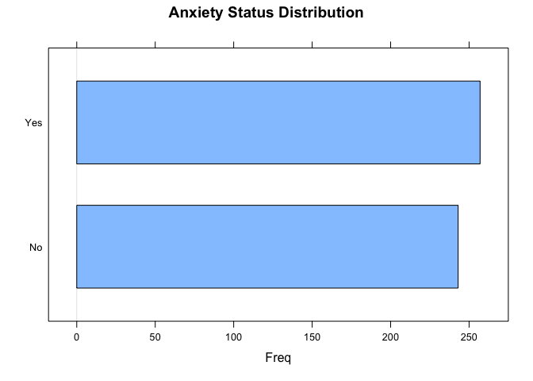

    # SECTION 4: INDEPENDENT VARIABLES PREPARATION
    # Extract survey response items (columns 43-50)
    i_var <- med[, c(43:50)]
    i_var

    ##     Item1 Item2 Item3 Item4 Item5 Item6 Item7 Item8
    ## 1       2     3     2     5     8     8     5     6
    ## 2       3     3     1     7     1     5     7     3
    ## 3       6     2     5     1     8     4     5     3
    ## 4       1     7     8     3     4     4     1     6
    ## 5       3     8     4     7     3     6     5     6
    ## 6       2     2     3     1     7     3     5     2
    ## 7       2     1     7     5     4     7     6     1
    ## 8       7     6     8     8     6     6     2     5
    ## 9       2     7     4     1     8     8     2     8
    ## 10      6     6     4     6     6     3     3     2
    ## 11      4     7     6     7     5     3     7     4
    ## 12      1     7     4     7     8     3     3     1
    ## 13      3     5     2     8     2     6     2     7
    ## 14      8     1     2     3     1     1     1     6
    ## 15      2     4     8     1     5     1     2     3
    ## 16      7     3     5     3     7     5     3     1
    ## 17      7     2     1     7     5     1     4     6
    ## 18      5     5     7     1     7     1     7     8
    ## 19      1     5     8     1     1     3     5     8
    ## 20      7     7     7     3     1     3     6     1
    ## 21      5     2     8     6     6     4     4     7
    ## 22      1     1     3     1     6     3     4     1
    ## 23      2     5     2     6     3     6     5     7
    ## 24      1     6     4     2     4     4     2     1
    ## 25      1     1     1     4     6     7     8     4
    ## 26      8     2     8     2     5     4     7     3
    ## 27      2     7     3     4     3     8     1     1
    ## 28      6     1     7     2     7     1     4     6
    ## 29      7     7     3     4     3     8     1     4
    ## 30      5     6     3     1     5     3     6     8
    ## 31      8     3     7     3     6     1     6     2
    ## 32      8     7     3     3     8     3     6     1
    ## 33      6     7     5     8     7     1     3     7
    ## 34      5     8     3     5     5     7     4     4
    ## 35      4     2     1     8     2     1     6     5
    ## 36      7     6     8     4     6     1     3     2
    ## 37      5     2     2     5     4     6     6     3
    ## 38      5     6     1     6     7     7     2     1
    ## 39      1     6     4     6     5     8     4     1
    ## 40      4     5     6     5     6     5     3     4
    ## 41      2     5     5     4     1     7     6     8
    ## 42      2     5     5     3     2     1     7     3
    ## 43      3     3     4     4     7     2     3     5
    ## 44      4     3     7     6     7     2     6     2
    ## 45      1     6     1     1     4     2     2     6
    ## 46      3     4     1     5     6     6     1     3
    ## 47      3     2     4     5     1     4     8     1
    ## 48      2     5     7     6     6     8     6     4
    ## 49      5     2     6     4     1     1     1     5
    ## 50      1     7     3     5     4     7     4     4
    ## 51      8     6     7     3     2     2     2     2
    ## 52      8     1     8     5     7     6     7     7
    ## 53      4     6     3     4     1     4     4     7
    ## 54      3     3     8     6     3     8     7     3
    ## 55      1     4     2     3     4     2     1     4
    ## 56      2     1     1     3     4     3     2     6
    ## 57      3     2     1     5     5     5     5     6
    ## 58      3     3     4     4     2     1     2     7
    ## 59      6     5     4     5     3     5     2     7
    ## 60      2     1     3     7     3     5     7     4
    ## 61      8     3     7     1     5     3     5     8
    ## 62      6     2     1     8     1     3     3     1
    ## 63      2     6     1     6     1     3     3     4
    ## 64      2     2     5     7     8     4     3     5
    ## 65      6     1     8     8     8     2     1     3
    ## 66      8     8     2     1     3     7     2     2
    ## 67      7     1     2     3     2     1     6     8
    ## 68      1     6     8     5     1     3     5     6
    ## 69      1     1     3     1     4     6     6     8
    ## 70      7     4     6     2     6     8     1     4
    ## 71      1     5     7     1     5     1     5     5
    ## 72      5     3     1     5     2     8     6     8
    ## 73      3     6     5     8     1     7     8     7
    ## 74      1     2     7     5     6     1     7     6
    ## 75      5     2     1     6     3     1     1     8
    ## 76      3     5     4     1     5     3     1     6
    ## 77      1     1     7     5     1     3     8     2
    ## 78      2     1     3     5     3     2     1     6
    ## 79      7     2     7     7     1     7     5     8
    ## 80      4     5     6     6     5     3     6     5
    ## 81      1     2     7     7     4     3     6     6
    ## 82      4     1     7     6     7     1     4     6
    ## 83      1     6     7     6     4     2     1     4
    ## 84      2     3     2     8     7     5     3     4
    ## 85      7     1     1     7     6     3     2     7
    ## 86      8     6     6     6     3     6     7     3
    ## 87      7     3     8     2     7     3     7     1
    ## 88      4     7     3     8     4     5     4     5
    ## 89      5     4     8     3     5     1     4     1
    ## 90      2     5     2     5     3     7     5     1
    ## 91      4     6     1     4     1     2     4     6
    ## 92      4     4     5     6     7     1     6     8
    ## 93      6     1     3     3     8     7     5     7
    ## 94      6     7     1     6     7     4     5     2
    ## 95      2     5     2     8     2     3     7     8
    ## 96      2     6     2     8     7     7     7     8
    ## 97      2     7     5     3     7     6     3     2
    ## 98      3     8     3     4     1     7     1     6
    ## 99      5     1     3     8     5     4     8     7
    ## 100     1     5     6     1     6     3     8     5
    ## 101     8     8     1     2     3     4     4     1
    ## 102     6     5     6     5     1     5     1     3
    ## 103     7     1     2     1     3     3     1     7
    ## 104     7     1     8     7     8     6     1     1
    ## 105     4     7     2     4     4     3     5     2
    ## 106     6     7     7     2     2     4     1     1
    ## 107     1     6     5     2     8     8     4     4
    ## 108     2     5     5     2     5     2     5     4
    ## 109     7     6     8     4     1     4     4     3
    ## 110     6     7     8     6     2     3     5     5
    ## 111     5     5     3     6     7     8     8     1
    ## 112     5     6     8     8     5     3     2     4
    ## 113     8     1     6     7     8     7     2     5
    ## 114     3     1     2     6     5     8     8     7
    ## 115     6     8     7     8     6     2     2     7
    ## 116     2     2     1     1     8     1     2     4
    ## 117     4     7     7     8     8     2     8     5
    ## 118     8     6     4     5     4     1     5     5
    ## 119     8     2     1     8     6     6     1     4
    ## 120     3     2     5     2     6     3     8     6
    ## 121     2     4     1     7     3     7     3     2
    ## 122     8     5     8     7     3     8     7     5
    ## 123     3     3     2     2     7     5     6     7
    ## 124     6     4     6     1     2     5     3     6
    ## 125     1     7     8     8     4     4     2     1
    ## 126     8     8     8     6     8     2     1     6
    ## 127     7     5     7     8     5     8     4     4
    ## 128     6     3     3     2     7     2     1     6
    ## 129     2     2     6     2     4     8     4     2
    ## 130     4     8     4     4     4     5     3     4
    ## 131     4     3     3     3     8     1     1     3
    ## 132     2     1     4     7     8     2     1     1
    ## 133     3     7     4     1     2     1     6     7
    ## 134     5     8     2     8     3     1     8     3
    ## 135     2     1     2     1     8     1     3     6
    ## 136     7     6     8     6     4     1     1     5
    ## 137     8     8     5     1     4     7     4     6
    ## 138     6     8     5     6     4     4     7     8
    ## 139     4     5     4     8     1     4     1     7
    ## 140     1     4     6     4     4     7     4     7
    ## 141     4     7     5     8     4     5     2     8
    ## 142     5     2     2     4     8     8     1     5
    ## 143     8     7     5     5     5     4     4     3
    ## 144     4     5     4     6     6     8     7     3
    ## 145     5     8     7     7     1     6     3     5
    ## 146     8     2     3     4     4     7     2     2
    ## 147     7     1     6     8     6     2     1     8
    ## 148     8     7     6     6     4     6     6     1
    ## 149     2     4     1     7     2     7     4     4
    ## 150     4     4     8     8     8     4     7     8
    ## 151     3     1     5     7     8     2     6     3
    ## 152     6     3     8     8     2     8     1     1
    ## 153     3     4     8     1     6     2     4     4
    ## 154     6     3     6     5     8     8     1     6
    ## 155     4     2     7     3     1     1     2     4
    ## 156     7     4     7     2     5     5     7     3
    ## 157     4     6     2     2     1     1     7     2
    ## 158     6     8     3     5     1     7     2     2
    ## 159     7     1     2     6     2     1     1     1
    ## 160     1     8     5     6     2     6     1     6
    ## 161     7     8     4     6     5     8     5     1
    ## 162     4     7     7     3     7     8     1     5
    ## 163     1     3     7     7     7     4     7     2
    ## 164     1     6     1     2     7     8     1     1
    ## 165     6     2     1     5     4     6     6     5
    ## 166     1     2     7     6     5     4     6     6
    ## 167     1     4     3     4     4     6     2     7
    ## 168     2     4     6     1     6     2     6     4
    ## 169     7     6     6     3     6     4     1     1
    ## 170     8     5     7     8     3     8     3     5
    ## 171     3     5     6     6     7     4     8     2
    ## 172     1     4     1     2     2     6     1     8
    ## 173     8     5     4     1     3     3     8     4
    ## 174     3     1     6     5     3     2     7     1
    ## 175     8     6     8     6     2     7     5     2
    ## 176     1     1     2     2     8     8     4     7
    ## 177     3     5     7     1     3     2     7     4
    ## 178     4     4     6     4     8     8     8     3
    ## 179     4     8     8     3     7     7     2     2
    ## 180     3     8     4     5     1     3     6     3
    ## 181     7     1     7     8     8     6     3     6
    ## 182     1     2     8     2     4     6     7     1
    ## 183     2     7     3     7     7     2     4     7
    ## 184     8     8     3     4     8     6     3     5
    ## 185     7     8     8     3     5     5     2     1
    ## 186     3     4     1     3     2     5     6     2
    ## 187     7     6     4     7     1     8     5     3
    ## 188     8     3     8     8     6     7     8     8
    ## 189     5     3     2     4     5     3     7     3
    ## 190     2     4     4     2     5     8     7     4
    ## 191     8     5     2     3     8     4     7     1
    ## 192     5     8     2     5     5     8     8     1
    ## 193     8     8     4     1     3     5     2     2
    ## 194     8     1     7     5     3     8     3     8
    ## 195     3     1     5     8     3     7     3     3
    ## 196     1     4     4     6     7     8     2     2
    ## 197     7     2     8     8     8     6     7     2
    ## 198     7     6     7     3     3     3     1     6
    ## 199     5     5     2     1     1     7     2     3
    ## 200     7     8     7     4     3     7     6     2
    ## 201     3     2     7     1     8     5     6     3
    ## 202     2     4     6     8     2     1     5     2
    ## 203     1     4     8     1     5     3     2     8
    ## 204     5     8     3     7     1     2     4     5
    ## 205     7     2     3     1     8     7     8     8
    ## 206     3     3     8     3     6     5     8     8
    ## 207     1     4     8     7     3     2     6     2
    ## 208     1     6     1     8     6     3     6     8
    ## 209     4     7     3     8     5     5     6     8
    ## 210     1     5     5     8     1     2     1     8
    ## 211     8     2     2     7     5     8     4     2
    ## 212     3     3     4     6     6     4     7     7
    ## 213     2     2     4     6     7     7     7     5
    ## 214     6     3     5     7     1     4     2     1
    ## 215     4     3     3     7     4     1     1     3
    ## 216     3     6     2     8     7     6     6     7
    ## 217     3     5     3     8     1     3     7     4
    ## 218     3     4     7     8     3     6     4     5
    ## 219     5     3     1     2     8     6     7     7
    ## 220     7     4     3     6     6     2     8     8
    ## 221     5     5     1     3     5     1     4     1
    ## 222     8     4     8     2     8     3     1     2
    ## 223     2     8     8     4     5     4     7     6
    ## 224     8     6     4     4     5     6     6     1
    ## 225     3     6     2     4     2     2     1     5
    ## 226     7     1     6     4     2     6     8     6
    ## 227     8     6     7     4     3     5     3     2
    ## 228     5     3     1     5     4     4     6     1
    ## 229     5     5     3     7     8     6     1     4
    ## 230     5     6     8     3     2     5     2     3
    ## 231     2     2     7     2     1     5     7     3
    ## 232     2     5     3     4     7     2     6     5
    ## 233     3     3     7     5     6     2     5     7
    ## 234     4     5     4     8     3     5     6     2
    ## 235     8     6     5     8     7     1     3     2
    ## 236     3     2     7     6     4     6     1     3
    ## 237     5     1     8     5     7     5     8     1
    ## 238     6     3     6     5     8     5     5     2
    ## 239     8     7     5     3     1     2     3     4
    ## 240     7     8     8     4     5     6     2     4
    ## 241     5     3     3     5     2     3     8     2
    ## 242     1     5     8     7     1     4     8     2
    ## 243     6     7     5     5     4     2     6     3
    ## 244     6     7     7     4     3     6     7     5
    ## 245     7     4     6     3     7     6     5     3
    ## 246     3     7     6     5     1     8     7     5
    ## 247     5     4     2     2     8     7     8     8
    ## 248     5     8     8     1     3     1     1     4
    ## 249     4     7     5     8     5     4     1     5
    ## 250     1     2     2     6     4     2     2     3
    ## 251     3     1     3     1     4     2     3     2
    ## 252     2     1     3     1     7     3     5     5
    ## 253     3     7     3     3     2     7     2     3
    ## 254     8     5     4     8     6     7     3     4
    ## 255     8     5     5     5     4     1     4     6
    ## 256     6     4     1     1     8     8     4     8
    ## 257     3     6     6     1     1     8     3     5
    ## 258     4     1     1     8     8     7     1     4
    ## 259     3     6     3     6     1     1     1     4
    ## 260     4     1     7     4     1     8     4     1
    ## 261     6     6     8     7     5     6     8     6
    ## 262     4     6     7     7     4     6     1     5
    ## 263     7     1     5     8     4     2     7     3
    ## 264     7     8     7     5     1     8     8     5
    ## 265     8     2     2     5     7     3     1     5
    ## 266     5     2     8     6     8     2     3     6
    ## 267     2     5     8     4     2     7     6     7
    ## 268     6     6     1     8     7     5     3     4
    ## 269     8     6     7     5     2     6     1     4
    ## 270     4     8     3     7     4     5     3     4
    ## 271     1     6     1     7     7     7     5     4
    ## 272     6     8     1     2     8     8     4     6
    ## 273     1     6     6     6     4     3     6     3
    ## 274     2     6     1     3     3     2     8     2
    ## 275     4     8     3     4     4     6     8     1
    ## 276     6     4     6     6     7     3     5     7
    ## 277     6     3     8     1     8     2     5     7
    ## 278     2     6     3     8     1     2     1     8
    ## 279     5     4     4     5     6     5     1     4
    ## 280     1     2     8     2     5     4     8     8
    ## 281     6     6     8     7     8     7     5     4
    ## 282     3     2     7     2     4     1     5     1
    ## 283     1     5     4     3     4     6     8     4
    ## 284     8     3     7     8     1     1     2     2
    ## 285     4     1     4     6     8     8     2     7
    ## 286     2     3     1     2     3     3     7     5
    ## 287     8     6     5     6     6     8     4     1
    ## 288     1     6     3     8     8     8     5     7
    ## 289     3     8     4     5     4     1     3     3
    ## 290     7     3     8     5     2     5     6     7
    ## 291     3     3     8     7     2     4     2     1
    ## 292     8     5     5     2     2     6     8     2
    ## 293     2     7     4     5     5     7     1     6
    ## 294     8     2     8     8     5     2     5     3
    ## 295     2     8     7     6     8     2     3     5
    ## 296     7     1     4     7     6     7     6     4
    ## 297     1     8     5     5     4     5     3     1
    ## 298     4     7     4     8     4     6     7     3
    ## 299     5     3     1     8     4     1     3     1
    ## 300     3     1     1     7     5     7     1     5
    ## 301     2     3     6     1     6     2     2     1
    ## 302     5     8     1     6     4     1     3     8
    ## 303     8     2     2     8     1     5     6     7
    ## 304     5     1     6     7     3     2     2     7
    ## 305     5     7     4     4     7     3     7     3
    ## 306     4     4     2     8     8     4     7     2
    ## 307     2     2     3     5     8     1     4     6
    ## 308     8     7     5     5     2     7     1     3
    ## 309     3     1     3     6     2     6     2     1
    ## 310     2     3     2     8     8     1     7     5
    ## 311     1     7     8     3     1     1     7     7
    ## 312     8     3     1     4     4     1     2     4
    ## 313     3     2     7     7     6     7     3     4
    ## 314     8     2     4     4     6     5     8     5
    ## 315     2     7     6     7     5     5     6     1
    ## 316     3     3     8     8     4     6     3     6
    ## 317     1     1     7     4     6     5     6     8
    ## 318     6     7     8     2     4     7     7     5
    ## 319     3     4     7     1     2     6     7     1
    ## 320     6     8     4     1     7     8     1     3
    ## 321     5     5     1     3     7     6     2     6
    ## 322     7     2     4     4     7     5     5     8
    ## 323     8     3     5     4     2     8     7     8
    ## 324     4     1     7     5     5     2     6     2
    ## 325     1     2     5     7     7     5     6     1
    ## 326     3     1     8     6     2     2     8     8
    ## 327     1     2     5     2     4     3     8     4
    ## 328     5     3     3     2     7     5     3     4
    ## 329     6     1     8     8     1     3     3     7
    ## 330     4     3     1     3     5     5     7     6
    ## 331     1     1     5     1     1     3     7     8
    ## 332     6     2     2     8     8     4     4     2
    ## 333     5     5     5     4     4     3     6     1
    ## 334     5     8     6     6     5     2     1     2
    ## 335     5     8     3     3     1     1     2     7
    ## 336     8     5     2     7     5     6     2     3
    ## 337     7     8     7     2     4     3     8     2
    ## 338     8     7     1     2     8     1     2     3
    ## 339     6     4     1     2     6     7     6     4
    ## 340     3     4     6     4     7     4     3     3
    ## 341     2     7     7     4     8     4     1     1
    ## 342     1     7     5     4     5     8     2     6
    ## 343     7     6     2     5     7     7     6     6
    ## 344     2     3     6     1     8     7     5     1
    ## 345     5     1     2     7     7     8     7     1
    ## 346     2     4     5     2     6     7     4     1
    ## 347     6     2     7     2     4     2     4     5
    ## 348     8     7     5     8     5     7     2     8
    ## 349     5     8     4     5     5     2     3     7
    ## 350     8     5     4     2     6     8     4     3
    ## 351     7     1     5     7     2     3     4     8
    ## 352     5     6     3     2     6     8     8     1
    ## 353     4     5     6     4     6     5     4     6
    ## 354     4     8     4     4     6     7     4     2
    ## 355     7     7     8     1     4     7     2     2
    ## 356     6     1     5     7     8     4     8     5
    ## 357     6     7     8     7     3     8     6     8
    ## 358     2     4     8     2     6     8     1     8
    ## 359     7     4     2     3     5     1     1     8
    ## 360     8     3     6     2     1     5     3     3
    ## 361     1     8     7     2     2     4     6     3
    ## 362     7     6     4     1     6     3     7     7
    ## 363     2     1     7     3     6     7     5     3
    ## 364     6     6     3     8     2     4     1     6
    ## 365     1     2     6     2     6     2     5     6
    ## 366     7     6     6     6     5     1     1     8
    ## 367     2     7     1     6     3     1     8     7
    ## 368     3     7     2     7     6     2     1     8
    ## 369     8     4     3     7     2     8     8     5
    ## 370     3     3     8     3     6     7     8     3
    ## 371     8     8     3     6     4     7     3     3
    ## 372     1     7     7     4     5     5     4     8
    ## 373     4     4     3     4     5     2     3     8
    ## 374     8     5     2     3     3     7     8     1
    ## 375     1     4     3     8     8     1     8     8
    ## 376     2     1     1     2     4     7     1     3
    ## 377     5     8     4     7     4     3     6     6
    ## 378     3     3     2     3     3     7     4     1
    ## 379     5     7     3     6     7     5     6     1
    ## 380     3     1     5     3     7     6     6     3
    ## 381     2     2     4     6     8     4     6     2
    ## 382     3     2     7     7     1     6     4     4
    ## 383     1     4     8     4     8     3     6     8
    ## 384     5     3     6     3     7     6     4     6
    ## 385     6     6     2     7     8     7     5     2
    ## 386     5     3     5     7     6     5     8     3
    ## 387     2     3     6     5     4     1     7     8
    ## 388     6     3     5     8     8     1     1     3
    ## 389     5     4     3     6     1     3     2     8
    ## 390     8     1     8     5     1     6     6     8
    ## 391     7     4     2     4     5     8     3     2
    ## 392     8     6     8     7     6     8     5     3
    ## 393     2     1     8     7     5     5     3     6
    ## 394     7     6     7     2     2     4     2     7
    ## 395     4     5     3     6     7     7     4     8
    ## 396     1     5     6     8     5     6     2     1
    ## 397     8     8     7     8     4     8     3     5
    ## 398     3     7     8     2     4     8     8     3
    ## 399     7     7     1     4     6     6     8     3
    ## 400     3     1     5     2     1     4     2     2
    ## 401     3     4     1     7     4     2     8     8
    ## 402     4     6     6     6     7     7     1     1
    ## 403     1     6     3     1     5     3     2     2
    ## 404     5     7     7     6     7     7     6     7
    ## 405     7     7     7     6     8     5     1     8
    ## 406     5     2     7     5     5     3     6     6
    ## 407     8     6     4     1     6     4     7     2
    ## 408     1     4     5     1     8     5     7     3
    ## 409     6     2     4     1     7     1     2     8
    ## 410     1     4     2     6     5     1     1     1
    ## 411     3     3     5     4     7     7     8     6
    ## 412     5     6     1     1     3     5     1     3
    ## 413     1     3     4     3     6     3     7     6
    ## 414     5     5     6     2     6     3     2     3
    ## 415     1     5     2     4     4     1     5     3
    ## 416     2     1     5     3     6     1     4     3
    ## 417     8     6     7     6     2     4     4     8
    ## 418     7     7     6     6     4     5     4     5
    ## 419     3     2     8     3     4     3     8     4
    ## 420     1     3     2     5     8     8     1     1
    ## 421     4     4     1     5     8     4     8     7
    ## 422     1     6     7     3     7     3     7     5
    ## 423     2     1     6     8     3     1     4     4
    ## 424     8     4     5     5     4     5     7     6
    ## 425     4     3     2     2     8     2     1     4
    ## 426     4     6     3     2     1     5     7     8
    ## 427     8     7     8     8     5     6     5     8
    ## 428     1     3     5     6     5     8     8     8
    ## 429     2     6     5     5     6     8     2     4
    ## 430     4     6     7     8     7     8     7     5
    ## 431     7     3     5     1     3     2     7     1
    ## 432     3     3     7     8     5     7     2     2
    ## 433     6     4     5     3     1     7     1     4
    ## 434     3     1     3     2     3     4     1     8
    ## 435     5     3     6     8     2     2     8     2
    ## 436     5     5     6     7     5     2     7     2
    ## 437     2     8     6     5     4     4     5     3
    ## 438     4     1     1     7     1     5     4     2
    ## 439     3     5     3     5     7     4     5     6
    ## 440     3     4     3     8     7     6     2     6
    ## 441     6     3     8     8     1     1     2     3
    ## 442     2     1     2     2     5     7     6     1
    ## 443     7     7     4     2     8     1     4     7
    ## 444     4     3     6     8     8     7     7     1
    ## 445     2     6     4     1     6     2     2     6
    ## 446     1     3     2     5     2     8     6     7
    ## 447     3     7     3     8     4     4     1     3
    ## 448     2     1     2     5     2     4     2     1
    ## 449     2     3     5     4     2     4     3     7
    ## 450     6     3     2     6     5     8     4     7
    ## 451     7     2     2     1     4     6     6     4
    ## 452     1     2     7     2     5     6     4     1
    ## 453     5     1     5     7     5     8     4     3
    ## 454     3     1     7     2     6     5     3     7
    ## 455     6     6     4     3     1     8     5     6
    ## 456     7     6     8     6     7     3     1     8
    ## 457     7     8     5     2     6     7     4     4
    ## 458     2     3     8     5     7     3     2     2
    ## 459     3     5     1     2     6     3     8     2
    ## 460     8     1     2     8     5     8     1     2
    ## 461     5     7     8     5     6     7     2     6
    ## 462     8     3     2     5     7     5     1     8
    ## 463     8     5     7     1     6     4     7     7
    ## 464     8     2     4     2     3     3     1     3
    ## 465     7     6     7     1     4     8     6     2
    ## 466     2     7     3     7     1     4     2     1
    ## 467     7     1     5     7     7     8     8     2
    ## 468     1     3     3     6     4     2     2     7
    ## 469     7     2     1     5     1     3     7     5
    ## 470     3     8     5     8     8     2     1     6
    ## 471     7     4     1     8     3     5     4     5
    ## 472     7     2     1     7     5     1     8     2
    ## 473     8     3     1     6     8     6     2     8
    ## 474     6     8     6     2     7     7     7     7
    ## 475     1     6     5     6     8     8     8     2
    ## 476     5     5     8     6     1     5     3     5
    ## 477     5     7     5     2     1     5     3     7
    ## 478     3     7     6     1     1     5     1     6
    ## 479     5     4     4     1     3     3     5     6
    ## 480     4     7     8     5     8     2     1     2
    ## 481     6     4     6     8     4     6     7     6
    ## 482     3     8     8     5     3     3     1     4
    ## 483     7     6     2     2     1     1     4     7
    ## 484     4     4     3     2     6     7     4     8
    ## 485     5     1     3     4     1     7     6     7
    ## 486     7     3     1     4     6     6     7     6
    ## 487     3     8     5     3     5     7     5     7
    ## 488     8     7     5     8     3     7     8     5
    ## 489     4     4     1     7     6     5     7     3
    ## 490     5     2     2     5     3     4     7     5
    ## 491     2     5     3     6     2     1     5     1
    ## 492     2     3     6     7     4     2     7     4
    ## 493     1     6     4     3     2     8     5     3
    ## 494     2     7     8     7     6     1     5     2
    ## 495     8     2     8     8     2     3     5     7
    ## 496     4     1     8     8     8     7     7     8
    ## 497     8     4     8     8     7     4     7     1
    ## 498     6     2     7     3     4     8     1     1
    ## 499     2     3     2     1     6     3     7     8
    ## 500     3     7     8     6     5     6     1     4

    # SECTION 5: DATA ENCODING
    # Convert binary anxiety variable to numeric (No=0, Yes=1)
    med$Anxiety[med$Anxiety == "No"] <- "0"
    med$Anxiety[med$Anxiety == "Yes"] <- "1"
    med$Anxiety <- as.numeric(med$Anxiety)

    # Verify encoding
    table(med$Anxiety)

    ## 
    ##   0   1 
    ## 243 257

    # SECTION 6: EXPLORATORY DATA ANALYSIS
    # Univariate statistics for independent variables
    print(summary(i_var))

    ##      Item1           Item2           Item3           Item4      
    ##  Min.   :1.000   Min.   :1.000   Min.   :1.000   Min.   :1.000  
    ##  1st Qu.:2.000   1st Qu.:2.000   1st Qu.:3.000   1st Qu.:3.000  
    ##  Median :4.000   Median :4.000   Median :5.000   Median :5.000  
    ##  Mean   :4.418   Mean   :4.382   Mean   :4.664   Mean   :4.724  
    ##  3rd Qu.:7.000   3rd Qu.:6.000   3rd Qu.:7.000   3rd Qu.:7.000  
    ##  Max.   :8.000   Max.   :8.000   Max.   :8.000   Max.   :8.000  
    ##      Item5           Item6           Item7          Item8      
    ##  Min.   :1.000   Min.   :1.000   Min.   :1.00   Min.   :1.000  
    ##  1st Qu.:3.000   1st Qu.:3.000   1st Qu.:2.00   1st Qu.:2.000  
    ##  Median :5.000   Median :5.000   Median :4.00   Median :4.000  
    ##  Mean   :4.672   Mean   :4.554   Mean   :4.36   Mean   :4.396  
    ##  3rd Qu.:7.000   3rd Qu.:7.000   3rd Qu.:7.00   3rd Qu.:6.000  
    ##  Max.   :8.000   Max.   :8.000   Max.   :8.00   Max.   :8.000

    print(table(med$Anxiety))

    ## 
    ##   0   1 
    ## 243 257

    # Boxplot visualization of survey responses
    boxplot(i_var,
            main = "Survey Response Distribution",
            xlab = "Survey Items",
            ylab = "Response Scale")

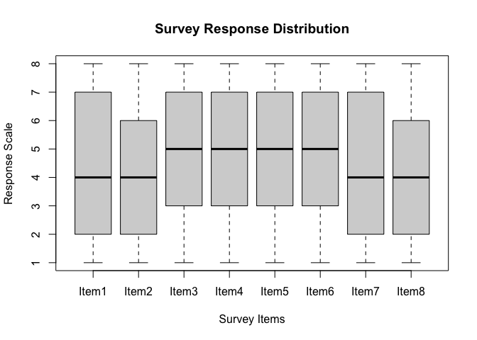

    # SECTION 7: BIVARIATE ANALYSIS
    # Combine variables for bivariate analysis
    all_var <- data.frame(Anxiety, i_var)

    # Mosaic plots for each survey item vs. anxiety (relationship visualization)
    mosaicplot(Item1~med.Anxiety, data = all_var, color = TRUE, main = "Item 1 vs. Anxiety")

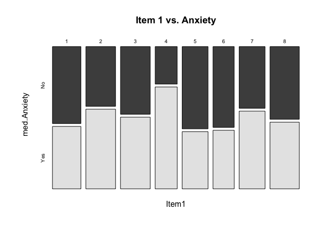

    mosaicplot(Item2~med.Anxiety, data = all_var, color = TRUE, main = "Item 2 vs. Anxiety")

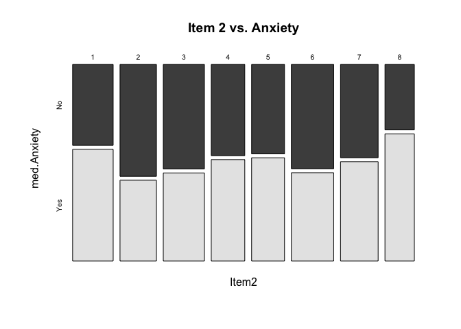

    mosaicplot(Item3~med.Anxiety, data = all_var, color = TRUE, main = "Item 3 vs. Anxiety")

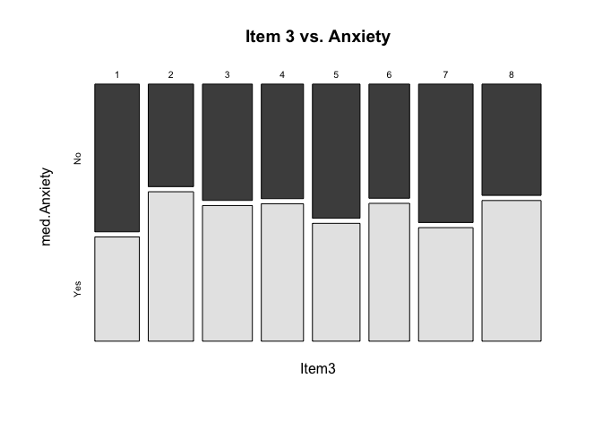

    mosaicplot(Item4~med.Anxiety, data = all_var, color = TRUE, main = "Item 4 vs. Anxiety")

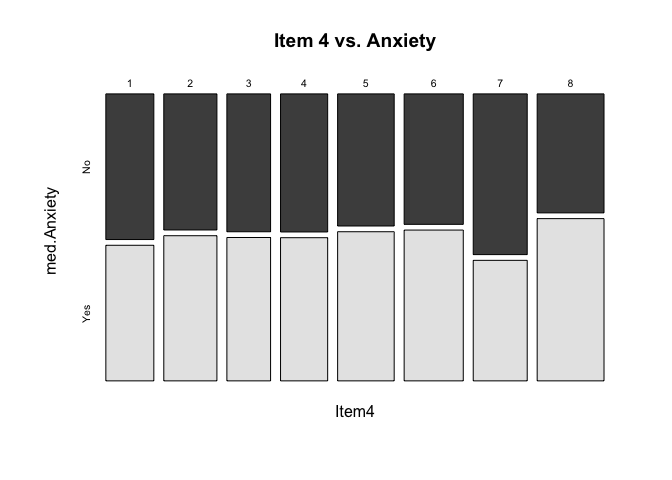

    mosaicplot(Item5~med.Anxiety, data = all_var, color = TRUE, main = "Item 5 vs. Anxiety")

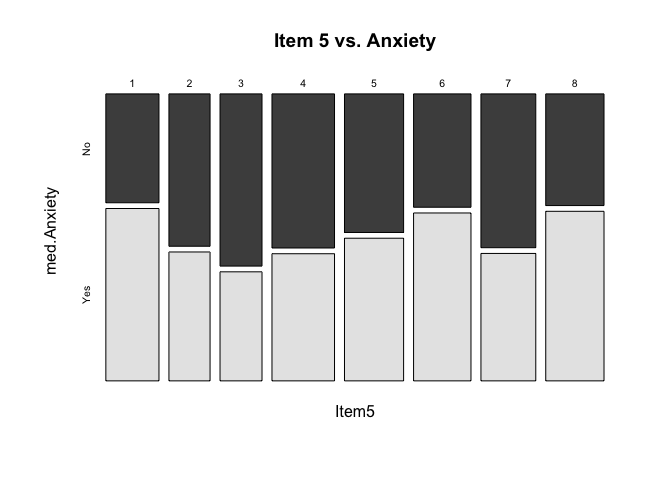

    mosaicplot(Item6~med.Anxiety, data = all_var, color = TRUE, main = "Item 6 vs. Anxiety")

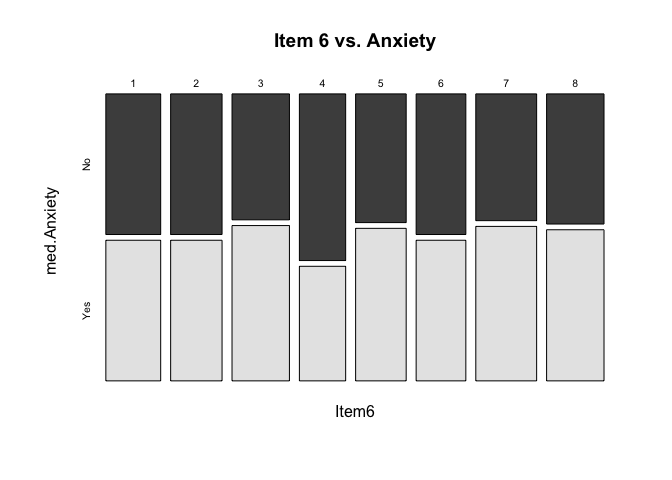

    mosaicplot(Item7~med.Anxiety, data = all_var, color = TRUE, main = "Item 7 vs. Anxiety")

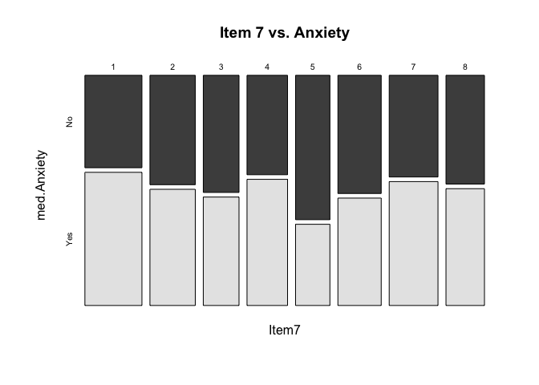

    mosaicplot(Item8~med.Anxiety, data = all_var, color = TRUE, main = "Item 8 vs. Anxiety")

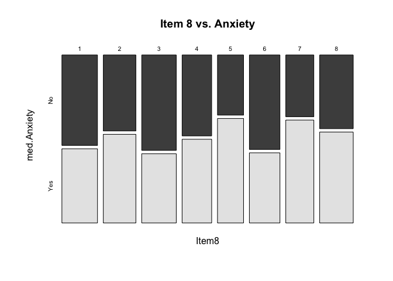

    # SECTION 8: DATA EXPORT
    # Create and save clean dataset for model building
    all_var_clean <- data.frame(med$Anxiety, i_var)
    summary(all_var_clean)

    ##   med.Anxiety        Item1           Item2           Item3      
    ##  Min.   :0.000   Min.   :1.000   Min.   :1.000   Min.   :1.000  
    ##  1st Qu.:0.000   1st Qu.:2.000   1st Qu.:2.000   1st Qu.:3.000  
    ##  Median :1.000   Median :4.000   Median :4.000   Median :5.000  
    ##  Mean   :0.514   Mean   :4.418   Mean   :4.382   Mean   :4.664  
    ##  3rd Qu.:1.000   3rd Qu.:7.000   3rd Qu.:6.000   3rd Qu.:7.000  
    ##  Max.   :1.000   Max.   :8.000   Max.   :8.000   Max.   :8.000  
    ##      Item4           Item5           Item6           Item7          Item8      
    ##  Min.   :1.000   Min.   :1.000   Min.   :1.000   Min.   :1.00   Min.   :1.000  
    ##  1st Qu.:3.000   1st Qu.:3.000   1st Qu.:3.000   1st Qu.:2.00   1st Qu.:2.000  
    ##  Median :5.000   Median :5.000   Median :5.000   Median :4.00   Median :4.000  
    ##  Mean   :4.724   Mean   :4.672   Mean   :4.554   Mean   :4.36   Mean   :4.396  
    ##  3rd Qu.:7.000   3rd Qu.:7.000   3rd Qu.:7.000   3rd Qu.:7.00   3rd Qu.:6.000  
    ##  Max.   :8.000   Max.   :8.000   Max.   :8.000   Max.   :8.00   Max.   :8.000

    # TODO: Update file path to your output location
    # write_csv(all_var_clean, "clean_med_log_reg.csv")

    #Initial Logistic Regression
    Logit (med.Anxiety ~ Item1 + Item2 + Item3 + Item4 + Item5 + Item6 + Item7 + Item8, data = all_var_clean)

    ## 
    ## Response Variable:   med.Anxiety
    ## Predictor Variable 1:  Item1
    ## Predictor Variable 2:  Item2
    ## Predictor Variable 3:  Item3
    ## Predictor Variable 4:  Item4
    ## Predictor Variable 5:  Item5
    ## Predictor Variable 6:  Item6
    ## Predictor Variable 7:  Item7
    ## Predictor Variable 8:  Item8
    ## 
    ## Number of cases (rows) of data:  500 
    ## Number of cases retained for analysis:  500 
    ## 
    ## 
    ##    BASIC ANALYSIS 
    ## 
    ## -- Estimated Model of med.Anxiety for the Logit of Reference Group Membership
    ## 
    ##              Estimate    Std Err  z-value  p-value   Lower 95%   Upper 95%
    ## (Intercept)   -0.5533     0.4940   -1.120    0.263     -1.5215      0.4150 
    ##       Item1   -0.0254     0.0386   -0.659    0.510     -0.1010      0.0502 
    ##       Item2    0.0404     0.0403    1.003    0.316     -0.0386      0.1195 
    ##       Item3    0.0127     0.0386    0.330    0.742     -0.0629      0.0883 
    ##       Item4    0.0188     0.0389    0.483    0.629     -0.0574      0.0950 
    ##       Item5    0.0288     0.0400    0.719    0.472     -0.0496      0.1072 
    ##       Item6    0.0263     0.0391    0.673    0.501     -0.0503      0.1029 
    ##       Item7   -0.0321     0.0382   -0.840    0.401     -0.1070      0.0428 
    ##       Item8    0.0643     0.0385    1.669    0.095     -0.0112      0.1398 
    ## 
    ## 
    ## -- Odds Ratios and Confidence Intervals
    ## 
    ##              Odds Ratio   Lower 95%   Upper 95%
    ## (Intercept)      0.5751      0.2184      1.5143 
    ##       Item1      0.9749      0.9039      1.0515 
    ##       Item2      1.0413      0.9621      1.1269 
    ##       Item3      1.0128      0.9391      1.0923 
    ##       Item4      1.0190      0.9442      1.0996 
    ##       Item5      1.0292      0.9516      1.1131 
    ##       Item6      1.0267      0.9509      1.1084 
    ##       Item7      0.9684      0.8985      1.0438 
    ##       Item8      1.0664      0.9889      1.1501 
    ## 
    ## 
    ## -- Model Fit
    ## 
    ##     Null deviance: 692.755 on 499 degrees of freedom
    ## Residual deviance: 686.907 on 491 degrees of freedom
    ## 
    ## AIC: 704.9075 
    ## 
    ## Number of iterations to convergence: 4 
    ## 
    ## 
    ## Collinearity
    ## 
    ##       Tolerance       VIF
    ## Item1     0.980     1.020
    ## Item2     0.965     1.037
    ## Item3     0.991     1.009
    ## Item4     0.994     1.006
    ## Item5     0.984     1.016
    ## Item6     0.971     1.030
    ## Item7     0.979     1.022
    ## Item8     0.993     1.008
    ## 
    ##    ANALYSIS OF RESIDUALS AND INFLUENCE 
    ## Data, Fitted, Residual, Studentized Residual, Dffits, Cook's Distance
    ##    [sorted by Cook's Distance]
    ##    [res_rows = 20 out of 500 cases (rows) of data]
    ## --------------------------------------------------------------------
    ##     Item1 Item2 Item3 Item4 Item5 Item6 Item7 Item8 med.Anxiety P(Y=1) residual rstudent  dffits    cooks
    ## 9       2     7     4     1     8     8     2     8           0 0.6547  -0.6547   -1.476 -0.2084 0.006010
    ## 159     7     1     2     6     2     1     1     1           1 0.3926   0.6074    1.384  0.1985 0.005065
    ## 470     3     8     5     8     8     2     1     6           0 0.6328  -0.6328   -1.430 -0.1902 0.004830
    ## 288     1     6     3     8     8     8     5     7           0 0.6417  -0.6417   -1.447 -0.1881 0.004794
    ## 14      8     1     2     3     1     1     1     6           1 0.4439   0.5561    1.290  0.1927 0.004448
    ## 172     1     4     1     2     2     6     1     8           0 0.5820  -0.5820   -1.335 -0.1876 0.004364
    ## 278     2     6     3     8     1     2     1     8           0 0.5964  -0.5964   -1.361 -0.1836 0.004266
    ## 256     6     4     1     1     8     8     4     8           0 0.5779  -0.5779   -1.328 -0.1857 0.004252
    ## 77      1     1     7     5     1     3     8     2           1 0.4071   0.5929    1.354  0.1838 0.004252
    ## 431     7     3     5     1     3     2     7     1           1 0.3661   0.6339    1.431  0.1766 0.004174
    ## 208     1     6     1     8     6     3     6     8           0 0.5988  -0.5988   -1.365 -0.1812 0.004166
    ## 284     8     3     7     8     1     1     2     2           1 0.4313   0.5687    1.311  0.1845 0.004144
    ## 260     4     1     7     4     1     8     4     1           1 0.4316   0.5684    1.310  0.1802 0.003955
    ## 456     7     6     8     6     7     3     1     8           0 0.6198  -0.6198   -1.403 -0.1737 0.003950
    ## 374     8     5     2     3     3     7     8     1           1 0.4026   0.5974    1.362  0.1760 0.003924
    ## 203     1     4     8     1     5     3     2     8           0 0.5931  -0.5931   -1.354 -0.1762 0.003909
    ## 338     8     7     1     2     8     1     2     3           1 0.4905   0.5095    1.208  0.1846 0.003860
    ## 302     5     8     1     6     4     1     3     8           0 0.5813  -0.5813   -1.332 -0.1746 0.003777
    ## 427     8     7     8     8     5     6     5     8           0 0.6069  -0.6069   -1.379 -0.1710 0.003756
    ## 194     8     1     7     5     3     8     3     8           0 0.5453  -0.5453   -1.269 -0.1782 0.003755
    ## 
    ## 
    ##    PREDICTION 
    ## 
    ## Probability threshold for classification : 0.5
    ## 
    ## 
    ## Data, Fitted Values, Standard Errors
    ##    [sorted by fitted value]
    ##    [pred_all=TRUE to see all intervals displayed]
    ## --------------------------------------------------------------------
    ##     Item1 Item2 Item3 Item4 Item5 Item6 Item7 Item8 med.Anxiety label fitted std.err
    ## 431     7     3     5     1     3     2     7     1           1     0 0.3661 0.06948
    ## 472     7     2     1     7     5     1     8     2           0     0 0.3860 0.07954
    ## 47      3     2     4     5     1     4     8     1           1     0 0.3864 0.06770
    ## 174     3     1     6     5     3     2     7     1           1     0 0.3917 0.06472
    ## 
    ## ... for the rows of data where fitted is close to 0.5 ...
    ## 
    ##     Item1 Item2 Item3 Item4 Item5 Item6 Item7 Item8 med.Anxiety label fitted std.err
    ## 408     1     4     5     1     8     5     7     3           0     0 0.4989 0.06683
    ## 143     8     7     5     5     5     4     4     3           0     0 0.4994 0.05032
    ## 406     5     2     7     5     5     3     6     6           0     0 0.4999 0.04709
    ## 255     8     5     5     5     4     1     4     6           0     1 0.5005 0.05729
    ## 495     8     2     8     8     2     3     5     7           0     1 0.5006 0.07569
    ## 
    ## ... for the last 4 rows of sorted data ...
    ## 
    ##     Item1 Item2 Item3 Item4 Item5 Item6 Item7 Item8 med.Anxiety label fitted std.err
    ## 358     2     4     8     2     6     8     1     8           1     1 0.6370 0.07916
    ## 288     1     6     3     8     8     8     5     7           0     1 0.6417 0.07271
    ## 405     7     7     7     6     8     5     1     8           1     1 0.6451 0.07002
    ## 9       2     7     4     1     8     8     2     8           0     1 0.6547 0.07815
    ## --------------------------------------------------------------------
    ## 
    ## 
    ## ----------------------------
    ## Specified confusion matrices
    ## ----------------------------
    ## 
    ## Probability threshold for predicting : 0.5
    ## 
    ##                     Baseline         Predicted 
    ## ---------------------------------------------------
    ##                    Total  %Tot        0      1  %Correct 
    ## ---------------------------------------------------
    ##               1      257  51.4       92    165     64.2 
    ## med.Anxiety   0      243  48.6      111    132     45.7 
    ## ---------------------------------------------------
    ##             Total    500                           55.2 
    ## 
    ## Accuracy: 55.20 
    ## Sensitivity: 64.20 
    ## Precision: 55.56

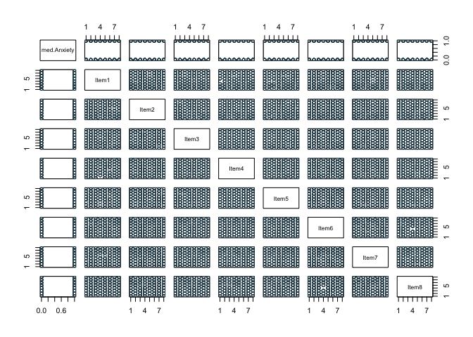

    #Reduced model minus Item3
    Logit (med.Anxiety ~ Item1 + Item2 + Item4 + Item5 + Item6 + Item7 + Item8, data = all_var_clean)

    ## 
    ## Response Variable:   med.Anxiety
    ## Predictor Variable 1:  Item1
    ## Predictor Variable 2:  Item2
    ## Predictor Variable 3:  Item4
    ## Predictor Variable 4:  Item5
    ## Predictor Variable 5:  Item6
    ## Predictor Variable 6:  Item7
    ## Predictor Variable 7:  Item8
    ## 
    ## Number of cases (rows) of data:  500 
    ## Number of cases retained for analysis:  500 
    ## 
    ## 
    ##    BASIC ANALYSIS 
    ## 
    ## -- Estimated Model of med.Anxiety for the Logit of Reference Group Membership
    ## 
    ##              Estimate    Std Err  z-value  p-value   Lower 95%   Upper 95%
    ## (Intercept)   -0.5006     0.4673   -1.071    0.284     -1.4165      0.4153 
    ##       Item1   -0.0247     0.0385   -0.642    0.521     -0.1002      0.0508 
    ##       Item2    0.0412     0.0402    1.024    0.306     -0.0377      0.1201 
    ##       Item4    0.0190     0.0389    0.488    0.626     -0.0572      0.0952 
    ##       Item5    0.0286     0.0400    0.716    0.474     -0.0498      0.1070 
    ##       Item6    0.0260     0.0391    0.665    0.506     -0.0506      0.1026 
    ##       Item7   -0.0315     0.0382   -0.825    0.409     -0.1063      0.0433 
    ##       Item8    0.0641     0.0385    1.663    0.096     -0.0114      0.1396 
    ## 
    ## 
    ## -- Odds Ratios and Confidence Intervals
    ## 
    ##              Odds Ratio   Lower 95%   Upper 95%
    ## (Intercept)      0.6062      0.2426      1.5148 
    ##       Item1      0.9756      0.9046      1.0521 
    ##       Item2      1.0421      0.9630      1.1276 
    ##       Item4      1.0192      0.9444      1.0998 
    ##       Item5      1.0290      0.9515      1.1130 
    ##       Item6      1.0263      0.9506      1.1080 
    ##       Item7      0.9690      0.8991      1.0443 
    ##       Item8      1.0662      0.9886      1.1498 
    ## 
    ## 
    ## -- Model Fit
    ## 
    ##     Null deviance: 692.755 on 499 degrees of freedom
    ## Residual deviance: 687.016 on 492 degrees of freedom
    ## 
    ## AIC: 703.0162 
    ## 
    ## Number of iterations to convergence: 4 
    ## 
    ## 
    ## Collinearity
    ## 
    ##       Tolerance       VIF
    ## Item1     0.983     1.018
    ## Item2     0.968     1.033
    ## Item4     0.994     1.006
    ## Item5     0.985     1.016
    ## Item6     0.972     1.029
    ## Item7     0.981     1.020
    ## Item8     0.993     1.007
    ## 
    ##    ANALYSIS OF RESIDUALS AND INFLUENCE 
    ## Data, Fitted, Residual, Studentized Residual, Dffits, Cook's Distance
    ##    [sorted by Cook's Distance]
    ##    [res_rows = 20 out of 500 cases (rows) of data]
    ## --------------------------------------------------------------------
    ##     Item1 Item2 Item4 Item5 Item6 Item7 Item8 med.Anxiety P(Y=1) residual rstudent  dffits    cooks
    ## 9       2     7     1     8     8     2     8           0 0.6556  -0.6556   -1.478 -0.2085 0.006769
    ## 470     3     8     8     8     2     1     6           0 0.6320  -0.6320   -1.429 -0.1900 0.005410
    ## 288     1     6     8     8     8     5     7           0 0.6460  -0.6460   -1.455 -0.1856 0.005280
    ## 159     7     1     6     2     1     1     1           1 0.4006   0.5994    1.367  0.1877 0.005026
    ## 431     7     3     1     3     2     7     1           1 0.3659   0.6341    1.431  0.1768 0.004698
    ## 278     2     6     8     1     2     1     8           0 0.6012  -0.6012   -1.369 -0.1812 0.004695
    ## 77      1     1     5     1     3     8     2           1 0.3997   0.6003    1.367  0.1769 0.004469
    ## 284     8     3     8     1     1     2     2           1 0.4247   0.5753    1.322  0.1799 0.004465
    ## 14      8     1     3     1     1     1     6           1 0.4519   0.5481    1.274  0.1827 0.004445
    ## 172     1     4     2     2     6     1     8           0 0.5919  -0.5919   -1.351 -0.1755 0.004346
    ## 260     4     1     4     1     8     4     1           1 0.4236   0.5764    1.323  0.1727 0.004122
    ## 256     6     4     1     8     8     4     8           0 0.5886  -0.5886   -1.345 -0.1712 0.004116
    ## 47      3     2     5     1     4     8     1           1 0.3886   0.6114    1.386  0.1643 0.003918
    ## 331     1     1     1     1     3     7     8           1 0.4834   0.5166    1.218  0.1741 0.003889
    ## 33      6     7     8     7     1     3     7           0 0.5919  -0.5919   -1.350 -0.1655 0.003867
    ## 208     1     6     8     6     3     6     8           0 0.6099  -0.6099   -1.383 -0.1631 0.003852
    ## 420     1     3     5     8     8     1     1           0 0.5405  -0.5405   -1.259 -0.1704 0.003834
    ## 292     8     5     2     2     6     8     2           1 0.4097   0.5903    1.347  0.1632 0.003751
    ## 428     1     3     6     5     8     8     8           0 0.5802  -0.5802   -1.329 -0.1643 0.003747
    ## 194     8     1     5     3     8     3     8           0 0.5373  -0.5373   -1.253 -0.1680 0.003711
    ## 
    ## 
    ##    PREDICTION 
    ## 
    ## Probability threshold for classification : 0.5
    ## 
    ## 
    ## Data, Fitted Values, Standard Errors
    ##    [sorted by fitted value]
    ##    [pred_all=TRUE to see all intervals displayed]
    ## --------------------------------------------------------------------
    ##     Item1 Item2 Item4 Item5 Item6 Item7 Item8 med.Anxiety label fitted std.err
    ## 431     7     3     1     3     2     7     1           1     0 0.3659 0.06946
    ## 174     3     1     5     3     2     7     1           1     0 0.3876 0.06330
    ## 47      3     2     5     1     4     8     1           1     0 0.3886 0.06749
    ## 472     7     2     7     5     1     8     2           0     0 0.3981 0.07141
    ## 
    ## ... for the rows of data where fitted is close to 0.5 ...
    ## 
    ##     Item1 Item2 Item4 Item5 Item6 Item7 Item8 med.Anxiety label fitted std.err
    ## 143     8     7     5     5     4     4     3           0     0 0.4995 0.05031
    ## 414     5     5     2     6     3     2     3           0     0 0.4997 0.04835
    ## 116     2     2     1     8     1     2     4           1     0 0.4999 0.07306
    ## 255     8     5     5     4     1     4     6           0     1 0.5003 0.05729
    ## 329     6     1     8     1     3     3     7           1     1 0.5011 0.07220
    ## 
    ## ... for the last 4 rows of sorted data ...
    ## 
    ##     Item1 Item2 Item4 Item5 Item6 Item7 Item8 med.Anxiety label fitted std.err
    ## 368     3     7     7     6     2     1     8           1     1 0.6344 0.06555
    ## 405     7     7     6     8     5     1     8           1     1 0.6384 0.06755
    ## 288     1     6     8     8     8     5     7           0     1 0.6460 0.07114
    ## 9       2     7     1     8     8     2     8           0     1 0.6556 0.07798
    ## --------------------------------------------------------------------
    ## 
    ## 
    ## ----------------------------
    ## Specified confusion matrices
    ## ----------------------------
    ## 
    ## Probability threshold for predicting : 0.5
    ## 
    ##                     Baseline         Predicted 
    ## ---------------------------------------------------
    ##                    Total  %Tot        0      1  %Correct 
    ## ---------------------------------------------------
    ##               1      257  51.4       92    165     64.2 
    ## med.Anxiety   0      243  48.6      112    131     46.1 
    ## ---------------------------------------------------
    ##             Total    500                           55.4 
    ## 
    ## Accuracy: 55.40 
    ## Sensitivity: 64.20 
    ## Precision: 55.74

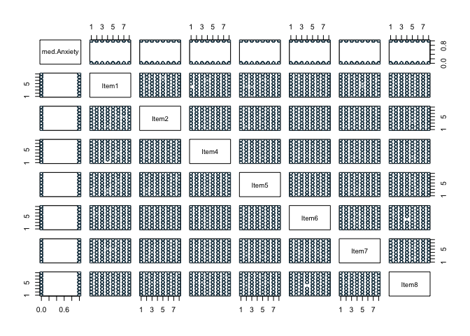

    #Reduced model minus Item3, Item7
    Logit (med.Anxiety ~ Item1 + Item2 + Item4 + Item5 + Item6 + Item8, data = all_var_clean)

    ## 
    ## Response Variable:   med.Anxiety
    ## Predictor Variable 1:  Item1
    ## Predictor Variable 2:  Item2
    ## Predictor Variable 3:  Item4
    ## Predictor Variable 4:  Item5
    ## Predictor Variable 5:  Item6
    ## Predictor Variable 6:  Item8
    ## 
    ## Number of cases (rows) of data:  500 
    ## Number of cases retained for analysis:  500 
    ## 
    ## 
    ##    BASIC ANALYSIS 
    ## 
    ## -- Estimated Model of med.Anxiety for the Logit of Reference Group Membership
    ## 
    ##              Estimate    Std Err  z-value  p-value   Lower 95%   Upper 95%
    ## (Intercept)   -0.6450     0.4334   -1.488    0.137     -1.4945      0.2046 
    ##       Item1   -0.0231     0.0384   -0.602    0.547     -0.0985      0.0522 
    ##       Item2    0.0446     0.0400    1.113    0.266     -0.0339      0.1230 
    ##       Item4    0.0195     0.0388    0.502    0.616     -0.0566      0.0956 
    ##       Item5    0.0281     0.0400    0.703    0.482     -0.0502      0.1064 
    ##       Item6    0.0235     0.0389    0.603    0.546     -0.0528      0.0998 
    ##       Item8    0.0633     0.0385    1.644    0.100     -0.0121      0.1387 
    ## 
    ## 
    ## -- Odds Ratios and Confidence Intervals
    ## 
    ##              Odds Ratio   Lower 95%   Upper 95%
    ## (Intercept)      0.5247      0.2244      1.2270 
    ##       Item1      0.9771      0.9062      1.0536 
    ##       Item2      1.0456      0.9667      1.1309 
    ##       Item4      1.0197      0.9449      1.1004 
    ##       Item5      1.0285      0.9510      1.1123 
    ##       Item6      1.0238      0.9485      1.1050 
    ##       Item8      1.0653      0.9879      1.1488 
    ## 
    ## 
    ## -- Model Fit
    ## 
    ##     Null deviance: 692.755 on 499 degrees of freedom
    ## Residual deviance: 687.698 on 493 degrees of freedom
    ## 
    ## AIC: 701.698 
    ## 
    ## Number of iterations to convergence: 4 
    ## 
    ## 
    ## Collinearity
    ## 
    ##       Tolerance       VIF
    ## Item1     0.985     1.015
    ## Item2     0.978     1.022
    ## Item4     0.994     1.006
    ## Item5     0.985     1.015
    ## Item6     0.977     1.023
    ## Item8     0.993     1.007
    ## 
    ##    ANALYSIS OF RESIDUALS AND INFLUENCE 
    ## Data, Fitted, Residual, Studentized Residual, Dffits, Cook's Distance
    ##    [sorted by Cook's Distance]
    ##    [res_rows = 20 out of 500 cases (rows) of data]
    ## --------------------------------------------------------------------
    ##     Item1 Item2 Item4 Item5 Item6 Item8 med.Anxiety P(Y=1) residual rstudent  dffits    cooks
    ## 9       2     7     1     8     8     8           0 0.6362  -0.6362   -1.438 -0.1957 0.006594
    ## 288     1     6     8     8     8     7           0 0.6482  -0.6482   -1.460 -0.1858 0.006061
    ## 159     7     1     6     2     1     1           1 0.3770   0.6230    1.410  0.1776 0.005320
    ## 284     8     3     8     1     1     2           1 0.4104   0.5896    1.348  0.1778 0.005077
    ## 470     3     8     8     8     2     6           0 0.6105  -0.6105   -1.386 -0.1747 0.005051
    ## 260     4     1     4     1     8     1           1 0.4169   0.5831    1.335  0.1729 0.004759
    ## 14      8     1     3     1     1     6           1 0.4266   0.5734    1.318  0.1739 0.004750
    ## 256     6     4     1     8     8     8           0 0.5825  -0.5825   -1.333 -0.1691 0.004548
    ## 208     1     6     8     6     3     8           0 0.6226  -0.6226   -1.407 -0.1604 0.004337
    ## 431     7     3     1     3     2     1           1 0.3872   0.6128    1.388  0.1610 0.004305
    ## 33      6     7     8     7     1     7           0 0.5860  -0.5860   -1.339 -0.1636 0.004278
    ## 278     2     6     8     1     2     8           0 0.5777  -0.5777   -1.324 -0.1634 0.004221
    ## 427     8     7     8     5     6     8           0 0.6048  -0.6048   -1.373 -0.1552 0.003953
    ## 400     3     1     2     1     4     2           1 0.4056   0.5944    1.353  0.1554 0.003904
    ## 428     1     3     6     5     8     8           0 0.6028  -0.6028   -1.369 -0.1544 0.003903
    ## 331     1     1     1     1     3     8           1 0.5002   0.4998    1.188  0.1645 0.003891
    ## 183     2     7     7     7     2     7           0 0.6092  -0.6092   -1.380 -0.1531 0.003873
    ## 338     8     7     2     8     1     3           1 0.4897   0.5103    1.206  0.1624 0.003835
    ## 77      1     1     5     1     3     2           1 0.4253   0.5747    1.318  0.1560 0.003829
    ## 194     8     1     5     3     8     8           0 0.5226  -0.5226   -1.227 -0.1603 0.003791
    ## 
    ## 
    ##    PREDICTION 
    ## 
    ## Probability threshold for classification : 0.5
    ## 
    ## 
    ## Data, Fitted Values, Standard Errors
    ##    [sorted by fitted value]
    ##    [pred_all=TRUE to see all intervals displayed]
    ## --------------------------------------------------------------------
    ##     Item1 Item2 Item4 Item5 Item6 Item8 med.Anxiety label fitted std.err
    ## 159     7     1     6     2     1     1           1     0 0.3770 0.07118
    ## 431     7     3     1     3     2     1           1     0 0.3872 0.06598
    ## 282     3     2     2     4     1     1           0     0 0.4044 0.06201
    ## 400     3     1     2     1     4     2           1     0 0.4056 0.06584
    ## 
    ## ... for the rows of data where fitted is close to 0.5 ...
    ## 
    ##     Item1 Item2 Item4 Item5 Item6 Item8 med.Anxiety label fitted std.err
    ## 54      3     3     6     3     8     3           0     0 0.4996 0.05298
    ## 121     2     4     7     3     7     2           0     0 0.4997 0.05529
    ## 336     8     5     7     5     6     3           1     1 0.5001 0.04856
    ## 370     3     3     3     6     7     3           1     1 0.5002 0.04510
    ## 331     1     1     1     1     3     8           1     1 0.5002 0.08041
    ## 
    ## ... for the last 4 rows of sorted data ...
    ## 
    ##     Item1 Item2 Item4 Item5 Item6 Item8 med.Anxiety label fitted std.err
    ## 208     1     6     8     6     3     8           0     1 0.6226 0.06459
    ## 9       2     7     1     8     8     8           0     1 0.6362 0.07619
    ## 96      2     6     8     7     7     8           1     1 0.6455 0.06419
    ## 288     1     6     8     8     8     7           0     1 0.6482 0.07088
    ## --------------------------------------------------------------------
    ## 
    ## 
    ## ----------------------------
    ## Specified confusion matrices
    ## ----------------------------
    ## 
    ## Probability threshold for predicting : 0.5
    ## 
    ##                     Baseline         Predicted 
    ## ---------------------------------------------------
    ##                    Total  %Tot        0      1  %Correct 
    ## ---------------------------------------------------
    ##               1      257  51.4       85    172     66.9 
    ## med.Anxiety   0      243  48.6      112    131     46.1 
    ## ---------------------------------------------------
    ##             Total    500                           56.8 
    ## 
    ## Accuracy: 56.80 
    ## Sensitivity: 66.93 
    ## Precision: 56.77

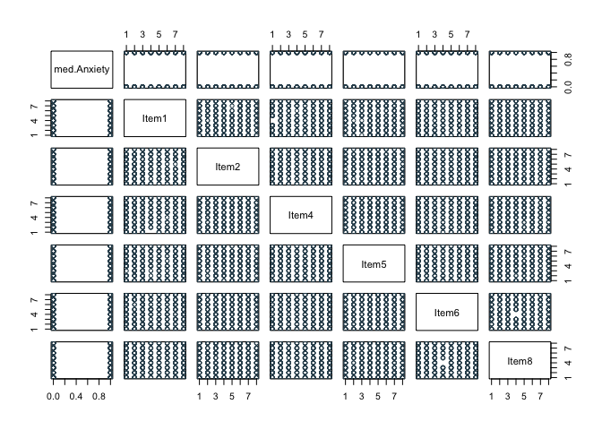

    #Reduced model minus Item3, Item7, Item1
    Logit (med.Anxiety ~ Item2 + Item4 + Item5 + Item6 + Item8, data = all_var_clean)

    ## 
    ## Response Variable:   med.Anxiety
    ## Predictor Variable 1:  Item2
    ## Predictor Variable 2:  Item4
    ## Predictor Variable 3:  Item5
    ## Predictor Variable 4:  Item6
    ## Predictor Variable 5:  Item8
    ## 
    ## Number of cases (rows) of data:  500 
    ## Number of cases retained for analysis:  500 
    ## 
    ## 
    ##    BASIC ANALYSIS 
    ## 
    ## -- Estimated Model of med.Anxiety for the Logit of Reference Group Membership
    ## 
    ##              Estimate    Std Err  z-value  p-value   Lower 95%   Upper 95%
    ## (Intercept)   -0.7275     0.4113   -1.769    0.077     -1.5337      0.0787 
    ##       Item2    0.0429     0.0399    1.075    0.282     -0.0353      0.1212 
    ##       Item4    0.0181     0.0388    0.467    0.640     -0.0579      0.0941 
    ##       Item5    0.0285     0.0399    0.713    0.476     -0.0498      0.1068 
    ##       Item6    0.0217     0.0388    0.560    0.576     -0.0544      0.0978 
    ##       Item8    0.0633     0.0385    1.646    0.100     -0.0121      0.1387 
    ## 
    ## 
    ## -- Odds Ratios and Confidence Intervals
    ## 
    ##              Odds Ratio   Lower 95%   Upper 95%
    ## (Intercept)      0.4831      0.2157      1.0819 
    ##       Item2      1.0439      0.9653      1.1288 
    ##       Item4      1.0183      0.9438      1.0987 
    ##       Item5      1.0289      0.9514      1.1127 
    ##       Item6      1.0220      0.9471      1.1027 
    ##       Item8      1.0654      0.9880      1.1488 
    ## 
    ## 
    ## -- Model Fit
    ## 
    ##     Null deviance: 692.755 on 499 degrees of freedom
    ## Residual deviance: 688.061 on 494 degrees of freedom
    ## 
    ## AIC: 700.0607 
    ## 
    ## Number of iterations to convergence: 4 
    ## 
    ## 
    ## Collinearity
    ## 
    ##       Tolerance       VIF
    ## Item2     0.983     1.018
    ## Item4     0.998     1.002
    ## Item5     0.985     1.015
    ## Item6     0.983     1.018
    ## Item8     0.993     1.007
    ## 
    ##    ANALYSIS OF RESIDUALS AND INFLUENCE 
    ## Data, Fitted, Residual, Studentized Residual, Dffits, Cook's Distance
    ##    [sorted by Cook's Distance]
    ##    [res_rows = 20 out of 500 cases (rows) of data]
    ## --------------------------------------------------------------------
    ##     Item2 Item4 Item5 Item6 Item8 med.Anxiety P(Y=1) residual rstudent  dffits    cooks
    ## 9       7     1     8     8     8           0 0.6223  -0.6223   -1.409 -0.1841 0.006650
    ## 260     1     4     1     8     1           1 0.4142   0.5858    1.340  0.1732 0.005583
    ## 470     8     8     8     2     6           0 0.6016  -0.6016   -1.368 -0.1694 0.005463
    ## 256     4     1     8     8     8           0 0.5916  -0.5916   -1.350 -0.1668 0.005222
    ## 159     1     6     2     1     1           1 0.3932   0.6068    1.377  0.1618 0.005017
    ## 288     6     8     8     8     7           0 0.6271  -0.6271   -1.415 -0.1588 0.004986
    ## 33      7     8     7     1     7           0 0.5944  -0.5944   -1.354 -0.1616 0.004919
    ## 400     1     2     1     4     2           1 0.3998   0.6002    1.364  0.1546 0.004540
    ## 302     8     6     4     1     8           0 0.5907  -0.5907   -1.346 -0.1521 0.004335
    ## 284     3     8     1     1     2           1 0.4312   0.5688    1.307  0.1542 0.004327
    ## 331     1     1     1     3     8           1 0.4834   0.5166    1.216  0.1576 0.004236
    ## 132     1     7     8     2     1           1 0.4445   0.5555    1.283  0.1536 0.004219
    ## 278     6     8     1     2     8           0 0.5630  -0.5630   -1.296 -0.1507 0.004103
    ## 18      5     1     7     1     8           0 0.5580  -0.5580   -1.287 -0.1508 0.004082
    ## 79      2     7     1     7     8           0 0.5429  -0.5429   -1.261 -0.1521 0.004071
    ## 247     4     2     8     7     8           0 0.5907  -0.5907   -1.345 -0.1458 0.003987
    ## 438     1     7     1     5     2           1 0.4270   0.5730    1.313  0.1468 0.003943
    ## 427     7     8     5     6     8           0 0.6218  -0.6218   -1.403 -0.1411 0.003906
    ## 431     3     1     3     2     1           1 0.4041   0.5959    1.355  0.1431 0.003864
    ## 77      1     5     1     3     2           1 0.4076   0.5924    1.348  0.1429 0.003834
    ## 
    ## 
    ##    PREDICTION 
    ## 
    ## Probability threshold for classification : 0.5
    ## 
    ## 
    ## Data, Fitted Values, Standard Errors
    ##    [sorted by fitted value]
    ##    [pred_all=TRUE to see all intervals displayed]
    ## --------------------------------------------------------------------
    ##     Item2 Item4 Item5 Item6 Item8 med.Anxiety label fitted std.err
    ## 159     1     6     2     1     1           1     0 0.3932 0.06694
    ## 282     2     2     4     1     1           0     0 0.3998 0.06129
    ## 400     1     2     1     4     2           1     0 0.3998 0.06483
    ## 174     1     5     3     2     1           1     0 0.4009 0.05884
    ## 
    ## ... for the rows of data where fitted is close to 0.5 ...
    ## 
    ##     Item2 Item4 Item5 Item6 Item8 med.Anxiety label fitted std.err
    ## 386     3     7     6     5     3           1     0 0.4994 0.03901
    ## 66      8     1     3     7     2           0     0 0.4995 0.06443
    ## 328     3     2     7     5     4           0     0 0.4997 0.04355
    ## 10      6     6     6     3     2           1     1 0.5004 0.04484
    ## 164     6     2     7     8     1           1     1 0.5007 0.06220
    ## 
    ## ... for the last 4 rows of sorted data ...
    ## 
    ##     Item2 Item4 Item5 Item6 Item8 med.Anxiety label fitted std.err
    ## 348     7     8     5     7     8           1     1 0.6269 0.05937
    ## 288     6     8     8     8     7           0     1 0.6271 0.06338
    ## 405     7     6     8     5     8           1     1 0.6282 0.05870
    ## 96      6     8     7     7     8           1     1 0.6302 0.06001
    ## --------------------------------------------------------------------
    ## 
    ## 
    ## ----------------------------
    ## Specified confusion matrices
    ## ----------------------------
    ## 
    ## Probability threshold for predicting : 0.5
    ## 
    ##                     Baseline         Predicted 
    ## ---------------------------------------------------
    ##                    Total  %Tot        0      1  %Correct 
    ## ---------------------------------------------------
    ##               1      257  51.4       88    169     65.8 
    ## med.Anxiety   0      243  48.6      108    135     44.4 
    ## ---------------------------------------------------
    ##             Total    500                           55.4 
    ## 
    ## Accuracy: 55.40 
    ## Sensitivity: 65.76 
    ## Precision: 55.59

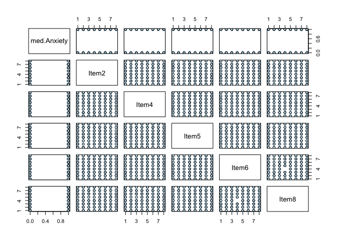

    #Reduced model minus Item3, Item7, Item1, Item4
    Logit (med.Anxiety ~ Item2 + Item5 + Item6 + Item8, data = all_var_clean)

    ## 
    ## Response Variable:   med.Anxiety
    ## Predictor Variable 1:  Item2
    ## Predictor Variable 2:  Item5
    ## Predictor Variable 3:  Item6
    ## Predictor Variable 4:  Item8
    ## 
    ## Number of cases (rows) of data:  500 
    ## Number of cases retained for analysis:  500 
    ## 
    ## 
    ##    BASIC ANALYSIS 
    ## 
    ## -- Estimated Model of med.Anxiety for the Logit of Reference Group Membership
    ## 
    ##              Estimate    Std Err  z-value  p-value   Lower 95%   Upper 95%
    ## (Intercept)   -0.6445     0.3708   -1.738    0.082     -1.3712      0.0822 
    ##       Item2    0.0426     0.0399    1.067    0.286     -0.0356      0.1208 
    ##       Item5    0.0283     0.0399    0.708    0.479     -0.0500      0.1065 
    ##       Item6    0.0225     0.0388    0.581    0.561     -0.0535      0.0985 
    ##       Item8    0.0636     0.0385    1.655    0.098     -0.0117      0.1390 
    ## 
    ## 
    ## -- Odds Ratios and Confidence Intervals
    ## 
    ##              Odds Ratio   Lower 95%   Upper 95%
    ## (Intercept)      0.5249      0.2538      1.0857 
    ##       Item2      1.0435      0.9650      1.1284 
    ##       Item5      1.0287      0.9512      1.1124 
    ##       Item6      1.0228      0.9479      1.1035 
    ##       Item8      1.0657      0.9883      1.1491 
    ## 
    ## 
    ## -- Model Fit
    ## 
    ##     Null deviance: 692.755 on 499 degrees of freedom
    ## Residual deviance: 688.279 on 495 degrees of freedom
    ## 
    ## AIC: 698.2792 
    ## 
    ## Number of iterations to convergence: 4 
    ## 
    ## 
    ## Collinearity
    ## 
    ##       Tolerance       VIF
    ## Item2     0.983     1.017
    ## Item5     0.985     1.015
    ## Item6     0.984     1.016
    ## Item8     0.994     1.006
    ## 
    ##    ANALYSIS OF RESIDUALS AND INFLUENCE 
    ## Data, Fitted, Residual, Studentized Residual, Dffits, Cook's Distance
    ##    [sorted by Cook's Distance]
    ##    [res_rows = 20 out of 500 cases (rows) of data]
    ## --------------------------------------------------------------------
    ##     Item2 Item5 Item6 Item8 med.Anxiety P(Y=1) residual rstudent  dffits    cooks
    ## 260     1     1     8     1           1 0.4183   0.5817    1.332  0.1713 0.006506
    ## 9       7     8     8     8           0 0.6385  -0.6385   -1.438 -0.1634 0.006441
    ## 159     1     2     1     1           1 0.3872   0.6128    1.388  0.1596 0.005906
    ## 470     8     8     2     6           0 0.5864  -0.5864   -1.338 -0.1478 0.004876
    ## 302     8     4     1     8           0 0.5844  -0.5844   -1.334 -0.1478 0.004860
    ## 256     4     8     8     8           0 0.6086  -0.6086   -1.378 -0.1446 0.004818
    ## 132     1     8     2     1           1 0.4336   0.5664    1.302  0.1463 0.004649
    ## 77      1     1     3     2           1 0.4064   0.5936    1.350  0.1430 0.004611
    ## 194     1     3     8     8           0 0.5429  -0.5429   -1.260 -0.1470 0.004559
    ## 288     6     8     8     7           0 0.6137  -0.6137   -1.387 -0.1397 0.004526
    ## 309     1     2     6     1           1 0.4142   0.5858    1.336  0.1421 0.004504
    ## 174     1     3     2     1           1 0.3993   0.6007    1.363  0.1397 0.004445
    ## 400     1     1     4     2           1 0.4119   0.5881    1.340  0.1399 0.004380
    ## 438     1     1     5     2           1 0.4173   0.5827    1.330  0.1403 0.004372
    ## 448     1     2     4     1           1 0.4033   0.5967    1.356  0.1388 0.004359
    ## 79      2     1     7     8           0 0.5339  -0.5339   -1.244 -0.1443 0.004345
    ## 47      2     1     4     1           1 0.4068   0.5932    1.349  0.1388 0.004343
    ## 33      7     7     1     7           0 0.5792  -0.5792   -1.324 -0.1394 0.004296
    ## 72      3     2     8     8           0 0.5570  -0.5570   -1.284 -0.1401 0.004213
    ## 323     3     2     8     8           0 0.5570  -0.5570   -1.284 -0.1401 0.004213
    ## 
    ## 
    ##    PREDICTION 
    ## 
    ## Probability threshold for classification : 0.5
    ## 
    ## 
    ## Data, Fitted Values, Standard Errors
    ##    [sorted by fitted value]
    ##    [pred_all=TRUE to see all intervals displayed]
    ## --------------------------------------------------------------------
    ##     Item2 Item5 Item6 Item8 med.Anxiety label fitted std.err
    ## 159     1     2     1     1           1     0 0.3872 0.06533
    ## 174     1     3     2     1           1     0 0.3993 0.05867
    ## 62      2     1     3     1           0     0 0.4013 0.06001
    ## 448     1     2     4     1           1     0 0.4033 0.05869
    ## 
    ## ... for the rows of data where fitted is close to 0.5 ...
    ## 
    ##     Item2 Item5 Item6 Item8 med.Anxiety label fitted std.err
    ## 489     4     6     5     3           1     0 0.4997 0.02949
    ## 412     6     3     5     3           0     0 0.4998 0.03408
    ## 119     2     6     6     4           1     0 0.5000 0.03759
    ## 28      1     7     1     6           0     1 0.5001 0.05720
    ## 82      1     7     1     6           1     1 0.5001 0.05720
    ## 
    ## ... for the last 4 rows of sorted data ...
    ## 
    ##     Item2 Item5 Item6 Item8 med.Anxiety label fitted std.err
    ## 272     8     8     8     6           1     1 0.6188 0.06192
    ## 474     8     7     7     7           1     1 0.6218 0.05710
    ## 405     7     8     5     8           1     1 0.6228 0.05783
    ## 9       7     8     8     8           0     1 0.6385 0.06373
    ## --------------------------------------------------------------------
    ## 
    ## 
    ## ----------------------------
    ## Specified confusion matrices
    ## ----------------------------
    ## 
    ## Probability threshold for predicting : 0.5
    ## 
    ##                     Baseline         Predicted 
    ## ---------------------------------------------------
    ##                    Total  %Tot        0      1  %Correct 
    ## ---------------------------------------------------
    ##               1      257  51.4       84    173     67.3 
    ## med.Anxiety   0      243  48.6      103    140     42.4 
    ## ---------------------------------------------------
    ##             Total    500                           55.2 
    ## 
    ## Accuracy: 55.20 
    ## Sensitivity: 67.32 
    ## Precision: 55.27

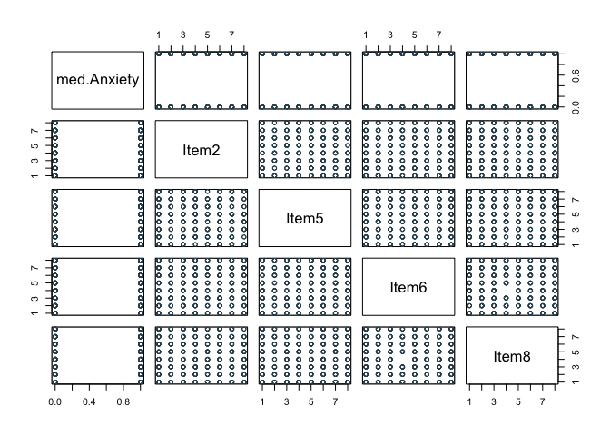

    #Reduced model minus Item3, Item7, Item1, Item4, Item6
    Logit (med.Anxiety ~ Item2 + Item5 + Item8, data = all_var_clean)

    ## 
    ## Response Variable:   med.Anxiety
    ## Predictor Variable 1:  Item2
    ## Predictor Variable 2:  Item5
    ## Predictor Variable 3:  Item8
    ## 
    ## Number of cases (rows) of data:  500 
    ## Number of cases retained for analysis:  500 
    ## 
    ## 
    ##    BASIC ANALYSIS 
    ## 
    ## -- Estimated Model of med.Anxiety for the Logit of Reference Group Membership
    ## 
    ##              Estimate    Std Err  z-value  p-value   Lower 95%   Upper 95%
    ## (Intercept)   -0.5515     0.3340   -1.651    0.099     -1.2060      0.1031 
    ##       Item2    0.0444     0.0398    1.116    0.264     -0.0336      0.1224 
    ##       Item5    0.0300     0.0398    0.754    0.451     -0.0480      0.1080 
    ##       Item8    0.0621     0.0384    1.620    0.105     -0.0130      0.1373 
    ## 
    ## 
    ## -- Odds Ratios and Confidence Intervals
    ## 
    ##              Odds Ratio   Lower 95%   Upper 95%
    ## (Intercept)      0.5761      0.2994      1.1086 
    ##       Item2      1.0454      0.9670      1.1302 
    ##       Item5      1.0305      0.9531      1.1141 
    ##       Item8      1.0641      0.9870      1.1472 
    ## 
    ## 
    ## -- Model Fit
    ## 
    ##     Null deviance: 692.755 on 499 degrees of freedom
    ## Residual deviance: 688.617 on 496 degrees of freedom
    ## 
    ## AIC: 696.6169 
    ## 
    ## Number of iterations to convergence: 3 
    ## 
    ## 
    ## Collinearity
    ## 
    ##       Tolerance       VIF
    ## Item2     0.989     1.011
    ## Item5     0.991     1.009
    ## Item8     0.998     1.002
    ## 
    ##    ANALYSIS OF RESIDUALS AND INFLUENCE 
    ## Data, Fitted, Residual, Studentized Residual, Dffits, Cook's Distance
    ##    [sorted by Cook's Distance]
    ##    [res_rows = 20 out of 500 cases (rows) of data]
    ## --------------------------------------------------------------------
    ##     Item2 Item5 Item8 med.Anxiety P(Y=1) residual rstudent  dffits    cooks
    ## 260     1     1     1           1 0.3977   0.6023    1.367  0.1524 0.006619
    ## 9       7     8     8           0 0.6216  -0.6216   -1.403 -0.1432 0.006014
    ## 77      1     1     2           1 0.4127   0.5873    1.338  0.1398 0.005452
    ## 400     1     1     2           1 0.4127   0.5873    1.338  0.1398 0.005452
    ## 438     1     1     2           1 0.4127   0.5873    1.338  0.1398 0.005452
    ## 159     1     2     1           1 0.4049   0.5951    1.353  0.1384 0.005403
    ## 309     1     2     1           1 0.4049   0.5951    1.353  0.1384 0.005403
    ## 448     1     2     1           1 0.4049   0.5951    1.353  0.1384 0.005403
    ## 47      2     1     1           1 0.4084   0.5916    1.346  0.1385 0.005382
    ## 470     8     8     6           0 0.6027  -0.6027   -1.366 -0.1344 0.005146
    ## 138     8     4     8           0 0.6037  -0.6037   -1.367 -0.1278 0.004664
    ## 302     8     4     8           0 0.6037  -0.6037   -1.367 -0.1278 0.004664
    ## 104     1     8     1           1 0.4490   0.5510    1.273  0.1310 0.004565
    ## 132     1     8     1           1 0.4490   0.5510    1.273  0.1310 0.004565
    ## 174     1     3     1           1 0.4122   0.5878    1.338  0.1275 0.004537
    ## 184     8     8     5           0 0.5877  -0.5877   -1.338 -0.1274 0.004532
    ## 331     1     1     8           1 0.5050   0.4950    1.176  0.1316 0.004315
    ## 390     1     1     8           1 0.5050   0.4950    1.176  0.1316 0.004315
    ## 278     6     1     8           0 0.5602  -0.5602   -1.288 -0.1239 0.004128
    ## 237     1     7     1           1 0.4416   0.5584    1.285  0.1228 0.004048
    ## 
    ## 
    ##    PREDICTION 
    ## 
    ## Probability threshold for classification : 0.5
    ## 
    ## 
    ## Data, Fitted Values, Standard Errors
    ##    [sorted by fitted value]
    ##    [pred_all=TRUE to see all intervals displayed]
    ## --------------------------------------------------------------------
    ##     Item2 Item5 Item8 med.Anxiety label fitted std.err
    ## 260     1     1     1           1     0 0.3977 0.06362
    ## 159     1     2     1           1     0 0.4049 0.05868
    ## 309     1     2     1           1     0 0.4049 0.05868
    ## 448     1     2     1           1     0 0.4049 0.05868
    ## 
    ## ... for the rows of data where fitted is close to 0.5 ...
    ## 
    ##     Item2 Item5 Item8 med.Anxiety label fitted std.err
    ## 55      4     4     4           0     0 0.4987 0.02416
    ## 369     4     2     5           1     0 0.4992 0.03566
    ## 303     2     1     7           1     1 0.5006 0.05576
    ## 105     7     4     2           1     1 0.5009 0.04075
    ## 355     7     4     2           0     1 0.5009 0.04075
    ## 
    ## ... for the last 4 rows of sorted data ...
    ## 
    ##     Item2 Item5 Item8 med.Anxiety label fitted std.err
    ## 368     7     6     8           1     1 0.6074 0.04988
    ## 474     8     7     7           1     1 0.6103 0.05417
    ## 9       7     8     8           0     1 0.6216 0.05784
    ## 405     7     8     8           1     1 0.6216 0.05784
    ## --------------------------------------------------------------------
    ## 
    ## 
    ## ----------------------------
    ## Specified confusion matrices
    ## ----------------------------
    ## 
    ## Probability threshold for predicting : 0.5
    ## 
    ##                     Baseline         Predicted 
    ## ---------------------------------------------------
    ##                    Total  %Tot        0      1  %Correct 
    ## ---------------------------------------------------
    ##               1      257  51.4       83    174     67.7 
    ## med.Anxiety   0      243  48.6      101    142     41.6 
    ## ---------------------------------------------------
    ##             Total    500                           55.0 
    ## 
    ## Accuracy: 55.00 
    ## Sensitivity: 67.70 
    ## Precision: 55.06

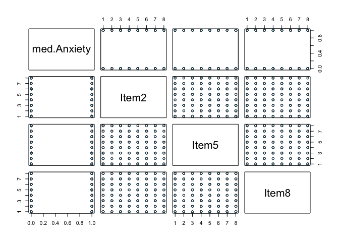

    reduced <- glm(formula = med.Anxiety ~ Item2 + Item5 + Item8, data = all_var_clean, family = binomial())
    summary(reduced)

    ## 
    ## Call:
    ## glm(formula = med.Anxiety ~ Item2 + Item5 + Item8, family = binomial(), 
    ##     data = all_var_clean)
    ## 
    ## Coefficients:
    ##             Estimate Std. Error z value Pr(>|z|)  
    ## (Intercept) -0.55146    0.33398  -1.651   0.0987 .
    ## Item2        0.04439    0.03978   1.116   0.2645  
    ## Item5        0.03001    0.03981   0.754   0.4509  
    ## Item8        0.06214    0.03836   1.620   0.1052  
    ## ---
    ## Signif. codes:  0 '***' 0.001 '**' 0.01 '*' 0.05 '.' 0.1 ' ' 1
    ## 
    ## (Dispersion parameter for binomial family taken to be 1)
    ## 
    ##     Null deviance: 692.76  on 499  degrees of freedom
    ## Residual deviance: 688.62  on 496  degrees of freedom
    ## AIC: 696.62
    ## 
    ## Number of Fisher Scoring iterations: 3

    #McFadden's R-squared value
    with(summary(reduced), 1 - deviance/null.deviance)

    ## [1] 0.005973556
