    ################################################################################
    # Project:      Income Prediction - Multiple Linear Regression
    # Objective:    Predict patient income using survey response items
    # Author:       Kim Shellenberger
    # Date:         2024
    # Description:  Multiple linear regression model to predict income based on
    #               8 survey response items. Includes exploratory analysis,
    #               model diagnostics, and visualization of relationships.
    ################################################################################

    # SECTION 1: LOAD REQUIRED PACKAGES
    library(ggplot2)       # Data visualization
    library(tidyverse)     # Data manipulation suite

    ## ── Attaching core tidyverse packages ──────────────────────── tidyverse 2.0.0 ──
    ## ✔ dplyr     1.1.4     ✔ readr     2.1.5
    ## ✔ forcats   1.0.0     ✔ stringr   1.5.1
    ## ✔ lubridate 1.9.3     ✔ tibble    3.2.1
    ## ✔ purrr     1.0.2     ✔ tidyr     1.3.1
    ## ── Conflicts ────────────────────────────────────────── tidyverse_conflicts() ──
    ## ✖ dplyr::filter() masks stats::filter()
    ## ✖ dplyr::lag()    masks stats::lag()
    ## ℹ Use the conflicted package (<http://conflicted.r-lib.org/>) to force all conflicts to become errors

    # SECTION 2: LOAD DATA
    # TODO: Update file path to your data location
    med <- read.csv("medical_clean.csv")  # Load medical dataset

    # SECTION 3: INDEPENDENT VARIABLES PREPARATION
    # Extract survey response items (columns 43-50)
    i_var <- med[, c(43:50)]

    # SECTION 4: EXPLORATORY DATA ANALYSIS
    # Univariate statistics for dependent variable (Income)
    print(summary(med$Income))

    ##    Min. 1st Qu.  Median    Mean 3rd Qu.    Max. 
    ##    6871   33720   48746   58546   72900  258160

    print(summary(i_var))

    ##      Item1           Item2           Item3           Item4      
    ##  Min.   :1.000   Min.   :1.000   Min.   :1.000   Min.   :1.000  
    ##  1st Qu.:2.000   1st Qu.:2.000   1st Qu.:3.000   1st Qu.:3.000  
    ##  Median :4.000   Median :4.000   Median :5.000   Median :5.000  
    ##  Mean   :4.418   Mean   :4.382   Mean   :4.664   Mean   :4.724  
    ##  3rd Qu.:7.000   3rd Qu.:6.000   3rd Qu.:7.000   3rd Qu.:7.000  
    ##  Max.   :8.000   Max.   :8.000   Max.   :8.000   Max.   :8.000  
    ##      Item5           Item6           Item7          Item8      
    ##  Min.   :1.000   Min.   :1.000   Min.   :1.00   Min.   :1.000  
    ##  1st Qu.:3.000   1st Qu.:3.000   1st Qu.:2.00   1st Qu.:2.000  
    ##  Median :5.000   Median :5.000   Median :4.00   Median :4.000  
    ##  Mean   :4.672   Mean   :4.554   Mean   :4.36   Mean   :4.396  
    ##  3rd Qu.:7.000   3rd Qu.:7.000   3rd Qu.:7.00   3rd Qu.:6.000  
    ##  Max.   :8.000   Max.   :8.000   Max.   :8.00   Max.   :8.000

    # SECTION 5: DATA VISUALIZATION
    # Boxplot of survey responses distribution
    boxplot(i_var,
            main = "Survey Response Items Distribution",
            xlab = "Survey Items",
            ylab = "Response Scale")

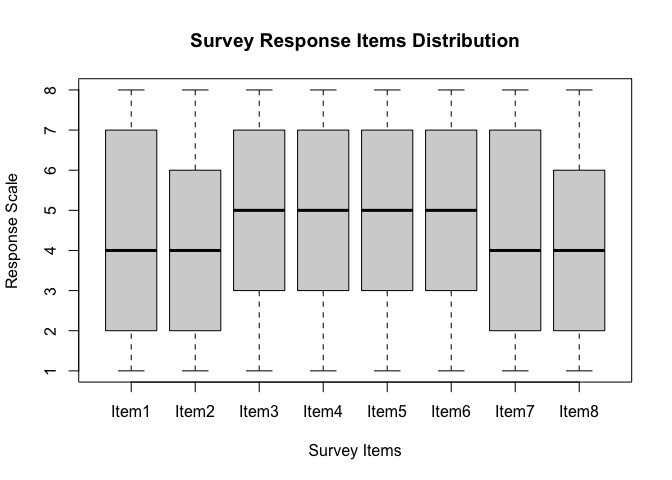

    # Boxplot of income distribution
    boxplot(med$Income,
            main = "Patient Income Distribution",
            ylab = "Annual Income ($)")

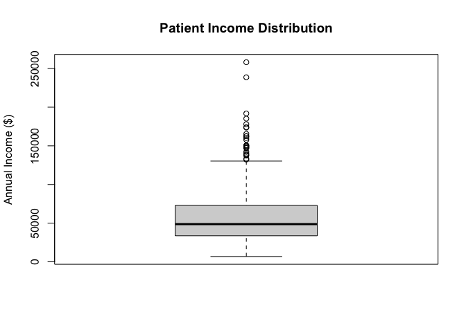

    # SECTION 6: DATA PREPARATION
    # Combine dependent and independent variables
    all_var <- data.frame(med$Income, i_var)
    all_var

    ##     med.Income Item1 Item2 Item3 Item4 Item5 Item6 Item7 Item8
    ## 1        24533     2     3     2     5     8     8     5     6
    ## 2        29523     3     3     1     7     1     5     7     3
    ## 3        25342     6     2     5     1     8     4     5     3
    ## 4        45945     1     7     8     3     4     4     1     6
    ## 5        34140     3     8     4     7     3     6     5     6
    ## 6        59323     2     2     3     1     7     3     5     2
    ## 7        72378     2     1     7     5     4     7     6     1
    ## 8        69499     7     6     8     8     6     6     2     5
    ## 9        38328     2     7     4     1     8     8     2     8
    ## 10       58144     6     6     4     6     6     3     3     2
    ## 11       91224     4     7     6     7     5     3     7     4
    ## 12       64045     1     7     4     7     8     3     3     1
    ## 13      149550     3     5     2     8     2     6     2     7
    ## 14       88372     8     1     2     3     1     1     1     6
    ## 15      137454     2     4     8     1     5     1     2     3
    ## 16       10988     7     3     5     3     7     5     3     1
    ## 17       51948     7     2     1     7     5     1     4     6
    ## 18       40362     5     5     7     1     7     1     7     8
    ## 19       45479     1     5     8     1     1     3     5     8
    ## 20       30243     7     7     7     3     1     3     6     1
    ## 21       62176     5     2     8     6     6     4     4     7
    ## 22       16564     1     1     3     1     6     3     4     1
    ## 23       62446     2     5     2     6     3     6     5     7
    ## 24       30853     1     6     4     2     4     4     2     1
    ## 25       36307     1     1     1     4     6     7     8     4
    ## 26       63774     8     2     8     2     5     4     7     3
    ## 27       51393     2     7     3     4     3     8     1     1
    ## 28       92259     6     1     7     2     7     1     4     6
    ## 29       27400     7     7     3     4     3     8     1     4
    ## 30       46704     5     6     3     1     5     3     6     8
    ## 31       83555     8     3     7     3     6     1     6     2
    ## 32       60884     8     7     3     3     8     3     6     1
    ## 33       63282     6     7     5     8     7     1     3     7
    ## 34       95304     5     8     3     5     5     7     4     4
    ## 35       38417     4     2     1     8     2     1     6     5
    ## 36       33857     7     6     8     4     6     1     3     2
    ## 37       69254     5     2     2     5     4     6     6     3
    ## 38       44817     5     6     1     6     7     7     2     1
    ## 39       96117     1     6     4     6     5     8     4     1
    ## 40       61198     4     5     6     5     6     5     3     4
    ## 41       33725     2     5     5     4     1     7     6     8
    ## 42       60056     2     5     5     3     2     1     7     3
    ## 43       28521     3     3     4     4     7     2     3     5
    ## 44       86522     4     3     7     6     7     2     6     2
    ## 45       21199     1     6     1     1     4     2     2     6
    ## 46      102052     3     4     1     5     6     6     1     3
    ## 47       59428     3     2     4     5     1     4     8     1
    ## 48       44412     2     5     7     6     6     8     6     4
    ## 49       77497     5     2     6     4     1     1     1     5
    ## 50       66622     1     7     3     5     4     7     4     4
    ## 51      108905     8     6     7     3     2     2     2     2
    ## 52      108297     8     1     8     5     7     6     7     7
    ## 53       60559     4     6     3     4     1     4     4     7
    ## 54       29055     3     3     8     6     3     8     7     3
    ## 55       35422     1     4     2     3     4     2     1     4
    ## 56       46958     2     1     1     3     4     3     2     6
    ## 57       93811     3     2     1     5     5     5     5     6
    ## 58       37278     3     3     4     4     2     1     2     7
    ## 59       39192     6     5     4     5     3     5     2     7
    ## 60      148600     2     1     3     7     3     5     7     4
    ## 61       46047     8     3     7     1     5     3     5     8
    ## 62       33495     6     2     1     8     1     3     3     1
    ## 63       78119     2     6     1     6     1     3     3     4
    ## 64       47397     2     2     5     7     8     4     3     5
    ## 65       21295     6     1     8     8     8     2     1     3
    ## 66       91542     8     8     2     1     3     7     2     2
    ## 67       31313     7     1     2     3     2     1     6     8
    ## 68       50320     1     6     8     5     1     3     5     6
    ## 69       47057     1     1     3     1     4     6     6     8
    ## 70       56278     7     4     6     2     6     8     1     4
    ## 71       13166     1     5     7     1     5     1     5     5
    ## 72       40092     5     3     1     5     2     8     6     8
    ## 73       96269     3     6     5     8     1     7     8     7
    ## 74      104743     1     2     7     5     6     1     7     6
    ## 75       27044     5     2     1     6     3     1     1     8
    ## 76       85166     3     5     4     1     5     3     1     6
    ## 77       31043     1     1     7     5     1     3     8     2
    ## 78       39155     2     1     3     5     3     2     1     6
    ## 79       40409     7     2     7     7     1     7     5     8
    ## 80       52328     4     5     6     6     5     3     6     5
    ## 81       89395     1     2     7     7     4     3     6     6
    ## 82       57455     4     1     7     6     7     1     4     6
    ## 83       45448     1     6     7     6     4     2     1     4
    ## 84       87587     2     3     2     8     7     5     3     4
    ## 85       30285     7     1     1     7     6     3     2     7
    ## 86       46801     8     6     6     6     3     6     7     3
    ## 87       89096     7     3     8     2     7     3     7     1
    ## 88       67345     4     7     3     8     4     5     4     5
    ## 89       37057     5     4     8     3     5     1     4     1
    ## 90       19776     2     5     2     5     3     7     5     1
    ## 91       59072     4     6     1     4     1     2     4     6
    ## 92       19011     4     4     5     6     7     1     6     8
    ## 93       43153     6     1     3     3     8     7     5     7
    ## 94       99446     6     7     1     6     7     4     5     2
    ## 95       70126     2     5     2     8     2     3     7     8
    ## 96       14557     2     6     2     8     7     7     7     8
    ## 97       55286     2     7     5     3     7     6     3     2
    ## 98       40477     3     8     3     4     1     7     1     6
    ## 99       22829     5     1     3     8     5     4     8     7
    ## 100      59935     1     5     6     1     6     3     8     5
    ## 101      36496     8     8     1     2     3     4     4     1
    ## 102      36632     6     5     6     5     1     5     1     3
    ## 103      52808     7     1     2     1     3     3     1     7
    ## 104      33674     7     1     8     7     8     6     1     1
    ## 105      51919     4     7     2     4     4     3     5     2
    ## 106      34338     6     7     7     2     2     4     1     1
    ## 107      35487     1     6     5     2     8     8     4     4
    ## 108      88944     2     5     5     2     5     2     5     4
    ## 109      94542     7     6     8     4     1     4     4     3
    ## 110      17585     6     7     8     6     2     3     5     5
    ## 111      76745     5     5     3     6     7     8     8     1
    ## 112     113454     5     6     8     8     5     3     2     4
    ## 113     124795     8     1     6     7     8     7     2     5
    ## 114      66985     3     1     2     6     5     8     8     7
    ## 115      25992     6     8     7     8     6     2     2     7
    ## 116      71538     2     2     1     1     8     1     2     4
    ## 117      29099     4     7     7     8     8     2     8     5
    ## 118      39904     8     6     4     5     4     1     5     5
    ## 119      61688     8     2     1     8     6     6     1     4
    ## 120      30247     3     2     5     2     6     3     8     6
    ## 121      24641     2     4     1     7     3     7     3     2
    ## 122      64826     8     5     8     7     3     8     7     5
    ## 123     150292     3     3     2     2     7     5     6     7
    ## 124     103357     6     4     6     1     2     5     3     6
    ## 125      74930     1     7     8     8     4     4     2     1
    ## 126      88213     8     8     8     6     8     2     1     6
    ## 127      71871     7     5     7     8     5     8     4     4
    ## 128      64212     6     3     3     2     7     2     1     6
    ## 129      84050     2     2     6     2     4     8     4     2
    ## 130      21568     4     8     4     4     4     5     3     4
    ## 131      55254     4     3     3     3     8     1     1     3
    ## 132      46697     2     1     4     7     8     2     1     1
    ## 133      51397     3     7     4     1     2     1     6     7
    ## 134      37167     5     8     2     8     3     1     8     3
    ## 135      66990     2     1     2     1     8     1     3     6
    ## 136      30009     7     6     8     6     4     1     1     5
    ## 137      35585     8     8     5     1     4     7     4     6
    ## 138      33113     6     8     5     6     4     4     7     8
    ## 139      82320     4     5     4     8     1     4     1     7
    ## 140      48677     1     4     6     4     4     7     4     7
    ## 141      37179     4     7     5     8     4     5     2     8
    ## 142      39181     5     2     2     4     8     8     1     5
    ## 143      49135     8     7     5     5     5     4     4     3
    ## 144     129742     4     5     4     6     6     8     7     3
    ## 145      23344     5     8     7     7     1     6     3     5
    ## 146      73520     8     2     3     4     4     7     2     2
    ## 147      65063     7     1     6     8     6     2     1     8
    ## 148      28860     8     7     6     6     4     6     6     1
    ## 149     118199     2     4     1     7     2     7     4     4
    ## 150      67749     4     4     8     8     8     4     7     8
    ## 151      36147     3     1     5     7     8     2     6     3
    ## 152      16064     6     3     8     8     2     8     1     1
    ## 153      56246     3     4     8     1     6     2     4     4
    ## 154      47722     6     3     6     5     8     8     1     6
    ## 155      26412     4     2     7     3     1     1     2     4
    ## 156      26208     7     4     7     2     5     5     7     3
    ## 157      82546     4     6     2     2     1     1     7     2
    ## 158      15163     6     8     3     5     1     7     2     2
    ## 159      59194     7     1     2     6     2     1     1     1
    ## 160      43807     1     8     5     6     2     6     1     6
    ## 161      66058     7     8     4     6     5     8     5     1
    ## 162      41086     4     7     7     3     7     8     1     5
    ## 163      58452     1     3     7     7     7     4     7     2
    ## 164      31393     1     6     1     2     7     8     1     1
    ## 165      47595     6     2     1     5     4     6     6     5
    ## 166      65739     1     2     7     6     5     4     6     6
    ## 167      53665     1     4     3     4     4     6     2     7
    ## 168      61586     2     4     6     1     6     2     6     4
    ## 169      28092     7     6     6     3     6     4     1     1
    ## 170      34393     8     5     7     8     3     8     3     5
    ## 171      34752     3     5     6     6     7     4     8     2
    ## 172      41527     1     4     1     2     2     6     1     8
    ## 173     110763     8     5     4     1     3     3     8     4
    ## 174      39636     3     1     6     5     3     2     7     1
    ## 175      24683     8     6     8     6     2     7     5     2
    ## 176      67845     1     1     2     2     8     8     4     7
    ## 177     109973     3     5     7     1     3     2     7     4
    ## 178      23001     4     4     6     4     8     8     8     3
    ## 179     160121     4     8     8     3     7     7     2     2
    ## 180      62888     3     8     4     5     1     3     6     3
    ## 181      91157     7     1     7     8     8     6     3     6
    ## 182     118213     1     2     8     2     4     6     7     1
    ## 183      87866     2     7     3     7     7     2     4     7
    ## 184      45875     8     8     3     4     8     6     3     5
    ## 185     101785     7     8     8     3     5     5     2     1
    ## 186      57111     3     4     1     3     2     5     6     2
    ## 187      94305     7     6     4     7     1     8     5     3
    ## 188     100702     8     3     8     8     6     7     8     8
    ## 189      25475     5     3     2     4     5     3     7     3
    ## 190      78951     2     4     4     2     5     8     7     4
    ## 191      43953     8     5     2     3     8     4     7     1
    ## 192      53259     5     8     2     5     5     8     8     1
    ## 193      52905     8     8     4     1     3     5     2     2
    ## 194      51647     8     1     7     5     3     8     3     8
    ## 195     122286     3     1     5     8     3     7     3     3
    ## 196      21593     1     4     4     6     7     8     2     2
    ## 197      17441     7     2     8     8     8     6     7     2
    ## 198      15368     7     6     7     3     3     3     1     6
    ## 199      93105     5     5     2     1     1     7     2     3
    ## 200      30821     7     8     7     4     3     7     6     2
    ## 201      53067     3     2     7     1     8     5     6     3
    ## 202      45760     2     4     6     8     2     1     5     2
    ## 203      28801     1     4     8     1     5     3     2     8
    ## 204      81706     5     8     3     7     1     2     4     5
    ## 205      45412     7     2     3     1     8     7     8     8
    ## 206      42504     3     3     8     3     6     5     8     8
    ## 207      56372     1     4     8     7     3     2     6     2
    ## 208      75543     1     6     1     8     6     3     6     8
    ## 209      27574     4     7     3     8     5     5     6     8
    ## 210      82764     1     5     5     8     1     2     1     8
    ## 211     116998     8     2     2     7     5     8     4     2
    ## 212      20834     3     3     4     6     6     4     7     7
    ## 213      57929     2     2     4     6     7     7     7     5
    ## 214      40825     6     3     5     7     1     4     2     1
    ## 215      74573     4     3     3     7     4     1     1     3
    ## 216      23624     3     6     2     8     7     6     6     7
    ## 217     130270     3     5     3     8     1     3     7     4
    ## 218      18681     3     4     7     8     3     6     4     5
    ## 219      42338     5     3     1     2     8     6     7     7
    ## 220      63613     7     4     3     6     6     2     8     8
    ## 221      32474     5     5     1     3     5     1     4     1
    ## 222      29554     8     4     8     2     8     3     1     2
    ## 223      56013     2     8     8     4     5     4     7     6
    ## 224      51362     8     6     4     4     5     6     6     1
    ## 225      49196     3     6     2     4     2     2     1     5
    ## 226      82061     7     1     6     4     2     6     8     6
    ## 227      38689     8     6     7     4     3     5     3     2
    ## 228      59383     5     3     1     5     4     4     6     1
    ## 229      36172     5     5     3     7     8     6     1     4
    ## 230      29449     5     6     8     3     2     5     2     3
    ## 231      41322     2     2     7     2     1     5     7     3
    ## 232      36342     2     5     3     4     7     2     6     5
    ## 233      37448     3     3     7     5     6     2     5     7
    ## 234      98636     4     5     4     8     3     5     6     2
    ## 235      42089     8     6     5     8     7     1     3     2
    ## 236      32934     3     2     7     6     4     6     1     3
    ## 237      49854     5     1     8     5     7     5     8     1
    ## 238      52184     6     3     6     5     8     5     5     2
    ## 239      24050     8     7     5     3     1     2     3     4
    ## 240      40985     7     8     8     4     5     6     2     4
    ## 241      40006     5     3     3     5     2     3     8     2
    ## 242      44210     1     5     8     7     1     4     8     2
    ## 243      75759     6     7     5     5     4     2     6     3
    ## 244      53210     6     7     7     4     3     6     7     5
    ## 245     102412     7     4     6     3     7     6     5     3
    ## 246      48679     3     7     6     5     1     8     7     5
    ## 247     142294     5     4     2     2     8     7     8     8
    ## 248      37180     5     8     8     1     3     1     1     4
    ## 249      30892     4     7     5     8     5     4     1     5
    ## 250      68076     1     2     2     6     4     2     2     3
    ## 251     111129     3     1     3     1     4     2     3     2
    ## 252      21434     2     1     3     1     7     3     5     5
    ## 253      43556     3     7     3     3     2     7     2     3
    ## 254      33980     8     5     4     8     6     7     3     4
    ## 255      53408     8     5     5     5     4     1     4     6
    ## 256      49316     6     4     1     1     8     8     4     8
    ## 257     109889     3     6     6     1     1     8     3     5
    ## 258      45934     4     1     1     8     8     7     1     4
    ## 259     111845     3     6     3     6     1     1     1     4
    ## 260      40576     4     1     7     4     1     8     4     1
    ## 261      85467     6     6     8     7     5     6     8     6
    ## 262      56230     4     6     7     7     4     6     1     5
    ## 263     138404     7     1     5     8     4     2     7     3
    ## 264      20207     7     8     7     5     1     8     8     5
    ## 265      24384     8     2     2     5     7     3     1     5
    ## 266     147116     5     2     8     6     8     2     3     6
    ## 267      31572     2     5     8     4     2     7     6     7
    ## 268      32798     6     6     1     8     7     5     3     4
    ## 269      28986     8     6     7     5     2     6     1     4
    ## 270      97642     4     8     3     7     4     5     3     4
    ## 271      23108     1     6     1     7     7     7     5     4
    ## 272      49686     6     8     1     2     8     8     4     6
    ## 273      41799     1     6     6     6     4     3     6     3
    ## 274      91300     2     6     1     3     3     2     8     2
    ## 275      34954     4     8     3     4     4     6     8     1
    ## 276      62891     6     4     6     6     7     3     5     7
    ## 277      24277     6     3     8     1     8     2     5     7
    ## 278     191830     2     6     3     8     1     2     1     8
    ## 279      42457     5     4     4     5     6     5     1     4
    ## 280      49279     1     2     8     2     5     4     8     8
    ## 281     132303     6     6     8     7     8     7     5     4
    ## 282      34475     3     2     7     2     4     1     5     1
    ## 283     133310     1     5     4     3     4     6     8     4
    ## 284      38297     8     3     7     8     1     1     2     2
    ## 285      73352     4     1     4     6     8     8     2     7
    ## 286      34766     2     3     1     2     3     3     7     5
    ## 287      21728     8     6     5     6     6     8     4     1
    ## 288      62866     1     6     3     8     8     8     5     7
    ## 289      71965     3     8     4     5     4     1     3     3
    ## 290      22258     7     3     8     5     2     5     6     7
    ## 291      40773     3     3     8     7     2     4     2     1
    ## 292     100756     8     5     5     2     2     6     8     2
    ## 293      70268     2     7     4     5     5     7     1     6
    ## 294      38672     8     2     8     8     5     2     5     3
    ## 295      34251     2     8     7     6     8     2     3     5
    ## 296     157778     7     1     4     7     6     7     6     4
    ## 297      20575     1     8     5     5     4     5     3     1
    ## 298      47310     4     7     4     8     4     6     7     3
    ## 299      20357     5     3     1     8     4     1     3     1
    ## 300     107892     3     1     1     7     5     7     1     5
    ## 301      48812     2     3     6     1     6     2     2     1
    ## 302      54552     5     8     1     6     4     1     3     8
    ## 303     258160     8     2     2     8     1     5     6     7
    ## 304      34335     5     1     6     7     3     2     2     7
    ## 305     139965     5     7     4     4     7     3     7     3
    ## 306      38776     4     4     2     8     8     4     7     2
    ## 307      42612     2     2     3     5     8     1     4     6
    ## 308     238686     8     7     5     5     2     7     1     3
    ## 309      44505     3     1     3     6     2     6     2     1
    ## 310      21491     2     3     2     8     8     1     7     5
    ## 311      58055     1     7     8     3     1     1     7     7
    ## 312      44195     8     3     1     4     4     1     2     4
    ## 313      61099     3     2     7     7     6     7     3     4
    ## 314      45245     8     2     4     4     6     5     8     5
    ## 315     185225     2     7     6     7     5     5     6     1
    ## 316      68463     3     3     8     8     4     6     3     6
    ## 317      25720     1     1     7     4     6     5     6     8
    ## 318      52824     6     7     8     2     4     7     7     5
    ## 319      30340     3     4     7     1     2     6     7     1
    ## 320      42251     6     8     4     1     7     8     1     3
    ## 321      28388     5     5     1     3     7     6     2     6
    ## 322     173559     7     2     4     4     7     5     5     8
    ## 323      32376     8     3     5     4     2     8     7     8
    ## 324      74053     4     1     7     5     5     2     6     2
    ## 325      40373     1     2     5     7     7     5     6     1
    ## 326      24464     3     1     8     6     2     2     8     8
    ## 327      55193     1     2     5     2     4     3     8     4
    ## 328      62344     5     3     3     2     7     5     3     4
    ## 329      68540     6     1     8     8     1     3     3     7
    ## 330      10165     4     3     1     3     5     5     7     6
    ## 331      23367     1     1     5     1     1     3     7     8
    ## 332      87076     6     2     2     8     8     4     4     2
    ## 333      28165     5     5     5     4     4     3     6     1
    ## 334      55369     5     8     6     6     5     2     1     2
    ## 335      23045     5     8     3     3     1     1     2     7
    ## 336      76036     8     5     2     7     5     6     2     3
    ## 337      85713     7     8     7     2     4     3     8     2
    ## 338      76050     8     7     1     2     8     1     2     3
    ## 339      91084     6     4     1     2     6     7     6     4
    ## 340     125284     3     4     6     4     7     4     3     3
    ## 341      24235     2     7     7     4     8     4     1     1
    ## 342      30540     1     7     5     4     5     8     2     6
    ## 343      83996     7     6     2     5     7     7     6     6
    ## 344      96580     2     3     6     1     8     7     5     1
    ## 345      32709     5     1     2     7     7     8     7     1
    ## 346      31372     2     4     5     2     6     7     4     1
    ## 347      33146     6     2     7     2     4     2     4     5
    ## 348      18712     8     7     5     8     5     7     2     8
    ## 349      22860     5     8     4     5     5     2     3     7
    ## 350      23193     8     5     4     2     6     8     4     3
    ## 351      41091     7     1     5     7     2     3     4     8
    ## 352      57671     5     6     3     2     6     8     8     1
    ## 353      63582     4     5     6     4     6     5     4     6
    ## 354      36129     4     8     4     4     6     7     4     2
    ## 355      36666     7     7     8     1     4     7     2     2
    ## 356      52796     6     1     5     7     8     4     8     5
    ## 357      19978     6     7     8     7     3     8     6     8
    ## 358      87174     2     4     8     2     6     8     1     8
    ## 359     106004     7     4     2     3     5     1     1     8
    ## 360      33680     8     3     6     2     1     5     3     3
    ## 361      38597     1     8     7     2     2     4     6     3
    ## 362     103361     7     6     4     1     6     3     7     7
    ## 363      45532     2     1     7     3     6     7     5     3
    ## 364      69769     6     6     3     8     2     4     1     6
    ## 365      46380     1     2     6     2     6     2     5     6
    ## 366     124715     7     6     6     6     5     1     1     8
    ## 367      65778     2     7     1     6     3     1     8     7
    ## 368      68091     3     7     2     7     6     2     1     8
    ## 369      68857     8     4     3     7     2     8     8     5
    ## 370      35134     3     3     8     3     6     7     8     3
    ## 371      37125     8     8     3     6     4     7     3     3
    ## 372      77773     1     7     7     4     5     5     4     8
    ## 373      52884     4     4     3     4     5     2     3     8
    ## 374      24184     8     5     2     3     3     7     8     1
    ## 375     150823     1     4     3     8     8     1     8     8
    ## 376      88154     2     1     1     2     4     7     1     3
    ## 377      50140     5     8     4     7     4     3     6     6
    ## 378      41602     3     3     2     3     3     7     4     1
    ## 379      55227     5     7     3     6     7     5     6     1
    ## 380      66870     3     1     5     3     7     6     6     3
    ## 381      14475     2     2     4     6     8     4     6     2
    ## 382     174104     3     2     7     7     1     6     4     4
    ## 383      30518     1     4     8     4     8     3     6     8
    ## 384      48965     5     3     6     3     7     6     4     6
    ## 385      50057     6     6     2     7     8     7     5     2
    ## 386     162447     5     3     5     7     6     5     8     3
    ## 387      46496     2     3     6     5     4     1     7     8
    ## 388     127148     6     3     5     8     8     1     1     3
    ## 389      62570     5     4     3     6     1     3     2     8
    ## 390      27526     8     1     8     5     1     6     6     8
    ## 391      53147     7     4     2     4     5     8     3     2
    ## 392      45656     8     6     8     7     6     8     5     3
    ## 393      25580     2     1     8     7     5     5     3     6
    ## 394      60757     7     6     7     2     2     4     2     7
    ## 395      49675     4     5     3     6     7     7     4     8
    ## 396      68450     1     5     6     8     5     6     2     1
    ## 397      55051     8     8     7     8     4     8     3     5
    ## 398      33168     3     7     8     2     4     8     8     3
    ## 399      77730     7     7     1     4     6     6     8     3
    ## 400      33704     3     1     5     2     1     4     2     2
    ## 401       7633     3     4     1     7     4     2     8     8
    ## 402      52955     4     6     6     6     7     7     1     1
    ## 403      35156     1     6     3     1     5     3     2     2
    ## 404      61653     5     7     7     6     7     7     6     7
    ## 405     162645     7     7     7     6     8     5     1     8
    ## 406     165486     5     2     7     5     5     3     6     6
    ## 407      44397     8     6     4     1     6     4     7     2
    ## 408      29855     1     4     5     1     8     5     7     3
    ## 409      69620     6     2     4     1     7     1     2     8
    ## 410      39256     1     4     2     6     5     1     1     1
    ## 411      62011     3     3     5     4     7     7     8     6
    ## 412      32974     5     6     1     1     3     5     1     3
    ## 413      56978     1     3     4     3     6     3     7     6
    ## 414      30116     5     5     6     2     6     3     2     3
    ## 415      99763     1     5     2     4     4     1     5     3
    ## 416      34407     2     1     5     3     6     1     4     3
    ## 417      72887     8     6     7     6     2     4     4     8
    ## 418      22952     7     7     6     6     4     5     4     5
    ## 419      78331     3     2     8     3     4     3     8     4
    ## 420      27451     1     3     2     5     8     8     1     1
    ## 421      57337     4     4     1     5     8     4     8     7
    ## 422      90574     1     6     7     3     7     3     7     5
    ## 423      43478     2     1     6     8     3     1     4     4
    ## 424      26436     8     4     5     5     4     5     7     6
    ## 425      66045     4     3     2     2     8     2     1     4
    ## 426      29596     4     6     3     2     1     5     7     8
    ## 427      38463     8     7     8     8     5     6     5     8
    ## 428      57485     1     3     5     6     5     8     8     8
    ## 429     110902     2     6     5     5     6     8     2     4
    ## 430      49808     4     6     7     8     7     8     7     5
    ## 431      49698     7     3     5     1     3     2     7     1
    ## 432      76306     3     3     7     8     5     7     2     2
    ## 433      50525     6     4     5     3     1     7     1     4
    ## 434      71777     3     1     3     2     3     4     1     8
    ## 435      93631     5     3     6     8     2     2     8     2
    ## 436      40270     5     5     6     7     5     2     7     2
    ## 437       6871     2     8     6     5     4     4     5     3
    ## 438      30009     4     1     1     7     1     5     4     2
    ## 439     101236     3     5     3     5     7     4     5     6
    ## 440      48038     3     4     3     8     7     6     2     6
    ## 441      39995     6     3     8     8     1     1     2     3
    ## 442      98723     2     1     2     2     5     7     6     1
    ## 443      46129     7     7     4     2     8     1     4     7
    ## 444      13967     4     3     6     8     8     7     7     1
    ## 445      19867     2     6     4     1     6     2     2     6
    ## 446      63019     1     3     2     5     2     8     6     7
    ## 447      47092     3     7     3     8     4     4     1     3
    ## 448     117336     2     1     2     5     2     4     2     1
    ## 449      31572     2     3     5     4     2     4     3     7
    ## 450      40713     6     3     2     6     5     8     4     7
    ## 451      28834     7     2     2     1     4     6     6     4
    ## 452      35870     1     2     7     2     5     6     4     1
    ## 453      15754     5     1     5     7     5     8     4     3
    ## 454      38894     3     1     7     2     6     5     3     7
    ## 455      47519     6     6     4     3     1     8     5     6
    ## 456      45171     7     6     8     6     7     3     1     8
    ## 457     178034     7     8     5     2     6     7     4     4
    ## 458     147280     2     3     8     5     7     3     2     2
    ## 459      31240     3     5     1     2     6     3     8     2
    ## 460      14381     8     1     2     8     5     8     1     2
    ## 461      46188     5     7     8     5     6     7     2     6
    ## 462      61446     8     3     2     5     7     5     1     8
    ## 463      29252     8     5     7     1     6     4     7     7
    ## 464      30134     8     2     4     2     3     3     1     3
    ## 465     126694     7     6     7     1     4     8     6     2
    ## 466      42002     2     7     3     7     1     4     2     1
    ## 467      72937     7     1     5     7     7     8     8     2
    ## 468      28052     1     3     3     6     4     2     2     7
    ## 469      47374     7     2     1     5     1     3     7     5
    ## 470      40063     3     8     5     8     8     2     1     6
    ## 471      32688     7     4     1     8     3     5     4     5
    ## 472      98045     7     2     1     7     5     1     8     2
    ## 473      21305     8     3     1     6     8     6     2     8
    ## 474      58691     6     8     6     2     7     7     7     7
    ## 475      39614     1     6     5     6     8     8     8     2
    ## 476      62874     5     5     8     6     1     5     3     5
    ## 477      39937     5     7     5     2     1     5     3     7
    ## 478      82480     3     7     6     1     1     5     1     6
    ## 479      27894     5     4     4     1     3     3     5     6
    ## 480      98177     4     7     8     5     8     2     1     2
    ## 481      48181     6     4     6     8     4     6     7     6
    ## 482      22090     3     8     8     5     3     3     1     4
    ## 483      73727     7     6     2     2     1     1     4     7
    ## 484      43508     4     4     3     2     6     7     4     8
    ## 485      17594     5     1     3     4     1     7     6     7
    ## 486      59843     7     3     1     4     6     6     7     6
    ## 487      89676     3     8     5     3     5     7     5     7
    ## 488     105797     8     7     5     8     3     7     8     5
    ## 489      39065     4     4     1     7     6     5     7     3
    ## 490      53487     5     2     2     5     3     4     7     5
    ## 491      50530     2     5     3     6     2     1     5     1
    ## 492     119836     2     3     6     7     4     2     7     4
    ## 493      30143     1     6     4     3     2     8     5     3
    ## 494      37094     2     7     8     7     6     1     5     2
    ## 495      29708     8     2     8     8     2     3     5     7
    ## 496      20548     4     1     8     8     8     7     7     8
    ## 497      56878     8     4     8     8     7     4     7     1
    ## 498     128127     6     2     7     3     4     8     1     1
    ## 499      43517     2     3     2     1     6     3     7     8
    ## 500      28879     3     7     8     6     5     6     1     4

    # TODO: Update file path to your output location
    # write_csv(all_var, "clean_med_regression.csv")

    # SECTION 7: DATA QUALITY CHECKS
    # Examine data structure and missing values
    str(all_var)

    ## 'data.frame':    500 obs. of  9 variables:
    ##  $ med.Income: int  24533 29523 25342 45945 34140 59323 72378 69499 38328 58144 ...
    ##  $ Item1     : int  2 3 6 1 3 2 2 7 2 6 ...
    ##  $ Item2     : int  3 3 2 7 8 2 1 6 7 6 ...
    ##  $ Item3     : int  2 1 5 8 4 3 7 8 4 4 ...
    ##  $ Item4     : int  5 7 1 3 7 1 5 8 1 6 ...
    ##  $ Item5     : int  8 1 8 4 3 7 4 6 8 6 ...
    ##  $ Item6     : int  8 5 4 4 6 3 7 6 8 3 ...
    ##  $ Item7     : int  5 7 5 1 5 5 6 2 2 3 ...
    ##  $ Item8     : int  6 3 3 6 6 2 1 5 8 2 ...

    summary(all_var)

    ##    med.Income         Item1           Item2           Item3      
    ##  Min.   :  6871   Min.   :1.000   Min.   :1.000   Min.   :1.000  
    ##  1st Qu.: 33720   1st Qu.:2.000   1st Qu.:2.000   1st Qu.:3.000  
    ##  Median : 48746   Median :4.000   Median :4.000   Median :5.000  
    ##  Mean   : 58546   Mean   :4.418   Mean   :4.382   Mean   :4.664  
    ##  3rd Qu.: 72900   3rd Qu.:7.000   3rd Qu.:6.000   3rd Qu.:7.000  
    ##  Max.   :258160   Max.   :8.000   Max.   :8.000   Max.   :8.000  
    ##      Item4           Item5           Item6           Item7          Item8      
    ##  Min.   :1.000   Min.   :1.000   Min.   :1.000   Min.   :1.00   Min.   :1.000  
    ##  1st Qu.:3.000   1st Qu.:3.000   1st Qu.:3.000   1st Qu.:2.00   1st Qu.:2.000  
    ##  Median :5.000   Median :5.000   Median :5.000   Median :4.00   Median :4.000  
    ##  Mean   :4.724   Mean   :4.672   Mean   :4.554   Mean   :4.36   Mean   :4.396  
    ##  3rd Qu.:7.000   3rd Qu.:7.000   3rd Qu.:7.000   3rd Qu.:7.00   3rd Qu.:6.000  
    ##  Max.   :8.000   Max.   :8.000   Max.   :8.000   Max.   :8.00   Max.   :8.000

    colSums(is.na(all_var))  # Check for missing data

    ## med.Income      Item1      Item2      Item3      Item4      Item5      Item6 
    ##          0          0          0          0          0          0          0 
    ##      Item7      Item8 
    ##          0          0

    # SECTION 8: BIVARIATE VISUALIZATIONS
    # Scatter plots to examine relationships between each survey item and income
    # Visual inspection helps identify linear relationships and outliers
    # Dollar formatting on y-axis improves readability

    # Bivariate visualization - Survey Item 1 vs. Income
    ggplot(all_var, 
           aes(x = Item1, y = med.Income)) +
      geom_point(color="cornflowerblue", 
                 size = 1.5, 
                 alpha=.8) +
      scale_y_continuous(label = scales::dollar, 
                         limits = c(0, 225000)) +
      scale_x_continuous(breaks = seq(1:8), 
                         limits=c(0, 8)) + 
      labs(x = "Survey Item 1 Response",
           y = "Annual Income",
           title = "Survey Responses vs. Income",
           subtitle = "Item 1 - Interpretation of slope indicates effect on income")

    ## Warning: Removed 2 rows containing missing values or values outside the scale range
    ## (`geom_point()`).

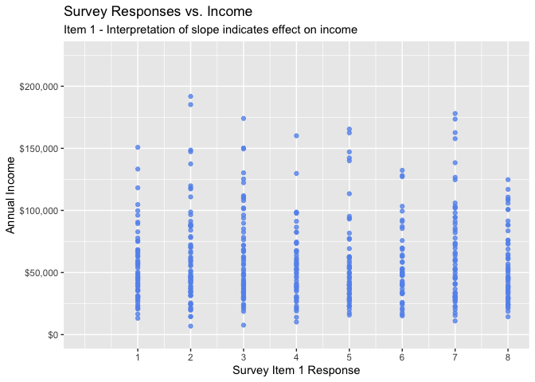

    #Item 2
    ggplot(all_var, 
           aes(x = Item2, y = med.Income)) +
      geom_point(color="cornflowerblue", 
                 size = 1.5, 
                 alpha=.8) +
      scale_y_continuous(label = scales::dollar, 
                         limits = c(0, 225000)) +
      scale_x_continuous(breaks = seq(1:8), 
                         limits=c(0, 8)) + 
      labs(x = "Survey Item 2 Response",
           y = "",
           title = "Survey Responses vs. Income",
           subtitle = "Item 2")

    ## Warning: Removed 2 rows containing missing values or values outside the scale range
    ## (`geom_point()`).

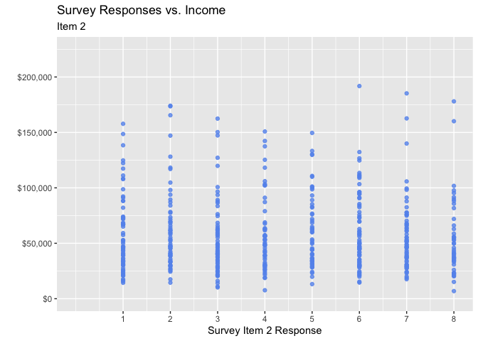

    #Item 3
    ggplot(all_var, 
           aes(x = Item3, y = med.Income)) +
      geom_point(color="cornflowerblue", 
                 size = 1.5, 
                 alpha=.8) +
      scale_y_continuous(label = scales::dollar, 
                         limits = c(0, 225000)) +
      scale_x_continuous(breaks = seq(1:8), 
                         limits=c(0, 8)) + 
      labs(x = "Survey Item3",
           y = "",
           title = "Survey Responses vs. Income",
           subtitle = "Item3")

    ## Warning: Removed 2 rows containing missing values or values outside the scale range
    ## (`geom_point()`).

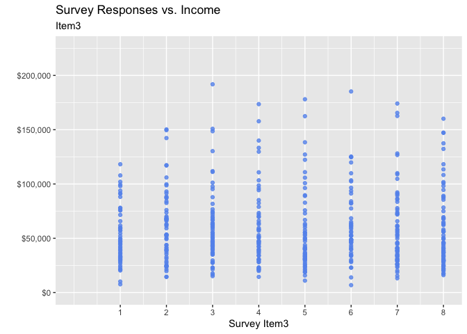

    #Item 4
    ggplot(all_var, 
           aes(x = Item4, y = med.Income)) +
      geom_point(color="cornflowerblue", 
                 size = 1.5, 
                 alpha=.8) +
      scale_y_continuous(label = scales::dollar, 
                         limits = c(0, 225000)) +
      scale_x_continuous(breaks = seq(1:8), 
                         limits=c(0, 8)) + 
      labs(x = "Survey Item4",
           y = "",
           title = "Survey Responses vs. Income",
           subtitle = "Item4")

    ## Warning: Removed 2 rows containing missing values or values outside the scale range
    ## (`geom_point()`).

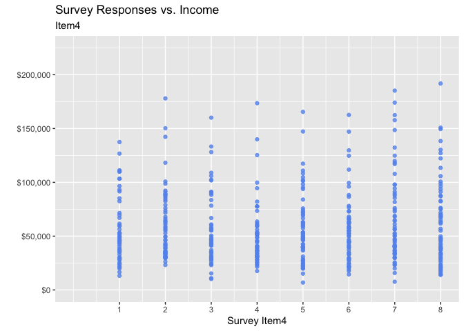

    #Item 5
    ggplot(all_var, 
           aes(x = Item5, y = med.Income)) +
      geom_point(color="cornflowerblue", 
                 size = 1.5, 
                 alpha=.8) +
      scale_y_continuous(label = scales::dollar, 
                         limits = c(0, 225000)) +
      scale_x_continuous(breaks = seq(1:8), 
                         limits=c(0, 8)) + 
      labs(x = "Survey Item5",
           y = "",
           title = "Survey Responses vs. Income",
           subtitle = "Item5")

    ## Warning: Removed 2 rows containing missing values or values outside the scale range
    ## (`geom_point()`).

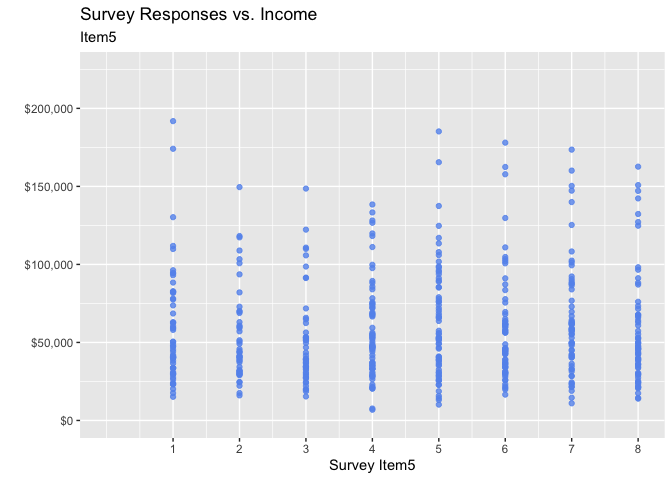

    #Item 6
    ggplot(all_var, 
           aes(x = Item6, y = med.Income)) +
      geom_point(color="cornflowerblue", 
                 size = 1.5, 
                 alpha=.8) +
      scale_y_continuous(label = scales::dollar, 
                         limits = c(0, 225000)) +
      scale_x_continuous(breaks = seq(1:8), 
                         limits=c(0, 8)) + 
      labs(x = "Survey Item6",
           y = "",
           title = "Survey Responses vs. Income",
           subtitle = "Item6")

    ## Warning: Removed 2 rows containing missing values or values outside the scale range
    ## (`geom_point()`).

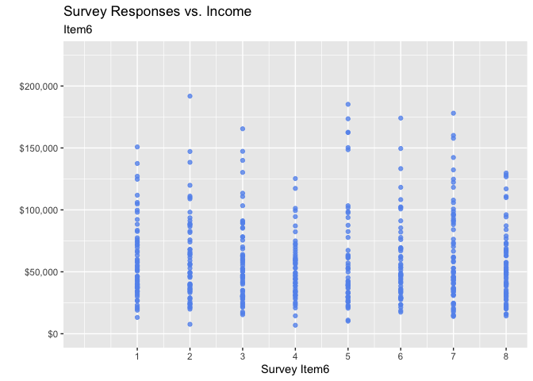

    #Item 7
    ggplot(all_var, 
           aes(x = Item7, y = med.Income)) +
      geom_point(color="cornflowerblue", 
                 size = 1.5, 
                 alpha=.8) +
      scale_y_continuous(label = scales::dollar, 
                         limits = c(0, 225000)) +
      scale_x_continuous(breaks = seq(1:8), 
                         limits=c(0, 8)) + 
      labs(x = "Survey Item7",
           y = "",
           title = "Survey Responses vs. Income",
           subtitle = "Item7")

    ## Warning: Removed 2 rows containing missing values or values outside the scale range
    ## (`geom_point()`).

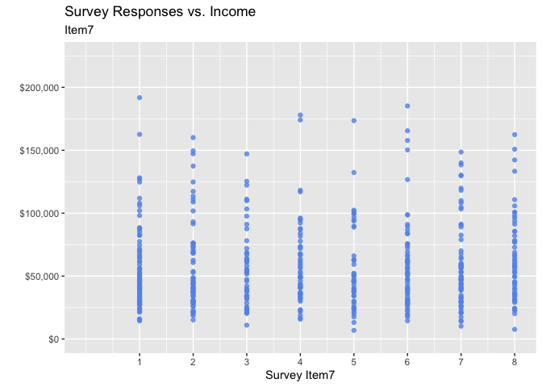

    #Item 8
    ggplot(all_var, 
           aes(x = Item8, y = med.Income)) +
      geom_point(color="cornflowerblue", 
                 size = 1.5, 
                 alpha=.8) +
      scale_y_continuous(label = scales::dollar, 
                         limits = c(0, 225000)) +
      scale_x_continuous(breaks = seq(1:8), 
                         limits=c(0, 8)) + 
      labs(x = "Survey Item8",
           y = "",
           title = "Survey Responses vs. Income",
           subtitle = "Item8")

    ## Warning: Removed 2 rows containing missing values or values outside the scale range
    ## (`geom_point()`).

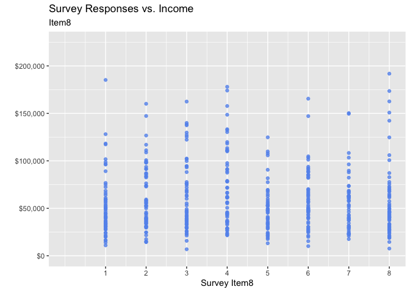

    # SECTION 9: MULTIPLE LINEAR REGRESSION MODELING
    # Objective: Build model to predict income using survey responses
    # Approach: Iterative backward elimination to identify significant predictors

    #Initial Multiple linear regression model
    # Full model with all 8 survey items as predictors
    # Each coefficient represents the effect of 1-unit increase in survey response on annual income
    fit1 <- lm(med.Income ~ Item1 + Item2 + Item3 + Item4 + Item5 + Item6 + Item7 + Item8, data = all_var )
    summary(fit1)  # Review: R-squared, F-statistic, individual p-values

    ## 
    ## Call:
    ## lm(formula = med.Income ~ Item1 + Item2 + Item3 + Item4 + Item5 + 
    ##     Item6 + Item7 + Item8, data = all_var)
    ## 
    ## Residuals:
    ##    Min     1Q Median     3Q    Max 
    ## -54190 -24249  -9368  14186 193847 
    ## 
    ## Coefficients:
    ##             Estimate Std. Error t value Pr(>|t|)    
    ## (Intercept) 51309.09    8812.56   5.822 1.05e-08 ***
    ## Item1         444.11     689.09   0.644    0.520    
    ## Item2        -314.31     720.06  -0.437    0.663    
    ## Item3         -97.90     689.27  -0.142    0.887    
    ## Item4         959.44     694.64   1.381    0.168    
    ## Item5         179.50     714.46   0.251    0.802    
    ## Item6          12.94     698.36   0.019    0.985    
    ## Item7         335.93     682.78   0.492    0.623    
    ## Item8          48.61     686.97   0.071    0.944    
    ## ---
    ## Signif. codes:  0 '***' 0.001 '**' 0.01 '*' 0.05 '.' 0.1 ' ' 1
    ## 
    ## Residual standard error: 35970 on 491 degrees of freedom
    ## Multiple R-squared:  0.006011,   Adjusted R-squared:  -0.01018 
    ## F-statistic: 0.3711 on 8 and 491 DF,  p-value: 0.9357

    plot(fit1)     # Diagnostic plots: residuals, Q-Q plot, scale-location, leverage

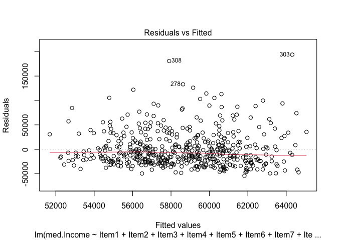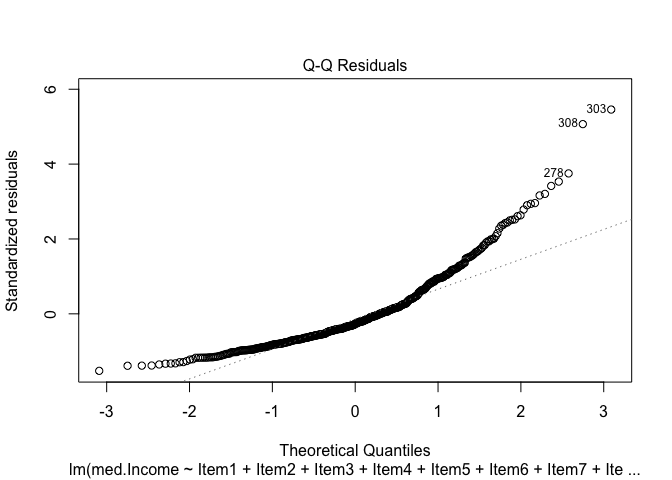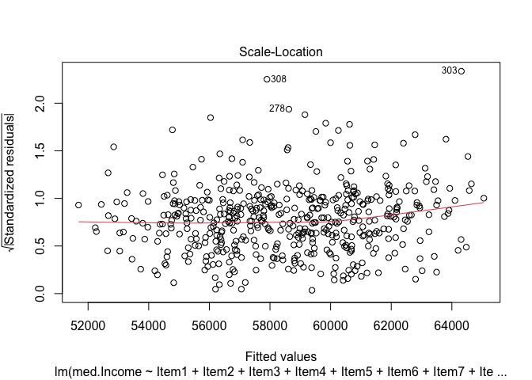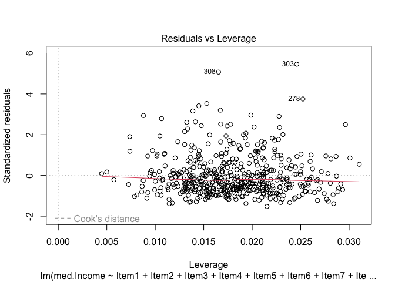

    # SECTION 10: MODEL REFINEMENT - BACKWARD ELIMINATION
    # Remove non-significant variables (p > 0.05) iteratively
    # Goal: Maximize adjusted R-squared while minimizing model complexity

    #Reduced model (remove Item1)
    fit2 <- lm(med.Income ~ Item2 + Item3 + Item4 + Item5 + Item6 + Item7 + Item8, data = all_var )
    summary(fit2)  # Compare adjusted R-squared and AIC

    ## 
    ## Call:
    ## lm(formula = med.Income ~ Item2 + Item3 + Item4 + Item5 + Item6 + 
    ##     Item7 + Item8, data = all_var)
    ## 
    ## Residuals:
    ##    Min     1Q Median     3Q    Max 
    ## -54611 -24380  -9501  14199 195477 
    ## 
    ## Coefficients:
    ##             Estimate Std. Error t value Pr(>|t|)    
    ## (Intercept) 52896.35    8456.39   6.255 8.63e-10 ***
    ## Item2        -287.40     718.42  -0.400    0.689    
    ## Item3         -74.42     687.90  -0.108    0.914    
    ## Item4         985.01     693.10   1.421    0.156    
    ## Item5         172.36     713.95   0.241    0.809    
    ## Item6          48.34     695.78   0.069    0.945    
    ## Item7         313.14     681.45   0.460    0.646    
    ## Item8          48.17     686.56   0.070    0.944    
    ## ---
    ## Signif. codes:  0 '***' 0.001 '**' 0.01 '*' 0.05 '.' 0.1 ' ' 1
    ## 
    ## Residual standard error: 35940 on 492 degrees of freedom
    ## Multiple R-squared:  0.00517,    Adjusted R-squared:  -0.008984 
    ## F-statistic: 0.3652 on 7 and 492 DF,  p-value: 0.9223

    #Reduced model (remove Item1, Item6)
    fit3 <- lm(med.Income ~ Item2 + Item3 + Item4 + Item5 + Item7 + Item8, data = all_var )
    summary(fit3)  # Model improvement?

    ## 
    ## Call:
    ## lm(formula = med.Income ~ Item2 + Item3 + Item4 + Item5 + Item7 + 
    ##     Item8, data = all_var)
    ## 
    ## Residuals:
    ##    Min     1Q Median     3Q    Max 
    ## -54740 -24535  -9487  14154 195516 
    ## 
    ## Coefficients:
    ##             Estimate Std. Error t value Pr(>|t|)    
    ## (Intercept) 53073.74    8053.63   6.590 1.13e-10 ***
    ## Item2        -283.06     714.98  -0.396    0.692    
    ## Item3         -75.45     687.04  -0.110    0.913    
    ## Item4         987.18     691.69   1.427    0.154    
    ## Item5         176.10     711.20   0.248    0.805    
    ## Item7         316.60     678.95   0.466    0.641    
    ## Item8          44.93     684.28   0.066    0.948    
    ## ---
    ## Signif. codes:  0 '***' 0.001 '**' 0.01 '*' 0.05 '.' 0.1 ' ' 1
    ## 
    ## Residual standard error: 35910 on 493 degrees of freedom
    ## Multiple R-squared:  0.00516,    Adjusted R-squared:  -0.006948 
    ## F-statistic: 0.4262 on 6 and 493 DF,  p-value: 0.8616

    #Reduced model (remove Item1, Item6, Item3)
    fit4 <- lm(med.Income ~ Item2 + Item4 + Item5 + Item7 + Item8, data = all_var )
    summary(fit4)

    ## 
    ## Call:
    ## lm(formula = med.Income ~ Item2 + Item4 + Item5 + Item7 + Item8, 
    ##     data = all_var)
    ## 
    ## Residuals:
    ##    Min     1Q Median     3Q    Max 
    ## -54455 -24365  -9560  14032 195715 
    ## 
    ## Coefficients:
    ##             Estimate Std. Error t value Pr(>|t|)    
    ## (Intercept) 52752.42    7495.78   7.038 6.57e-12 ***
    ## Item2        -287.85     712.94  -0.404    0.687    
    ## Item4         985.89     690.90   1.427    0.154    
    ## Item5         177.06     710.43   0.249    0.803    
    ## Item7         313.51     677.68   0.463    0.644    
    ## Item8          46.17     683.50   0.068    0.946    
    ## ---
    ## Signif. codes:  0 '***' 0.001 '**' 0.01 '*' 0.05 '.' 0.1 ' ' 1
    ## 
    ## Residual standard error: 35870 on 494 degrees of freedom
    ## Multiple R-squared:  0.005136,   Adjusted R-squared:  -0.004934 
    ## F-statistic:  0.51 on 5 and 494 DF,  p-value: 0.7688

    #Reduced model (remove Item1, Item6, Item3, Item7)
    fit5 <- lm(med.Income ~ Item2 + Item4 + Item5 + Item8, data = all_var )
    summary(fit5)

    ## 
    ## Call:
    ## lm(formula = med.Income ~ Item2 + Item4 + Item5 + Item8, data = all_var)
    ## 
    ## Residuals:
    ##    Min     1Q Median     3Q    Max 
    ## -53330 -24206  -9487  13883 196179 
    ## 
    ## Coefficients:
    ##             Estimate Std. Error t value Pr(>|t|)    
    ## (Intercept) 54230.75    6775.10   8.004 8.61e-15 ***
    ## Item2        -320.89     708.78  -0.453    0.651    
    ## Item4         980.52     690.25   1.421    0.156    
    ## Item5         184.26     709.70   0.260    0.795    
    ## Item8          51.89     682.85   0.076    0.939    
    ## ---
    ## Signif. codes:  0 '***' 0.001 '**' 0.01 '*' 0.05 '.' 0.1 ' ' 1
    ## 
    ## Residual standard error: 35840 on 495 degrees of freedom
    ## Multiple R-squared:  0.004705,   Adjusted R-squared:  -0.003338 
    ## F-statistic: 0.5849 on 4 and 495 DF,  p-value: 0.6737

    # SECTION 11: FINAL MODEL
    # Parsimonious model with optimal balance of simplicity and explanatory power
    #Reduced model (remove Item1, Item6, Item3, Item7, Item5)
    fit6 <- lm(med.Income ~ Item2 + Item4 + Item8, data = all_var )
    summary(fit6)  # Final model coefficients, p-values, and R-squared

    ## 
    ## Call:
    ## lm(formula = med.Income ~ Item2 + Item4 + Item8, data = all_var)
    ## 
    ## Residuals:
    ##    Min     1Q Median     3Q    Max 
    ## -53452 -24307  -9407  13838 195470 
    ## 
    ## Coefficients:
    ##             Estimate Std. Error t value Pr(>|t|)    
    ## (Intercept) 55181.52    5694.80   9.690   <2e-16 ***
    ## Item2        -338.38     704.91  -0.480    0.631    
    ## Item4         978.94     689.58   1.420    0.156    
    ## Item8          50.57     682.19   0.074    0.941    
    ## ---
    ## Signif. codes:  0 '***' 0.001 '**' 0.01 '*' 0.05 '.' 0.1 ' ' 1
    ## 
    ## Residual standard error: 35810 on 496 degrees of freedom
    ## Multiple R-squared:  0.004569,   Adjusted R-squared:  -0.001452 
    ## F-statistic: 0.7589 on 3 and 496 DF,  p-value: 0.5176

    plot(fit6)     # Diagnostic plots for final model assumptions

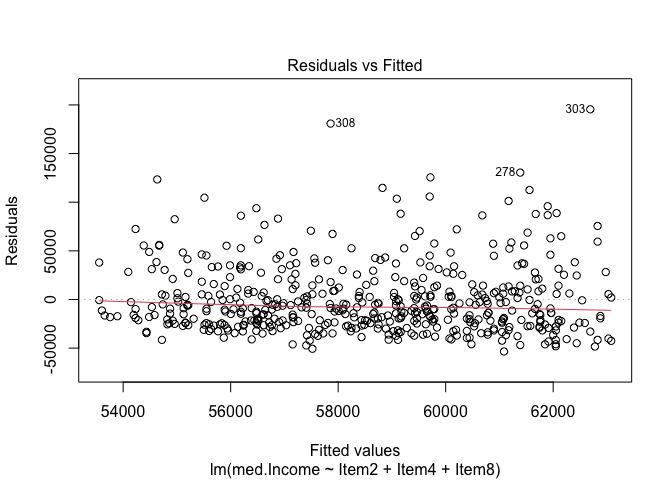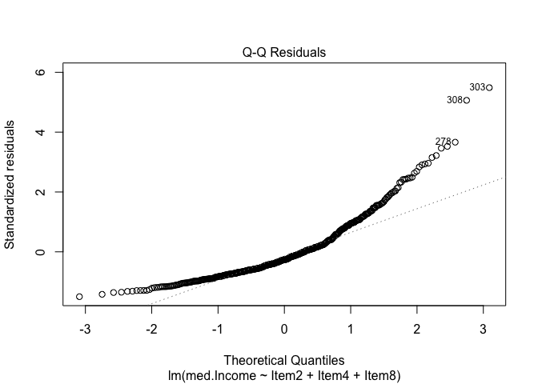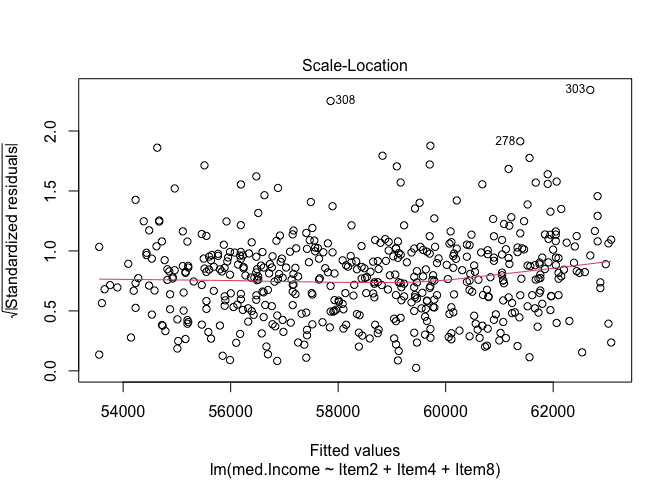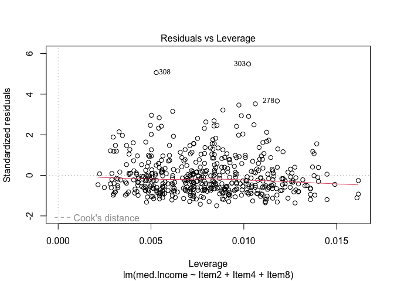
