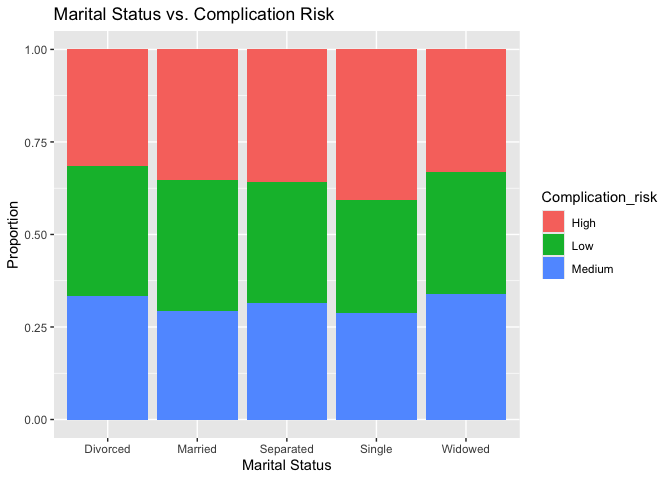
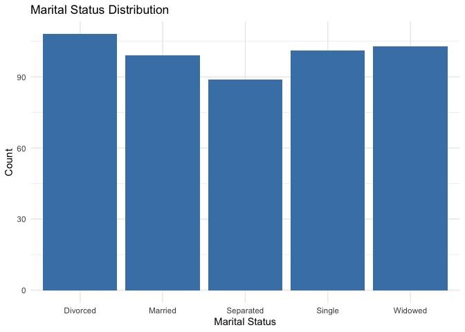
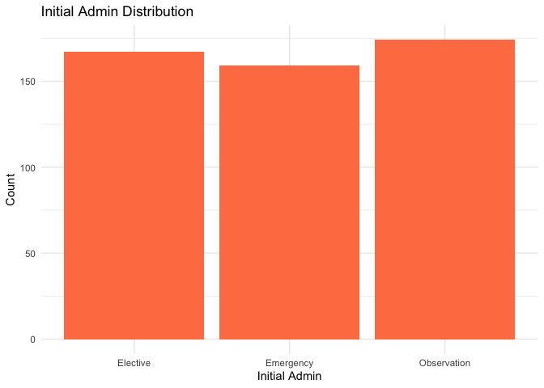
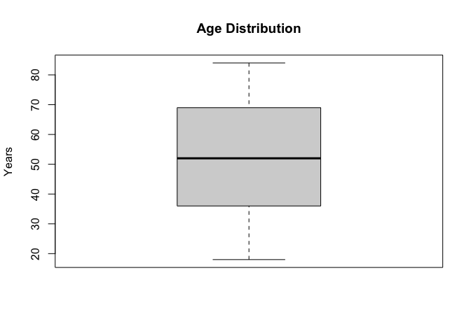
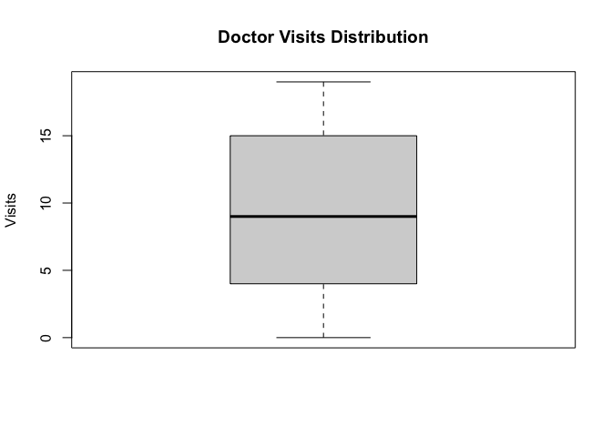
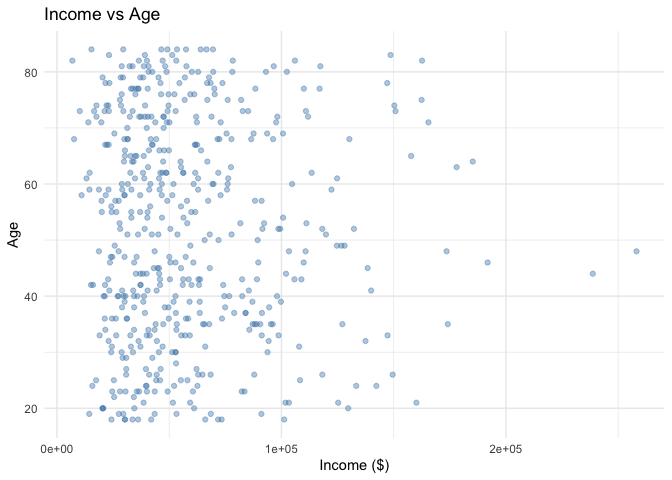
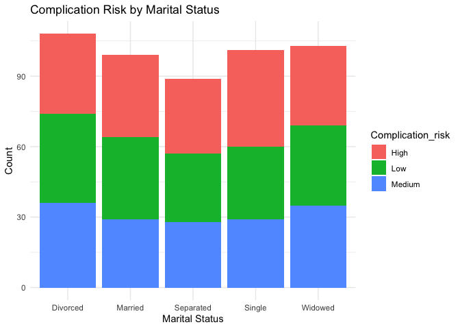

    ################################################################################
    # Project:      Medical Chi-Square Analysis
    # Objective:    Test association between marital status and complication risk
    # Author:       Kim Shellenberger
    # Date:         2024
    # Description:  Analyzes relationship between patient marital status and
    #               complication risk using Chi-Square test of independence.
    ################################################################################

    # SECTION 1: LOAD REQUIRED PACKAGES
    # Note: Install packages manually if needed using install.packages()
    library(ggplot2)       # Data visualization
    library(dvmisc)        # Statistical utilities

    ## Loading required package: rbenchmark

    ## Loading required package: dplyr

    ## 
    ## Attaching package: 'dplyr'

    ## The following objects are masked from 'package:stats':
    ## 
    ##     filter, lag

    ## The following objects are masked from 'package:base':
    ## 
    ##     intersect, setdiff, setequal, union

    library(infer)         # Statistical inference
    library(plyr)          # Data manipulation

    ## ------------------------------------------------------------------------------

    ## You have loaded plyr after dplyr - this is likely to cause problems.
    ## If you need functions from both plyr and dplyr, please load plyr first, then dplyr:
    ## library(plyr); library(dplyr)

    ## ------------------------------------------------------------------------------

    ## 
    ## Attaching package: 'plyr'

    ## The following objects are masked from 'package:dplyr':
    ## 
    ##     arrange, count, desc, failwith, id, mutate, rename, summarise,
    ##     summarize

    library(pastecs)       # Descriptive statistics

    ## 
    ## Attaching package: 'pastecs'

    ## The following objects are masked from 'package:dplyr':
    ## 
    ##     first, last

    library(tidyverse)     # Data manipulation suite

    ## ── Attaching core tidyverse packages ──────────────────────── tidyverse 2.0.0 ──
    ## ✔ forcats   1.0.0     ✔ stringr   1.5.1
    ## ✔ lubridate 1.9.3     ✔ tibble    3.2.1
    ## ✔ purrr     1.0.2     ✔ tidyr     1.3.1
    ## ✔ readr     2.1.5

    ## ── Conflicts ────────────────────────────────────────── tidyverse_conflicts() ──
    ## ✖ plyr::arrange()      masks dplyr::arrange()
    ## ✖ purrr::compact()     masks plyr::compact()
    ## ✖ plyr::count()        masks dplyr::count()
    ## ✖ plyr::desc()         masks dplyr::desc()
    ## ✖ tidyr::expand_grid() masks dvmisc::expand_grid()
    ## ✖ tidyr::extract()     masks pastecs::extract()
    ## ✖ plyr::failwith()     masks dplyr::failwith()
    ## ✖ dplyr::filter()      masks stats::filter()
    ## ✖ pastecs::first()     masks dplyr::first()
    ## ✖ plyr::id()           masks dplyr::id()
    ## ✖ dplyr::lag()         masks stats::lag()
    ## ✖ pastecs::last()      masks dplyr::last()
    ## ✖ plyr::mutate()       masks dplyr::mutate()
    ## ✖ plyr::rename()       masks dplyr::rename()
    ## ✖ plyr::summarise()    masks dplyr::summarise()
    ## ✖ plyr::summarize()    masks dplyr::summarize()
    ## ℹ Use the conflicted package (<http://conflicted.r-lib.org/>) to force all conflicts to become errors

    library(dplyr)         # Data frame operations

    # SECTION 2: LOAD DATA
    # TODO: Update file path to your data location
    med <- read.csv("medical_clean.csv")  # Load medical dataset

    # SECTION 3: EXPLORATORY DATA ANALYSIS
    # Display dataset structure and summary statistics
    str(med)

    ## 'data.frame':    500 obs. of  50 variables:
    ##  $ Customer_id       : chr  "C00001" "C00002" "C00003" "C00004" ...
    ##  $ Interaction       : chr  "I0000001" "I0000002" "I0000003" "I0000004" ...
    ##  $ UID               : chr  "U000000001" "U000000002" "U000000003" "U000000004" ...
    ##  $ City              : chr  "Dallas" "Austin" "Phoenix" "Austin" ...
    ##  $ State             : chr  "TX" "IL" "TX" "AZ" ...
    ##  $ County            : chr  "Dallas" "Dallas" "Dallas" "Dallas" ...
    ##  $ Zip               : int  93807 55539 17491 60192 90395 73888 83609 19077 30953 86919 ...
    ##  $ Lat               : num  33.1 30.4 43 31.3 43.9 ...
    ##  $ Lng               : num  -116.9 -94.4 -79.7 -97 -117.4 ...
    ##  $ Population        : int  2454129 192771 242199 1814595 2862281 2737481 645473 2279316 1588214 756518 ...
    ##  $ Area              : chr  "Urban" "Urban" "Rural" "Suburban" ...
    ##  $ Timezone          : chr  "America/New_York" "America/Chicago" "America/New_York" "America/Chicago" ...
    ##  $ Job               : chr  "Manager" "Engineer" "Analyst" "Engineer" ...
    ##  $ Children          : int  4 0 3 4 4 1 3 3 4 3 ...
    ##  $ Age               : int  36 84 25 25 64 21 68 84 62 25 ...
    ##  $ Education         : chr  "Bachelor" "Bachelor" "Doctorate" "High School" ...
    ##  $ Employment        : chr  "Self Employed" "Full Time" "Unemployed" "Unemployed" ...
    ##  $ Income            : int  24533 29523 25342 45945 34140 59323 72378 69499 38328 58144 ...
    ##  $ Marital           : chr  "Single" "Divorced" "Single" "Divorced" ...
    ##  $ Gender            : chr  "Male" "Male" "Male" "Nonbinary" ...
    ##  $ ReAdmis           : chr  "No" "No" "No" "No" ...
    ##  $ VitD_levels       : num  20.6 18.2 29.1 31.7 49.9 ...
    ##  $ Doc_visits        : int  13 17 5 17 19 15 14 15 7 12 ...
    ##  $ Full_meals_eaten  : int  2 2 4 2 0 3 3 1 1 2 ...
    ##  $ VitD_supp         : int  0 0 2 2 0 3 3 0 1 1 ...
    ##  $ Soft_drink        : chr  "No" "Yes" "No" "No" ...
    ##  $ Initial_admin     : chr  "Elective" "Observation" "Observation" "Elective" ...
    ##  $ HighBlood         : chr  "No" "Yes" "No" "Yes" ...
    ##  $ Stroke            : chr  "Yes" "No" "No" "Yes" ...
    ##  $ Complication_risk : chr  "High" "Low" "Medium" "High" ...
    ##  $ Overweight        : chr  "No" "No" "Yes" "No" ...
    ##  $ Arthritis         : chr  "Yes" "No" "Yes" "No" ...
    ##  $ Diabetes          : chr  "No" "Yes" "Yes" "No" ...
    ##  $ Hyperlipidemia    : chr  "Yes" "Yes" "Yes" "Yes" ...
    ##  $ BackPain          : chr  "Yes" "Yes" "Yes" "No" ...
    ##  $ Anxiety           : chr  "Yes" "No" "No" "No" ...
    ##  $ Allergic_rhinitis : chr  "Yes" "Yes" "Yes" "Yes" ...
    ##  $ Reflux_esophagitis: chr  "No" "Yes" "No" "Yes" ...
    ##  $ Asthma            : chr  "No" "No" "Yes" "No" ...
    ##  $ Services          : chr  "Outpatient" "Outpatient" "Emergency" "Outpatient" ...
    ##  $ Initial_days      : int  4 12 13 19 13 12 3 3 14 18 ...
    ##  $ Additional_charges: num  4956 2214 4362 4493 4196 ...
    ##  $ Item1             : int  2 3 6 1 3 2 2 7 2 6 ...
    ##  $ Item2             : int  3 3 2 7 8 2 1 6 7 6 ...
    ##  $ Item3             : int  2 1 5 8 4 3 7 8 4 4 ...
    ##  $ Item4             : int  5 7 1 3 7 1 5 8 1 6 ...
    ##  $ Item5             : int  8 1 8 4 3 7 4 6 8 6 ...
    ##  $ Item6             : int  8 5 4 4 6 3 7 6 8 3 ...
    ##  $ Item7             : int  5 7 5 1 5 5 6 2 2 3 ...
    ##  $ Item8             : int  6 3 3 6 6 2 1 5 8 2 ...

    print(summary(med))

    ##  Customer_id        Interaction            UID                City          
    ##  Length:500         Length:500         Length:500         Length:500        
    ##  Class :character   Class :character   Class :character   Class :character  
    ##  Mode  :character   Mode  :character   Mode  :character   Mode  :character  
    ##                                                                             
    ##                                                                             
    ##                                                                             
    ##     State              County               Zip             Lat       
    ##  Length:500         Length:500         Min.   :10281   Min.   :25.07  
    ##  Class :character   Class :character   1st Qu.:34607   1st Qu.:30.53  
    ##  Mode  :character   Mode  :character   Median :54276   Median :36.60  
    ##                                        Mean   :54948   Mean   :36.38  
    ##                                        3rd Qu.:78766   3rd Qu.:41.95  
    ##                                        Max.   :99899   Max.   :47.96  
    ##       Lng            Population          Area             Timezone        
    ##  Min.   :-119.92   Min.   :   5159   Length:500         Length:500        
    ##  1st Qu.:-106.16   1st Qu.: 803880   Class :character   Class :character  
    ##  Median : -94.66   Median :1540958   Mode  :character   Mode  :character  
    ##  Mean   : -94.75   Mean   :1548157                                        
    ##  3rd Qu.: -82.10   3rd Qu.:2319420                                        
    ##  Max.   : -70.11   Max.   :2995568                                        
    ##      Job               Children          Age         Education        
    ##  Length:500         Min.   :0.000   Min.   :18.00   Length:500        
    ##  Class :character   1st Qu.:1.000   1st Qu.:36.00   Class :character  
    ##  Mode  :character   Median :2.000   Median :52.00   Mode  :character  
    ##                     Mean   :2.134   Mean   :51.98                     
    ##                     3rd Qu.:3.000   3rd Qu.:69.00                     
    ##                     Max.   :4.000   Max.   :84.00                     
    ##   Employment            Income         Marital             Gender         
    ##  Length:500         Min.   :  6871   Length:500         Length:500        
    ##  Class :character   1st Qu.: 33720   Class :character   Class :character  
    ##  Mode  :character   Median : 48746   Mode  :character   Mode  :character  
    ##                     Mean   : 58546                                        
    ##                     3rd Qu.: 72900                                        
    ##                     Max.   :258160                                        
    ##    ReAdmis           VitD_levels      Doc_visits     Full_meals_eaten
    ##  Length:500         Min.   :-5.39   Min.   : 0.000   Min.   :0.000   
    ##  Class :character   1st Qu.:22.72   1st Qu.: 4.000   1st Qu.:1.000   
    ##  Mode  :character   Median :29.91   Median : 9.000   Median :2.000   
    ##                     Mean   :29.90   Mean   : 9.542   Mean   :2.204   
    ##                     3rd Qu.:36.62   3rd Qu.:15.000   3rd Qu.:4.000   
    ##                     Max.   :62.40   Max.   :19.000   Max.   :4.000   
    ##    VitD_supp      Soft_drink        Initial_admin       HighBlood        
    ##  Min.   :0.000   Length:500         Length:500         Length:500        
    ##  1st Qu.:1.000   Class :character   Class :character   Class :character  
    ##  Median :2.000   Mode  :character   Mode  :character   Mode  :character  
    ##  Mean   :1.548                                                           
    ##  3rd Qu.:3.000                                                           
    ##  Max.   :3.000                                                           
    ##     Stroke          Complication_risk   Overweight         Arthritis        
    ##  Length:500         Length:500         Length:500         Length:500        
    ##  Class :character   Class :character   Class :character   Class :character  
    ##  Mode  :character   Mode  :character   Mode  :character   Mode  :character  
    ##                                                                             
    ##                                                                             
    ##                                                                             
    ##    Diabetes         Hyperlipidemia       BackPain           Anxiety         
    ##  Length:500         Length:500         Length:500         Length:500        
    ##  Class :character   Class :character   Class :character   Class :character  
    ##  Mode  :character   Mode  :character   Mode  :character   Mode  :character  
    ##                                                                             
    ##                                                                             
    ##                                                                             
    ##  Allergic_rhinitis  Reflux_esophagitis    Asthma            Services        
    ##  Length:500         Length:500         Length:500         Length:500        
    ##  Class :character   Class :character   Class :character   Class :character  
    ##  Mode  :character   Mode  :character   Mode  :character   Mode  :character  
    ##                                                                             
    ##                                                                             
    ##                                                                             
    ##   Initial_days  Additional_charges     Item1           Item2      
    ##  Min.   : 1.0   Min.   : 103.1     Min.   :1.000   Min.   :1.000  
    ##  1st Qu.: 6.0   1st Qu.:1402.0     1st Qu.:2.000   1st Qu.:2.000  
    ##  Median :10.0   Median :2705.2     Median :4.000   Median :4.000  
    ##  Mean   :10.4   Mean   :2633.2     Mean   :4.418   Mean   :4.382  
    ##  3rd Qu.:15.0   3rd Qu.:3814.9     3rd Qu.:7.000   3rd Qu.:6.000  
    ##  Max.   :19.0   Max.   :4999.1     Max.   :8.000   Max.   :8.000  
    ##      Item3           Item4           Item5           Item6           Item7     
    ##  Min.   :1.000   Min.   :1.000   Min.   :1.000   Min.   :1.000   Min.   :1.00  
    ##  1st Qu.:3.000   1st Qu.:3.000   1st Qu.:3.000   1st Qu.:3.000   1st Qu.:2.00  
    ##  Median :5.000   Median :5.000   Median :5.000   Median :5.000   Median :4.00  
    ##  Mean   :4.664   Mean   :4.724   Mean   :4.672   Mean   :4.554   Mean   :4.36  
    ##  3rd Qu.:7.000   3rd Qu.:7.000   3rd Qu.:7.000   3rd Qu.:7.000   3rd Qu.:7.00  
    ##  Max.   :8.000   Max.   :8.000   Max.   :8.000   Max.   :8.000   Max.   :8.00  
    ##      Item8      
    ##  Min.   :1.000  
    ##  1st Qu.:2.000  
    ##  Median :4.000  
    ##  Mean   :4.396  
    ##  3rd Qu.:6.000  
    ##  Max.   :8.000

    # SECTION 4: VISUALIZATION
    # Create proportional bar chart showing relationship
    ggplot(med, aes(Marital, fill = Complication_risk)) + 
      geom_bar(position = "fill") +
      labs(title = "Marital Status vs. Complication Risk",
           x = "Marital Status",
           y = "Proportion")

    # SECTION 5: CONTINGENCY TABLE
    # Create count table for categorical variables
    c_var <- table(med$Marital, med$Complication_risk)
    c_var

    ##            
    ##             High Low Medium
    ##   Divorced    34  38     36
    ##   Married     35  35     29
    ##   Separated   32  29     28
    ##   Single      41  31     29
    ##   Widowed     34  34     35

    summary.table(c_var)

    ## Number of cases in table: 500 
    ## Number of factors: 2 
    ## Test for independence of all factors:
    ##  Chisq = 2.5941, df = 8, p-value = 0.9572

    # SECTION 6: CHI-SQUARE TEST OF INDEPENDENCE
    # Test null hypothesis: marital status and complication risk are independent
    results <- chisq.test(c_var)
    results

    ## 
    ##  Pearson's Chi-squared test
    ## 
    ## data:  c_var
    ## X-squared = 2.5941, df = 8, p-value = 0.9572

    # Interpret: p-value < 0.05 suggests variables are associated

    # SECTION 7: SUPPORTING UNIVARIATE ANALYSES
    # Bar chart for Marital Status distribution
    ggplot(med, aes(x = Marital)) +
      geom_bar(fill = "steelblue") +
      labs(title = "Marital Status Distribution", x = "Marital Status", y = "Count") +
      theme_minimal()

    # Bar chart for Initial Administration distribution
    ggplot(med, aes(x = Initial_admin)) +
      geom_bar(fill = "coral") +
      labs(title = "Initial Admin Distribution", x = "Initial Admin", y = "Count") +
      theme_minimal()

    # SECTION 8: CONTINUOUS VARIABLE ANALYSIS
    # Boxplot and statistics for Age (outlier detection)
    boxplot(med$Age, main = "Age Distribution", ylab = "Years")

    boxplot.stats(med$Age)

    ## $stats
    ## [1] 18 36 52 69 84
    ## 
    ## $n
    ## [1] 500
    ## 
    ## $conf
    ## [1] 49.66823 54.33177
    ## 
    ## $out
    ## integer(0)

    print(summary(med$Age))

    ##    Min. 1st Qu.  Median    Mean 3rd Qu.    Max. 
    ##   18.00   36.00   52.00   51.98   69.00   84.00

    # Boxplot and statistics for Doctor Visits
    boxplot(med$Doc_visits, main = "Doctor Visits Distribution", ylab = "Visits")

    boxplot.stats(med$Doc_visits)

    ## $stats
    ## [1]  0  4  9 15 19
    ## 
    ## $n
    ## [1] 500
    ## 
    ## $conf
    ## [1] 8.222743 9.777257
    ## 
    ## $out
    ## integer(0)

    # SECTION 9: INCOME STATISTICS
    stat.desc(med$Income)

    ##      nbr.val     nbr.null       nbr.na          min          max        range 
    ## 5.000000e+02 0.000000e+00 0.000000e+00 6.871000e+03 2.581600e+05 2.512890e+05 
    ##          sum       median         mean      SE.mean CI.mean.0.95          var 
    ## 2.927277e+07 4.874550e+04 5.854554e+04 1.600298e+03 3.144153e+03 1.280478e+09 
    ##      std.dev     coef.var 
    ## 3.578376e+04 6.112124e-01

    summary(med$Age)

    ##    Min. 1st Qu.  Median    Mean 3rd Qu.    Max. 
    ##   18.00   36.00   52.00   51.98   69.00   84.00

    ggplot(med, aes(x = Income, y = Age)) +
      geom_point(alpha = 0.4, color = "steelblue") +
      labs(title = "Income vs Age", x = "Income ($)", y = "Age") +
      theme_minimal()

    ggplot(med, aes(x = Marital, fill = Complication_risk)) +
      geom_bar(position = "stack") +
      labs(title = "Complication Risk by Marital Status", x = "Marital Status", y = "Count") +
      theme_minimal()

    #Two continuous variable descriptive stats for bivariate

    #Group one veriable by quantile
    Quantile_Age <- quant_groups(med$Age, groups = 4, probs = NULL, quantile.list = NULL,
                 cut.list = NULL)

    ## Observations per group: 133, 120, 124, 123. 0 missing.

    #View new grouped data
    Quantile_Age

    ##   [1] [18,36] (69,84] [18,36] [18,36] (52,69] [18,36] (52,69] (69,84] (52,69]
    ##  [10] [18,36] [18,36] (69,84] [18,36] (69,84] [18,36] (52,69] (36,52] (36,52]
    ##  [19] (52,69] [18,36] [18,36] (69,84] (52,69] [18,36] (69,84] (36,52] (52,69]
    ##  [28] (52,69] (36,52] (52,69] [18,36] (52,69] (36,52] [18,36] (69,84] [18,36]
    ##  [37] (52,69] (36,52] [18,36] (69,84] (69,84] (69,84] (69,84] (52,69] (69,84]
    ##  [46] (36,52] (36,52] [18,36] (52,69] (69,84] (36,52] [18,36] [18,36] (36,52]
    ##  [55] (52,69] (52,69] [18,36] (36,52] (36,52] (69,84] (52,69] (52,69] (69,84]
    ##  [64] (69,84] [18,36] (36,52] (69,84] (36,52] [18,36] (52,69] (52,69] (69,84]
    ##  [73] (52,69] (52,69] (36,52] (69,84] [18,36] (69,84] (69,84] (69,84] (36,52]
    ##  [82] [18,36] (36,52] (52,69] (52,69] (52,69] (36,52] (52,69] (52,69] (69,84]
    ##  [91] (36,52] [18,36] (36,52] (36,52] (69,84] (52,69] (52,69] (69,84] (36,52]
    ## [100] (36,52] (69,84] [18,36] (36,52] (69,84] (52,69] (36,52] (36,52] [18,36]
    ## [109] (36,52] (69,84] (36,52] (52,69] (52,69] (52,69] (52,69] (52,69] (52,69]
    ## [118] [18,36] (52,69] (52,69] [18,36] [18,36] (69,84] (36,52] (36,52] (52,69]
    ## [127] (52,69] (52,69] (36,52] [18,36] (36,52] (52,69] (69,84] (36,52] (69,84]
    ## [136] (52,69] [18,36] (52,69] [18,36] (52,69] [18,36] (69,84] (52,69] [18,36]
    ## [145] (36,52] [18,36] [18,36] (69,84] (36,52] (69,84] [18,36] (36,52] (52,69]
    ## [154] (52,69] [18,36] [18,36] (36,52] (36,52] [18,36] (69,84] [18,36] (52,69]
    ## [163] [18,36] (36,52] (69,84] [18,36] (36,52] (52,69] [18,36] (36,52] (52,69]
    ## [172] (52,69] (36,52] [18,36] (36,52] [18,36] (69,84] [18,36] [18,36] (69,84]
    ## [181] (52,69] [18,36] [18,36] (36,52] [18,36] [18,36] [18,36] (52,69] [18,36]
    ## [190] (36,52] [18,36] [18,36] [18,36] [18,36] (52,69] (69,84] [18,36] (69,84]
    ## [199] (69,84] [18,36] [18,36] (52,69] [18,36] (52,69] [18,36] [18,36] (52,69]
    ## [208] (52,69] [18,36] (69,84] (69,84] (36,52] (52,69] (69,84] (36,52] (36,52]
    ## [217] (52,69] (36,52] (52,69] (36,52] (69,84] [18,36] (36,52] [18,36] (69,84]
    ## [226] (69,84] (69,84] (69,84] (69,84] (69,84] [18,36] [18,36] (69,84] (36,52]
    ## [235] (69,84] [18,36] (52,69] [18,36] (36,52] (52,69] [18,36] (52,69] (52,69]
    ## [244] [18,36] (69,84] (52,69] [18,36] (36,52] [18,36] (36,52] (52,69] (36,52]
    ## [253] [18,36] (36,52] [18,36] [18,36] (36,52] (36,52] (69,84] (52,69] (36,52]
    ## [262] (36,52] (36,52] [18,36] (52,69] (69,84] (52,69] (52,69] (36,52] (69,84]
    ## [271] (69,84] (69,84] (52,69] (36,52] (69,84] [18,36] [18,36] (36,52] (69,84]
    ## [280] (69,84] (36,52] [18,36] [18,36] (36,52] [18,36] (52,69] (52,69] (52,69]
    ## [289] (36,52] (52,69] (69,84] (52,69] (69,84] (52,69] [18,36] (52,69] [18,36]
    ## [298] (52,69] (69,84] [18,36] (69,84] (69,84] (36,52] [18,36] (36,52] (36,52]
    ## [307] (52,69] (36,52] [18,36] (52,69] (52,69] [18,36] [18,36] (69,84] (52,69]
    ## [316] (69,84] (36,52] [18,36] [18,36] (36,52] (69,84] (36,52] (69,84] (36,52]
    ## [325] (52,69] [18,36] [18,36] (69,84] [18,36] (69,84] (69,84] (36,52] (36,52]
    ## [334] [18,36] (52,69] (52,69] [18,36] (69,84] [18,36] [18,36] (52,69] [18,36]
    ## [343] (36,52] (69,84] [18,36] (52,69] (52,69] (52,69] (69,84] (69,84] [18,36]
    ## [352] (69,84] (36,52] (36,52] (69,84] (36,52] (52,69] [18,36] (69,84] [18,36]
    ## [361] [18,36] [18,36] (36,52] (52,69] (69,84] (36,52] (36,52] (36,52] (69,84]
    ## [370] (69,84] (69,84] (36,52] (69,84] [18,36] (69,84] [18,36] (69,84] (52,69]
    ## [379] (52,69] (69,84] (52,69] [18,36] (36,52] (69,84] (36,52] (69,84] (69,84]
    ## [388] [18,36] [18,36] (52,69] (69,84] (52,69] (52,69] (36,52] (36,52] [18,36]
    ## [397] (52,69] (52,69] (52,69] (69,84] (52,69] (36,52] (36,52] (52,69] (69,84]
    ## [406] (69,84] (36,52] (52,69] (69,84] (69,84] (69,84] (69,84] (69,84] (36,52]
    ## [415] (36,52] (36,52] (52,69] (52,69] (69,84] (36,52] (36,52] [18,36] [18,36]
    ## [424] (52,69] [18,36] (69,84] (36,52] (69,84] (69,84] [18,36] (69,84] (52,69]
    ## [433] (36,52] [18,36] (52,69] (52,69] (69,84] (52,69] [18,36] (36,52] (69,84]
    ## [442] [18,36] (69,84] (69,84] (52,69] (36,52] (69,84] (69,84] (52,69] [18,36]
    ## [451] (69,84] (36,52] [18,36] (52,69] (69,84] (36,52] (52,69] [18,36] [18,36]
    ## [460] [18,36] [18,36] (52,69] [18,36] (36,52] (36,52] [18,36] (69,84] (69,84]
    ## [469] [18,36] [18,36] (52,69] (36,52] (36,52] (36,52] [18,36] (52,69] (36,52]
    ## [478] (36,52] (52,69] (69,84] (69,84] (69,84] (69,84] [18,36] (69,84] (52,69]
    ## [487] (36,52] (36,52] (36,52] (69,84] (36,52] (36,52] (52,69] (52,69] (36,52]
    ## [496] [18,36] (69,84] (36,52] (36,52] (52,69]
    ## Levels: [18,36] (36,52] (52,69] (69,84]

    str(Quantile_Age)

    ##  Factor w/ 4 levels "[18,36]","(36,52]",..: 1 4 1 1 3 1 3 4 3 1 ...

    #Create new table with grouped data and other continous variable
    bivar_continuous = data.frame(Quantile_Age, med$Income)

    #View new table 
    bivar_continuous

    ##     Quantile_Age med.Income
    ## 1        [18,36]      24533
    ## 2        (69,84]      29523
    ## 3        [18,36]      25342
    ## 4        [18,36]      45945
    ## 5        (52,69]      34140
    ## 6        [18,36]      59323
    ## 7        (52,69]      72378
    ## 8        (69,84]      69499
    ## 9        (52,69]      38328
    ## 10       [18,36]      58144
    ## 11       [18,36]      91224
    ## 12       (69,84]      64045
    ## 13       [18,36]     149550
    ## 14       (69,84]      88372
    ## 15       [18,36]     137454
    ## 16       (52,69]      10988
    ## 17       (36,52]      51948
    ## 18       (36,52]      40362
    ## 19       (52,69]      45479
    ## 20       [18,36]      30243
    ## 21       [18,36]      62176
    ## 22       (69,84]      16564
    ## 23       (52,69]      62446
    ## 24       [18,36]      30853
    ## 25       (69,84]      36307
    ## 26       (36,52]      63774
    ## 27       (52,69]      51393
    ## 28       (52,69]      92259
    ## 29       (36,52]      27400
    ## 30       (52,69]      46704
    ## 31       [18,36]      83555
    ## 32       (52,69]      60884
    ## 33       (36,52]      63282
    ## 34       [18,36]      95304
    ## 35       (69,84]      38417
    ## 36       [18,36]      33857
    ## 37       (52,69]      69254
    ## 38       (36,52]      44817
    ## 39       [18,36]      96117
    ## 40       (69,84]      61198
    ## 41       (69,84]      33725
    ## 42       (69,84]      60056
    ## 43       (69,84]      28521
    ## 44       (52,69]      86522
    ## 45       (69,84]      21199
    ## 46       (36,52]     102052
    ## 47       (36,52]      59428
    ## 48       [18,36]      44412
    ## 49       (52,69]      77497
    ## 50       (69,84]      66622
    ## 51       (36,52]     108905
    ## 52       [18,36]     108297
    ## 53       [18,36]      60559
    ## 54       (36,52]      29055
    ## 55       (52,69]      35422
    ## 56       (52,69]      46958
    ## 57       [18,36]      93811
    ## 58       (36,52]      37278
    ## 59       (36,52]      39192
    ## 60       (69,84]     148600
    ## 61       (52,69]      46047
    ## 62       (52,69]      33495
    ## 63       (69,84]      78119
    ## 64       (69,84]      47397
    ## 65       [18,36]      21295
    ## 66       (36,52]      91542
    ## 67       (69,84]      31313
    ## 68       (36,52]      50320
    ## 69       [18,36]      47057
    ## 70       (52,69]      56278
    ## 71       (52,69]      13166
    ## 72       (69,84]      40092
    ## 73       (52,69]      96269
    ## 74       (52,69]     104743
    ## 75       (36,52]      27044
    ## 76       (69,84]      85166
    ## 77       [18,36]      31043
    ## 78       (69,84]      39155
    ## 79       (69,84]      40409
    ## 80       (69,84]      52328
    ## 81       (36,52]      89395
    ## 82       [18,36]      57455
    ## 83       (36,52]      45448
    ## 84       (52,69]      87587
    ## 85       (52,69]      30285
    ## 86       (52,69]      46801
    ## 87       (36,52]      89096
    ## 88       (52,69]      67345
    ## 89       (52,69]      37057
    ## 90       (69,84]      19776
    ## 91       (36,52]      59072
    ## 92       [18,36]      19011
    ## 93       (36,52]      43153
    ## 94       (36,52]      99446
    ## 95       (69,84]      70126
    ## 96       (52,69]      14557
    ## 97       (52,69]      55286
    ## 98       (69,84]      40477
    ## 99       (36,52]      22829
    ## 100      (36,52]      59935
    ## 101      (69,84]      36496
    ## 102      [18,36]      36632
    ## 103      (36,52]      52808
    ## 104      (69,84]      33674
    ## 105      (52,69]      51919
    ## 106      (36,52]      34338
    ## 107      (36,52]      35487
    ## 108      [18,36]      88944
    ## 109      (36,52]      94542
    ## 110      (69,84]      17585
    ## 111      (36,52]      76745
    ## 112      (52,69]     113454
    ## 113      (52,69]     124795
    ## 114      (52,69]      66985
    ## 115      (52,69]      25992
    ## 116      (52,69]      71538
    ## 117      (52,69]      29099
    ## 118      [18,36]      39904
    ## 119      (52,69]      61688
    ## 120      (52,69]      30247
    ## 121      [18,36]      24641
    ## 122      [18,36]      64826
    ## 123      (69,84]     150292
    ## 124      (36,52]     103357
    ## 125      (36,52]      74930
    ## 126      (52,69]      88213
    ## 127      (52,69]      71871
    ## 128      (52,69]      64212
    ## 129      (36,52]      84050
    ## 130      [18,36]      21568
    ## 131      (36,52]      55254
    ## 132      (52,69]      46697
    ## 133      (69,84]      51397
    ## 134      (36,52]      37167
    ## 135      (69,84]      66990
    ## 136      (52,69]      30009
    ## 137      [18,36]      35585
    ## 138      (52,69]      33113
    ## 139      [18,36]      82320
    ## 140      (52,69]      48677
    ## 141      [18,36]      37179
    ## 142      (69,84]      39181
    ## 143      (52,69]      49135
    ## 144      [18,36]     129742
    ## 145      (36,52]      23344
    ## 146      [18,36]      73520
    ## 147      [18,36]      65063
    ## 148      (69,84]      28860
    ## 149      (36,52]     118199
    ## 150      (69,84]      67749
    ## 151      [18,36]      36147
    ## 152      (36,52]      16064
    ## 153      (52,69]      56246
    ## 154      (52,69]      47722
    ## 155      [18,36]      26412
    ## 156      [18,36]      26208
    ## 157      (36,52]      82546
    ## 158      (36,52]      15163
    ## 159      [18,36]      59194
    ## 160      (69,84]      43807
    ## 161      [18,36]      66058
    ## 162      (52,69]      41086
    ## 163      [18,36]      58452
    ## 164      (36,52]      31393
    ## 165      (69,84]      47595
    ## 166      [18,36]      65739
    ## 167      (36,52]      53665
    ## 168      (52,69]      61586
    ## 169      [18,36]      28092
    ## 170      (36,52]      34393
    ## 171      (52,69]      34752
    ## 172      (52,69]      41527
    ## 173      (36,52]     110763
    ## 174      [18,36]      39636
    ## 175      (36,52]      24683
    ## 176      [18,36]      67845
    ## 177      (69,84]     109973
    ## 178      [18,36]      23001
    ## 179      [18,36]     160121
    ## 180      (69,84]      62888
    ## 181      (52,69]      91157
    ## 182      [18,36]     118213
    ## 183      [18,36]      87866
    ## 184      (36,52]      45875
    ## 185      [18,36]     101785
    ## 186      [18,36]      57111
    ## 187      [18,36]      94305
    ## 188      (52,69]     100702
    ## 189      [18,36]      25475
    ## 190      (36,52]      78951
    ## 191      [18,36]      43953
    ## 192      [18,36]      53259
    ## 193      [18,36]      52905
    ## 194      [18,36]      51647
    ## 195      (52,69]     122286
    ## 196      (69,84]      21593
    ## 197      [18,36]      17441
    ## 198      (69,84]      15368
    ## 199      (69,84]      93105
    ## 200      [18,36]      30821
    ## 201      [18,36]      53067
    ## 202      (52,69]      45760
    ## 203      [18,36]      28801
    ## 204      (52,69]      81706
    ## 205      [18,36]      45412
    ## 206      [18,36]      42504
    ## 207      (52,69]      56372
    ## 208      (52,69]      75543
    ## 209      [18,36]      27574
    ## 210      (69,84]      82764
    ## 211      (69,84]     116998
    ## 212      (36,52]      20834
    ## 213      (52,69]      57929
    ## 214      (69,84]      40825
    ## 215      (36,52]      74573
    ## 216      (36,52]      23624
    ## 217      (52,69]     130270
    ## 218      (36,52]      18681
    ## 219      (52,69]      42338
    ## 220      (36,52]      63613
    ## 221      (69,84]      32474
    ## 222      [18,36]      29554
    ## 223      (36,52]      56013
    ## 224      [18,36]      51362
    ## 225      (69,84]      49196
    ## 226      (69,84]      82061
    ## 227      (69,84]      38689
    ## 228      (69,84]      59383
    ## 229      (69,84]      36172
    ## 230      (69,84]      29449
    ## 231      [18,36]      41322
    ## 232      [18,36]      36342
    ## 233      (69,84]      37448
    ## 234      (36,52]      98636
    ## 235      (69,84]      42089
    ## 236      [18,36]      32934
    ## 237      (52,69]      49854
    ## 238      [18,36]      52184
    ## 239      (36,52]      24050
    ## 240      (52,69]      40985
    ## 241      [18,36]      40006
    ## 242      (52,69]      44210
    ## 243      (52,69]      75759
    ## 244      [18,36]      53210
    ## 245      (69,84]     102412
    ## 246      (52,69]      48679
    ## 247      [18,36]     142294
    ## 248      (36,52]      37180
    ## 249      [18,36]      30892
    ## 250      (36,52]      68076
    ## 251      (52,69]     111129
    ## 252      (36,52]      21434
    ## 253      [18,36]      43556
    ## 254      (36,52]      33980
    ## 255      [18,36]      53408
    ## 256      [18,36]      49316
    ## 257      (36,52]     109889
    ## 258      (36,52]      45934
    ## 259      (69,84]     111845
    ## 260      (52,69]      40576
    ## 261      (36,52]      85467
    ## 262      (36,52]      56230
    ## 263      (36,52]     138404
    ## 264      [18,36]      20207
    ## 265      (52,69]      24384
    ## 266      (69,84]     147116
    ## 267      (52,69]      31572
    ## 268      (52,69]      32798
    ## 269      (36,52]      28986
    ## 270      (69,84]      97642
    ## 271      (69,84]      23108
    ## 272      (69,84]      49686
    ## 273      (52,69]      41799
    ## 274      (36,52]      91300
    ## 275      (69,84]      34954
    ## 276      [18,36]      62891
    ## 277      [18,36]      24277
    ## 278      (36,52]     191830
    ## 279      (69,84]      42457
    ## 280      (69,84]      49279
    ## 281      (36,52]     132303
    ## 282      [18,36]      34475
    ## 283      [18,36]     133310
    ## 284      (36,52]      38297
    ## 285      [18,36]      73352
    ## 286      (52,69]      34766
    ## 287      (52,69]      21728
    ## 288      (52,69]      62866
    ## 289      (36,52]      71965
    ## 290      (52,69]      22258
    ## 291      (69,84]      40773
    ## 292      (52,69]     100756
    ## 293      (69,84]      70268
    ## 294      (52,69]      38672
    ## 295      [18,36]      34251
    ## 296      (52,69]     157778
    ## 297      [18,36]      20575
    ## 298      (52,69]      47310
    ## 299      (69,84]      20357
    ## 300      [18,36]     107892
    ## 301      (69,84]      48812
    ## 302      (69,84]      54552
    ## 303      (36,52]     258160
    ## 304      [18,36]      34335
    ## 305      (36,52]     139965
    ## 306      (36,52]      38776
    ## 307      (52,69]      42612
    ## 308      (36,52]     238686
    ## 309      [18,36]      44505
    ## 310      (52,69]      21491
    ## 311      (52,69]      58055
    ## 312      [18,36]      44195
    ## 313      [18,36]      61099
    ## 314      (69,84]      45245
    ## 315      (52,69]     185225
    ## 316      (69,84]      68463
    ## 317      (36,52]      25720
    ## 318      [18,36]      52824
    ## 319      [18,36]      30340
    ## 320      (36,52]      42251
    ## 321      (69,84]      28388
    ## 322      (36,52]     173559
    ## 323      (69,84]      32376
    ## 324      (36,52]      74053
    ## 325      (52,69]      40373
    ## 326      [18,36]      24464
    ## 327      [18,36]      55193
    ## 328      (69,84]      62344
    ## 329      [18,36]      68540
    ## 330      (69,84]      10165
    ## 331      (69,84]      23367
    ## 332      (36,52]      87076
    ## 333      (36,52]      28165
    ## 334      [18,36]      55369
    ## 335      (52,69]      23045
    ## 336      (52,69]      76036
    ## 337      [18,36]      85713
    ## 338      (69,84]      76050
    ## 339      [18,36]      91084
    ## 340      [18,36]     125284
    ## 341      (52,69]      24235
    ## 342      [18,36]      30540
    ## 343      (36,52]      83996
    ## 344      (69,84]      96580
    ## 345      [18,36]      32709
    ## 346      (52,69]      31372
    ## 347      (52,69]      33146
    ## 348      (52,69]      18712
    ## 349      (69,84]      22860
    ## 350      (69,84]      23193
    ## 351      [18,36]      41091
    ## 352      (69,84]      57671
    ## 353      (36,52]      63582
    ## 354      (36,52]      36129
    ## 355      (69,84]      36666
    ## 356      (36,52]      52796
    ## 357      (52,69]      19978
    ## 358      [18,36]      87174
    ## 359      (69,84]     106004
    ## 360      [18,36]      33680
    ## 361      [18,36]      38597
    ## 362      [18,36]     103361
    ## 363      (36,52]      45532
    ## 364      (52,69]      69769
    ## 365      (69,84]      46380
    ## 366      (36,52]     124715
    ## 367      (36,52]      65778
    ## 368      (36,52]      68091
    ## 369      (69,84]      68857
    ## 370      (69,84]      35134
    ## 371      (69,84]      37125
    ## 372      (36,52]      77773
    ## 373      (69,84]      52884
    ## 374      [18,36]      24184
    ## 375      (69,84]     150823
    ## 376      [18,36]      88154
    ## 377      (69,84]      50140
    ## 378      (52,69]      41602
    ## 379      (52,69]      55227
    ## 380      (69,84]      66870
    ## 381      (52,69]      14475
    ## 382      [18,36]     174104
    ## 383      (36,52]      30518
    ## 384      (69,84]      48965
    ## 385      (36,52]      50057
    ## 386      (69,84]     162447
    ## 387      (69,84]      46496
    ## 388      [18,36]     127148
    ## 389      [18,36]      62570
    ## 390      (52,69]      27526
    ## 391      (69,84]      53147
    ## 392      (52,69]      45656
    ## 393      (52,69]      25580
    ## 394      (36,52]      60757
    ## 395      (36,52]      49675
    ## 396      [18,36]      68450
    ## 397      (52,69]      55051
    ## 398      (52,69]      33168
    ## 399      (52,69]      77730
    ## 400      (69,84]      33704
    ## 401      (52,69]       7633
    ## 402      (36,52]      52955
    ## 403      (36,52]      35156
    ## 404      (52,69]      61653
    ## 405      (69,84]     162645
    ## 406      (69,84]     165486
    ## 407      (36,52]      44397
    ## 408      (52,69]      29855
    ## 409      (69,84]      69620
    ## 410      (69,84]      39256
    ## 411      (69,84]      62011
    ## 412      (69,84]      32974
    ## 413      (69,84]      56978
    ## 414      (36,52]      30116
    ## 415      (36,52]      99763
    ## 416      (36,52]      34407
    ## 417      (52,69]      72887
    ## 418      (52,69]      22952
    ## 419      (69,84]      78331
    ## 420      (36,52]      27451
    ## 421      (36,52]      57337
    ## 422      [18,36]      90574
    ## 423      [18,36]      43478
    ## 424      (52,69]      26436
    ## 425      [18,36]      66045
    ## 426      (69,84]      29596
    ## 427      (36,52]      38463
    ## 428      (69,84]      57485
    ## 429      (69,84]     110902
    ## 430      [18,36]      49808
    ## 431      (69,84]      49698
    ## 432      (52,69]      76306
    ## 433      (36,52]      50525
    ## 434      [18,36]      71777
    ## 435      (52,69]      93631
    ## 436      (52,69]      40270
    ## 437      (69,84]       6871
    ## 438      (52,69]      30009
    ## 439      [18,36]     101236
    ## 440      (36,52]      48038
    ## 441      (69,84]      39995
    ## 442      [18,36]      98723
    ## 443      (69,84]      46129
    ## 444      (69,84]      13967
    ## 445      (52,69]      19867
    ## 446      (36,52]      63019
    ## 447      (69,84]      47092
    ## 448      (69,84]     117336
    ## 449      (52,69]      31572
    ## 450      [18,36]      40713
    ## 451      (69,84]      28834
    ## 452      (36,52]      35870
    ## 453      [18,36]      15754
    ## 454      (52,69]      38894
    ## 455      (69,84]      47519
    ## 456      (36,52]      45171
    ## 457      (52,69]     178034
    ## 458      [18,36]     147280
    ## 459      [18,36]      31240
    ## 460      [18,36]      14381
    ## 461      [18,36]      46188
    ## 462      (52,69]      61446
    ## 463      [18,36]      29252
    ## 464      (36,52]      30134
    ## 465      (36,52]     126694
    ## 466      [18,36]      42002
    ## 467      (69,84]      72937
    ## 468      (69,84]      28052
    ## 469      [18,36]      47374
    ## 470      [18,36]      40063
    ## 471      (52,69]      32688
    ## 472      (36,52]      98045
    ## 473      (36,52]      21305
    ## 474      (36,52]      58691
    ## 475      [18,36]      39614
    ## 476      (52,69]      62874
    ## 477      (36,52]      39937
    ## 478      (36,52]      82480
    ## 479      (52,69]      27894
    ## 480      (69,84]      98177
    ## 481      (69,84]      48181
    ## 482      (69,84]      22090
    ## 483      (69,84]      73727
    ## 484      [18,36]      43508
    ## 485      (69,84]      17594
    ## 486      (52,69]      59843
    ## 487      (36,52]      89676
    ## 488      (36,52]     105797
    ## 489      (36,52]      39065
    ## 490      (69,84]      53487
    ## 491      (36,52]      50530
    ## 492      (36,52]     119836
    ## 493      (52,69]      30143
    ## 494      (52,69]      37094
    ## 495      (36,52]      29708
    ## 496      [18,36]      20548
    ## 497      (69,84]      56878
    ## 498      (36,52]     128127
    ## 499      (36,52]      43517
    ## 500      (52,69]      28879

    #Descriptive statistics table for bivariate continuous variable grouped by the grouped variable

    ###   https://cran.r-project.org/web/packages/summarytools/vignettes/introduction.html   6.1 Special Case of descr() with stby()
    #When used to produce split-group statistics for a single variable, stby() assembles everything into a single table instead of displaying a series of one-column tables.

    #with(tobacco, 
    #     stby(data    = BMI, 
    #          INDICES = age.gr, 
    #          FUN     = descr,      ####

    tapply(bivar_continuous[, 2], Quantile_Age, summary)

    ## $`[18,36]`
    ##    Min. 1st Qu.  Median    Mean 3rd Qu.    Max. 
    ##   14381   32934   47374   58101   71777  174104 
    ## 
    ## $`(36,52]`
    ##    Min. 1st Qu.  Median    Mean 3rd Qu.    Max. 
    ##   15163   36064   52882   65015   84404  258160 
    ## 
    ## $`(52,69]`
    ##    Min. 1st Qu.  Median    Mean 3rd Qu.    Max. 
    ##    7633   32409   46700   54298   67822  185225 
    ## 
    ## $`(69,84]`
    ##    Min. 1st Qu.  Median    Mean 3rd Qu.    Max. 
    ##    6871   34340   48181   56996   69178  165486
