    ################################################################################
    # Project:      Medical Data PCA Analysis
    # Objective:    Reduce dimensionality using PCA and identify outliers
    # Author:       Kim Shellenberger
    # Date:         2024
    # Description:  Principal Component Analysis (PCA) to understand data structure,
    #               identify outliers, and reduce dimensions. Includes comprehensive
    #               data quality checks and statistical analysis.
    ################################################################################

    # SECTION 1: LOAD REQUIRED PACKAGES
    library(tidyverse)    # Data manipulation suite

    ## ── Attaching core tidyverse packages ──────────────────────── tidyverse 2.0.0 ──
    ## ✔ dplyr     1.1.4     ✔ readr     2.1.5
    ## ✔ forcats   1.0.0     ✔ stringr   1.5.1
    ## ✔ ggplot2   3.5.0     ✔ tibble    3.2.1
    ## ✔ lubridate 1.9.3     ✔ tidyr     1.3.1
    ## ✔ purrr     1.0.2     
    ## ── Conflicts ────────────────────────────────────────── tidyverse_conflicts() ──
    ## ✖ dplyr::filter() masks stats::filter()
    ## ✖ dplyr::lag()    masks stats::lag()
    ## ℹ Use the conflicted package (<http://conflicted.r-lib.org/>) to force all conflicts to become errors

    # SECTION 2: LOAD DATA
    # TODO: Update file path to your data location
    medical_raw_data <- read.csv("medical_raw_data.csv")

    # SECTION 3: DATA EXPLORATION
    # Examine dataset structure and dimensions
    str(medical_raw_data)

    ## 'data.frame':    500 obs. of  52 variables:
    ##  $ CaseOrder         : int  1 2 3 4 5 6 7 8 9 10 ...
    ##  $ Customer_id       : chr  "C00001" "C00002" "C00003" "C00004" ...
    ##  $ Interaction       : chr  "I0000001" "I0000002" "I0000003" "I0000004" ...
    ##  $ UID               : chr  "U000000001" "U000000002" "U000000003" "U000000004" ...
    ##  $ City              : chr  "Dallas" "Austin" "Phoenix" "Austin" ...
    ##  $ State             : chr  "GA" "IL" "FL" "AZ" ...
    ##  $ County            : chr  "Fulton" "Fulton" "Fulton" "Fulton" ...
    ##  $ Zip               : int  93807 55539 17491 60192 90395 73888 83609 19077 30953 86919 ...
    ##  $ Gender            : chr  "Male" "Female" "Nonbinary" "Male" ...
    ##  $ Marital           : chr  "Single" "Single" "Single" "Single" ...
    ##  $ Area              : chr  "Urban" "Suburban" "Suburban" "Urban" ...
    ##  $ Population        : int  2937235 1544600 894497 2232503 43635 1148647 2967102 1421953 895083 2699245 ...
    ##  $ Timezone          : chr  "America/New_York" "America/LA" "America/LA" "America/New_York" ...
    ##  $ Job               : chr  "Analyst" "Engineer" "Teacher" "Teacher" ...
    ##  $ Education         : chr  "Bachelor" "HS" "Master" "Associate" ...
    ##  $ Children          : num  3 4 4 4 2 3 3 2 4 1 ...
    ##  $ Age               : num  NA 58 39 41 61 18 27 73 67 29 ...
    ##  $ Employment        : chr  "Unemployed" "Unemployed" "Unemployed" "Full Time" ...
    ##  $ ReAdmis           : chr  "No" "No" "No" "Yes" ...
    ##  $ Income            : num  116448 51044 104638 26961 69808 ...
    ##  $ Lat               : num  27.3 25.4 39.2 47.1 45.8 ...
    ##  $ Lng               : num  -116 -102 -77.1 -108.4 -114.2 ...
    ##  $ HighBlood         : chr  "No" "Yes" "No" "No" ...
    ##  $ VitD_levels       : num  25.9 31.4 43 31.1 30.8 ...
    ##  $ Doc_visits        : int  12 2 6 5 8 11 14 19 2 9 ...
    ##  $ Full_meals_eaten  : int  2 3 0 0 4 4 2 4 3 4 ...
    ##  $ VitD_supp         : int  3 0 2 1 2 3 2 0 3 0 ...
    ##  $ Soft_drink        : chr  "Yes" "No" "Yes" "Yes" ...
    ##  $ Initial_admin     : chr  "Observation" "Observation" "Observation" "Emergency" ...
    ##  $ Stroke            : chr  "No" "No" "No" "Yes" ...
    ##  $ Complication_risk : chr  "High" "Medium" "Low" "Medium" ...
    ##  $ Overweight        : int  0 1 1 1 1 1 1 0 1 1 ...
    ##  $ Arthritis         : chr  "Yes" "No" "Yes" "Yes" ...
    ##  $ Diabetes          : chr  "No" "Yes" "Yes" "Yes" ...
    ##  $ Hyperlipidemia    : chr  "No" "Yes" "No" "No" ...
    ##  $ BackPain          : chr  "Yes" "No" "Yes" "No" ...
    ##  $ Anxiety           : int  1 1 0 1 0 1 0 0 1 0 ...
    ##  $ Allergic_rhinitis : chr  "Yes" "Yes" "No" "No" ...
    ##  $ Reflux_esophagitis: chr  "Yes" "Yes" "Yes" "No" ...
    ##  $ Asthma            : chr  "Yes" "Yes" "Yes" "Yes" ...
    ##  $ Services          : chr  "Emergency" "Inpatient" "Emergency" "Outpatient" ...
    ##  $ Initial_days      : num  NA 2 15 3 5 11 7 6 14 1 ...
    ##  $ Additional_charges: num  2731 4549 387 2983 2853 ...
    ##  $ Item1             : int  4 2 2 7 1 5 5 8 5 6 ...
    ##  $ Item2             : int  6 4 1 6 5 5 5 8 7 8 ...
    ##  $ Item3             : int  1 3 1 2 5 8 8 5 8 7 ...
    ##  $ Item4             : int  8 1 5 2 5 6 3 2 7 1 ...
    ##  $ Item5             : int  8 3 1 8 4 6 3 7 2 2 ...
    ##  $ Item6             : int  1 5 1 8 4 5 1 5 4 8 ...
    ##  $ Item7             : int  3 5 3 4 3 2 1 6 3 1 ...
    ##  $ Item8             : int  3 7 7 4 6 1 2 2 8 2 ...
    ##  $ TotalCharge       : num  7804 19039 14774 12174 3542 ...

    # SECTION 4: DATA QUALITY ASSESSMENT
    # Check for duplicate records in ID fields
    cat("Duplicates in Customer_id:", sum(duplicated(medical_raw_data$Customer_id)), "\n")

    ## Duplicates in Customer_id: 0

    cat("Duplicates in Interaction:", sum(duplicated(medical_raw_data$Interaction)), "\n")

    ## Duplicates in Interaction: 0

    cat("Duplicates in UID:", sum(duplicated(medical_raw_data$UID)), "\n")

    ## Duplicates in UID: 0

    # Check for missing values
    cat("\nTotal NA values in dataset:", sum(is.na(medical_raw_data)), "\n")

    ## 
    ## Total NA values in dataset: 40

    cat("NA values per column:\n")

    ## NA values per column:

    print(colSums(is.na(medical_raw_data)))

    ##          CaseOrder        Customer_id        Interaction                UID 
    ##                  0                  0                  0                  0 
    ##               City              State             County                Zip 
    ##                  0                  0                  0                  0 
    ##             Gender            Marital               Area         Population 
    ##                  0                  0                  0                  0 
    ##           Timezone                Job          Education           Children 
    ##                  0                  0                  0                 10 
    ##                Age         Employment            ReAdmis             Income 
    ##                 10                  0                  0                 10 
    ##                Lat                Lng          HighBlood        VitD_levels 
    ##                  0                  0                  0                  0 
    ##         Doc_visits   Full_meals_eaten          VitD_supp         Soft_drink 
    ##                  0                  0                  0                  0 
    ##      Initial_admin             Stroke  Complication_risk         Overweight 
    ##                  0                  0                  0                  0 
    ##          Arthritis           Diabetes     Hyperlipidemia           BackPain 
    ##                  0                  0                  0                  0 
    ##            Anxiety  Allergic_rhinitis Reflux_esophagitis             Asthma 
    ##                  0                  0                  0                  0 
    ##           Services       Initial_days Additional_charges              Item1 
    ##                  0                 10                  0                  0 
    ##              Item2              Item3              Item4              Item5 
    ##                  0                  0                  0                  0 
    ##              Item6              Item7              Item8        TotalCharge 
    ##                  0                  0                  0                  0

    # SECTION 5: OUTLIER DETECTION
    # Create boxplots and extract statistics for each numerical variable
    # This identifies extreme values that may skew analysis

    cat("\n=== POPULATION ===\n")

    ## 
    ## === POPULATION ===

    boxplot.stats(medical_raw_data$Population)

    ## $stats
    ## [1]    5159.0  862844.5 1558455.5 2352361.0 2995568.0
    ## 
    ## $n
    ## [1] 500
    ## 
    ## $conf
    ## [1] 1453207 1663704
    ## 
    ## $out
    ## integer(0)

    boxplot(medical_raw_data$Population, main = "Population Distribution")

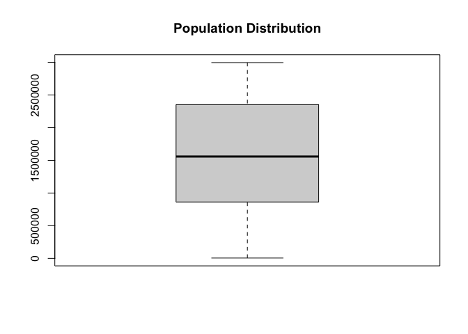

    cat("\n=== ADDITIONAL CHARGES ===\n")

    ## 
    ## === ADDITIONAL CHARGES ===

    boxplot.stats(medical_raw_data$Additional_charges)

    ## $stats
    ## [1]  112.780 1405.120 2679.615 3740.970 4999.100
    ## 
    ## $n
    ## [1] 500
    ## 
    ## $conf
    ## [1] 2514.564 2844.666
    ## 
    ## $out
    ## numeric(0)

    boxplot(medical_raw_data$Additional_charges, main = "Additional Charges Distribution")

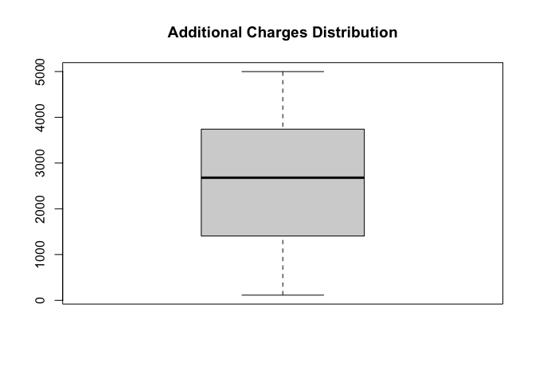

    cat("\n=== AGE ===\n")

    ## 
    ## === AGE ===

    boxplot.stats(medical_raw_data$Age)

    ## $stats
    ## [1] 18 36 52 69 84
    ## 
    ## $n
    ## [1] 490
    ## 
    ## $conf
    ## [1] 49.64455 54.35545
    ## 
    ## $out
    ## numeric(0)

    boxplot(medical_raw_data$Age, main = "Age Distribution")

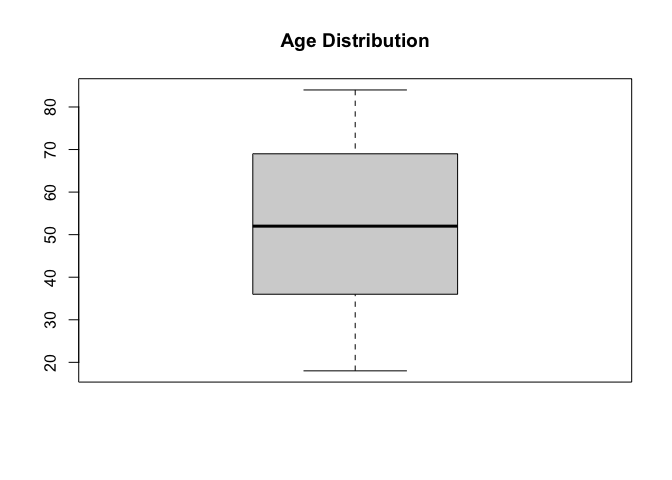

    cat("\n=== NUMBER OF CHILDREN ===\n")

    ## 
    ## === NUMBER OF CHILDREN ===

    boxplot.stats(medical_raw_data$Children)

    ## $stats
    ## [1] 0 1 2 3 4
    ## 
    ## $n
    ## [1] 490
    ## 
    ## $conf
    ## [1] 1.857246 2.142754
    ## 
    ## $out
    ## numeric(0)

    boxplot(medical_raw_data$Children, main = "Number of Children Distribution")

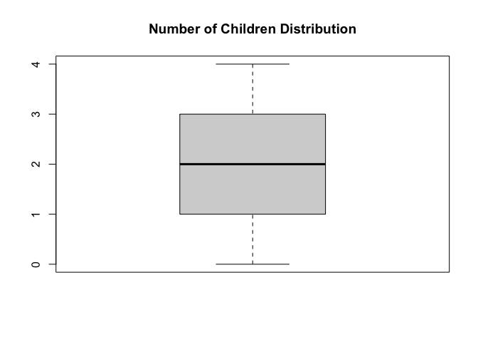

    cat("\n=== INCOME ===\n")

    ## 
    ## === INCOME ===

    boxplot.stats(medical_raw_data$Income)

    ## $stats
    ## [1]   8419  32617  48732  69808 121789
    ## 
    ## $n
    ## [1] 490
    ## 
    ## $conf
    ## [1] 46077.41 51386.59
    ## 
    ## $out
    ##  [1] 181946 158767 127640 219547 145569 143596 139864 165009 237724 169050
    ## [11] 257734 132493 138320 155998 144581 129950 221608 154353 246576 194061
    ## [21] 138304 132041 147612 135451

    boxplot(medical_raw_data$Income, main = "Income Distribution")

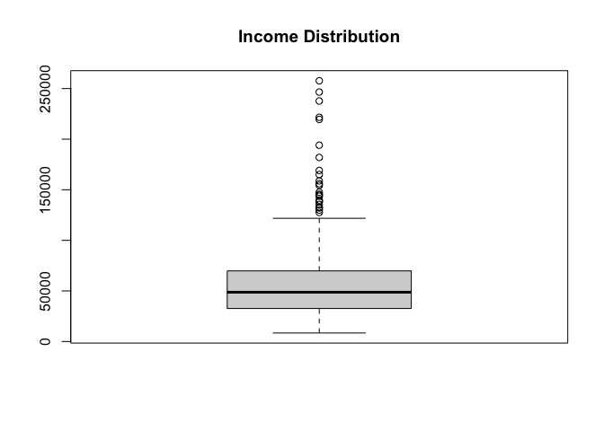

    cat("\n=== VITAMIN D LEVELS ===\n")

    ## 
    ## === VITAMIN D LEVELS ===

    boxplot.stats(medical_raw_data$VitD_levels)

    ## $stats
    ## [1]  7.890 24.385 30.830 36.905 55.070
    ## 
    ## $n
    ## [1] 500
    ## 
    ## $conf
    ## [1] 29.94534 31.71466
    ## 
    ## $out
    ## [1]  5.11 56.57 65.99  4.31 -0.64 57.57 57.08 58.51

    boxplot(medical_raw_data$VitD_levels, main = "Vitamin D Levels Distribution")

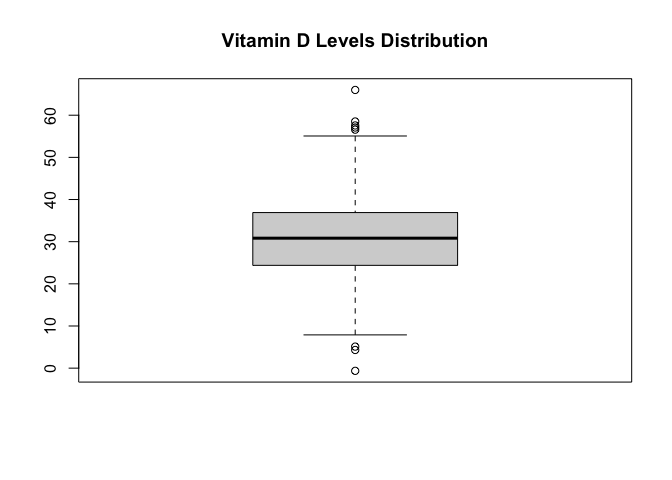

    cat("\n=== DOCTOR VISITS ===\n")

    ## 
    ## === DOCTOR VISITS ===

    boxplot.stats(medical_raw_data$Doc_visits)

    ## $stats
    ## [1]  0  4  9 15 19
    ## 
    ## $n
    ## [1] 500
    ## 
    ## $conf
    ## [1] 8.222743 9.777257
    ## 
    ## $out
    ## integer(0)

    boxplot(medical_raw_data$Doc_visits, main = "Doctor Visits Distribution")

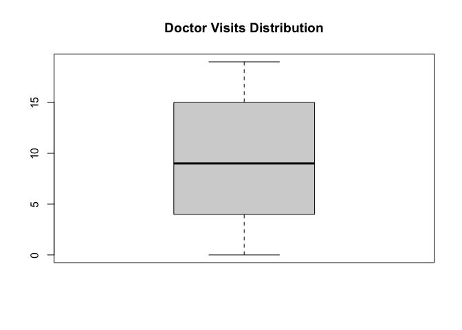

    cat("\n=== FULL MEALS EATEN ===\n")

    ## 
    ## === FULL MEALS EATEN ===

    boxplot.stats(medical_raw_data$Full_meals_eaten)

    ## $stats
    ## [1] 0 1 2 3 4
    ## 
    ## $n
    ## [1] 500
    ## 
    ## $conf
    ## [1] 1.858681 2.141319
    ## 
    ## $out
    ## integer(0)

    boxplot(medical_raw_data$Full_meals_eaten, main = "Full Meals Eaten Distribution")

    cat("\n=== VITAMIN D SUPPLEMENT ===\n")

    ## 
    ## === VITAMIN D SUPPLEMENT ===

    boxplot.stats(medical_raw_data$VitD_supp)

    ## $stats
    ## [1] 0 1 2 3 3
    ## 
    ## $n
    ## [1] 500
    ## 
    ## $conf
    ## [1] 1.858681 2.141319
    ## 
    ## $out
    ## integer(0)

    boxplot(medical_raw_data$VitD_supp, main = "Vitamin D Supplement Distribution")

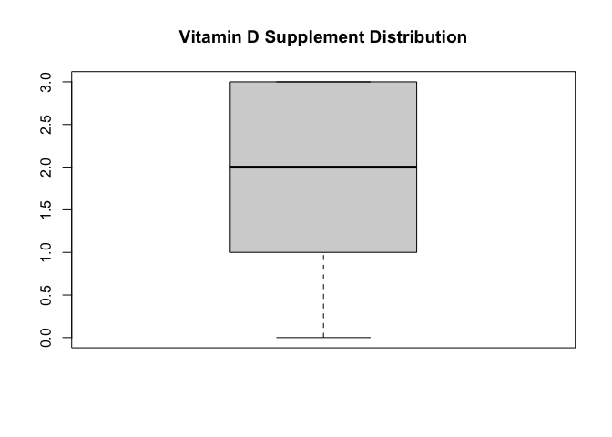

    cat("\n=== INITIAL DAYS ===\n")

    ## 
    ## === INITIAL DAYS ===

    boxplot.stats(medical_raw_data$Initial_days)

    ## $stats
    ## [1]  1  5 10 15 19
    ## 
    ## $n
    ## [1] 490
    ## 
    ## $conf
    ## [1]  9.286229 10.713771
    ## 
    ## $out
    ## numeric(0)

    boxplot(medical_raw_data$Initial_days, main = "Initial Days Distribution")

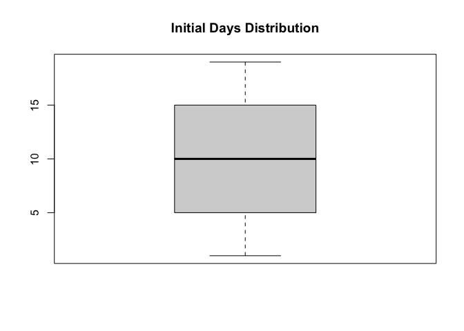

    cat("\n=== TOTAL CHARGE ===\n")

    ## 
    ## === TOTAL CHARGE ===

    boxplot.stats(medical_raw_data$TotalCharge)

    ## $stats
    ## [1]   598.70  5193.79 10506.69 15255.62 19862.81
    ## 
    ## $n
    ## [1] 500
    ## 
    ## $conf
    ## [1]  9795.723 11217.657
    ## 
    ## $out
    ## numeric(0)

    boxplot(medical_raw_data$TotalCharge, main = "Total Charge Distribution")

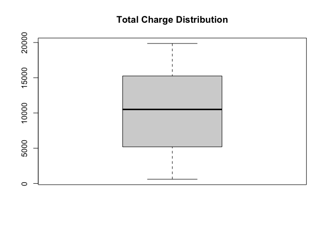

    # SECTION 6: DATA CLEANING
    # Standardize missing values - convert string 'NA' to proper NA
    medical_raw_data[medical_raw_data == 'NA'] <- NA

    # Verify cleaning
    cat("\nAfter standardizing NA values:\n")

    ## 
    ## After standardizing NA values:

    cat("Total NA values:", sum(is.na(medical_raw_data)), "\n")

    ## Total NA values: 40

    print(colSums(is.na(medical_raw_data)))

    ##          CaseOrder        Customer_id        Interaction                UID 
    ##                  0                  0                  0                  0 
    ##               City              State             County                Zip 
    ##                  0                  0                  0                  0 
    ##             Gender            Marital               Area         Population 
    ##                  0                  0                  0                  0 
    ##           Timezone                Job          Education           Children 
    ##                  0                  0                  0                 10 
    ##                Age         Employment            ReAdmis             Income 
    ##                 10                  0                  0                 10 
    ##                Lat                Lng          HighBlood        VitD_levels 
    ##                  0                  0                  0                  0 
    ##         Doc_visits   Full_meals_eaten          VitD_supp         Soft_drink 
    ##                  0                  0                  0                  0 
    ##      Initial_admin             Stroke  Complication_risk         Overweight 
    ##                  0                  0                  0                  0 
    ##          Arthritis           Diabetes     Hyperlipidemia           BackPain 
    ##                  0                  0                  0                  0 
    ##            Anxiety  Allergic_rhinitis Reflux_esophagitis             Asthma 
    ##                  0                  0                  0                  0 
    ##           Services       Initial_days Additional_charges              Item1 
    ##                  0                 10                  0                  0 
    ##              Item2              Item3              Item4              Item5 
    ##                  0                  0                  0                  0 
    ##              Item6              Item7              Item8        TotalCharge 
    ##                  0                  0                  0                  0

    # SECTION 7: MISSING VALUE IMPUTATION
    # TODO: Implement median imputation for missing numerical values
    # Example: medical_raw_data$Column <- ifelse(is.na(medical_raw_data$Column), 
    #                                            median(medical_raw_data$Column, na.rm = TRUE),
    #                                            medical_raw_data$Column)
    medical_raw_data$Age <- replace(medical_raw_data$Age, is.na(medical_raw_data$Age), median(medical_raw_data$Age, na.rm=TRUE))
    medical_raw_data$Initial_days <- replace(medical_raw_data$Initial_days, is.na(medical_raw_data$Initial_days), median(medical_raw_data$Initial_days, na.rm=TRUE))
    medical_raw_data$Income <- replace(medical_raw_data$Income, is.na(medical_raw_data$Income), median(medical_raw_data$Income, na.rm=TRUE))
    medical_raw_data$Children <- replace(medical_raw_data$Children, is.na(medical_raw_data$Children), median(medical_raw_data$Children, na.rm=TRUE))

    # Reclass columns as numeric
    medical_raw_data$Age <- as.numeric(medical_raw_data$Age)
    medical_raw_data$Children <- as.numeric(medical_raw_data$Children)
    medical_raw_data$Income <- as.numeric(medical_raw_data$Income)
    medical_raw_data$Initial_days <- as.numeric(medical_raw_data$Initial_days)
    medical_raw_data$Population <- as.numeric(medical_raw_data$Population)
    medical_raw_data$Doc_visits <- as.numeric(medical_raw_data$Doc_visits)
    medical_raw_data$Full_meals_eaten <- as.numeric(medical_raw_data$Full_meals_eaten)
    medical_raw_data$VitD_supp <- as.numeric(medical_raw_data$VitD_supp)

    # Change 0 to No and 1 to Yes
    medical_raw_data$Overweight[medical_raw_data$Overweight =="0"] <- "No"
    medical_raw_data$Overweight[medical_raw_data$Overweight =="1"] <- "Yes"
    medical_raw_data$Anxiety [medical_raw_data$Anxiety =="0"] <- "No"
    medical_raw_data$Anxiety[medical_raw_data$Anxiety =="1"] <- "Yes"

    #Summary of data set
    str(medical_raw_data)

    ## 'data.frame':    500 obs. of  52 variables:
    ##  $ CaseOrder         : int  1 2 3 4 5 6 7 8 9 10 ...
    ##  $ Customer_id       : chr  "C00001" "C00002" "C00003" "C00004" ...
    ##  $ Interaction       : chr  "I0000001" "I0000002" "I0000003" "I0000004" ...
    ##  $ UID               : chr  "U000000001" "U000000002" "U000000003" "U000000004" ...
    ##  $ City              : chr  "Dallas" "Austin" "Phoenix" "Austin" ...
    ##  $ State             : chr  "GA" "IL" "FL" "AZ" ...
    ##  $ County            : chr  "Fulton" "Fulton" "Fulton" "Fulton" ...
    ##  $ Zip               : int  93807 55539 17491 60192 90395 73888 83609 19077 30953 86919 ...
    ##  $ Gender            : chr  "Male" "Female" "Nonbinary" "Male" ...
    ##  $ Marital           : chr  "Single" "Single" "Single" "Single" ...
    ##  $ Area              : chr  "Urban" "Suburban" "Suburban" "Urban" ...
    ##  $ Population        : num  2937235 1544600 894497 2232503 43635 ...
    ##  $ Timezone          : chr  "America/New_York" "America/LA" "America/LA" "America/New_York" ...
    ##  $ Job               : chr  "Analyst" "Engineer" "Teacher" "Teacher" ...
    ##  $ Education         : chr  "Bachelor" "HS" "Master" "Associate" ...
    ##  $ Children          : num  3 4 4 4 2 3 3 2 4 1 ...
    ##  $ Age               : num  52 58 39 41 61 18 27 73 67 29 ...
    ##  $ Employment        : chr  "Unemployed" "Unemployed" "Unemployed" "Full Time" ...
    ##  $ ReAdmis           : chr  "No" "No" "No" "Yes" ...
    ##  $ Income            : num  116448 51044 104638 26961 69808 ...
    ##  $ Lat               : num  27.3 25.4 39.2 47.1 45.8 ...
    ##  $ Lng               : num  -116 -102 -77.1 -108.4 -114.2 ...
    ##  $ HighBlood         : chr  "No" "Yes" "No" "No" ...
    ##  $ VitD_levels       : num  25.9 31.4 43 31.1 30.8 ...
    ##  $ Doc_visits        : num  12 2 6 5 8 11 14 19 2 9 ...
    ##  $ Full_meals_eaten  : num  2 3 0 0 4 4 2 4 3 4 ...
    ##  $ VitD_supp         : num  3 0 2 1 2 3 2 0 3 0 ...
    ##  $ Soft_drink        : chr  "Yes" "No" "Yes" "Yes" ...
    ##  $ Initial_admin     : chr  "Observation" "Observation" "Observation" "Emergency" ...
    ##  $ Stroke            : chr  "No" "No" "No" "Yes" ...
    ##  $ Complication_risk : chr  "High" "Medium" "Low" "Medium" ...
    ##  $ Overweight        : chr  "No" "Yes" "Yes" "Yes" ...
    ##  $ Arthritis         : chr  "Yes" "No" "Yes" "Yes" ...
    ##  $ Diabetes          : chr  "No" "Yes" "Yes" "Yes" ...
    ##  $ Hyperlipidemia    : chr  "No" "Yes" "No" "No" ...
    ##  $ BackPain          : chr  "Yes" "No" "Yes" "No" ...
    ##  $ Anxiety           : chr  "Yes" "Yes" "No" "Yes" ...
    ##  $ Allergic_rhinitis : chr  "Yes" "Yes" "No" "No" ...
    ##  $ Reflux_esophagitis: chr  "Yes" "Yes" "Yes" "No" ...
    ##  $ Asthma            : chr  "Yes" "Yes" "Yes" "Yes" ...
    ##  $ Services          : chr  "Emergency" "Inpatient" "Emergency" "Outpatient" ...
    ##  $ Initial_days      : num  10 2 15 3 5 11 7 6 14 1 ...
    ##  $ Additional_charges: num  2731 4549 387 2983 2853 ...
    ##  $ Item1             : int  4 2 2 7 1 5 5 8 5 6 ...
    ##  $ Item2             : int  6 4 1 6 5 5 5 8 7 8 ...
    ##  $ Item3             : int  1 3 1 2 5 8 8 5 8 7 ...
    ##  $ Item4             : int  8 1 5 2 5 6 3 2 7 1 ...
    ##  $ Item5             : int  8 3 1 8 4 6 3 7 2 2 ...
    ##  $ Item6             : int  1 5 1 8 4 5 1 5 4 8 ...
    ##  $ Item7             : int  3 5 3 4 3 2 1 6 3 1 ...
    ##  $ Item8             : int  3 7 7 4 6 1 2 2 8 2 ...
    ##  $ TotalCharge       : num  7804 19039 14774 12174 3542 ...

    #zip codes had dropped leading zeroes 
    library(zipcodeR)
    medical_raw_data$Zip <- c(normalize_zip(medical_raw_data$Zip))

    #drop first column due to redundancy
    medical_raw_data <- subset(medical_raw_data, select = -1)

    #Create Mode function for treating NAs in character variables
    mode_funct <- function(x) {
      col_tbl <- table(x)
      names(col_tbl)[which(col_tbl==max(col_tbl))]
    }

    #change character columns with NA to Mode using the Mode function
    medical_raw_data$Anxiety<-replace(medical_raw_data$Anxiety,is.na(medical_raw_data$Anxiety), mode_funct(medical_raw_data$Anxiety))
    medical_raw_data$Soft_drink<-replace(medical_raw_data$Soft_drink,is.na(medical_raw_data$Soft_drink), mode_funct(medical_raw_data$Soft_drink))
    medical_raw_data$Overweight<-replace(medical_raw_data$Overweight,is.na(medical_raw_data$Overweight), mode_funct(medical_raw_data$Overweight))
                                                                        
    #Proof NA are eliminated
    colSums(is.na(medical_raw_data))

    ##        Customer_id        Interaction                UID               City 
    ##                  0                  0                  0                  0 
    ##              State             County                Zip             Gender 
    ##                  0                  0                  0                  0 
    ##            Marital               Area         Population           Timezone 
    ##                  0                  0                  0                  0 
    ##                Job          Education           Children                Age 
    ##                  0                  0                  0                  0 
    ##         Employment            ReAdmis             Income                Lat 
    ##                  0                  0                  0                  0 
    ##                Lng          HighBlood        VitD_levels         Doc_visits 
    ##                  0                  0                  0                  0 
    ##   Full_meals_eaten          VitD_supp         Soft_drink      Initial_admin 
    ##                  0                  0                  0                  0 
    ##             Stroke  Complication_risk         Overweight          Arthritis 
    ##                  0                  0                  0                  0 
    ##           Diabetes     Hyperlipidemia           BackPain            Anxiety 
    ##                  0                  0                  0                  0 
    ##  Allergic_rhinitis Reflux_esophagitis             Asthma           Services 
    ##                  0                  0                  0                  0 
    ##       Initial_days Additional_charges              Item1              Item2 
    ##                  0                  0                  0                  0 
    ##              Item3              Item4              Item5              Item6 
    ##                  0                  0                  0                  0 
    ##              Item7              Item8        TotalCharge 
    ##                  0                  0                  0

    # Use the already-cleaned in-memory object directly
    library(tidyverse)
    medical_clean <- medical_raw_data
    PCA_test <-medical_clean[,c(11,15:16,19,23:26,42:44)]
    PCA_test1 <-prcomp(PCA_test[,c(1:11)], center=TRUE, scale. = TRUE)
    PCA_test1$rotation

    ##                            PC1         PC2         PC3         PC4        PC5
    ## Population         -0.23754270  0.27979683  0.53656153 -0.21558943  0.3045587
    ## Children            0.30812234 -0.16133797  0.27500728 -0.20561164 -0.4256631
    ## Age                 0.13341801 -0.30572447  0.22171229 -0.45449463  0.2906386
    ## Income              0.42069692  0.37871355 -0.01224286  0.04410849  0.3414517
    ## VitD_levels        -0.02429442 -0.40714294  0.26890340  0.23780970  0.4253959
    ## Doc_visits          0.34677812  0.10383620 -0.16337958  0.39899316 -0.1010720
    ## Full_meals_eaten   -0.40102928  0.08458893 -0.12836960  0.41497394  0.3434521
    ## VitD_supp          -0.08921133 -0.30784728  0.38431391  0.44244131 -0.2906064
    ## Additional_charges -0.33913903  0.47951828  0.03987891 -0.17658303 -0.2474941
    ## Item1              -0.05122055  0.27655497  0.52711442  0.24830975 -0.2039953
    ## Item2               0.49656880  0.27184443  0.21106561  0.16182753  0.1689343
    ##                            PC6         PC7          PC8         PC9        PC10
    ## Population          0.07410498  0.14278073  0.288507529 -0.10436383  0.19435884
    ## Children           -0.15757400 -0.61848774  0.154703391 -0.31250417 -0.11834621
    ## Age                -0.45737595  0.35341771 -0.189011194 -0.16435909 -0.33902791
    ## Income              0.09366054 -0.24130072 -0.483347781  0.22342089 -0.34074786
    ## VitD_levels        -0.14837344 -0.38489220  0.234168375  0.52166552  0.07646239
    ## Doc_visits         -0.62727096  0.28754456  0.271496016  0.07315294  0.08580531
    ## Full_meals_eaten   -0.21356032 -0.26740710 -0.008748218 -0.58006297 -0.26573745
    ## VitD_supp           0.27480177  0.29954281 -0.080181004  0.05747529 -0.50387941
    ## Additional_charges -0.24752043 -0.08377787  0.265108141  0.38144725 -0.48234459
    ## Item1              -0.26633256 -0.01699201 -0.479066009 -0.02118462  0.36800911
    ## Item2               0.28793554  0.12080008  0.434330463 -0.22650611 -0.10659682
    ##                           PC11
    ## Population          0.52950210
    ## Children            0.19230706
    ## Age                -0.19173889
    ## Income              0.30701139
    ## VitD_levels        -0.14438604
    ## Doc_visits          0.33209077
    ## Full_meals_eaten   -0.03313909
    ## VitD_supp           0.20124372
    ## Additional_charges -0.21046606
    ## Item1              -0.32119604
    ## Item2              -0.48107590

    #Use package factoextra to run eigenvalue and scree plot
    library(factoextra)

    ## Welcome! Want to learn more? See two factoextra-related books at https://goo.gl/ve3WBa

    fviz_eig(PCA_test1)

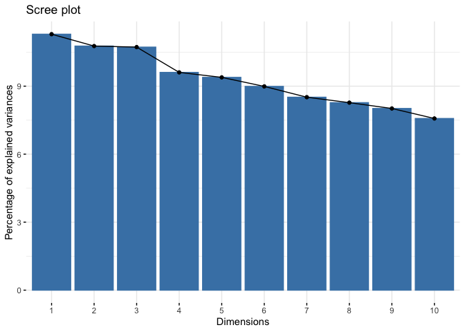

    fviz_eig(PCA_test1, choice = "eigenvalue", addlabels = TRUE)

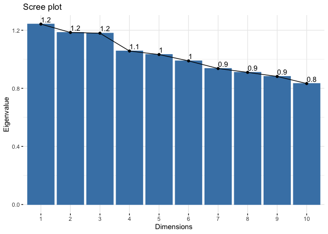

    sum(is.na(medical_clean))

    ## [1] 0

    str(PCA_test)

    ## 'data.frame':    500 obs. of  11 variables:
    ##  $ Population        : num  2937235 1544600 894497 2232503 43635 ...
    ##  $ Children          : num  3 4 4 4 2 3 3 2 4 1 ...
    ##  $ Age               : num  52 58 39 41 61 18 27 73 67 29 ...
    ##  $ Income            : num  116448 51044 104638 26961 69808 ...
    ##  $ VitD_levels       : num  25.9 31.4 43 31.1 30.8 ...
    ##  $ Doc_visits        : num  12 2 6 5 8 11 14 19 2 9 ...
    ##  $ Full_meals_eaten  : num  2 3 0 0 4 4 2 4 3 4 ...
    ##  $ VitD_supp         : num  3 0 2 1 2 3 2 0 3 0 ...
    ##  $ Additional_charges: num  2731 4549 387 2983 2853 ...
    ##  $ Item1             : int  4 2 2 7 1 5 5 8 5 6 ...
    ##  $ Item2             : int  6 4 1 6 5 5 5 8 7 8 ...
