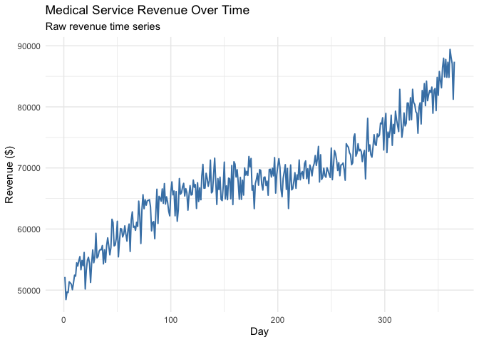
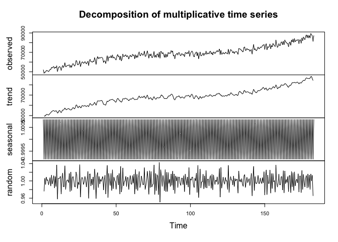
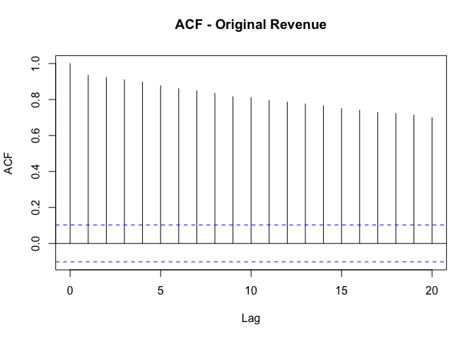
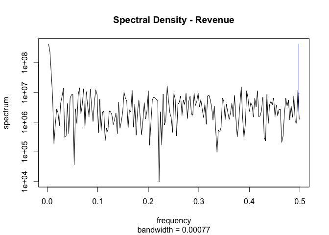
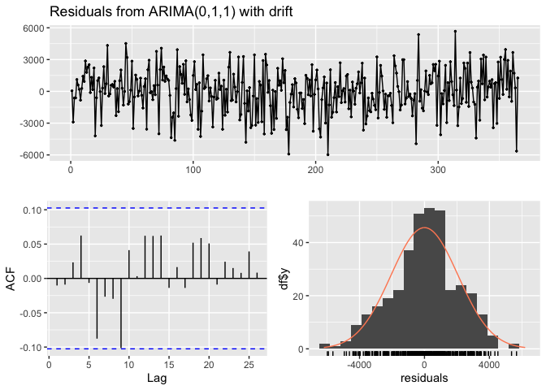
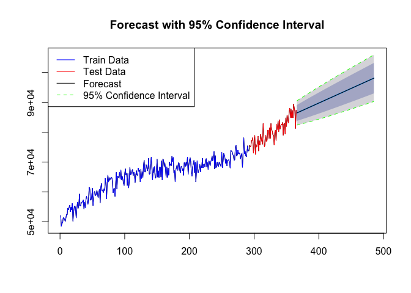

    ################################################################################
    # Project:      Medical Revenue Time Series ARIMA Forecasting
    # Objective:    Forecast revenue using ARIMA modeling and time series analysis
    # Author:       Kim Shellenberger
    # Date:         2024
    # Description:  Complete time series analysis pipeline including data loading,
    #               stationarity testing, model identification, decomposition,
    #               and ACF/PACF analysis for revenue forecasting.
    ################################################################################

    # SECTION 1: LOAD REQUIRED PACKAGES
    library(tidyverse)   # Data manipulation

    ## ── Attaching core tidyverse packages ──────────────────────── tidyverse 2.0.0 ──
    ## ✔ dplyr     1.1.4     ✔ readr     2.1.5
    ## ✔ forcats   1.0.0     ✔ stringr   1.5.1
    ## ✔ ggplot2   3.5.0     ✔ tibble    3.2.1
    ## ✔ lubridate 1.9.3     ✔ tidyr     1.3.1
    ## ✔ purrr     1.0.2     
    ## ── Conflicts ────────────────────────────────────────── tidyverse_conflicts() ──
    ## ✖ dplyr::filter() masks stats::filter()
    ## ✖ dplyr::lag()    masks stats::lag()
    ## ℹ Use the conflicted package (<http://conflicted.r-lib.org/>) to force all conflicts to become errors

    library(ggplot2)     # Data visualization
    library(tseries)     # Time series analysis (ADF test)

    ## Registered S3 method overwritten by 'quantmod':
    ##   method            from
    ##   as.zoo.data.frame zoo

    library(seasonal)    # Seasonal decomposition

    ## 
    ## Attaching package: 'seasonal'
    ## 
    ## The following object is masked from 'package:tibble':
    ## 
    ##     view

    library(forecast)    # ARIMA and forecasting functions
    library(rmarkdown)   # Report generation
    library(knitr)       # Markdown utilities

    # SECTION 2: LOAD AND INSPECT DATA
    # TODO: Update file path to your data location
    data <- read.csv("medical_time_series.csv")

    head(data)

    ##   Day  Revenue
    ## 1   1 52151.47
    ## 2   2 48449.29
    ## 3   3 49710.42
    ## 4   4 49602.54
    ## 5   5 51363.59
    ## 6   6 51180.11

    str(data)

    ## 'data.frame':    365 obs. of  2 variables:
    ##  $ Day    : int  1 2 3 4 5 6 7 8 9 10 ...
    ##  $ Revenue: num  52151 48449 49710 49603 51364 ...

    # SECTION 3: TIME SERIES VISUALIZATION
    # Plot original time series to identify trends and patterns
    ggplot(data, aes(x = Day, y = Revenue)) +
      geom_line(color = "steelblue", size = 0.7) +
      labs(title = "Medical Service Revenue Over Time",
           x = "Day",
           y = "Revenue ($)",
           subtitle = "Raw revenue time series") +
      theme_minimal()

    ## Warning: Using `size` aesthetic for lines was deprecated in ggplot2 3.4.0.
    ## ℹ Please use `linewidth` instead.
    ## This warning is displayed once every 8 hours.
    ## Call `lifecycle::last_lifecycle_warnings()` to see where this warning was
    ## generated.

    # SECTION 4: DATA QUALITY CHECKS
    # Check for gaps in the time series (missing days)
    print(paste("Any gaps in measurement:", any(diff(data$Day) != 1)))

    ## [1] "Any gaps in measurement: FALSE"

    # Calculate sequence length for train-test split
    length_sequence <- nrow(data)
    print(paste("Total observations:", length_sequence))

    ## [1] "Total observations: 365"

    # SECTION 5: STATIONARITY TESTING
    # Augmented Dickey-Fuller (ADF) test on original series
    cat("\nADF Test on Original Revenue Series:\n")

    ## 
    ## ADF Test on Original Revenue Series:

    adf_original <- adf.test(data$Revenue)
    print(adf_original)

    ## 
    ##  Augmented Dickey-Fuller Test
    ## 
    ## data:  data$Revenue
    ## Dickey-Fuller = -2.4698, Lag order = 7, p-value = 0.3786
    ## alternative hypothesis: stationary

    # Interpretation: p-value < 0.05 suggests stationarity (no unit root)

    # SECTION 6: DIFFERENCING FOR STATIONARITY
    # Apply first-order differencing to remove trend
    data$diff_revenue <- c(NA, diff(data$Revenue))

    # Test differenced series for stationarity
    cat("\nADF Test on First-Differenced Revenue Series:\n")

    ## 
    ## ADF Test on First-Differenced Revenue Series:

    adf_differenced <- adf.test(data$diff_revenue[-1], alternative = "stationary")

    ## Warning in adf.test(data$diff_revenue[-1], alternative = "stationary"): p-value
    ## smaller than printed p-value

    print(adf_differenced)

    ## 
    ##  Augmented Dickey-Fuller Test
    ## 
    ## data:  data$diff_revenue[-1]
    ## Dickey-Fuller = -9.5326, Lag order = 7, p-value = 0.01
    ## alternative hypothesis: stationary

    # SECTION 7: TRAIN-TEST SPLIT
    # Allocate 80% for training, 20% for testing (typical split)
    length_sequence <- nrow(data)
    train_size <- round(0.8 * length_sequence)
    train_data <- data[1:train_size, ]
    test_data <- data[(train_size + 1):length_sequence, ]

    print(paste("Training set size:", nrow(train_data)))

    ## [1] "Training set size: 292"

    print(paste("Test set size:", nrow(test_data)))

    ## [1] "Test set size: 73"

    # SECTION 8: EXPORT TRAIN-TEST DATA
    # TODO: Update file paths to your output locations
    write.csv(train_data, file = "train_data.csv", row.names = FALSE)
    write.csv(test_data, file = "test_data.csv", row.names = FALSE)
    print("Train and test data exported.")

    ## [1] "Train and test data exported."

    # SECTION 9: TIME SERIES DECOMPOSITION
    # Decompose original revenue series into components (trend, seasonal, random)
    decomposed_ts <- decompose(ts(data$Revenue, frequency = 2), type = "multiplicative")
    plot(decomposed_ts)

    print("Decomposition complete: Trend | Seasonal | Random components identified")

    ## [1] "Decomposition complete: Trend | Seasonal | Random components identified"

    # SECTION 10: AUTOCORRELATION ANALYSIS
    # ACF and PACF plots inform ARIMA parameter selection
    cat("\nAutocorrelation Function (ACF) Analysis:\n")

    ## 
    ## Autocorrelation Function (ACF) Analysis:

    acf(data$Revenue, main = "ACF - Original Revenue", lag.max = 20)

    # SECTION 11: SPECTRAL ANALYSIS
    # Examine frequency domain characteristics
    spec.pgram(data$Revenue, main = "Spectral Density - Revenue")

    # Identify ARIMA model
    arima_model <- auto.arima(data$Revenue)
    arima_model 

    ## Series: data$Revenue 
    ## ARIMA(0,1,1) with drift 
    ## 
    ## Coefficients:
    ##           ma1    drift
    ##       -0.8498  97.9108
    ## s.e.   0.0258  16.5380
    ## 
    ## sigma^2 = 4293833:  log likelihood = -3295.76
    ## AIC=6597.52   AICc=6597.59   BIC=6609.21

    # Perform forecast
    forecast_result <- forecast(arima_model, h = 120)
    forecast_result

    ##     Point Forecast    Lo 80     Hi 80    Lo 95     Hi 95
    ## 366       86424.41 83768.83  89079.98 82363.06  90485.76
    ## 367       86522.32 83836.95  89207.69 82415.41  90629.23
    ## 368       86620.23 83905.40  89335.06 82468.26  90772.20
    ## 369       86718.14 83974.17  89462.12 82521.59  90914.69
    ## 370       86816.05 84043.24  89588.87 82575.40  91056.71
    ## 371       86913.96 84112.60  89715.32 82629.65  91198.27
    ## 372       87011.87 84182.26  89841.49 82684.35  91339.40
    ## 373       87109.78 84252.19  89967.38 82739.48  91480.09
    ## 374       87207.70 84322.40  90092.99 82795.02  91620.37
    ## 375       87305.61 84392.87  90218.34 82850.96  91760.25
    ## 376       87403.52 84463.59  90343.44 82907.29  91899.74
    ## 377       87501.43 84534.57  90468.29 82964.01  92038.85
    ## 378       87599.34 84605.79  90592.89 83021.09  92177.58
    ## 379       87697.25 84677.24  90717.26 83078.54  92315.96
    ## 380       87795.16 84748.92  90841.40 83136.34  92453.98
    ## 381       87893.07 84820.83  90965.31 83194.48  92591.66
    ## 382       87990.98 84892.95  91089.01 83252.95  92729.01
    ## 383       88088.89 84965.29  91212.49 83311.75  92866.03
    ## 384       88186.80 85037.84  91335.77 83370.87  93002.73
    ## 385       88284.71 85110.58  91458.84 83430.30  93139.13
    ## 386       88382.62 85183.53  91581.72 83490.03  93275.22
    ## 387       88480.54 85256.67  91704.40 83550.06  93411.01
    ## 388       88578.45 85330.00  91826.90 83610.37  93546.52
    ## 389       88676.36 85403.51  91949.20 83670.97  93681.74
    ## 390       88774.27 85477.20  92071.33 83731.84  93816.69
    ## 391       88872.18 85551.07  92193.28 83792.99  93951.37
    ## 392       88970.09 85625.12  92315.06 83854.39  94085.78
    ## 393       89068.00 85699.33  92436.67 83916.06  94219.94
    ## 394       89165.91 85773.70  92558.12 83977.98  94353.84
    ## 395       89263.82 85848.24  92679.40 84040.15  94487.50
    ## 396       89361.73 85922.94  92800.52 84102.56  94620.91
    ## 397       89459.64 85997.80  92921.49 84165.21  94754.08
    ## 398       89557.55 86072.80  93042.30 84228.09  94887.02
    ## 399       89655.46 86147.96  93162.97 84291.20  95019.73
    ## 400       89753.38 86223.26  93283.49 84354.53  95152.22
    ## 401       89851.29 86298.71  93403.86 84418.09  95284.48
    ## 402       89949.20 86374.30  93524.10 84481.86  95416.53
    ## 403       90047.11 86450.02  93644.19 84545.84  95548.37
    ## 404       90145.02 86525.88  93764.15 84610.03  95680.00
    ## 405       90242.93 86601.88  93883.98 84674.43  95811.43
    ## 406       90340.84 86678.01  94003.67 84739.02  95942.66
    ## 407       90438.75 86754.26  94123.24 84803.81  96073.69
    ## 408       90536.66 86830.65  94242.68 84868.80  96204.52
    ## 409       90634.57 86907.15  94361.99 84933.98  96335.17
    ## 410       90732.48 86983.78  94481.18 84999.34  96465.63
    ## 411       90830.39 87060.53  94600.26 85064.89  96595.90
    ## 412       90928.30 87137.40  94719.21 85130.61  96726.00
    ## 413       91026.22 87214.38  94838.05 85196.52  96855.91
    ## 414       91124.13 87291.48  94956.77 85262.60  96985.65
    ## 415       91222.04 87368.69  95075.39 85328.85  97115.22
    ## 416       91319.95 87446.01  95193.89 85395.27  97244.63
    ## 417       91417.86 87523.44  95312.28 85461.86  97373.86
    ## 418       91515.77 87600.97  95430.56 85528.61  97502.93
    ## 419       91613.68 87678.62  95548.74 85595.52  97631.84
    ## 420       91711.59 87756.36  95666.82 85662.59  97760.59
    ## 421       91809.50 87834.21  95784.79 85729.82  97889.18
    ## 422       91907.41 87912.16  95902.66 85797.20  98017.62
    ## 423       92005.32 87990.21  96020.44 85864.73  98145.91
    ## 424       92103.23 88068.35  96138.11 85932.42  98274.05
    ## 425       92201.14 88146.60  96255.69 86000.25  98402.04
    ## 426       92299.05 88224.93  96373.18 86068.22  98529.89
    ## 427       92396.97 88303.36  96490.57 86136.34  98657.59
    ## 428       92494.88 88381.89  96607.87 86204.60  98785.15
    ## 429       92592.79 88460.50  96725.07 86273.00  98912.57
    ## 430       92690.70 88539.21  96842.19 86341.54  99039.86
    ## 431       92788.61 88618.00  96959.22 86410.21  99167.01
    ## 432       92886.52 88696.88  97076.16 86479.01  99294.02
    ## 433       92984.43 88775.84  97193.02 86547.95  99420.91
    ## 434       93082.34 88854.89  97309.79 86617.02  99547.66
    ## 435       93180.25 88934.03  97426.48 86686.21  99674.29
    ## 436       93278.16 89013.24  97543.08 86755.53  99800.79
    ## 437       93376.07 89092.54  97659.60 86824.98  99927.17
    ## 438       93473.98 89171.92  97776.05 86894.55 100053.42
    ## 439       93571.89 89251.38  97892.41 86964.24 100179.55
    ## 440       93669.81 89330.92  98008.69 87034.05 100305.56
    ## 441       93767.72 89410.53  98124.90 87103.98 100431.46
    ## 442       93865.63 89490.22  98241.03 87174.02 100557.23
    ## 443       93963.54 89569.99  98357.09 87244.18 100682.89
    ## 444       94061.45 89649.83  98473.07 87314.46 100808.44
    ## 445       94159.36 89729.74  98588.97 87384.85 100933.87
    ## 446       94257.27 89809.73  98704.81 87455.35 101059.19
    ## 447       94355.18 89889.79  98820.57 87525.96 101184.40
    ## 448       94453.09 89969.92  98936.26 87596.68 101309.51
    ## 449       94551.00 90050.12  99051.88 87667.50 101434.50
    ## 450       94648.91 90130.39  99167.43 87738.43 101559.39
    ## 451       94746.82 90210.73  99282.92 87809.47 101684.18
    ## 452       94844.73 90291.14  99398.33 87880.61 101808.86
    ## 453       94942.65 90371.61  99513.68 87951.85 101933.44
    ## 454       95040.56 90452.15  99628.96 88023.20 102057.91
    ## 455       95138.47 90532.76  99744.18 88094.64 102182.29
    ## 456       95236.38 90613.43  99859.33 88166.19 102306.57
    ## 457       95334.29 90694.16  99974.41 88237.83 102430.75
    ## 458       95432.20 90774.96 100089.44 88309.57 102554.83
    ## 459       95530.11 90855.82 100204.40 88381.40 102678.82
    ## 460       95628.02 90936.74 100319.30 88453.33 102802.71
    ## 461       95725.93 91017.73 100434.14 88525.35 102926.51
    ## 462       95823.84 91098.77 100548.91 88597.47 103050.21
    ## 463       95921.75 91179.88 100663.63 88669.68 103173.83
    ## 464       96019.66 91261.04 100778.29 88741.98 103297.35
    ## 465       96117.57 91342.26 100892.89 88814.36 103420.79
    ## 466       96215.49 91423.54 101007.43 88886.84 103544.13
    ## 467       96313.40 91504.88 101121.91 88959.41 103667.39
    ## 468       96411.31 91586.28 101236.34 89032.06 103790.56
    ## 469       96509.22 91667.73 101350.71 89104.80 103913.64
    ## 470       96607.13 91749.23 101465.02 89177.62 104036.64
    ## 471       96705.04 91830.80 101579.28 89250.53 104159.55
    ## 472       96802.95 91912.41 101693.49 89323.52 104282.38
    ## 473       96900.86 91994.08 101807.64 89396.59 104405.13
    ## 474       96998.77 92075.81 101921.74 89469.75 104527.80
    ## 475       97096.68 92157.59 102035.78 89542.99 104650.38
    ## 476       97194.59 92239.42 102149.77 89616.30 104772.88
    ## 477       97292.50 92321.30 102263.71 89689.70 104895.31
    ## 478       97390.41 92403.23 102377.60 89763.18 105017.65
    ## 479       97488.33 92485.22 102491.43 89836.73 105139.92
    ## 480       97586.24 92567.25 102605.22 89910.36 105262.11
    ## 481       97684.15 92649.34 102718.96 89984.07 105384.23
    ## 482       97782.06 92731.47 102832.64 90057.85 105506.26
    ## 483       97879.97 92813.66 102946.28 90131.71 105628.23
    ## 484       97977.88 92895.89 103059.87 90205.64 105750.11
    ## 485       98075.79 92978.17 103173.41 90279.65 105871.93

    # Ensure same length of test data and forecasted values
    test_data <- test_data[1:min(length(test_data$Revenue), length(forecast_result$mean)), ]
    forecast_values <- forecast_result$mean[1:min(length(test_data$Revenue), length(forecast_result$mean))]

    # Remove NA values from test data and forecasted values
    test_data <- test_data[!is.na(test_data$Revenue), ]
    forecast_values <- forecast_values[!is.na(test_data$Revenue)]

    # Calculate RMSE
    rmse <- sqrt(mean((test_data$Revenue - forecast_values)^2))

    #residual plot
    checkresiduals(arima_model)

    ## 
    ##  Ljung-Box test
    ## 
    ## data:  Residuals from ARIMA(0,1,1) with drift
    ## Q* = 9.7208, df = 9, p-value = 0.3736
    ## 
    ## Model df: 1.   Total lags used: 10

    # Print RMSE
    print(paste("RMSE:", round(rmse, 4)))

    ## [1] "RMSE: 9903.0558"

    # Plot forecast with training, test data, and 95% confidence interval
    plot(forecast_result, main = "Forecast with 95% Confidence Interval")
    lines(train_data$Day, train_data$Revenue, col = "blue")  # Train data
    lines(test_data$Day, test_data$Revenue, col = "red")    # Test data
    lines(forecast_result$mean, col = "black")              # Forecast
    lines(forecast_result$lower[,2], col = "green", lty = 2) # 95% confidence interval lower bound
    lines(forecast_result$upper[,2], col = "green", lty = 2) # 95% confidence interval upper bound
    legend("topleft", legend = c("Train Data", "Test Data", "Forecast", "95% Confidence Interval"), 
           col = c("blue", "red", "black", "green"), lty = c(1, 1, 1, 2))

